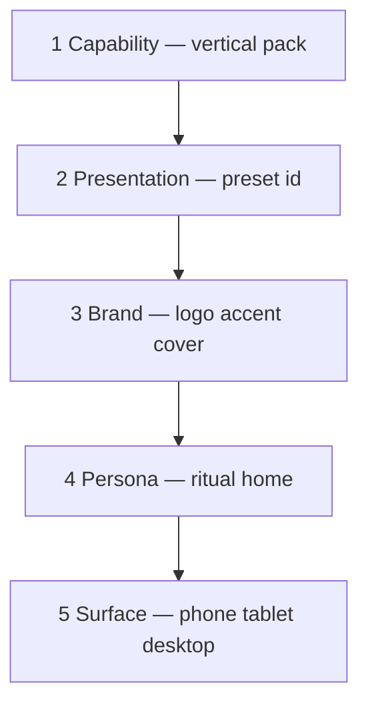
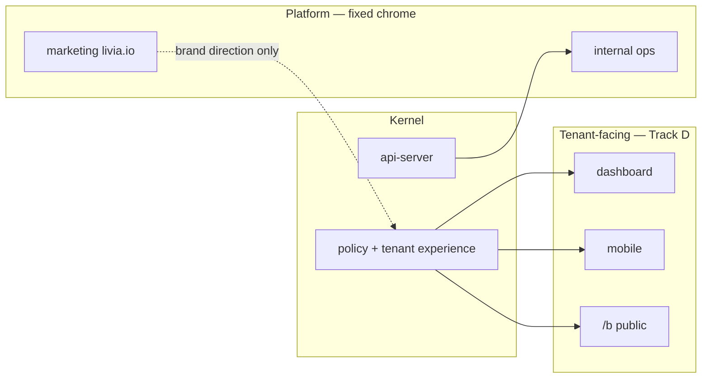

# Livia experience architecture — master design system

**Status:** canonical (2026-05-29)  
**Origin:** product/design working session — UX boundaries, vertical fairness, persona rituals, presentation presets, surface morph  
**Audience:** founder, product, engineering, design  
**Master program:** [`../product/PLATFORM-EVOLUTION-AND-OPS-PROGRAM.md`](../product/PLATFORM-EVOLUTION-AND-OPS-PROGRAM.md) Track D  
**Does not replace:** [`../product/LIVIA-EXPERIENCE-DESIGN-BIBLE.md`](../product/LIVIA-EXPERIENCE-DESIGN-BIBLE.md) (screen cards) · [`../product/PERSONA-UX.md`](../product/PERSONA-UX.md) (routes)

---

## Part 0 — Why this document exists

Livia’s kernel and API are often **ahead of UI craft**. A series of design explorations (2026-05) asked:

1. What is technically buildable today that materially improves UX (not GPU theatre)?
2. Should one global theme serve all businesses and personas? **No.**
3. What is the correct hierarchy: persona-first, business-first, or theme-first? **Business capability first → tenant presentation → persona ritual → surface morph.**

This document is the **canonical architecture** for those decisions. Implementation specs live in linked docs; this is the map.

| Child spec | Role |
|------------|------|
| [`PLATFORM-SURFACES-UX-REDESIGN.md`](./PLATFORM-SURFACES-UX-REDESIGN.md) | Marketing, internal, gateway — 3 concepts per screen |
| [`PRESENTATION-PRESETS-AND-ROLLOUT.md`](./PRESENTATION-PRESETS-AND-ROLLOUT.md) | 36 presets, API, staging Phases 0–8 |
| [`SURFACE-AND-BREAKPOINTS.md`](./SURFACE-AND-BREAKPOINTS.md) | Phone / tablet / desktop morph |
| [`PERSONA-VERTICAL-SURFACE-MATRIX.md`](./PERSONA-VERTICAL-SURFACE-MATRIX.md) | Full P×V×surface tables |
| [`CHANNEL-UX-CONTRACT.md`](./CHANNEL-UX-CONTRACT.md) | M2/M3/M4 (non-visual Liv) |
| [`PRODUCT-UX-SYSTEM.md`](./PRODUCT-UX-SYSTEM.md) | Engineering layout contract |
| [`../product/V3-EXPERIENCE-SPEC.md`](../product/V3-EXPERIENCE-SPEC.md) | Motion, alive, continuity |

---

## Part 1 — North star

From [`V3-EXPERIENCE-SPEC.md`](../product/V3-EXPERIENCE-SPEC.md):

> Every surface should feel like **one colleague** handled the journey — not seven apps stitched with email.

**UX enemy:** CRUD browser with a sidebar of entities. Owner hunts for “what broke since I left.” Staff gets a shrunken desktop. Customer sees “powered by Livia” instead of their salon.

**UX goal:** Same kernel; **different keys** (hotel principle). The tattoo studio is not a dark hair salon. The barber between clients is not the founder on Sunday triage. The customer on `/b` trusts **Velvet & Blade**, not Aurora gradients.

**Honesty from [`LIVIA-ALIGNMENT.md`](../LIVIA-ALIGNMENT.md):** Production grade = kernel + **finished surfaces** + live ops — not docs marked [x].

---

## Part 2 — Five-layer resolution model

Every tenant-facing pixel resolves through **five layers** in order. Lower layers constrain higher layers; higher layers never unlock features.



### Layer 1 — Capability (vertical pack)

**Source:** `@workspace/policy` — `vertical`, `getVerticalPlaybook()`, `businessVocabulary()`, wedge gates.

| Controls | Does not control |
|----------|------------------|
| Routes (`/design-proofs`, class sessions, medspa hub) | Colour palette |
| Hero workflow (consult → proof → session for body-art) | Font choice |
| Home module ids (`timeline`, `design-proofs`, `classes`) | Persona membership |
| Public CTA (“Request a consult” vs “Book your visit”) | Device width |
| Vocabulary (client vs patient vs member) | |

**Rule:** Vertical is chosen at onboarding; changes require admin migration, not a settings toggle.

### Layer 2 — Presentation (preset)

**Source:** `lib/policy/src/presentation-presets.ts` — four presets per vertical.

| Controls | Does not control |
|----------|------------------|
| Colour mode, density, shell, typography display | Feature routes |
| CSS token bundle (`data-presentation`) | Vertical vocabulary |
| Layout *primitive hint* (cards, pipeline, list) | Persona home route |
| Platform Default = Aurora Livia chrome | |

**Rule:** All four presets expose **identical** routes and entitlements. Invalid `presetId` → vertical-native default (not Platform Default).

### Layer 3 — Brand (tenant assets)

**Source:** `businesses` row — `logoUrl`, `coverImageUrl`, optional `brandAccentHex`; multi-brand via brand shell (C13).

| Controls | Does not control |
|----------|------------------|
| Logo, cover, optional accent override | Preset structure |
| Public `/b` header identity | Vertical capabilities |
| Outbound email/SMS header when wired | |

**Rule:** Brand shell (portfolio) overrides **logo/accent per shell**; preset remains per `business` record. See [`CHANNEL-UX-CONTRACT.md`](./CHANNEL-UX-CONTRACT.md) for outbound parity.

### Layer 4 — Persona (ritual home)

**Source:** membership role → `PersonaKind` → `persona-rituals.ts` + vertical home module map.

| Controls | Does not control |
|----------|------------------|
| Home route (`/my-day`, `/inbox`, `/chain`) | Vertical pack |
| Nav order and ritual labels | Preset colours |
| Which home **module** is emphasized (pipeline vs flight plan) | API entitlements |
| Liv briefing voice framing | |

**Rule:** Same persona route across presets; module **emphasis** shifts by vertical.

### Layer 5 — Surface (viewport class)

**Source:** `useSurfaceClass()` — phone / tablet / desktop.

| Controls | Does not control |
|----------|------------------|
| Layout morph (kanban → stage list) | Preset id |
| Single vs split vs triple pane | Vertical features |
| Thumb zone, haptics (native) | Persona identity |
| Web handoff triggers | |

**Rule:** Preset tokens are surface-agnostic. Morph is **module + persona + surface**.

### Resolver pseudocode

```text
experience =
  resolveVerticalPlaybook(business.vertical)
  |> mergePresentationPreset(business.presentationPresetId)
  |> applyBrand(business.logoUrl, business.brandAccentHex)
  |> resolvePersonaRitual(membership.persona, business.vertical)
  |> morphForSurface(viewportClass, nativeApp?)
```

---

## Part 3 — Design exploration archive (decisions)

Explorations informed the architecture; **only the five-layer model ships** as product strategy.

### 3.1 Aurora-forward ops UX (retained as Platform Default)

**Idea:** Liv command hub, continuity timeline, glass surfaces, SSE-alive dashboard, motion tokens from v3.

**Decision:** Ship as **`platform-default`** preset — opt-in Aurora chrome available in every vertical. Not the forced global skin.

**Buildable tech:** Framer Motion, TanStack Query live invalidation, CSS `data-presentation=platform-default`, existing `index.css` Aurora tokens, Reanimated + haptics on mobile.

### 3.2 Global theme swaps (rejected as primary strategy)

Explored: Atelier editorial, Signal Desk terminal, Soft Human, Mono Lux — four **aesthetic-only** directions.

**Rejected because:** Hair owner and tattoo owner need different **information architecture**, not just colour. A terminal skin on a consult-first tattoo flow still wrong IA.

**Partial retain:** Density and typography ideas map to **vertical-native presets** (e.g. Barber Bold ≈ compact list, Minimal Mono ≈ body-art third preset).

### 3.3 Persona-first themes (rejected as global strategy)

Explored six directions: Briefing Paper, Floor Glance, The Thread, Shop Window, Pegboard, Quiet Ledger — each persona gets a **different product metaphor**.

**Rejected because:** One tenant business has **all personas**; founder + staff + reception share one preset. Persona differences are **home route + module**, not separate apps.

**Partial retain:** Each direction became a **persona home pattern** within vertical capability (see Part 4).

### 3.4 Persona × three layouts each (reference designs)

Explored three UI directions per persona (P1, P2b, P3, P4, P6, P7) — 18 reference metaphors.

**Decision:** Document as **persona home candidates** in [`PERSONA-VERTICAL-SURFACE-MATRIX.md`](./PERSONA-VERTICAL-SURFACE-MATRIX.md); implement **one recommended home per persona per vertical**, morph by surface.

### 3.5 Business-first vertical (canonical pattern)

**Example:** Body-art — pipeline IA, design proof hero, session blocks, consult-first public flow.

**Decision:** **Canonical.** All verticals define capability contract first; three vertical-native presets + Platform Default second; persona homes third.

### 3.6 Explicitly rejected visuals

| Idea | Why skip |
|------|----------|
| WebGL / 3D salon | Zero ops value; hurts 320px |
| AR try-on in booking | Different product |
| AI-generated layout per session | Untestable, a11y risk |
| visionOS native | Audience ≈ 0 for EU wedge |
| Aurora marketing blobs in ops UI | v3 spec — marketing only |
| Separate app per vertical | Violates hotel principle |

---

## Part 4 — Persona ritual catalog

Stable routes from [`PERSONA-UX.md`](../product/PERSONA-UX.md). **Home module** varies by vertical (matrix doc).

### P1 — Founder (multi-shop)

| Attribute | Value |
|-----------|--------|
| **Job** | Sunday triage 15 min; “is anything about to break?” |
| **Web home** | `/chain` — shop cards, rollup, drill-down |
| **Mobile home** | Glance tab + `GET /me/chain-rollup` |
| **Primary surface** | Phone evening; desktop week P&L |
| **Home patterns explored** | Briefing Paper (editorial), Fleet Cards (wallet), Exception Only (queue) |
| **Recommended IA** | **Exception Only** daily + **Briefing Paper** Sunday optional view |
| **Avoid on phone** | Dense cross-shop P&L tables |

### P2a — Owner-with-manager

Inherits P2 owner home with lighter rollup; approval queue for cap escalations.

### P2b — Working owner (Conor)

| Attribute | Value |
|-----------|--------|
| **Job** | Phone during cuts; close day 5 min; Liv **is** the team (R3 Day 1) |
| **Web home** | `/dashboard` — today pulse |
| **Mobile home** | Today tab |
| **Primary surface** | Phone native |
| **Home patterns explored** | Quiet Ledger (close ritual), Always-On Counter (live €), WhatsApp Mode (chat shell) |
| **Recommended IA** | **Always-On Counter** + **Quiet Ledger** end-of-day; **WhatsApp Mode** for no-app variant (M4) |
| **Liv depth** | Highest owner rung — see [`livia-positioning.md`](../livia-positioning.md) |

### P3 — Manager (Niamh)

| Attribute | Value |
|-----------|--------|
| **Job** | Sick-day re-rota; refund cap queue; floor walk |
| **Web home** | `/inbox` or vertical queue (body-art: stations + proof) |
| **Primary surface** | Tablet floor walk; desktop rota |
| **Home patterns explored** | Pegboard (spatial), Timeline River (swimlanes), Escalation Desk (approval queue) |
| **Recommended IA** | **Escalation Desk** default; **Pegboard** when spatial module enabled (body-art, fitness) |

### P4 — Staff (senior/junior)

| Attribute | Value |
|-----------|--------|
| **Job** | 30s between clients; bounded trust (R2 max) |
| **Web home** | `/my-day` |
| **Mobile home** | My day tab |
| **Primary surface** | Phone native only |
| **Home patterns explored** | Floor Glance (one hero), Card Stack (swipe day), Quick Thread (reply inline) |
| **Recommended IA** | **Floor Glance** default; **Quick Thread** when continuity pack on |
| **Junior (P5)** | Same UI; fewer actions (no pricing/refunds) |

### P6 — Reception (Síobhan)

| Attribute | Value |
|-----------|--------|
| **Job** | Arrivals + inbound + approve Liv drafts |
| **Web home** | `/bookings` or proof desk (body-art) |
| **Primary surface** | Tablet landscape |
| **Home patterns explored** | The Thread (3-pane), Approval Conveyor (kanban), Front Desk Mode (arrivals split) |
| **Recommended IA** | **The Thread** / inbox-first; **Front Desk Mode** on tablet for check-in heavy shops |

### P7 — Customer

| Attribute | Value |
|-----------|--------|
| **Job** | Book <90s; trust salon; CT1–CT6 copy not layout |
| **Home** | `/b/{slug}` — no login |
| **Primary surface** | Phone browser |
| **Home patterns explored** | Shop Window (tenant brand), Text Liv (conversational), Menu Steps (wizard) |
| **Recommended IA** | **Shop Window** default; **Text Liv** alt entry `?mode=chat`; vertical dictates steps (consult vs book) |

---

## Part 5 — Vertical capability summary

Full preset tables: [`PRESENTATION-PRESETS-AND-ROLLOUT.md` Part III](./PRESENTATION-PRESETS-AND-ROLLOUT.md#part-iii--full-vertical-catalog).

| Vertical | Wedge (one line) | Hero object | Public CTA |
|----------|------------------|-------------|------------|
| hair | Fill the chair + SMS continuity | Booking / chair | Book your visit |
| beauty | DM-to-chair | Inbox thread | Book a treatment |
| body-art | Consult → proof → session | Design proof | Request a consult |
| wellness | Calm scheduling + buffers | Session / room | Book a session |
| fitness | Classes + waitlist + packs | Class roster | Book a class |
| medspa | Consent-first aesthetics | Mandate / procedure | Book a consultation |
| allied-health | Lite clinic scheduling | Follow-up chain | Book an appointment |
| pet-grooming | Pet profiles + pickup SMS | Pet card | Book a groom |
| automotive-detailing | Vehicle packages + bay | Bay timeline | Book your detail |

---

## Part 6 — Recommended whole-product mix

If shipping one coherent system tomorrow (staging):

| Persona | Home pattern | Vertical note |
|---------|--------------|---------------|
| P7 Customer | Shop Window + Text Liv alt | Tenant brand forward |
| P6 Reception | The Thread | Tablet split when proof desk |
| P4 Staff | Floor Glance + Quick Thread | Native phone |
| P3 Manager | Escalation Desk + Pegboard (spatial verticals) | Tablet-first |
| P2b Owner | Always-On Counter + Quiet Ledger close | WhatsApp for no-app |
| P2a/P2 Owner | Flight plan / pipeline by vertical | Desktop settings |
| P1 Founder | Exception Only + Briefing optional | Glance mobile |

**Default preset for new tenants:** vertical-native default (e.g. `hair-warm-chair`), **not** Platform Default. Platform Default = demos + opt-in.

---

## Part 7 — Modality parallel stack (M1–M4)

Visual layers cover **M1 only**. See full contract: [`CHANNEL-UX-CONTRACT.md`](./CHANNEL-UX-CONTRACT.md).

| Modality | Surface | Preset applies? |
|----------|---------|-----------------|
| M1 Visual | Dashboard, mobile, `/b` | Yes |
| M2 Conversational | SMS, WA, in-app chat | Brand + locale tone; not CSS preset |
| M3 Voice | Twilio voice | Disclosure + voice character |
| M4 Passive | Owner on WA only, no app | Chat-native shell; no dashboard skin |

**Failure mode to avoid:** Tattoo studio picks Studio Dark while owner lives in WhatsApp — Liv must still sound like the studio, use correct vocabulary, link to `/b` with same tenant slug.

---

## Part 8 — Cross-cutting requirements (must ship with Track D)

From [`PRESENTATION-PRESETS-AND-ROLLOUT.md` Appendix B](./PRESENTATION-PRESETS-AND-ROLLOUT.md#appendix-b--cross-cutting-concerns-decide-before-prod-promotion):

1. **Accessibility** — WCAG AA per preset × surface; kanban→list preserves SR order ([`accessibility.md`](../engineering/accessibility.md)).
2. **Locale** — DE/FR string overflow rules on compact phone; locale ≠ preset.
3. **Migration** — prod tenants stay vertical-native default until opt-in; audit log on preset change.
4. **Shared tablet** — session timeout; clear PII between check-ins (body-art/medspa proof desk).
5. **Onboarding order** — vertical → default preset → optional picker (staging) → brand logo.
6. **Performance** — degrade blur/glass on low-end Android.
7. **Support** — ticket metadata includes `presetId`, `surfaceClass`, `vertical` (Track B).

---

## Part 9 — Implementation ownership

| Layer | Ring (COMPOSABLE-EVOLUTION) | Primary files |
|-------|----------------------------|---------------|
| Capability | Ring 1 hub | `lib/policy`, wedge gates, routes |
| Presentation | Ring 1–2 | `presentation-presets.ts`, `tenant-experience.ts` |
| Brand | Ring 2 | `businesses` schema, public API |
| Persona | Ring 2–3 | `persona-rituals.ts`, `vertical-ritual-homes.ts` |
| Surface | Ring 3 | `use-surface-class.ts`, `surface-adaptive/*` |

Hub changes follow [`COMPOSABLE-EVOLUTION.md`](../engineering/COMPOSABLE-EVOLUTION.md) §5.2.

---

## Part 10 — Verification

| Gate | Command / doc |
|------|----------------|
| Typecheck | `pnpm run typecheck` |
| Preset catalog | `presentation-presets.test.ts` |
| Staging QA | Phase 7 matrix — 36 presets × 3 surfaces |
| Manual | [`MANUAL-WALKTHROUGH-BETA.md`](../testing/MANUAL-WALKTHROUGH-BETA.md) + preset switch step |
| A11y | Contrast audit per vertical-native preset |
| Parity | [`WEB-MOBILE-PARITY.md`](../product/WEB-MOBILE-PARITY.md) |

---

## Part 12 — Platform surfaces beyond tenant UX

Track D (presentation presets + surface morph) applies to **tenant-facing** clients only. Livia ships **seven deployable surfaces**; each has its own UX contract, chrome, and program owner.

**Full inventory:** [`LIVIA-FULL-SURFACE-MAP.md`](../product/LIVIA-FULL-SURFACE-MAP.md) · **Identity boundaries:** [ADR 0019](../adr/0019-multi-surface-architecture.md)

### 12.1 Surface taxonomy

**Lifecycle map (skins, seed, programmatic flow):** [`LIVIA-PLATFORM-LIFECYCLE.md`](../product/LIVIA-PLATFORM-LIFECYCLE.md)

| # | Surface | Artifact / URL | Audience | Five-layer presets? | Canonical spec | Program track |
|---|---------|----------------|----------|---------------------|----------------|---------------|
| 1 | **Public marketing** | `artifacts/livia-marketing` → **livia.io** | Prospects, waitlist | **No** — single Livia brand | [`LIVIA-FULL-SURFACE-MAP.md`](../product/LIVIA-FULL-SURFACE-MAP.md) Block J · [`audits/marketing-vs-reality.md`](../audits/marketing-vs-reality.md) | Operation Solidify / Block J |
| 2 | **Tenant web** | `artifacts/livia-dashboard` → **app.** | Owner, manager, reception, founder (tenant) | **Yes** | This doc + Track D | Track D |
| 3 | **Tenant mobile** | `artifacts/livia-mobile` | Staff, working owner, founder glance | **Yes** | Track D + [`MOBILE-UX-PRINCIPLES.md`](./MOBILE-UX-PRINCIPLES.md) | Track D |
| 4 | **Customer booking** | `/b/{slug}` on dashboard host | End customers (P7) | **Yes** — brand + preset on public shell | Track D Phase D5 · [`PUBLIC-BOOKING-INTAKE-E2E.md`](../product/PUBLIC-BOOKING-INTAKE-E2E.md) | Track D |
| 5 | **Internal ops** | `artifacts/livia-internal` → **ops.** (staging/prod) | Livia Inc, Goldspire workforce | **No** — fixed INTERNAL chrome | [`livia-internal-portal-spec.md`](../company/livia-internal-portal-spec.md) | Tracks **B** + **C** |
| 6 | **API** | `artifacts/api-server` | All clients | N/A (data contract) | OpenAPI + [`TENANT-EXPERIENCE-CONTRACT.md`](../product/TENANT-EXPERIENCE-CONTRACT.md) | Ring 1–2 |
| 7 | **Policy & DB** | `lib/policy`, `lib/db` | Kernel | N/A | `@workspace/policy` | Ring 1 |

**Rule:** Do not apply tenant `presentation_preset_id` to marketing or internal. Do not ship internal “god mode” inside tenant apps ([ADR 0019](../adr/0019-multi-surface-architecture.md)).

### 12.2 “Cockpit” — four different things

The word **cockpit** appears in multiple artifacts. They are **not** the same surface.

| Name | Where | Who | Presets? | Job |
|------|-------|-----|----------|-----|
| **Owner cockpit** | Dashboard `/dashboard` (today pulse) | P2 working owner | Yes | “What needs me right now?” — flight plan, running late, approvals |
| **Chain cockpit** | Dashboard `/chain` + mobile Glance tab | P1 founder (multi-shop) | Yes | Cross-shop rollup, exception cards |
| **Founder command center** | `livia-internal` → `FounderCockpitView` | Livia Inc / platform exec | No | **Platform exec home** — ship lane / exceptions / hats ([`PLATFORM-SURFACES-CONCEPTS-DEEP.md`](./PLATFORM-SURFACES-CONCEPTS-DEEP.md) I2). **Not** tenant P1 `/chain`. |
| **Onboarding cockpit tease** | Dashboard onboarding A12 | New tenant owner | N/A (pre-go-live) | Frosted preview before first real session |

**Platform exec routing:** `@livia-hq.com` (and configured Goldspire workforce) sign into the **tenant** Clerk app but `GET /me` returns `platformExec: true` → `PlatformExecHandoff` redirects to `opsPortalUrl` (`livia-internal`), not tenant onboarding. See `artifacts/livia-dashboard/src/components/platform-exec-handoff.tsx` and workforce docs [`WORKFORCE-ONBOARDING.md`](../operations/WORKFORCE-ONBOARDING.md).

### 12.3 Public marketing (livia.io)

Marketing is the **brand bible** for Livia Inc (ADR 0004): editorial Aurora on livia.io; tenant apps may inherit that direction via **Platform Default** preset — not the other way around.

| Topic | Rule |
|-------|------|
| **Visual** | Single global Livia marketing skin — hero aurora, editorial proof, vertical landings. Not tenant-selectable. |
| **Aurora blobs** | Marketing-only decorative aurora (v3 spec). **Excluded** from tenant ops UI except as Platform Default token baseline. |
| **Copy honesty** | Every claim traceable to [`marketing-vs-reality.md`](../audits/marketing-vs-reality.md). No dental hero; no live WA/IG unless shipped. |
| **Vertical landings** | `/verticals/:slug` — **prospect** stories, not tenant preset pickers. |
| **CTA flow** | Demo → `VITE_DASHBOARD_DEMO_URL` · Waitlist → `POST /api/public/marketing/leads` |
| **Build checklist** | Block J (J1.1–J1.10) in [`LIVIA-FULL-SURFACE-MAP.md`](../product/LIVIA-FULL-SURFACE-MAP.md) |
| **Deploy** | [`VERCEL-PRODUCTION-SETUP.md`](../operations/VERCEL-PRODUCTION-SETUP.md) — `livia-hq.com` root `artifacts/livia-marketing` |

Marketing does **not** participate in the 36×3 preset QA matrix (Track D7). Visual redesign concepts: [`PLATFORM-SURFACES-UX-REDESIGN.md`](./PLATFORM-SURFACES-UX-REDESIGN.md) Part 2.

### 12.4 Internal ops (livia-internal)

Separate product for **cross-tenant** work. Different identity boundary, different chrome, different API prefix.

| Topic | Rule |
|-------|------|
| **Identity** | Workforce access grants (`@livia-hq.com`, Goldspire inboxes) — not tenant Clerk org JWT for writes. See [`workforce-access.ts`](../../lib/policy/src/workforce-access.ts). |
| **Chrome** | Dense tables OK; **distinct** INTERNAL stripe (slate / violet border) so operators never confuse with a salon session ([`livia-internal-portal-spec.md`](../company/livia-internal-portal-spec.md) §4). |
| **Modules today** | Founder cockpit snapshot, support queue, tenant directory, workforce access panel, platform health, weekly report, voice cast (see `artifacts/livia-internal/src/views/`). |
| **Modules planned** | Feature flags, incidents, impersonation, finance read — portal spec §3 phasing. |
| **Investigation UX** | Track **C**: paste `requestId`, registry “likely code paths”, Sentry link template ([`SUPPORT-POINTS-AND-INVESTIGATION.md`](../operations/SUPPORT-POINTS-AND-INVESTIGATION.md)). |
| **Support metadata** | Tickets should carry `surfaceId` from tenant apps; internal enriches with registry row (Track B3 + C1.2). |
| **Deploy** | `ops.livia-hq.com` — [`PLATFORM-BACKLOG.md`](../operations/PLATFORM-BACKLOG.md) P2 internal portal deploy |

Internal does **not** get tenant preset picker, vertical vocabulary packs, or persona ritual homes. Visual redesign concepts: [`PLATFORM-SURFACES-UX-REDESIGN.md`](./PLATFORM-SURFACES-UX-REDESIGN.md) Part 3.

### 12.5 How surfaces relate to the five-layer model



- **Tenant apps** resolve capability → preset → brand → persona → surface (Parts 2–5).
- **Marketing** sets Livia Inc brand narrative; may inform Platform Default tokens.
- **Internal** consumes platform/exec APIs; UX owned by portal spec + Tracks B/C.
- **Channels (M2–M4)** parallel all visual surfaces — see [`CHANNEL-UX-CONTRACT.md`](./CHANNEL-UX-CONTRACT.md).

### 12.6 What to build next (by surface)

| Surface | Next work | Where tracked |
|---------|-----------|---------------|
| **Platform flows** | Guest surfaces + vertical completeness matrix | **Track G** · [`LIVIA-PLATFORM-FLOWS.md`](../product/LIVIA-PLATFORM-FLOWS.md) |
| Marketing | M0–M12 per BUILD-SPEC; **pick M1**; EUR; wedge deep links | **Track F** |
| Gateway `/demo` | G1-A wedge grid + per-vertical story interstitial | Track F3 |
| Tenant web/mobile/`/b` | Track D Phases D1–D8 | §7 |
| Internal exec | Ship Lane collapse + Hats River | Track F5 |
| Internal support | I4-A screen map + `surfaceId` registry | Track F6 + B/C |
| Channels | Thin templates (link-only) — not MMS/media hero paths | Track G3 |

---

## Part 11 — Changelog

| Date | Change |
|------|--------|
| 2026-05-29 | Initial canonical architecture — synthesis of UX working session |
| 2026-05-29 | Part 12 — platform surfaces (marketing, internal, cockpit disambiguation) |
| 2026-05-29 | Part 12.6 — Track G guest flows cross-ref |
