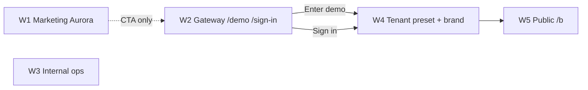

# Livia target visuals — naming, inheritance, coordinated experience

**Status:** canonical (2026-06-01)  
**Assets map:** [`assets/README.md`](./assets/README.md)

---

## 1. Two different “northstar” concepts

| Type | Folder | Purpose |
|------|--------|---------|
| **Evolution northstar** | `assets/evolution/northstar/` | Platform mood — density, composition, “what great feels like” |
| **Livia target** | `assets/w4-tenant/.../*.target.png` | **Ship bar** — this exact skin on this surface when we’re done |

Playwright **captures** (`captures/screen-cards/`) are a third thing: “what the app looks like today.” They are not approval art.

We are moving founder approval to **`.target.png`** files with explicit names. Screen-card YAML stays the functional spec; targets are the visual contract.

---

## 2. `g1-wedge-web` = `/demo` only

Yes — **`g1-wedge-web`** is the visual anchor for **`/demo`** (W2 gateway), not the tenant cockpit.

| Route | Skin |
|-------|------|
| `/demo` | W2 gateway Aurora (`g1-wedge-web.target.png`) |
| `/demo/wedge/:vertical` | Same W2 shell; **copy + crops** change per vertical — **not** tenant preset |
| After “Enter demo” → tenant session | **Switches to W4** — demo business’s `presentation_preset_id` + brand |
| `/dashboard`, `/inbox`, … | W4 only |
| `/sign-in` | W2 gateway — see §4 |
| `/b/{slug}` | W5 — inherits **tenant** preset + brand |

**Demo wedge does not feed other pages.** It only sets *expectation* for that vertical’s story before Clerk sign-in.

---

## 3. Skin inheritance chain (coordinated, not stitched)

| Step | User sees | Skin |
|------|-----------|------|
| Marketing | livia-hq.com | W1 fixed |
| Pick vertical on `/demo` | Wedge grid | W2 fixed |
| Wedge story | Interstitial | W2 + vertical **content** only |
| Enter demo / real login | Dashboard | W4 preset for **that business** |
| Change preset in Settings | Dashboard + `/b` preview | W4 + W5 update together |
| Staff opens `/b` link | Guest book | W5 = same preset + logo |

**One tenant record** drives W4 and W5. Platform worlds (W1–W3) never use tenant presets.

---

## 4. Sign-in — adaptive skin (differentiator)

**Problem:** Bright sign-in → dark dashboard feels like two products.

**Proposal (sustainable):**

| Phase | Behaviour |
|-------|-----------|
| **Anonymous** | W2 gateway default (Aurora) — same for everyone |
| **Email / Clerk first factor recognized** | Fetch `presentation_preset_id` + `brandAccent` for user’s **default business** (or last-used tenant) |
| **Before password/OAuth completes** | Cross-fade gateway panel to **preset preview tokens** (background, primary, logo thumbnail) — no full layout swap |
| **After auth** | Hard navigate to `/dashboard` — already in correct preset; **no second flash** |

**Rules**

- Sign-in **never** uses tenant preset as the permanent W2 skin — only a **preview hint** tied to session resolve.
- New users with no business yet → stay gateway until onboarding picks vertical + preset.
- Demo entry from `/demo` → optional `?preset=beauty-soft-studio` on sign-in preview only for that demo slug.

**Engineering:** `GET /api/public/sign-in-hint?email=` or post-identify hook — returns safe token bundle (colors, logo URL, preset id). No PII beyond what Clerk already exposed.

This is rare in SaaS and **on-brand** for “Livia adapts to your business.”

---

## 5. Do we need a mock per screen per skin?

**No** — once a preset’s **token contract** is defined:

| Locked per preset | Derived on every surface |
|-------------------|---------------------------|
| `--background`, `--primary`, `--radius`, font stack, density class | Dashboard, inbox, bookings, settings, `/b` book |
| Layout primitive (`cards` vs `editorial` vs `compact`) | Module order from policy + persona |
| Light/dark mode | `color-scheme` on `html[data-presentation]` |

We only need **target PNGs** for:

1. **Hero surfaces** per preset (dashboard owner-solo, dashboard manager, public book mobile)
2. **Regression captures** per release (automated)

Other screens inherit — designers spot-check inbox + one secondary route when preset ships.

---

## 6. Beauty vertical — four presets (current)

| # | Preset id | Label | Mode | Target folder |
|---|-----------|-------|------|----------------|
| 0 | `platform-default` | Platform Default (Aurora) | system | Uses global Aurora — demos |
| 1 | `beauty-soft-studio` | Soft Studio | light | `w4-tenant/beauty/presets/soft-studio/` |
| 2 | `beauty-editorial` | Editorial | light | `w4-tenant/beauty/presets/editorial/` |
| 3 | `beauty-premium-dark` | Premium Dark | dark | `w4-tenant/beauty/presets/premium-dark/` |

### Platform Default vs vertical default (no conflict)

| Role | `platform-default` | Vertical default (e.g. `beauty-noir-dusk`) |
|------|-------------------|---------------------------------------------|
| **New signup** | ~~was forced~~ → now **vertical default** on `POST /businesses` | What owners see on first login |
| **Owner picker** | Optional 5th choice — Aurora demos / “classic Livia” fans | Recommended default per vertical |
| **Invalid preset id** | Fallback resolver | — |
| **W2 `/demo`** | Gateway Aurora — separate world | — |

**Owners only see one active skin** (`presentation_preset_id` on the business row). W4 + W5 share it via `applyPresentationTheme`. You do **not** need Platform Default for normal beauty tenants — keep it for demos, support, and explicit opt-in only.

---

## 7. Screen-cards program (updated role)

| Artifact | Role going forward |
|----------|-------------------|
| `docs/design/screen-cards/*.yaml` | Behaviour, modules, copy, persona |
| `assets/w4-tenant/.../*.target.png` | Visual approval |
| `captures/screen-cards/*.png` | CI drift until target exists |
| `assets/evolution/northstar/*.png` | Inspiration only |

Re-capture or replace screen-cards when a surface gets a `.target.png` for that preset.

---

## 8. Changelog

| Date | Change |
|------|--------|
| 2026-06-01 | Asset folder map, naming convention, adaptive sign-in, demo vs tenant clarity |
