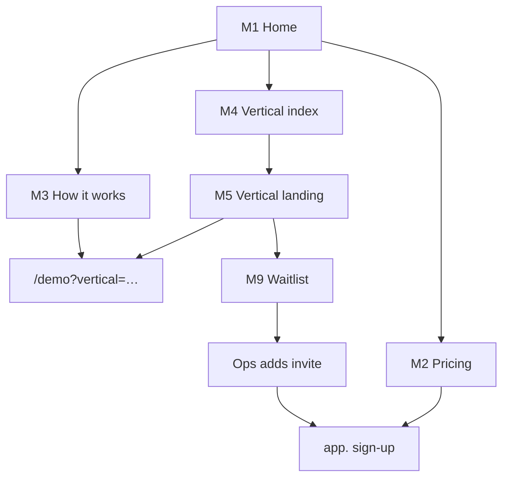
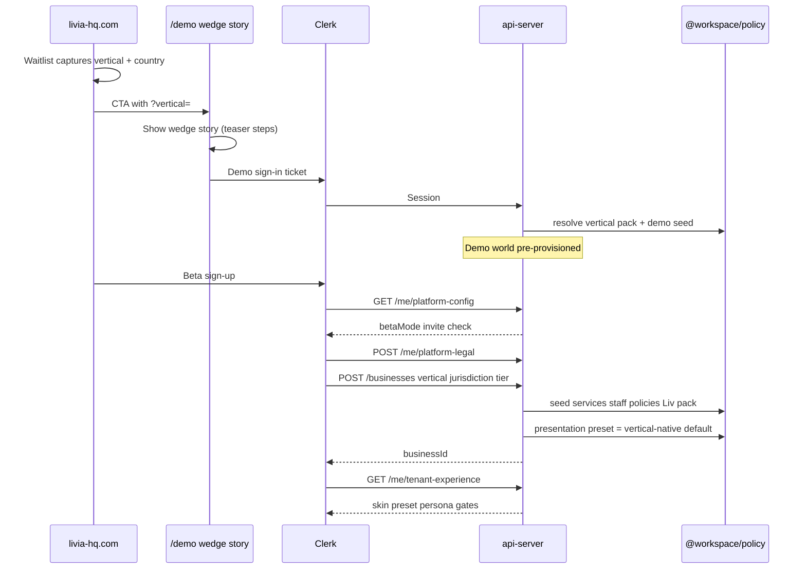

# Platform surfaces — build spec (design complete → implementation)

**Status:** canonical build handoff (2026-05-29)  
**Audience:** founder, engineering, agents  
**Supersedes:** ad-hoc notes in chat; pairs with [`PLATFORM-SURFACES-CONCEPTS-DEEP.md`](./PLATFORM-SURFACES-CONCEPTS-DEEP.md) (founder locks) and [`PLATFORM-SURFACES-UX-REDESIGN.md`](./PLATFORM-SURFACES-UX-REDESIGN.md) (full screen catalog).

**Program track:** Track **F** in [`PLATFORM-EVOLUTION-AND-OPS-PROGRAM.md`](../product/PLATFORM-EVOLUTION-AND-OPS-PROGRAM.md) §8.6.

**Full lifecycle (skins, seed, W4/W5):** [`LIVIA-PLATFORM-LIFECYCLE.md`](../product/LIVIA-PLATFORM-LIFECYCLE.md) · **Nested flows:** [`LIVIA-PLATFORM-FLOWS.md`](../product/LIVIA-PLATFORM-FLOWS.md)

---

## 0.1 Skin worlds (do not merge)

| World | Skin | Who |
|-------|------|-----|
| Marketing (livia-hq.com) | Aurora Editorial | Prospects |
| Gateway (/demo, sign-in) | Gateway aurora | Prospects |
| Internal exec | Ops amber — exec module | Livia Inc |
| Internal support | Ops amber — support module | Livia support |
| Tenant app (dashboard/mobile) | **Platform Default on signup** → optional vertical presets | Business users |
| Public booking (`/b/{slug}`) | Business brand × vertical P7 template | End customers |

See lifecycle doc §1 for full hierarchy.

## 0. Is UI/UX design done?

| Layer | Design status | Build status |
|-------|---------------|--------------|
| **Platform marketing** (`livia-hq.com`) | ✅ Spec complete — anchor [`northstar/m1-home-web.png`](./assets/livia-evolution/northstar/m1-home-web.png); **M1-R2 locked** | Not started |
| **Gateway demo** (`/demo`) | ✅ G1-A locked — grid + per-wedge story interstitial | Partial (`Launcher.tsx` persona grid, no wedge story yet) |
| **Gateway sign-in / exec handoff** | ✅ Spec in UX redesign G3/G4; inherits dashboard sign-in chrome | Partial |
| **Internal exec home** | ✅ I2 locked — Ship Lane collapse/expand + Hats, one skin | Partial (`FounderCockpitView`) |
| **Internal support** | ✅ I4-A locked — full screen map below | MVP list only |
| **Internal other modules** (tenants, flags, …) | 🟡 Concept A/B/C in UX redesign; **inherit I0-A shell** — no new PNGs required | MVP exists |
| **Tenant presentation presets (Track D)** | ✅ 36 presets catalogued | D1–D8 not built |
| **Tenant onboarding wizard** | ✅ Acts A0–A12 documented | Built; preset step deferred to D3.7 |

**Verdict:** Platform-surface **UX is specified enough to build this round**. **M1-R2 locked**; marketing anchor [`MARKETING-SURFACE-PROGRAM.md`](./MARKETING-SURFACE-PROGRAM.md). Tenant preset **visual QA** (D7 matrix) is implementation + sign-off, not more concept work.

---

## 1. Design inheritance — one brand, many pages

### 1.1 Livia Inc design tokens (from logo → CSS)

All **platform** surfaces (marketing, gateway, internal) share a **family resemblance** derived from the Livia wordmark — not tenant preset skins.

| Token | Source | CSS / Tailwind |
|-------|--------|----------------|
| **Wordmark** | LIVIA logotype — geometric sans, stylized **A** | `font-sans` tracking-tight; nav logo component |
| **Display type** | Editorial headlines | `font-serif` — H1/H2 on marketing + exec section titles |
| **Ink base** | Marketing + internal ops | `#0a0a0f` / `bg-background` |
| **Aurora accent** | Logo cyan glow | `aurora-cyan` — CTAs, links, active nav |
| **Champagne subline** | Secondary emphasis | `aurum-champagne` — eyebrows, Liv lines |
| **Glass panels** | Tier cards, exec rows | `bg-[#0c0c10]/80 backdrop-blur` |
| **Internal ops accent** | Distinct from tenant | Amber **INTERNAL** stripe — never in tenant apps (ADR 0019) |
| **Currency** | EU GTM | **€ only** — `pricing-catalog.ts`, `formatEur()` |

**Rule:** Each page **may vary layout** (hero vs table vs 3-col) but **must reuse** M0 nav/footer (marketing) or I0 sidebar (internal). No orphan pages with a third theme.

### 1.2 Marketing page inheritance matrix (`artifacts/livia-marketing`)

| ID | Route | Layout personality | Inherits from M0 | Locked? |
|----|-------|-------------------|------------------|---------|
| **M0** | shell | Sticky dark nav, 4-col footer, aurora hairline | — | ✅ Aurora Editorial |
| **M1** | `/`, `/de` | Story-first hero — narrative continuity (R2) | M0 | ✅ M1-R2 locked |
| **M2** | `/pricing` | 3 glass tier cards + add-on accordion | M0 + M1 tokens | ✅ M2-A honest (no badge) |
| **M3** | `/how-it-works` | Vertical timeline — Book → Inbox → Today → Liv | M0 | Hybrid: M3-A nodes + M1 showcase strip |
| **M4** | `/verticals` | Card grid — icon halo per trade | M0 | M4-A gallery |
| **M5** | `/verticals/:slug` | Trade-specific hero + 3 teaser bullets + demo CTA | M0; copy from `VERTICAL_COVERAGE_REGISTRY` | M5-C spec sheet + one screenshot |
| **M6** | `/for/chair-rental` | Host story + chain rollup tease | M0 | M6-A product-led |
| **M7** | `/europe`, `/de` | Locale pills + honest jurisdiction copy | M0; `/de` localized H1 | M7-B local trust |
| **M8** | `/eu-ai` | Long-read + sidebar TOC | M0 header band only | M8-B plain FAQ |
| **M9** | home band + `/contact` | Frosted form: email + **vertical** + country | M0 | M9-A invitation card |
| **M10** | `/changelog` | Dated serif month sections | M0 | M10-A diary |
| **M11** | `/status` | Component status rows | M0 | M11-A calm board |
| **M12** | `/legal/*` | `prose prose-invert` max-w-3xl | M0 minimal chrome | M12-A branded legal |

**Flow between pages:**



Every marketing CTA that promises product capability links to **demo** (try) or **sign-up** (commit) with **`?vertical=`** query preserved where possible.

---

## 2. Gateway — G1-A Wedge Story (locked)

### 2.1 Two-step flow

| Step | Route | UI | Purpose |
|------|-------|-----|---------|
| **1 — Pick trade** | `/demo` | Grid of wedges from `VERTICAL_COVERAGE_REGISTRY` (tier ≠ `defer`) | Self-segment before sign-in |
| **2 — Wedge story** | `/demo/wedge/:vertical` | 3–4 step story panel + **Enter demo** CTA | Show *what Livia does for this trade* without full product tour |
| **3 — Enter** | action | `requestDemoSignInForBusiness(demoSlug)` or provision + Clerk ticket | Land in tenant dashboard/mobile with vertical pack already seeded |

Reference visual: [`gateway-demo-a-wedge-story-tattoo.png`](./assets/platform-surfaces/gateway-demo-a-wedge-story-tattoo.png) (body-art — **clarity standard for all wedges**).

**Hair / other wedges:** Same interstitial **layout** as tattoo; trade-specific beats in [`GATEWAY-SURFACE-PROGRAM.md`](./GATEWAY-SURFACE-PROGRAM.md) §4. **Do not** use [`gateway-demo-c-continuity-hair.png`](./assets/platform-surfaces/gateway-demo-c-continuity-hair.png) as the hair interstitial — it crams too much (G1-C alternate only).

**Teaser rule:** Each step = **one sentence + one UI hint** (blurred or cropped screenshot). Never show full settings trees, Liv prompt editor, or internal ops.

### 2.2 Per-wedge story content (policy-driven)

Source of truth for slugs: `lib/policy/src/vertical-coverage.ts`. Story steps live in new **`lib/policy/src/wedge-demo-stories.ts`** (build task F2.1).

| Vertical | Step 1 | Step 2 | Step 3 | Step 4 (optional) | Demo tenant slug |
|----------|--------|--------|--------|-------------------|------------------|
| **hair** | Instagram DM lands in **Inbox** | Customer **books** from your link | **Reminder** SMS before appointment | **Today** — who's in next | default hair demo |
| **beauty** | WhatsApp thread in **Inbox** | **Book** with patch-test note on service | Liv **drafts** reply for you to approve | — | `bloom-beauty-dublin` |
| **body-art** | Consult request in **Inbox** | **Design proof** link on booking | **Deposit** to hold the session | Day-of **Today** list | `ink-anchor-galway` |
| **wellness** | Calm **booking page** | Package / voucher mention | **Reminder** with buffer time | — | `harbour-wellness-cork` |
| **fitness** | **Class** booking | **Waitlist** when full | Staff **borrow** cover (mention only) | — | `peak-fitness-dublin` |
| **medspa** | Consult **book** | **Consent** gate on public page | Procedure slot **Today** | Not an EHR — footnote | `clarity-medspa-dublin` |
| **allied-health** | Longer slot **book** | Policy **cancel window** | Intake on public page | Lite clinic disclaimer | `motion-physio-cork` |
| **pet-grooming** | **Pet profile** on book | Pickup time via **SMS thread** | Owner **Today** glance | — | `paws-parlour-dublin` |
| **automotive-detailing** | Vehicle size → **service tier** | **Book** detail slot | **Today** bay schedule | — | `shine-studio-belfast` |

**Partner-only / defer** verticals (dental, mental health, adjacent solo): show on grid with **“Partner programme”** or hidden until `tier !== defer`.

### 2.3 Implementation notes

| Item | Location |
|------|----------|
| Wedge story route | `artifacts/livia-dashboard/src/pages/demo/WedgeStory.tsx` |
| Grid → story navigation | `Launcher.tsx` — tile click → `/demo/wedge/${codeVertical}` |
| Query param fallback | `/demo?vertical=body-art` skips grid if valid |
| Marketing deep link | M5 CTA → `/demo/wedge/body-art` |
| Styling | Same aurora gateway shell as sign-in — not internal amber |

---

## 3. Internal support — I4-A The Thread (locked)

**Primary layout:** three columns on desktop — **Queue 240px | Thread flex | Context 320px**.  
**Alternates:** I4-B Board and I4-C Radar as **separate routes** (not just column toggles) for depth and bookmarking.

### 3.1 Screen map

| Screen | Route | Job | Key components |
|--------|-------|-----|----------------|
| **Support home** | `/support` | Redirect to queue default view | — |
| **Queue — Thread** | `/support/queue` | Browse open tickets; select → thread | `SupportQueueColumn`, filter chips, SLA sort |
| **Ticket thread** | `/support/tickets/:id` | Full thread + reply + Liv bundle for `liv_error` | `ThreadColumn`, composer, attachment strip |
| **Ticket context** | `/support/tickets/:id` (right pane) | Tenant health, `requestId`, `surfaceId`, runbooks, Sentry | `ContextColumn` — sticky on desktop, drawer on tablet |
| **Board** | `/support/board` | Kanban: Open → Triaged → Waiting → Resolved | `TriageBoard`, card → opens thread route |
| **Board card** | `/support/board` (detail drawer) | Quick assign / escalate without leaving board | Drawer overlays board |
| **Radar grid** | `/support/radar` | Tenant health grid, vertical badge | `TenantRadarGrid` |
| **Radar drill** | `/support/radar/:businessId` | All open tickets for one tenant | List + peek panel |
| **Radar peek** | drawer on drill | Assign / escalate | Same thread data model |
| **Investigate** | `/support/investigate` | Paste `requestId` — logs + Sentry template | Track C1.3 panel |
| **Knowledge** | `/knowledge` | Runbooks linked from context pane | existing route, cross-link |
| **Tenant bridge** | `/tenants/:id` → Support tab | Tenant detail support history | I7 integration |

### 3.2 Navigation chrome

- **Top bar:** `Thread | Board | Radar | Investigate` — persists across support routes.
- **Layout toggle on tablet:** Queue collapses to drawer; Context becomes bottom sheet.
- **Keyboard:** `j/k` queue navigation; `/` focus search; `c` compose when thread focused.
- **Registry:** Context pane pulls `getSupportPoint(surfaceId)` from `@workspace/policy` (Track B1).

### 3.3 Empty / edge states

| State | UX |
|-------|-----|
| Queue empty | Calm illustration + link to Radar for proactive sweep |
| Thread selected, no tenant | Context shows “Unknown tenant” + paste slug search |
| `liv_error` tag | Inline Liv incident bundle + link to `/platform` liv errors |
| P0 ticket | Red SLA banner; board column pinned top |

---

## 4. Internal exec — I2 (locked)

See [`PLATFORM-SURFACES-CONCEPTS-DEEP.md`](./PLATFORM-SURFACES-CONCEPTS-DEEP.md) §I2.

| Tab | Default state | Interaction |
|-----|---------------|-------------|
| **Exceptions** | List ≤5 items | Daily default landing |
| **Ship Lane** | **Collapsed** summary rows | Chevron → **expanded** checklist in place |
| **Hats River** | Swimlanes | Planning sessions |

Workforce grants → `/access`. Automations → `/platform`.

---

## 5. Pre-login → post-login programmatic pipeline

Goal: **platform is ready for the tenant before they finish onboarding** — correct vertical pack, demo seed, default preset, vocabulary, and gated features.



### 5.1 Capture points for `vertical`

| Stage | Field | Storage | Used for |
|-------|-------|---------|----------|
| Marketing waitlist | `vertical` select | `marketing_leads` table / CRM | Ops prioritization; optional pre-invite |
| Demo grid | tile click | URL `/demo/wedge/:vertical` | Story content + demo slug |
| Clerk sign-up metadata | optional `unsafeMetadata.vertical` | Clerk user | Pre-fill onboarding A1 |
| Onboarding A1 | **required** `vertical` enum | `businesses.vertical` | Pack seed, API gates, preset default |
| Onboarding D3.7 (Track D) | optional `presentation_preset_id` | `businesses` | Skin override (staging) |

### 5.2 What gets seeded on `POST /businesses`

Already today (extend, do not duplicate):

1. **Vertical pack** — services, staff template, Liv vocabulary (`resolveTenantExperience`).
2. **Operational policy** — cancel windows, jurisdiction footer.
3. **Onboarding extras** — `getVerticalOnboardingExtras(vertical)` copy in wizard.
4. **Feature gates** — `withBusinessFeature()` hides medspa/classes/proofs until vertical matches.
5. **Presentation preset (Track D2)** — default = **`platform-default`** (Platform Default / Aurora tenant chrome). Owner may switch to vertical-native presets in Settings → Appearance. Capability always from vertical, not preset.
6. **Demo path** — skip A1 seed if entering from demo provision (world exists).

### 5.3 Platform readiness before login

| Check | Enforced where |
|-------|----------------|
| Beta invite | `LIVIA_BETA_SIGNUP_MODE` + `beta-signup-gate.ts` |
| Platform legal | `/legal-acceptance` before `POST /businesses` |
| Vertical API routes | `wedge-api-gate.ts` / `withBusinessFeature` |
| Workforce / exec | `workforce-access-grants` + `/me` platform exec flag |
| Demo enabled | `LIVIA_DEMO_ENABLED` + `demo-portal-config.ts` |
| Staging presets | `presentationPresetsEnabled()` |

### 5.4 Registration form → skin (programmatic)

```typescript
// Target contract (Track D1 + F3)
vertical → presentation_preset_id = "platform-default" on create
  → resolvePresentationPreset(vertical, presetId?) → TenantExperienceSkin
  → dashboard/mobile: applyPresentationTheme(skin)
  → public /b: business brand + publicExperienceSkin(vertical) + preset tokens when D5 ships
```

No app-local vertical lists — **`GET /api/onboarding/catalog`** returns verticals + tiers + preset thumbnails (staging).

---

## 6. How platform surfaces connect to tenant Track D

| Concern | Platform surfaces (Track F) | Tenant Track D |
|---------|----------------------------|----------------|
| Audience | Prospects, ops, demo | Paying tenants |
| Visual system | Single Livia Inc brand | 36 presentation presets × 3 surfaces |
| Vertical stories | Marketing M5 + demo wedge stories | Ritual homes + preset thumbnails |
| Honesty | `marketing-vs-reality.md` | Preset QA matrix D7 |
| Code overlap | Share aurora **tokens** only | `presentation-presets.ts`, `tenant-experience.ts` |

Marketing **never** applies tenant preset picker. Demo **lands** in tenant app with vertical-default preset. Owner may change preset in Settings (staging gate) during Track D.

---

## 7. Build phases (Track F)

| Phase | Scope | Est. | Depends |
|-------|--------|------|---------|
| **F0** | Founder picks M1 (S1/S2/S3) | 30 min | — |
| **F1** | Marketing M0 shell token pass + logo components | 2 d | F0 |
| **F2** | M1 home + M2 pricing + M9 waitlist vertical field | 4 d | F1 |
| **F3** | G1-A wedge grid + story routes + `wedge-demo-stories.ts` | 3 d | F1 |
| **F4** | M4/M5 vertical pages wired to registry + demo deep links | 2 d | F2, F3 |
| **F5** | I0 internal token pass + I2 Ship Lane collapse | 3 d | — |
| **F6** | I4 support screen map (queue/thread/board/radar) | 8 d | Track B1 registry |
| **F7** | M3, M6–M8, M10–M12 utility pages | 4 d | F2 |
| **F8** | E2E: marketing → demo wedge → tenant; waitlist → invite → onboard | 2 d | F3, F4 |

**Parallel:** Track D D1–D8 can run alongside F5–F6; F3 demo stories share `vertical-coverage.ts` with onboarding catalog (Track A1 dedupe).

---

## 8. Verification checklist

| Check | Action |
|-------|--------|
| EUR everywhere on marketing | grep `\$[0-9]` in `livia-marketing` — zero matches |
| Wedge story doesn't leak settings | Manual QA each vertical story — max 4 steps |
| Support routes deep-linkable | `/support/tickets/:id`, `/support/board`, `/support/radar` |
| Vertical preserved sign-up → A1 | E2E with `?vertical=body-art` |
| Internal ≠ tenant chrome | No preset picker in `livia-internal` |
| `pnpm typecheck` | After each phase |

---

## 9. Related docs

| Doc | Role |
|-----|------|
| [`PLATFORM-SURFACES-FINAL-CATALOG.md`](../design/PLATFORM-SURFACES-FINAL-CATALOG.md) | **29 approved PNGs** + gallery |
| [`PLATFORM-SURFACES-UX-REDESIGN.md`](./PLATFORM-SURFACES-UX-REDESIGN.md) | Full A/B/C catalog |
| [`BETA-ONBOARDING-FLOW.md`](../product/BETA-ONBOARDING-FLOW.md) | Post-login acts |
| [`PRESENTATION-PRESETS-AND-ROLLOUT.md`](./PRESENTATION-PRESETS-AND-ROLLOUT.md) | Tenant skins |
| [`PLATFORM-EVOLUTION-AND-OPS-PROGRAM.md`](../product/PLATFORM-EVOLUTION-AND-OPS-PROGRAM.md) | Tracks A–F |

---

## Changelog

| Date | Change |
|------|--------|
| 2026-05-29 | Initial build spec — inheritance, G1 wedge catalog, I4 screen map, pre-login pipeline |
