# Platform surfaces — deep concept specs (v4)

**Status:** canonical design (2026-05-29)  
**Founder locks:** M1-R2 · M2-A · Platform exec Ship Lane + Hats · I4-A Thread · G1-A Wedge Story  
**Gallery:** http://localhost:5173/experience/platform-surfaces — **final screen catalog** (29 PNGs)

**Inventory:** [`PLATFORM-SURFACES-FINAL-CATALOG.md`](./PLATFORM-SURFACES-FINAL-CATALOG.md)

This document is the **full-depth** spec for the screen families you asked to nail down. PNGs are direction mockups; implementation uses React + Tailwind.

**Global marketing rule:** All marketing copy and visuals use **EUR (€)** — prices from `pricing-catalog.ts`, never `$`.

---

## M1 — Marketing home: company & product (R1–R3)

**Brief:** Home sells **Livia the company and category** — immersive, not a Book/Inbox/Today brochure. **S1–S3 retired** from gallery; PNGs kept for reference.

| Concept | What it sells | Best when |
|---------|---------------|-----------|
| **M1-R1 The OS** | Appointment **infrastructure** — beliefs, not pillars | Company-first |
| **M1-R2 One thread (story)** | **Narrative** continuity | Emotional GTM |
| **M1-R3 Trade worlds** | **Identity** — atmospheric trades | Vertical breadth |

### M1-R1 — The OS

### M1-R2 — One thread (story)

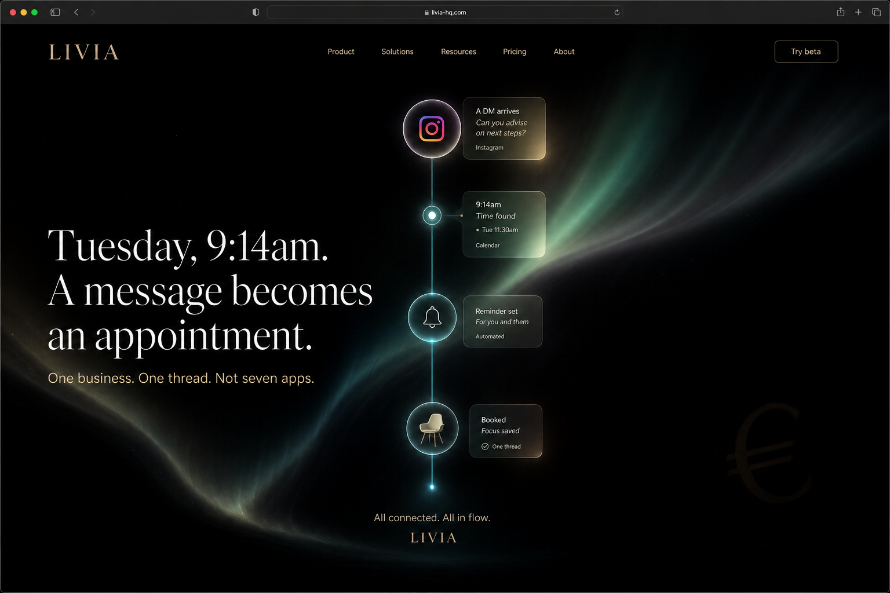

### M1-R3 — Trade worlds

---

## Critical naming — two different “founder” surfaces

| Surface | Who | Job | Route | This doc section |
|---------|-----|-----|-------|------------------|
| **Tenant P1 founder** | Aoife, 3 salons | “Are my shops OK?” | Dashboard `/chain`, mobile Glance | [`EXPERIENCE-ARCHITECTURE.md`](./EXPERIENCE-ARCHITECTURE.md) Part 4 — Briefing Paper / Exception Only |
| **Platform exec home** | Eamon / Livia Inc | “Can we invite customers? What’s on fire?” | `livia-internal` `FounderCockpitView` | **I2 below** |

The rejected “control room / briefing cards” mockups were **generic SaaS dashboards**. Platform exec home must answer **company ship and ops**, not duplicate Grafana.

---

## M2 — Pricing inherits home (locked rule)

**Rule:** Whichever home concept wins (M1-S1/S2/S3), pricing **must** use the same token bundle — no orphan pricing page. All prices in **€**.

| Home pick | Pricing concept | Shared tokens | Layout |
|-----------|-----------------|---------------|--------|
| **M1-S1** | **M2-A Aurora tier cards** | Ink bg, serif display, aurora-cyan CTA, glass cards, champagne sublines | 3-column card grid; Studio tier cyan ring; expansion row below |
| **M1-S2** | **M2-A** (same skin) | Same as S1 | Same — continuity story in hero, pricing below |
| **M1-S3** | **M2-A** (same skin) | Same as S1 | Same — three-panel motif echoes in add-ons band |

### M2-A — Aurora tier cards ✅ **LOCKED** (inherits M1-A)

**Founder decision:** M2-A approved. Pair with **M1-S1/S2/S3** home when implementing marketing refresh. **No “Most Popular” badge.** Prices in € from `pricing-catalog.ts`.

| Element | Spec |
|---------|------|
| **Page header** | Same `EditorialPageHeader` as home — serif H1 “Pricing”, eyebrow “Solo · Studio · Chain” |
| **Cards** | `CORE_PLANS` from `pricing-catalog.ts`; glass `bg-[#0c0c10]/80 backdrop-blur` |
| **Highlight** | Studio: `ring-2 ring-aurora-cyan` + “Recommended” pill |
| **Features** | Check list inside card; max 5 bullets visible, “+ N more” expand |
| **Add-ons** | Accordion below grid — same dark prose |
| **CTA** | Primary = Join beta scroll; secondary = Get started → dashboard sign-up |
| **Honesty** | Footnote links `marketing-vs-reality.md` rows for voice/SMS claims |

### M2-B — Atelier menus (inherits M1-B)

| Element | Spec |
|---------|------|
| **Background** | `aurum-cream` full bleed; no dark sections |
| **Tier presentation** | Tall menu cards — plan name as section title, price as serif hero, features as indented list |
| **Host / Chain** | Separate “For multi-location” band below solo/studio — links `/for/chair-rental` |
| **CTA** | Bronze filled button on Studio only; Chain = “Talk to us” |
| **Photography** | Optional thin strip of salon detail photos between header and menus |

### M2-C — Honest comparison (inherits M1-C)

| Element | Spec |
|---------|------|
| **Top** | Narrow product montage — `/b` + inbox + today (static PNG or iframe demo) |
| **Table** | shadcn `Table`; rows = features, cols = Solo/Studio/Chain; mobile = sticky first col |
| **No marketing fluff** | Zero serif poetry; one line value prop |
| **Enterprise** | Single row “Franchise / mid-chain” → contact |

---

## I2 — Platform exec home ✅ **One internal skin — Ship Lane collapse + Hats**

You liked **both Ship Lane visuals**. They are **not competing themes** — they are **collapse states of the same Ship Lane tab**, plus Hats River as a sibling tab. Every exec tab (Home summary, Ship Lane, Hats, Exceptions) inherits the **same internal shell** — sidebar, typography, dark ops tokens from `InternalShell`.

| State / tab | Visual | When you use it |
|-------------|--------|-----------------|
| **Ship Lane (summary)** | 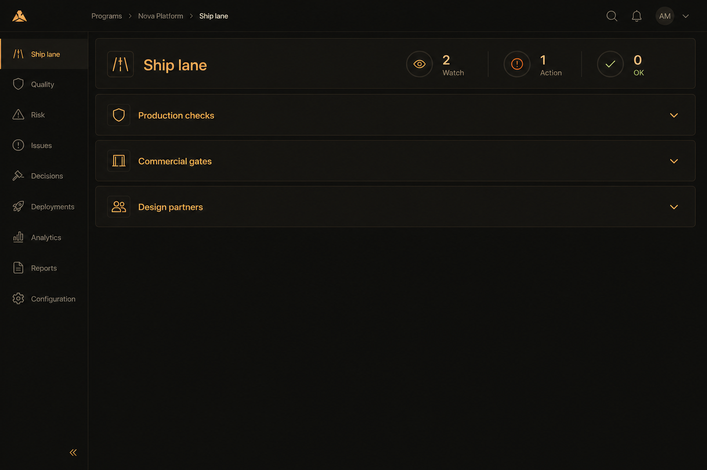 | Default — compact rows, expand chevrons, G2/G3 status at a glance |
| **Ship Lane (detail)** | 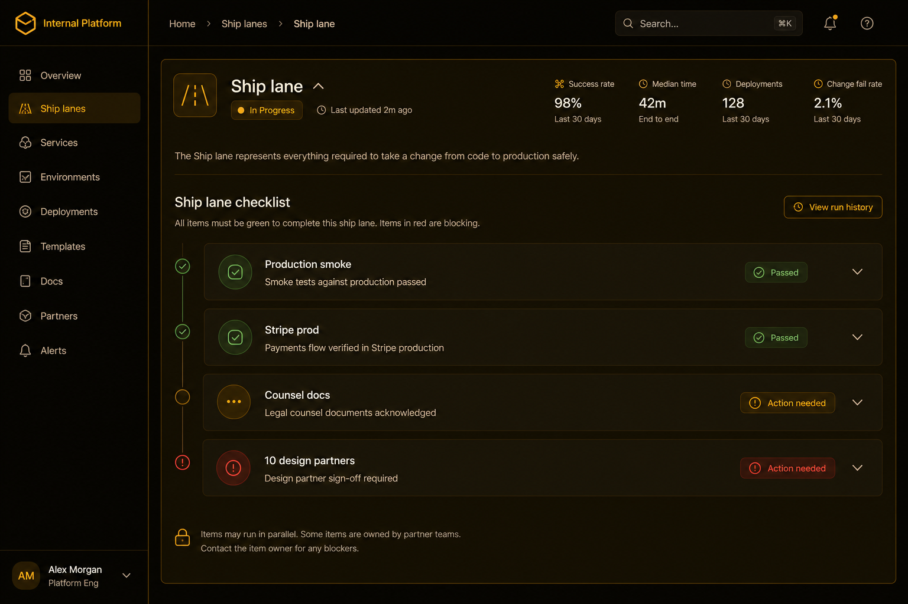 | Drill-in — full checklist per lane, same rows expanded inline |
| **Ship Lane (tabbed alt)** |  | Reference layout — lane tabs across top |
| **Ship Lane (scroll alt)** |  | Reference — vertical scroll all lanes |
| **Hats River** | 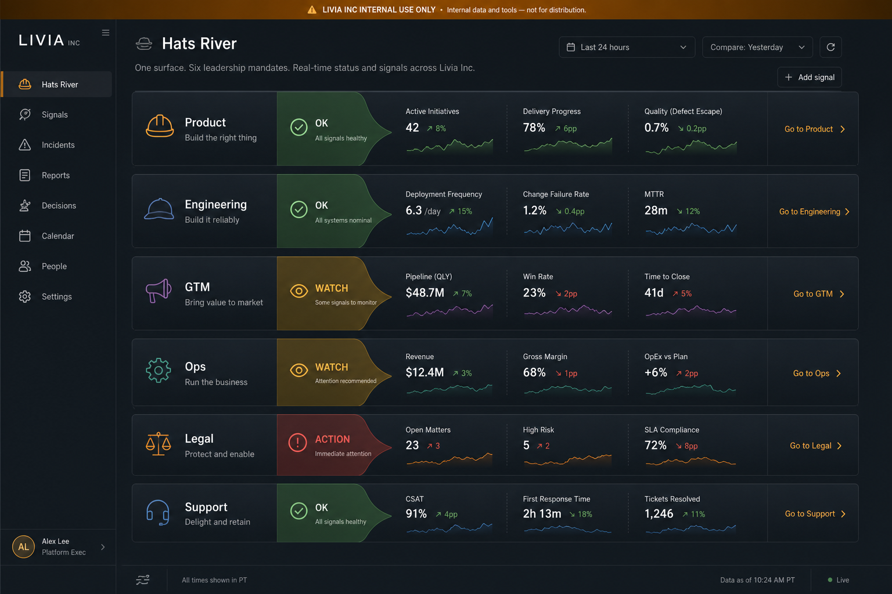 | Planning — mandate swimlanes from `FounderCockpitSnapshot.hats` |
| **Exceptions** | 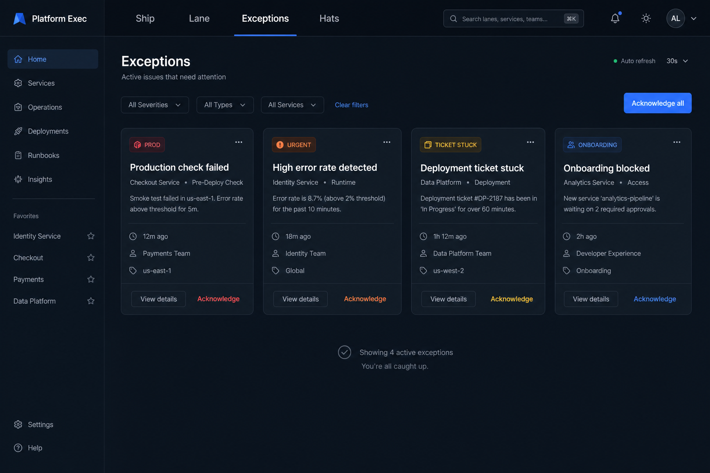 | Daily — ≤5 items or calm empty |

**Interaction model:** Collapsed = top-level exec view (what blocks ship). Click row chevron → expands to detail state **in place** (no route change, no theme swap). Retract → back to summary.

**Default tab on open:** Exceptions (daily) → Ship Lane summary (pre-invite) → Hats (planning).

Workforce grants + automations move to **`/access`** and **`/platform`** — not on exec home tabs.

---

## I4 — Support workspace ✅ **I4-A The Thread — full screen map**

**Primary:** I4-A Thread layout. **Alternates:** I4-B Board + I4-C Radar as **separate routes** (depth over single-page toggles). Clean nav bar: `Thread | Board | Radar | Investigate`.

### I4-A — The Thread ✅ **LOCKED (primary)**

| Screen | Route | Visual ref |
|--------|-------|------------|
| Queue + thread overview | `/support/queue` | 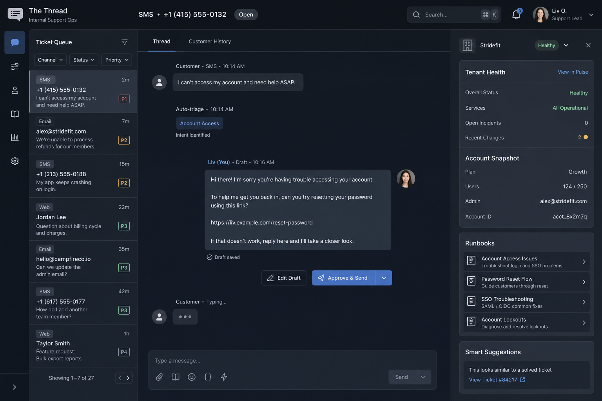 |
| Queue focus (tablet) | column state | 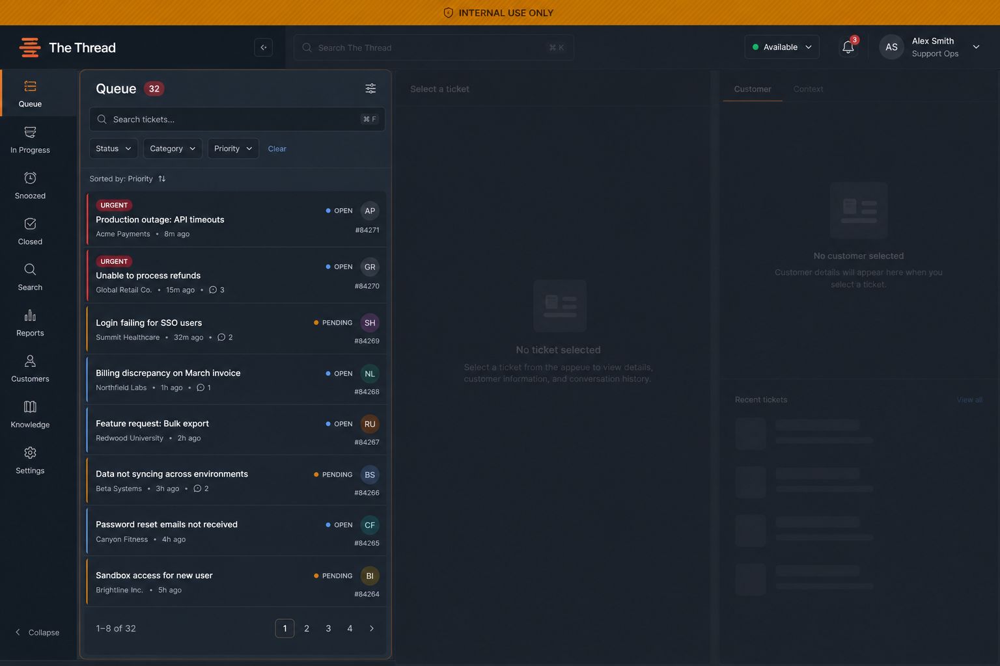 |
| Thread focus | `/support/tickets/:id` | 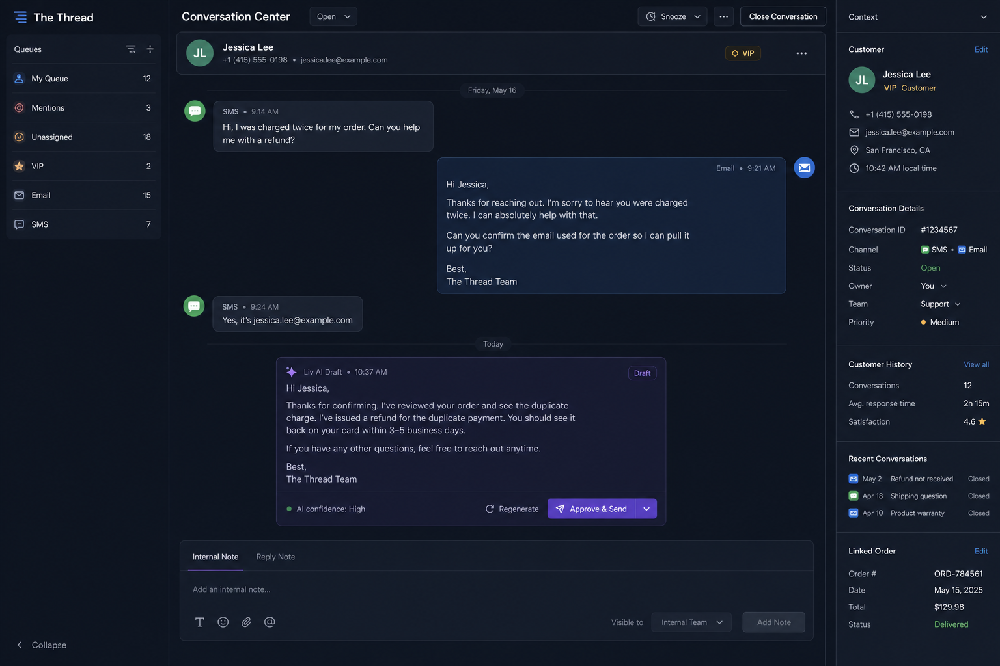 |
| Context pane | same route, right col | 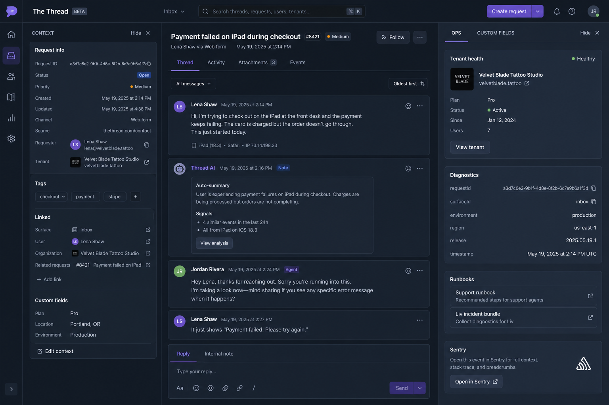 |

Three columns desktop: **Queue 240px | Thread flex | Context 320px**. Liv bundle inline for `liv_error`. Context = tenant health, copyable `requestId`/`surfaceId`, runbooks, Sentry link.

**Full screen inventory:** [`PLATFORM-SURFACES-BUILD-SPEC.md`](./PLATFORM-SURFACES-BUILD-SPEC.md) §3.1.

### I4-B — Triage Board (alternate route `/support/board`)

Kanban for **status workflow** when L1 needs to move tickets, not read long threads first.

| Variant | Visual |
|---------|--------|
| Board overview | 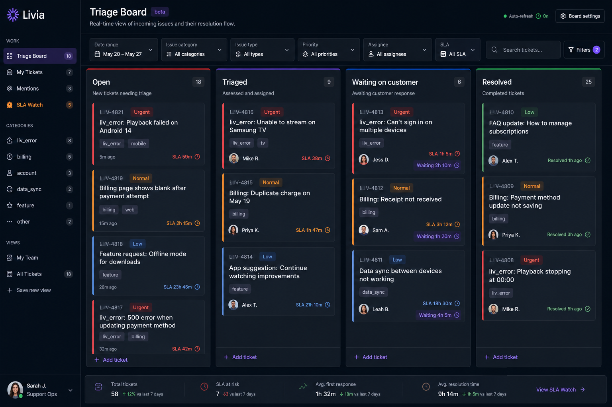 |
| Card detail | 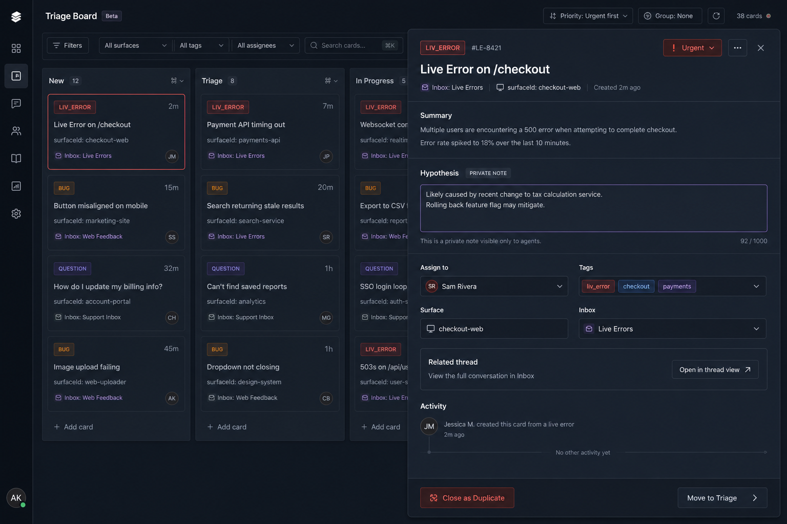 |

Columns: **Open → Triaged → Waiting on customer → Resolved**. Cards show priority, assignee, SLA timer, `liv_error` / `billing` tags. Double-click → opens **Thread** layout for that ticket.

---

### I4-C — Tenant Radar (fresh — replaces Investigate Console)

**Tenant-first** when one shop has multiple tickets or you’re doing proactive health sweeps.

| Variant | Visual |
|---------|--------|
| Health grid | 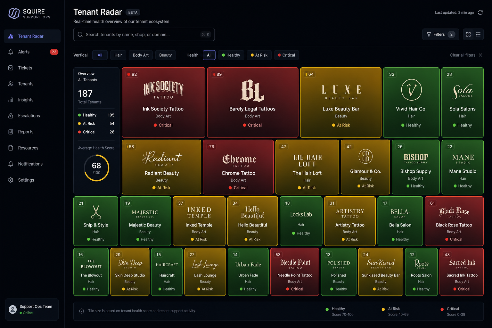 |
| Tenant drill-down | 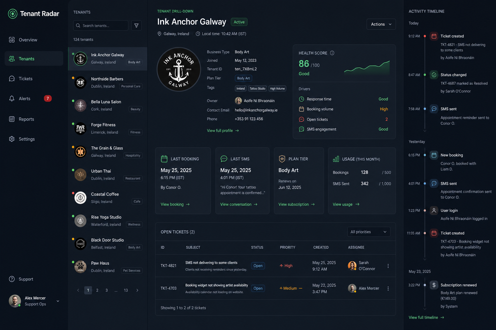 |
| Ticket peek | 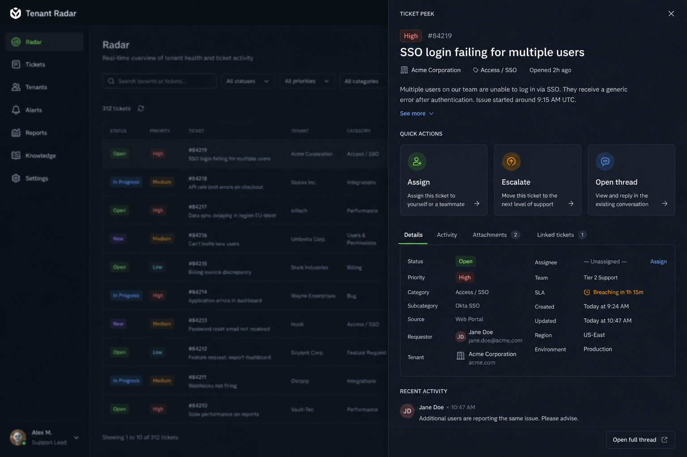 |

Grid = health dot + vertical badge; drill = all open tickets for one tenant; peek = quick assign/escalate without leaving grid.

**Switching layouts:** Top toggle `Thread | Board | Radar` — same ticket data, morph layout (like tenant surface morph).

---

## G1 — Demo launcher

### G1-A — Wedge Story ✅ **LOCKED**

**Flow:** Grid → **per-wedge story interstitial** → Enter demo. Each wedge gets its own teaser story (reference: tattoo PNG). Do **not** dump full product — 3–4 steps highlighting trade-specific value.

| Step | Route | Visual |
|------|-------|--------|
| 1 — Pick trade | `/demo` | 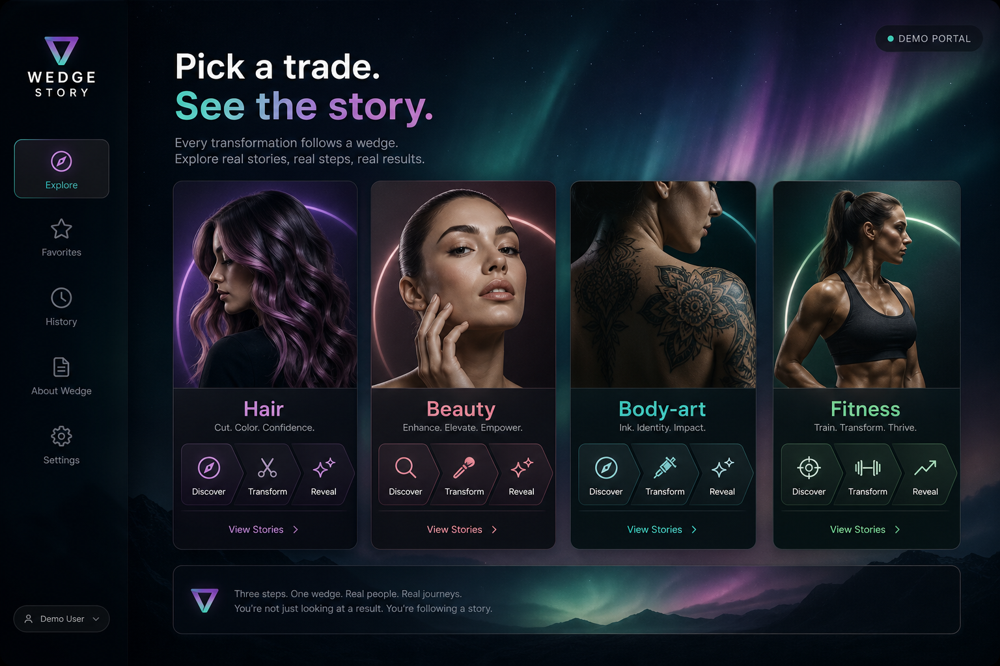 |
| 2 — Wedge story | `/demo/wedge/:vertical` | 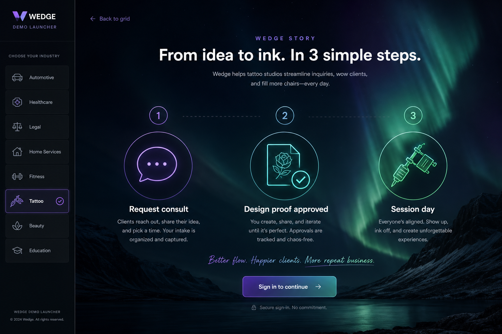 — **clarity standard for all wedges** |
| 3 — Enter demo | action | Clerk ticket → pre-seeded tenant from `VERTICAL_COVERAGE_REGISTRY.demoSlug` |

**Per-wedge rule (2026-05-30):** Every vertical uses the **same interstitial shell** as body-art/tattoo — 3–4 beats, one sentence + one UI crop each. **Unique copy/crops; identical clarity.** Do **not** use the G1-C continuity timeline layout for hair (too much on one screen). Full spec: [`GATEWAY-SURFACE-PROGRAM.md`](./GATEWAY-SURFACE-PROGRAM.md) §4.

**Retired as hair interstitial:** [`gateway-demo-c-continuity-hair.png`](./assets/platform-surfaces/gateway-demo-c-continuity-hair.png) — alternate G1-C concept only; not the locked hair story pattern.

### G1-B — Vertical gallery (alternate)

Pick trade first — simpler grid when wedge interstitial is skipped.

### G1-C — Continuity Timeline (alternate)

Livia differentiator story: **Book → SMS → Staff approves → Day-of**.

| Variant | Visual |
|---------|--------|
| Generic timeline |  |
| Hair filled | 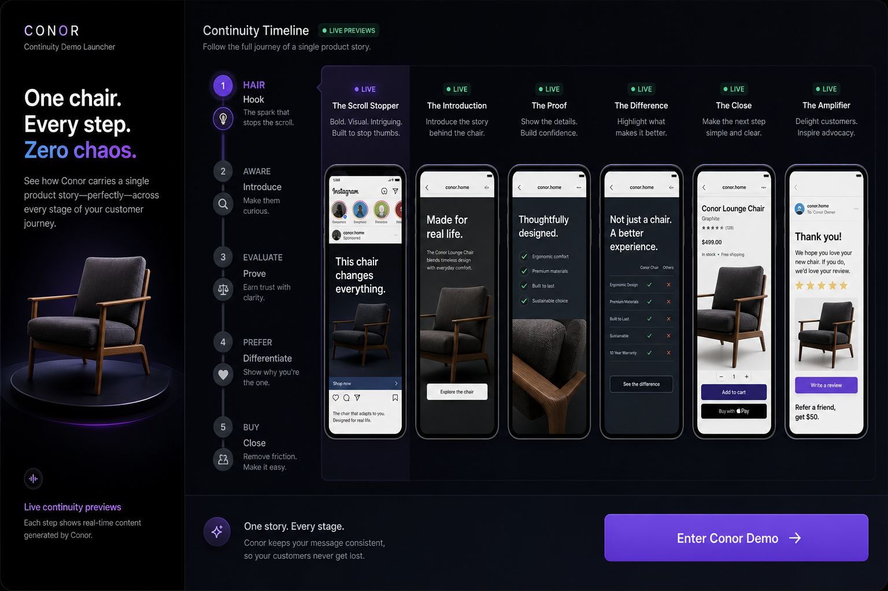 |

Optional second beat after vertical pick — or linked from marketing home C.

---

## Selection worksheet (v5 locks)

| ID | Pick | Status |
|----|------|--------|
| M0 | Aurora Editorial shell | ✅ Locked |
| M2 | **A honest** (no badge, €) | ✅ Locked |
| M1 | **R2 One thread (story)** | ✅ Locked |
| M3–M12 | Per-page inheritance — see BUILD-SPEC §1.2 | ✅ Spec'd (hybrids noted) |
| I0 | Amber Control Room shell | ✅ Locked |
| I2 | Ship Lane collapse/expand + Hats River | ✅ Locked |
| I4 | **A Thread** primary; B Board + C Radar separate routes | ✅ Locked |
| G1 | **A Wedge Story** — grid + per-wedge interstitial | ✅ Locked |

**Implementation handoff:** [`PLATFORM-SURFACES-BUILD-SPEC.md`](./PLATFORM-SURFACES-BUILD-SPEC.md)

---

## Changelog

| Date | Change |
|------|--------|
| 2026-05-29 | v2 initial deep spec |
| 2026-05-29 | v3 — M2-A lock; exec tabbed; I4-A tab PNGs; I4-B/C Triage/Radar; G1 Wedge/Continuity |
| 2026-05-29 | v4 — M1 showcase concepts (S1/S2/S3); EUR rule; Ship Lane collapsed/expanded; G1-A lock |
| 2026-05-29 | v5 — G1 per-wedge story table; I4 full screen map; BUILD-SPEC link; M0/M3–M12 inheritance |
| 2026-05-29 | UI/UX design complete → Track F build handoff in BUILD-SPEC |
