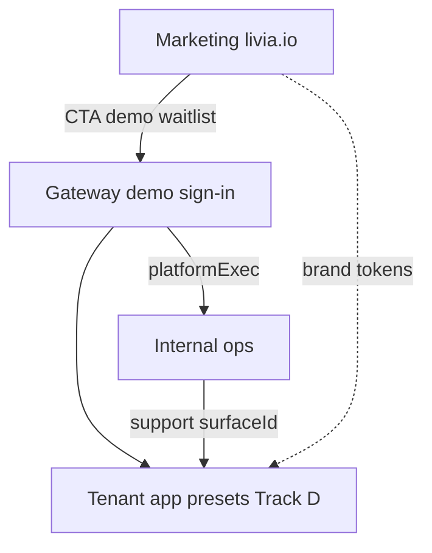

# Platform surfaces UX redesign — visual concepts catalog

> **Archived** — pre-lock A/B/C exploration. **Canonical:** [`PLATFORM-SURFACES-FINAL-CATALOG.md`](./PLATFORM-SURFACES-FINAL-CATALOG.md) → [`PLATFORM-SURFACES-BUILD-SPEC.md`](./PLATFORM-SURFACES-BUILD-SPEC.md) + surface programs. See [`../archive/README.md`](../archive/README.md).

**Status:** archived (2026-05-30) — reference only  
**Scope:** Surfaces **outside** tenant presentation presets — marketing (`livia-hq.com`), internal ops (`ops.`), platform gateway (demo, portal, sign-in).  
**Audience:** founder, product, design, engineering  
**Parent:** [`EXPERIENCE-ARCHITECTURE.md`](./EXPERIENCE-ARCHITECTURE.md) Part 12  
**Tenant UX (presets):** [`PRESENTATION-PRESETS-AND-ROLLOUT.md`](./PRESENTATION-PRESETS-AND-ROLLOUT.md) — do not merge with this doc.

---

## Part 0 — How to use this document

For **every screen family** below you get **three buildable visual concepts** (A / B / C). Each concept includes:

- **Metaphor** — what the user should feel
- **Layout** — structure (not pixel-perfect mock)
- **Tokens** — colours, type, density (Tailwind / CSS vars you already have)
- **Motion** — Framer or CSS only; no WebGL
- **Stack** — `livia-marketing` / `livia-internal` / dashboard components
- **Fit** — when to pick it

**Decision workflow**

1. Read Part 1 (shared constraints).
2. For each screen family, pick **one** concept (or hybrid: e.g. Home = B hero + A nav).
3. Fill the **Selection worksheet** (Part 6).
4. Implementation phases in Part 7.

**Explicitly out of scope here:** tenant dashboard/mobile/`/b` preset skins (Track D), generated concept PNGs from chat (reference only).

---

## Part 0b — Where the visuals live

The text spec below is paired with **concept PNGs** and a **dev gallery**.

| Location | What |
|----------|------|
| **Repo PNGs (canonical)** | [`assets/platform-surfaces/`](./assets/platform-surfaces/) — committed concept mockups |
| **Dev gallery (browse A/B/C)** | **`pnpm dev:dashboard`** → http://localhost:5173/experience/platform-surfaces (primary) · **Logo concepts:** http://localhost:5173/experience/brand-logos · or `pnpm dev:internal` → http://localhost:5175/experience/platform-surfaces |
| **Onboarding concepts (separate)** | [http://localhost:5175/experience/onboarding-picker](http://localhost:5175/experience/onboarding-picker) — live React mocks |
| **Marketing copy of home/pricing PNGs** | `artifacts/livia-marketing/public/concepts/` |

**PNG coverage today (15 assets):** M1 A/B/C, M2 A/B/C (inherits home), I2 platform exec A/B/C, I4 support A/B/C, G1 A/B/C. Full depth: [`PLATFORM-SURFACES-CONCEPTS-DEEP.md`](./PLATFORM-SURFACES-CONCEPTS-DEEP.md).

**Note:** PNGs are **direction mockups** for founder review — implementation uses Tailwind + your components, not pixel-perfect PNG export.

---

## Part 1 — Shared build constraints

| Constraint | Rule |
|------------|------|
| **Honesty** | Every visual claim maps to [`marketing-vs-reality.md`](../audits/marketing-vs-reality.md). |
| **Stack** | Vite + React + Tailwind v4 + Radix/shadcn; internal may stay inline styles until token pass. |
| **Motion** | [`V3-EXPERIENCE-SPEC.md`](../product/V3-EXPERIENCE-SPEC.md) + [`motion-tokens.md`](./motion-tokens.md); `prefers-reduced-motion` respected. |
| **A11y** | WCAG AA contrast; 44px touch targets on marketing CTAs. |
| **Internal safety** | Amber/violet **INTERNAL** banner never appears in tenant apps ([ADR 0019](../adr/0019-multi-surface-architecture.md)). |
| **Brand hierarchy** | Marketing defines **Livia Inc**; Platform Default preset in tenant apps may echo it — not reverse. |

### Three recurring “languages” (short names used in tables)

| Lang | Marketing nickname | Internal nickname | Character |
|------|-------------------|-------------------|-----------|
| **A** | Aurora Editorial | Amber Control Room | Dark base, aurora cyan/violet, serif display, champagne accent — **current marketing direction** |
| **B** | Morning Atelier | Briefing Cards | Light/cream or soft slate cards, photography-led, calm B2B trust |
| **C** | Proof Forward | Signal Desk | Minimal chrome, monospace metadata, product/screenshot-led, engineer-dense |

Concepts A/B/C **per screen** are variations on these languages, not copy-paste.

---

## Part 2 — Marketing (`artifacts/livia-marketing`)

**Routes today:** `/`, `/de`, `/pricing`, `/how-it-works`, `/verticals`, `/verticals/:slug`, `/for/chair-rental`, `/europe`, `/eu-ai`, `/contact`, `/changelog`, `/status`, `/legal/*`.

---

### M0 — Global shell (nav + footer)

Used on every marketing page.

| | **Concept A — Aurora Editorial** | **Concept B — Morning Atelier** | **Concept C — Proof Forward** |
|---|----------------------------------|-----------------------------------|--------------------------------|
| **Metaphor** | Premium EU SaaS, evening glass | Salon morning light, trustworthy craft | Product is the hero; chrome disappears |
| **Nav** | Sticky dark bar, blur, cyan logo dot, serif “Livia” wordmark | Sticky cream bar, thin bronze rule, sans wordmark | Fixed minimal top: logo + 3 links + CTA pill |
| **Footer** | 4-col dark, aurora hairline, mono version + status link | 3-col warm gray, editorial sign-off, handwritten Liv line | Single row links + compliance strip |
| **Tokens** | `--background` ink, `aurora-cyan`, `aurum-champagne`, `font-serif` display | `aurum-cream` bg, `aurum-bronze` borders, `font-sans` | Near-white bg, black text, one accent `#06b6d4` |
| **Motion** | Nav background opacity on scroll (Framer `useScroll`) | None on nav; footer fade-in | None |
| **Build** | Extend `MarketingShell` | New `data-marketing="atelier"` token block in `index.css` | Strip decorative gradients from shell |
| **Pick when** | Default brand continuity with tenant Platform Default | Wedge salons/barbers who fear “tech bro” dark mode | Demo-heavy GTM, founder wants screenshot truth |

---

### M1 — Home (`/`, `/de`)

| | **A — Aurora Editorial** | **B — Morning Atelier** | **C — Proof Forward** |
|---|---------------------------|-------------------------|------------------------|
| **Metaphor** | Liv as colleague in a beautiful ops story | “Your shop, but calmer” | See the product in 10 seconds |
| **Hero layout** | 2-col: serif H1 left + market cards right (current `marketing-home-content`) | Full-bleed photo (`hero-salon-morning.png`) left 60%; copy on cream panel overlapping | Centered H1; below: **live iframe** or static shot of demo `/b` + dashboard glance |
| **Liv line** | Italic champagne under H1 | Handwritten-style subhead in bronze | Single sentence in sans — no poetic line |
| **Social proof** | Editorial proof band — quote + vertical pills | Photo strip of real shop types (stock EU) | Logo row + “36 presets” stat from policy catalog |
| **CTA** | Cyan primary + ghost secondary (current) | Bronze filled primary, outline secondary | One cyan button; secondary = “Watch 90s demo” video modal |
| **Below fold** | Story + FAQ accordion (current) | 3 chapter scroll: Problem / Liv / Outcome with line illustrations | Feature checklist aligned to `marketing-vs-reality` |
| **Motion** | Radial aurora gradients (CSS only) | Parallax **disabled** — static photo | Tab switch between product surfaces (book / inbox / today) |
| **Build** | `editorial-hero.tsx`, `editorial-proof.tsx` | New `atelier-hero.tsx`; reuse `MarketingForm` | `product-proof-carousel.tsx`; link `VITE_DASHBOARD_DEMO_URL` |
| **Pick when** | Brand-led launch, editorial GTM | IE/UK salon wedge, trust-first | Technical buyers, short sales cycle |

**Recommended hybrid:** **B hero photography** + **A typography scale** + **C product strip** below fold.

---

### M2 — Pricing (`/pricing`)

| | **A** | **B** | **C** |
|---|------|------|------|
| **Metaphor** | Transparent tiers, premium price card | Menu card at reception | Spreadsheet honesty |
| **Layout** | 3 plan cards + expansion row (current catalog) | Single column stacked “menus” with serif prices | Comparison table, sticky header, mono footnotes |
| **Highlight** | Studio tier cyan ring | “Most shops start here” ribbon on Studio | Column diff checkmarks only |
| **Add-ons** | Accordion below cards | Inline “+ add” chips under each tier | Second table tab |
| **CTA** | Join beta per card | “Talk to us” on Chain/Host only | One bottom CTA for all |
| **Build** | `pricing-catalog.ts` + card grid | Same data, `PlanMenuCard` component | shadcn `Table` + mobile stack |
| **Pick when** | Self-serve narrative | High-touch EU sales | Finance-minded franchise buyers |

---

### M3 — How it works (`/how-it-works`)

| | **A** | **B** | **C** |
|---|------|------|------|
| **Metaphor** | Journey river | Day-in-the-life story | System diagram |
| **Layout** | Vertical timeline with aurora nodes | 4 “chapters” with full-width photos | Horizontal stepper: Book → SMS → Staff → Close |
| **Content** | CT1–CT6 continuity copy | Owner Conor + reception Síobhan vignettes | Icons only + link to vertical pages |
| **Motion** | Stagger list on scroll (`stagger-list`) | Chapter fade | Stepper progress on scroll |
| **Build** | Framer `whileInView` on steps | New chapter components | Reuse onboarding portal chapter spine visual language |
| **Pick when** | Emotional GTM | Wedge human story | Technical evaluators |

---

### M4 — Vertical index (`/verticals`)

| | **A** | **B** | **C** |
|---|------|------|------|
| **Metaphor** | Gallery of trades | Directory board | Filter grid |
| **Layout** | Card grid with vertical icon + one-line wedge | List rows with thumbnail photo per vertical | Compact tiles; filter chips top |
| **Visual** | Aurora icon halo per card | Photo + bronze label | Monochrome icon, cyan on hover |
| **Build** | Link to `/verticals/:slug` | Same routes | Client-side filter on slug |
| **Pick when** | Brand polish | Visual diversity matters | Many verticals (9+) |

---

### M5 — Vertical landing template (`/verticals/:slug`)

One template; content from `marketing-copy` / vertical packs.

| | **A** | **B** | **C** |
|---|------|------|------|
| **Metaphor** | Vertical-native editorial | Trade magazine cover | Spec sheet |
| **Hero** | Vertical-specific gradient + serif headline | Full-bleed trade photo (tattoo/hair/etc.) | H1 + 3 bullet wedges only |
| **Body** | 2-col: pain / Liv solution | Case study quote + photo | Feature matrix vs “spreadsheets” |
| **Preset teaser** | “3 skins + Platform Default” pill row (honest: tenant feature, staging) | Show **one** screenshot mock per vertical | No preset mention — capability only |
| **CTA** | Join beta + link demo vertical tenant | “See {vertical} demo” deep link | Book a call |
| **Build** | `vertical.tsx` + copy map | Per-vertical assets in `public/verticals/` | Table from policy playbook |
| **Pick when** | SEO + brand per trade | Emotional vertical GTM | Paid search landing |

---

### M6 — Chair rental / host (`/for/chair-rental`)

| | **A** | **B** | **C** |
|---|------|------|------|
| **Metaphor** | Host as conductor | Landlord ledger | Compliance-first |
| **Layout** | Split: host dashboard mock + copy | Story: empty chair → filled via Liv | Bullet list: VAT, deposits, renter SMS |
| **Visual** | Aurora + chain rollup screenshot | Warm interior photo multi-chair | Minimal, legal-forward |
| **Pick when** | Product-led host story | IE/UK chair rental wedge | Accountant co-sell |

---

### M7 — Europe wedge (`/europe`, `/de`)

| | **A** | **B** | **C** |
|---|------|------|------|
| **Metaphor** | EU-native premium | Local shop trust | Policy compliance map |
| **Layout** | Locale hero + DE/IE/FR/Nordic pills | `/de` duplicate with localized photo | Map + jurisdiction checklist |
| **Copy** | Honest: policy packs, not full voice in prod | Native language H1 on `/de` | GDPR + EU AI Act badges |
| **Pick when** | Single europe page | Dedicated DE market | Enterprise procurement |

---

### M8 — EU AI disclosure (`/eu-ai`)

| | **A** | **B** | **C** |
|---|------|------|------|
| **Metaphor** | Legal with brand | Plain language FAQ | Doc export |
| **Layout** | Editorial long-read, sidebar TOC | Q&A accordion only | Printable A4 column |
| **Visual** | Aurora header band | Cream paper | Black on white, no marketing chrome |
| **Pick when** | Linked from marketing footer | Customer-friendly | Counsel review primary |

---

### M9 — Contact / waitlist (home band + `/contact`)

| | **A** | **B** | **C** |
|---|------|------|------|
| **Metaphor** | Invitation | Guest book | Ticket |
| **Layout** | Frosted card on dark (current `MarketingForm`) | Cream card centered, soft shadow | Inline 3-field row in footer |
| **Fields** | Email + shop type + country | + vertical select from policy enum | Email only; rest in follow-up |
| **Success** | Cyan check + Liv whisper line | Thank-you with expected reply SLA | Redirect to `/changelog` |
| **Build** | `POST /api/public/marketing/leads` | Same API | Same |
| **Pick when** | Beta scarcity | High-trust EU | Low friction top-of-funnel |

---

### M10 — Changelog (`/changelog`)

| | **A** | **B** | **C** |
|---|------|------|------|
| **Metaphor** | Product diary | Release notes | RSS-style feed |
| **Layout** | Dated sections, serif month headers | Card per release | Dense mono list |
| **Data** | MD or CMS later; static JSON for now | Same | Same |
| **Pick when** | Brand consistency | Readable for owners | Engineer audience |

---

### M11 — Status (`/status`)

| | **A** | **B** | **C** |
|---|------|------|------|
| **Metaphor** | Calm status board | Airline departures | Minimal ping |
| **Layout** | Component rows: API, Clerk, Stripe, SMS | Big green/yellow/red banners | Single sentence + subscribe |
| **Integration** | Link external status page or embed | Same | Same |
| **Pick when** | Transparency story | Incident-heavy phase | Early beta |

---

### M12 — Legal template (`/legal/privacy`, `/tos`, `/dpa`)

| | **A** | **B** | **C** |
|---|------|------|------|
| **Metaphor** | Branded legal | Plain paper | Counsel PDF |
| **Layout** | `prose prose-invert` dark | `prose` cream max-w-3xl | Download PDF primary |
| **Nav** | Sub-nav tabs Privacy / ToS / DPA | Same | Same |
| **Pick when** | Until counsel delivers final HTML | Preferred for readability | Enterprise DPA buyers |

---

## Part 3 — Internal ops (`artifacts/livia-internal`)

**Routes:** `/` or exec home, `/support`, `/support/:id`, `/tenants`, `/tenants/:id`, `/knowledge`, `/monitoring`, `/continuity`, `/platform`, `/voice`, `/flags`, `/reports`, `/join`, `/access`, dev `/experience/onboarding-picker`.

Internal UX must stay **distinct from tenant** (amber audit stripe, dense data, no preset picker).

---

### I0 — App shell (nav + INTERNAL banner)

| | **A — Amber Control Room** | **B — Briefing Cards** | **C — Signal Desk** |
|---|---------------------------|------------------------|---------------------|
| **Metaphor** | audited ops terminal | founder Sunday read | SRE console |
| **Chrome** | Slate `#0f172a`, amber top stripe (current `InternalShell`) | Soft `#1a1f2e` + card sidebar, violet “INTERNAL” pill | Near-black `#050508`, green/red status dots in nav |
| **Nav** | Left sticky 260px button list (current) | Icon + label compact rail; sections grouped | Top tabs + command palette (`⌘K`) |
| **Header** | Title + role + Lock | Greeting + “3 things need you” | Environment badge `staging` / `prod` |
| **Build** | Migrate inline styles → `ops-ui.css` tokens | shadcn `Sidebar` | `cmdk` palette |
| **Pick when** | Ship fast, current code | Founder-primary ops | Engineer-primary ops |

**Recommended:** **A chrome** + **B greeting line** on exec home only.

---

### I1 — Service token sign-in

| | **A** | **B** | **C** |
|---|------|------|------|
| **Metaphor** | Vault door | Staff entrance | CLI login |
| **Layout** | Centered form on dark (current) | Split: brand left, form right | Terminal-style single column |
| **Fields** | Secret + operator email + role select | + MFA hint text (future IdP) | Paste secret only; email from SSO later |
| **Trust** | Yellow explainer: not tenant Clerk | Link workforce onboarding doc | Link `WORKFORCE-ONBOARDING.md` |
| **Pick when** | Current staging | Pre-SSO polish | Dev/staging only aesthetic |

---

### I2 — Founder cockpit / Overview (`FounderCockpitView`)

| | **A** | **B** | **C** |
|---|------|------|------|
| **Metaphor** | Mission control wall | Executive briefing deck | Exception inbox |
| **Layout** | Multi-section scroll: gates, health, support, rollouts, workforce (current) | **4 cards only:** Health / Support / Gates / This week | Single column prioritized actions max 7 rows |
| **Visual** | Status colors ok/watch/action (current) | Large numerals, sparklines optional | No charts — text status only |
| **Workforce** | `WorkforceAccessPanel` embedded (current) | Separate `/access` link only | Inline grant quick-add |
| **Automations** | Exec automation buttons (current) | Behind “Advanced” drawer | CLI-style commands list |
| **Motion** | None | Card enter stagger | Pulse on `action` status only |
| **Build** | Refactor to components; keep API `getExecSnapshot()` | `CockpitCard` grid | `ActionQueue` list |
| **Pick when** | Full situational awareness | 15-min Sunday triage | Mobile exec glance (future) |

**Recommended:** **B card grid** for default exec landing; link to **A** detail sections.

---

### I3 — Support queue (list + filters)

| | **A** | **B** | **C** |
|---|------|------|------|
| **Metaphor** | Ticket inbox | Hospital triage board | GitHub issues |
| **Layout** | Filters top + table list (current) | Kanban by status (open / triaged / blocked) | List + inline expand |
| **Density** | Medium | Low card drag (future) | High mono rows |
| **Sort** | Urgency first (current) | SLA countdown column | Created desc |
| **Empty** | “No open tickets” calm | Celebration + link monitoring | — |
| **Build** | `SupportQueueView` | `@dnd-kit` optional P2 | Virtualized list |
| **Pick when** | Default L1/L2 | Visual prioritization | High volume |

---

### I4 — Support ticket detail (3-column workspace)

Target layout from [`INTERNAL-SUPPORT-LIFECYCLE.md`](../operations/INTERNAL-SUPPORT-LIFECYCLE.md) + Track C.

| | **A** | **B** | **C** |
|---|------|------|------|
| **Metaphor** | CRM case file | War room | IDE debugger |
| **Columns** | **List \| Thread \| Context** (tenant + Liv bundle + runbooks) | **Thread center** full width; context drawer | **Context left** (registry paths) \| thread \| actions |
| **Investigate** | `RequestTracePanel` above queue (current) | Trace inline in context column | Trace as tab next to Liv bundle |
| **Registry** | “Likely code paths” from support-points (Track C) | Same, collapsible | Monospace file tree |
| **Actions** | Assign, note, status patch (current) | Sticky action footer | Keyboard shortcuts |
| **Build** | Refactor `SupportQueueView` split pane | shadcn `ResizablePanelGroup` | `react-resizable-panels` |
| **Pick when** | Balanced ops | Conversation-heavy Liv errors | Engineer on-call |

**Recommended:** **A columns** with **C registry tree** in context pane.

---

### I5 — Request trace / investigate panel

| | **A** | **B** | **C** |
|---|------|------|------|
| **Metaphor** | Detective paste box | Flight recorder | Search omnibar |
| **Layout** | Yellow-bordered panel (current in `App.tsx`) | Collapsed chip expands | Global `⌘K` → paste requestId |
| **Output** | Hint + Sentry link + open tickets | + log tail embed (future) | + surfaceId → registry jump |
| **Pick when** | Ship Track C v1 | Cleaner support page | Power users |

---

### I6 — Tenant directory (`/tenants`)

| | **A** | **B** | **C** |
|---|------|------|------|
| **Metaphor** | Phone book | Hospital ward board | Database browser |
| **Layout** | Search + table rows | Cards with health dot | Dense table all columns |
| **Row** | Name, slug, tier, last booking | + thumbnail logo | + Stripe id mono |
| **Pick when** | Default | Founder browse | Support search |

---

### I7 — Tenant detail (`/tenants/:id`)

| | **A** | **B** | **C** |
|---|------|------|------|
| **Metaphor** | Health chart | Single-page profile | Debug bundle |
| **Layout** | Sections: health, billing, flags, links out | 2-col: vitals left, timeline right | Accordion all API fields |
| **Actions** | Open dashboard, Stripe, Clerk | + Liv assist (below) | Copy ids row |
| **Liv assist** | `LivAssistPanel` (current) | Side dock | Modal |
| **Pick when** | Support L2 | Founder tenant review | Engineering debug |

---

### I8 — Monitoring (`/monitoring`)

| | **A** | **B** | **C** |
|---|------|------|------|
| **Metaphor** | Grafana embed | Health checklist | Alert feed |
| **Layout** | iframe Grafana / OpenObserve (current direction) | Green/yellow/red service rows | Chronological alert list |
| **Pick when** | Metrics mature | Quick human scan | Incident mode |

---

### I9 — Continuity traces (`/continuity`)

| | **A** | **B** | **C** |
|---|------|------|------|
| **Metaphor** | Story replay | SMS thread filmstrip | Raw JSON |
| **Layout** | Timeline scrubber | Chat bubbles per channel | Table of events |
| **Motion** | Scrubber only (v3 internal token) | Bubble enter stagger | None |
| **Pick when** | Liv debugging | Support narrative | Engineering |

---

### I10 — Platform (`/platform`)

| | **A** | **B** | **C** |
|---|------|------|------|
| **Metaphor** | Deploy dashboard | Version wallet | Git SHA list |
| **Content** | deploy env, git SHA, feature matrix | Same + rollout % | Minimal |
| **Pick when** | Release day | Founder | Engineer |

---

### I11 — Feature flags (`/flags`)

| | **A** | **B** | **C** |
|---|------|------|------|
| **Metaphor** | Flight switches | Form editor | Code config |
| **Layout** | Toggle list per flag | Flag card + % rollout slider | JSON editor |
| **Safety** | Reason code required on write | Same | Same |
| **Pick when** | Ops-friendly | Gradual rollout | Dev-only |

---

### I12 — Workforce join (`/join`)

| | **A** | **B** | **C** |
|---|------|------|------|
| **Metaphor** | Onboarding checklist | HR welcome pack | Runbook |
| **Layout** | Step checklist + links (current `WorkforceJoinView`) | Card per step with completion tick | Single markdown doc embed |
| **Audience** | New `@livia-hq.com` | Same | Goldspire partners |
| **Pick when** | Current workforce program | Polish hire experience | Minimal |

---

### I13 — Access / impersonation (`/access`)

| | **A** | **B** | **C** |
|---|------|------|------|
| **Metaphor** | Key cabinet | Approval queue | Break-glass |
| **Layout** | Grant list + impersonation rules | Request/approve flow | Red button + audit log |
| **Safety** | Time-boxed impersonation (spec) | Ticket id required | Founder only |
| **Pick when** | Track B/C maturity | SOC2-shaped | Emergency only |

---

### I14 — Knowledge / Atlas (`/knowledge`)

| | **A** | **B** | **C** |
|---|------|------|------|
| **Metaphor** | Internal wiki | Command reference | Search only |
| **Layout** | Doc tree + MD render | Command palette search → doc | Single search bar |
| **Deep links** | `/knowledge?doc=…` (current tip) | Same | Same |
| **Pick when** | Ops learning | Fast lookup | Minimal shell |

---

### I15 — Weekly reports (`/reports`)

| | **A** | **B** | **C** |
|---|------|------|------|
| **Metaphor** | Founder newsletter | KPI slide | Email preview |
| **Layout** | Sections: growth, support, incidents | One-page scroll | Export HTML |
| **Pick when** | Sunday email ritual | Board prep | Automated send |

---

### I16 — Voice & locales (`/voice`)

| | **A** | **B** | **C** |
|---|------|------|------|
| **Metaphor** | Casting studio | Locale map | Config table |
| **Layout** | Voice cast cards (current `VoiceCastView`) | EU map + language packs | Table: locale × modality |
| **Pick when** | Product voice story | GTM EU | Engineering |

---

### I17 — Dev onboarding experience picker (`/experience/onboarding-picker`)

Dev-only design tool for tenant onboarding previews.

| | **A** | **B** | **C** |
|---|------|------|------|
| **Metaphor** | Wireframe gallery | Live preset switcher | Side-by-side diff |
| **Layout** | Mock frames (current wireframes) | iframe tenant onboarding | 2-up compare |
| **Link** | Track D appearance panel | Same | Design QA |
| **Pick when** | Design reviews | Staging QA | Preset sign-off |

---

## Part 4 — Platform gateway (dashboard entry surfaces)

Not marketing, not tenant cockpit — **doors into** the product.

---

### G1 — Demo launcher (`/demo`)

| | **A — Persona theater** | **B — Vertical gallery** | **C — Single front door** |
|---|-------------------------|--------------------------|----------------------------|
| **Metaphor** | Pick your role | Pick your trade | One demo shop |
| **Layout** | Persona cards with accent stripes (current) | Vertical grid → persona subpick | Auto sign-in Conor hair demo |
| **Visual** | Aurora cards, icons per persona | Vertical photography tiles | Minimal copy + one button |
| **Build** | `demo/Launcher.tsx` | Reorder by vertical first | Config flag |
| **Pick when** | Sales role-play | Vertical GTM events | Conference booth |

---

### G2 — Portal / experience gateway (`/portal`, `/experience`)

| | **A** | **B** | **C** |
|---|------|------|------|
| **Metaphor** | Building lobby | Airport departures | Hidden dev only |
| **Layout** | 3 doors: Customer / Business / Internal | Single “Enter app” + small internal link | Remove; redirect to sign-in |
| **Pick when** | Multi-POV demos | Production simplification | Mature GTM |

---

### G3 — Sign-in (`/sign-in`)

| | **A** | **B** | **C** |
|---|------|------|------|
| **Metaphor** | Tenant front door | Branded by referrer | Invisible |
| **Layout** | Clerk component centered on aurora wash | Split: tenant logo if `?slug=` | Clerk only, white bg |
| **Visual** | Match Platform Default tokens | Tenant cover photo from public API | Zero decoration |
| **Pick when** | Default | White-label franchise | Mobile app WebView |

---

### G4 — Platform exec handoff splash

| | **A** | **B** | **C** |
|---|------|------|------|
| **Metaphor** | Redirecting to ops | Choose hat | No redirect |
| **Layout** | Spinner + “Opening operator console” (current) | “Continue as tenant” vs “Open ops” | Silent redirect |
| **Build** | `platform-exec-handoff.tsx` | Add choice for dual-hat founders | Keep redirect |
| **Pick when** | Current workforce model | Founder tests tenant + ops daily | Strict separation |

---

## Part 5 — Cross-surface relationships

| Journey | Marketing concept impact | Internal concept impact |
|---------|-------------------------|-------------------------|
| Prospect → waitlist | M9 form style | — |
| Prospect → demo | G1 launcher | — |
| `@livia-hq.com` login | — | I4 + I2 |
| Customer ticket | — | I4 thread + I5 trace |
| Founder Sunday | M10 changelog optional | I2 + I15 |

---

## Part 6 — Selection worksheet ✅ **v5 locks (2026-05-29)**

| ID | Screen | Chosen | Notes |
|----|--------|--------|-------|
| M0 | Marketing shell | **A — Aurora Editorial** | Logo-derived tokens — BUILD-SPEC §1.1 |
| M1 | Home | **R2 — One thread (story)** | ✅ Locked |
| M2 | Pricing | **A — honest tier cards (€)** | No Most Popular badge |
| M3 | How it works | **Hybrid A + M1 strip** | Continuity timeline |
| M4 | Vertical index | **A — gallery** | Links to M5 + demo |
| M5 | Vertical landing | **C spec sheet + screenshot** | Deep link `/demo/wedge/:vertical` |
| M6 | Chair rental | **A product-led** | |
| M7 | Europe | **B local trust** | `/de` localized |
| M8 | EU AI | **B plain FAQ** | |
| M9 | Contact / waitlist | **A invitation** | + vertical select |
| M10 | Changelog | **A diary** | |
| M11 | Status | **A calm board** | |
| M12 | Legal | **A branded prose** | |
| I0 | Internal shell | **A Amber Control Room** | |
| I1 | Sign-in | **A current** | |
| I2 | Founder cockpit | **Ship Lane collapse + Hats** | Not generic briefing cards |
| I3 | Support queue | **→ I4-A `/support/queue`** | Merged into thread workspace |
| I4 | Support workspace | **A Thread + B/C routes** | BUILD-SPEC §3 |
| I5 | Trace panel | **In context pane + /investigate** | Track C |
| I6–I16 | Other internal | **Inherit I0-A** | Incremental — portal spec |
| G1 | Demo launcher | **A Wedge Story** | Per-wedge interstitial |
| G2 | Portal gateway | **A current** | |
| G3 | Sign-in | **A aurora** | |
| G4 | Exec handoff | **A API-driven** | `/me` only |

Full build plan: [`PLATFORM-SURFACES-BUILD-SPEC.md`](./PLATFORM-SURFACES-BUILD-SPEC.md) · Program Track **F**.

---

## Part 7 — Locked direction pack (2026-05-29)

| Surface group | Direction | Rationale |
|---------------|-----------|-----------|
| **Marketing** | M0-A + **M1 pick pending** + M2-A + M5→demo wedge + EUR everywhere | Showcase product; honest pricing |
| **Internal** | I0-A + I2 Ship Lane + **I4-A screen map** | Ops depth without theme sprawl |
| **Gateway** | **G1-A** wedge grid → story → demo | Vertical GTM before sign-in |

Tenant Track D presets proceed independently — share aurora **tokens** only.

---

## Part 8 — Implementation phasing

**Superseded by Track F** in [`PLATFORM-EVOLUTION-AND-OPS-PROGRAM.md`](../product/PLATFORM-EVOLUTION-AND-OPS-PROGRAM.md) §8.6 and [`PLATFORM-SURFACES-BUILD-SPEC.md`](./PLATFORM-SURFACES-BUILD-SPEC.md) §7.

| Phase | Scope | Estimate |
|-------|--------|----------|
| **F0** | Pick M1 (S1/S2/S3) | 30 min |
| **F1–F2** | Marketing shell + home + pricing | 6 d |
| **F3–F4** | Demo wedge stories + vertical pages | 5 d |
| **F5–F6** | Internal exec + support workspace | 11 d |
| **F7–F8** | Utility pages + E2E | 6 d |

**Parallel:** Track D D1–D8 (~24 d) · Tracks B/C for support registry/investigate.

---

## Part 9 — Verification

| Check | Command / doc |
|-------|----------------|
| Marketing honest copy | [`marketing-vs-reality.md`](../audits/marketing-vs-reality.md) |
| E2E marketing | `pnpm test:e2e:marketing` |
| Internal RBAC | [`livia-internal-portal-spec.md`](../company/livia-internal-portal-spec.md) |
| No tenant/internal bleed | ADR 0019 grep `INTERNAL` in dashboard |
| Motion a11y | `prefers-reduced-motion` on all new Framer |

---

## Part 10 — Related docs

| Doc | Update when selection done |
|-----|---------------------------|
| [`EXPERIENCE-ARCHITECTURE.md`](./EXPERIENCE-ARCHITECTURE.md) Part 12 | Link chosen concepts |
| [`LIVIA-FULL-SURFACE-MAP.md`](../product/LIVIA-FULL-SURFACE-MAP.md) Block J | J1 visual acceptance |
| [`livia-internal-portal-spec.md`](../company/livia-internal-portal-spec.md) §4 UX | Internal chrome choice |
| [`V3-EXPERIENCE-SPEC.md`](../product/V3-EXPERIENCE-SPEC.md) | Marketing / internal motion rows |
| [`PLATFORM-EVOLUTION-AND-OPS-PROGRAM.md`](../product/PLATFORM-EVOLUTION-AND-OPS-PROGRAM.md) | Track F platform surfaces build |
| [`PLATFORM-SURFACES-BUILD-SPEC.md`](./PLATFORM-SURFACES-BUILD-SPEC.md) | Implementation handoff — inheritance, wedge stories, support screens, pre-login pipeline |

---

## Changelog

| Date | Change |
|------|--------|
| 2026-05-29 | Initial catalog — 3 concepts per marketing, internal, gateway screen family |
| 2026-05-29 | Added PNG assets + dev gallery at `/experience/platform-surfaces` |
