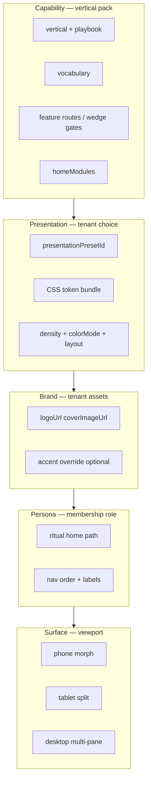

# Presentation presets — vertical capability × tenant skin × persona ritual

**Status:** Active spec (2026-05-29)  
**Scope:** **Staging rollout only** until promotion gate in [Part VIII](#part-viii--production-promotion-gate).  
**Code catalog:** `lib/policy/src/presentation-presets.ts`  
**Builds on:** [`../product/TENANT-EXPERIENCE-CONTRACT.md`](../product/TENANT-EXPERIENCE-CONTRACT.md), [`../product/PERSONA-UX.md`](../product/PERSONA-UX.md), [`../product/LIVIA-EXPERIENCE-DESIGN-BIBLE.md`](../product/LIVIA-EXPERIENCE-DESIGN-BIBLE.md)

---

## Part 0 — Executive summary

Livia serves nine vertical packs (hair → automotive detailing). Each vertical defines **capabilities** — features, routes, vocabulary, hero workflows. Tenants within a vertical may choose **one of four presentation presets** — three vertical-native skins plus **Platform Default** (classic Aurora Livia). Presets change chrome only; tools stay identical.

**Persona rituals** (founder, owner, manager, staff, reception, customer) inherit the tenant’s vertical + preset, then apply **role-specific home surfaces** (which module is fullscreen vs summary).

**Surface class** (phone, tablet, desktop) morphs layout **after** persona — same capability and preset, different shape. See [`SURFACE-AND-BREAKPOINTS.md`](./SURFACE-AND-BREAKPOINTS.md).

| Layer | Controls | Example |
|-------|----------|---------|
| **Capability** | What exists | Body-art: design proofs, consult-first, pipeline |
| **Presentation** | How it looks | Platform Default vs Studio Dark vs Flash Light |
| **Brand** | Who it is | Logo, cover photo, optional accent override |
| **Persona** | Where you land | Artist → session day; Owner → pipeline board |
| **Surface** | Layout shape | Phone: stage list; Desktop: kanban; Tablet: proof split |

**Rule:** Presets change presentation only. No preset unlocks `/design-proofs` on hair or removes age gate on body-art.

---

## Part I — Architecture



Surface rules: [`SURFACE-AND-BREAKPOINTS.md`](./SURFACE-AND-BREAKPOINTS.md).

### Resolver chain

1. `resolveVerticalKey(vertical, category)` → capability pack  
2. `resolvePresentationPreset(vertical, business.presentationPresetId)` → skin tokens  
3. `resolveTenantExperienceSkin()` merges preset + vertical default accent + brand override  
4. `derivePersonaKind(membership)` → ritual home from [Part IV](#part-iv--persona-ritual-homes-by-vertical)  
5. `useSurfaceClass()` / viewport → layout morph from [`SURFACE-AND-BREAKPOINTS.md`](./SURFACE-AND-BREAKPOINTS.md)

### Surfaces that consume the bundle

| Surface | Reads |
|---------|--------|
| Dashboard authenticated shell | `TenantExperience` + `data-presentation` |
| Mobile app | `fetchTenantExperience` + vertical accent |
| Public `/b/{slug}` | `publicExperienceSkin` + brand shell |
| Onboarding wizard | preset picker (staging) + live preview |
| Internal ops | **Neutral** — no tenant presets |

---

## Part II — Guardrails

1. **Max four presets per vertical** at launch — Platform Default + three vertical-native skins; not infinite themes.  
2. **Feature parity** — all presets expose identical routes and entitlements.  
3. **Preset validity** — `presetId` must belong to business `vertical`; invalid → vertical-native default (not Platform Default).  
4. **Public + ops alignment** — `/b` uses same preset as dashboard for that tenant.  
5. **Accessibility** — each preset must pass contrast check in light and dark variants.  
6. **Motion** — inherit [`V3-EXPERIENCE-SPEC.md`](../product/V3-EXPERIENCE-SPEC.md); presets may only tune duration/density, not disable reduced-motion.  
7. **Staging gate** — picker UI and `data-presentation` bundles ship when `presentationPresetsEnabled()` is true ([Part VII](#part-vii--staging-rollout-plan)).  
8. **Production** — until promotion gate: all tenants use vertical **native default** preset on prod even if DB column set (`platform-default` excluded until promotion unless explicitly enabled).

---

## Part IIb — Platform Default (Aurora)

**Id:** `platform-default` (`PLATFORM_DEFAULT_PRESET_ID` in `@workspace/policy`)  
**Available in:** every vertical pack — same Livia product chrome, vertical capability unchanged.

| Token | Value |
|-------|--------|
| Label | Platform Default |
| Shell | `aurora` |
| Color mode | `system` (light + dark — existing Aurora tokens in `index.css`) |
| Primary | Aurora cyan `188 95% 43%` |
| Accent | Aurora violet (AI / Liv moments) |
| Surfaces | `.aurora-glass`, `.aurora-glow`, gradient Liv command hub |
| Typography | Geist / Plus Jakarta sans; Cormorant available for display |
| Layout primitive | `cards` — vertical-native home **modules** still apply (e.g. body-art pipeline data in Aurora chrome) |
| Motion | `crisp` — v3 motion tokens |

**When to pick it:** Tenant wants the canonical Livia look rather than a vertical-curated skin (barber bold, studio dark, etc.). Safe default for demos, design partners, and owners who do not care about appearance tuning.

**CSS implementation:** `html[data-presentation="platform-default"]` maps to **baseline** `:root` / `.dark` Aurora variables in `artifacts/livia-dashboard/src/index.css` — no alternate bundle required for Phase 3 (bundle is identity mapping). Other presets override tokens; Platform Default resets to Aurora defaults.

**Not included in Platform Default:** marketing-only aurora hero blobs on livia.io (per v3 spec — ops UI only).

---

## Part III — Full vertical catalog

For each vertical: **capability contract**, **four presets** (Platform Default + three vertical-native), **persona ritual homes** (presentation inherits; homes differ by role).

Preset ids and labels are canonical in `lib/policy/src/presentation-presets.ts`. **Platform Default** is always first in the picker list.

### Preset row (all verticals)

| Id | Label | Notes |
|----|-------|-------|
| `platform-default` | Platform Default | Aurora Livia — every vertical |
| *(vertical default)* | *(see vertical table)* | Native curated skin — `isDefault: true` |
| *(alt 1)* | *(see vertical table)* | |
| *(alt 2)* | *(see vertical table)* | |

---

### V1 — Hair (v1 heartland)

**Capability contract**

| Item | Value |
|------|--------|
| Wedge | Fill the chair — bookings, colour consults, SMS continuity |
| Hero steps | Public book → SMS confirm + ref photo → deposit → T-24 reminder |
| Home modules | `timeline`, `proposals`, `running-late` |
| Public CTA | Book your visit |
| Vocabulary | client · stylist/barber · chair · visit |

**Presentation presets**

| Id | Label | Best for |
|----|-------|----------|
| `platform-default` | Platform Default | Classic Aurora Livia — cyan, violet Liv moments, glass |
| `hair-warm-chair` *(vertical default)* | Warm Chair | Full-service salon, serif, golden accents |
| `hair-clean-salon` | Clean Salon | Modern salon, bright sans, timeline layout |
| `hair-barber-bold` | Barber Bold | Barbershop, dark compact, list layout |

**Persona ritual homes**

| Persona | Home surface | Capability focus |
|---------|--------------|------------------|
| Founder (multi) | Shop cards + week signal | Cross-location chair fill |
| Owner | Today + flight plan + approvals | Running late, deposits |
| Manager | Inbox + floor queue | Rebook, refund caps |
| Staff | My Day — next chair | One client + thread snippet |
| Reception | Bookings floor calendar | Walk-ins, messages |
| Customer `/b` | Staff-forward book flow | Pick stylist → service → slot |

---

### V2 — Beauty (v1 heartland)

**Capability contract**

| Item | Value |
|------|--------|
| Wedge | DM-to-chair — lashes, nails, brows |
| Hero steps | IG/WA inbound → patch-test note → book → rebook fill |
| Home modules | `timeline`, `proposals`, `inbox` |
| Public CTA | Book a treatment |

**Presentation presets**

| Id | Label | Best for |
|----|-------|----------|
| `platform-default` | Platform Default | Aurora Livia |
| `beauty-soft-studio` *(vertical default)* | Soft Studio | Lash/brow, rounded cards |
| `beauty-editorial` | Editorial | Menu-card treatments, wide margins |
| `beauty-tech-chic` | Tech Chic | DM-heavy solo techs, compact |

**Persona ritual homes**

| Persona | Home surface | Capability focus |
|---------|--------------|------------------|
| Owner | Inbox-forward + cycle fill | DM continuity, patch-test flags |
| Manager | Inbox + approval queue | Service duration overrides |
| Staff | My Day — station | Patch-test reminder on card |
| Reception | Inbox + bookings | Channel priority (SMS > WA > IG) |
| Customer `/b` | Treatment menu + staff pick | Allergy/patch-test gate on first visit |

---

### V3 — Body art / tattoo (v2)

**Capability contract**

| Item | Value |
|------|--------|
| Wedge | Consult → design proof → session deposit |
| Hero steps | Consult → proof approval → session block → aftercare SMS |
| Home modules | `design-proofs`, `proposals`, `timeline` |
| Public CTA | Request a consult |
| Extra routes | `/design-proofs`, age gate, session blocks |
| Vocabulary | client · artist · station · session · consult · design proof |

**Presentation presets**

| Id | Label | Best for |
|----|-------|----------|
| `platform-default` | Platform Default | Aurora Livia |
| `body-art-studio-dark` *(vertical default)* | Studio Dark | Traditional studio, pipeline kanban |
| `body-art-flash-light` | Flash Light | Bright proof review |
| `body-art-minimal-mono` | Minimal Mono | Solo artist, list pipeline |

**Persona ritual homes**

| Persona | Home surface | Capability focus |
|---------|--------------|------------------|
| Owner | **Pipeline board** | Consults → proof → sessions |
| Manager | Station map + proof queue | Sick artist → reassign blocks |
| Artist | **Session day** — one block + prep checklist | Proof approved, deposit, refs |
| Reception | **Proof desk** | Approve sketch vs client refs |
| Customer `/b` | Consult request + upload + age gate | No 6hr slot until proof path |

---

### V4 — Wellness (v2)

**Capability contract**

| Item | Value |
|------|--------|
| Wedge | Calm scheduling — buffers, gift paths, room-aware booking |
| Hero steps | Public book → room buffer policy → reminder → package/voucher redeem |
| Home modules | `timeline`, `packages` |
| Public CTA | Book a session |
| Vocabulary | guest · therapist · room · session |

**Presentation presets**

| Id | Label | Best for |
|----|-------|----------|
| `platform-default` | Platform Default | Aurora Livia |
| `wellness-spa-calm` *(vertical default)* | Spa Calm | Serif, teal, generous spacing |
| `wellness-zen-light` | Zen Light | Near-white, minimal borders |
| `wellness-retreat-dark` | Retreat Dark | Evening spa, dark default |

**Persona ritual homes**

| Persona | Home surface | Capability focus |
|---------|--------------|------------------|
| Founder | Location session fill rollup | Underfilled room hours |
| Owner | Session timeline + packages | Buffer policy, gift vouchers |
| Manager | Room conflict inbox | Double-book prevention |
| Staff | Session block + buffer note | Turnover time visible |
| Reception | Arrivals + room assignment | Check-in calm copy |
| Customer `/b` | Room-aware slot picker | Package redemption path |

---

### V5 — Fitness (v2)

**Capability contract**

| Item | Value |
|------|--------|
| Wedge | Classes, PT packs, waitlist — one roster |
| Hero steps | Class capacity → waitlist on cancel → pack burn → staff borrow |
| Home modules | `classes`, `timeline`, `proposals` |
| Public CTA | Book a class |
| Vocabulary | member · coach · studio · session |

**Presentation presets**

| Id | Label | Best for |
|----|-------|----------|
| `platform-default` | Platform Default | Aurora Livia |
| `fitness-gym-bold` *(vertical default)* | Gym Bold | Dark, high energy, compact roster |
| `fitness-studio-clean` | Studio Clean | Pilates/yoga bright studio |
| `fitness-coach-compact` | Coach Compact | PT-focused dense day list |

**Persona ritual homes**

| Persona | Home surface | Capability focus |
|---------|--------------|------------------|
| Founder | Class fill + waitlist rollup | Capacity utilisation |
| Owner | Class roster + waitlist | Pack burn, cancel fill |
| Manager | Roster borrow + inbox | Cover sick coach |
| Staff / Coach | PT block or class list | Next session, pack remaining |
| Reception | Class check-in desk | Walk-in to open capacity |
| Customer `/b` | Class capacity + waitlist join | Member vs drop-in |

---

### V6 — Medspa (v3)

**Capability contract**

| Item | Value |
|------|--------|
| Wedge | Consent-first aesthetics — procedure catalog, mandates |
| Hero steps | Procedure + consent on book → mandate-gated changes → waitlist → audit |
| Home modules | `medspa-hub`, `proposals`, `timeline` |
| Public CTA | Book a consultation |
| Regulatory | Mandate-gated changes; audit trail; counsel before clinical claims |
| Vocabulary | patient/client (counsel) · practitioner · treatment room |

**Presentation presets**

| Id | Label | Best for |
|----|-------|----------|
| `platform-default` | Platform Default | Aurora Livia |
| `medspa-clinical-calm` *(vertical default)* | Clinical Calm | Restrained lavender, small radius |
| `medspa-luxury-serif` | Luxury Serif | Premium serif, dark luxury |
| `medspa-minimal-consent` | Minimal Consent | Form-forward, compact |

**Persona ritual homes**

| Persona | Home surface | Capability focus |
|---------|--------------|------------------|
| Founder | Compliance + mandate rollup | Cross-location audit |
| Owner | Medspa hub + pending mandates | Procedure approval queue |
| Manager | Mandate queue + inbox | Escalation to owner |
| Practitioner | Consent checklist per appointment | Pre-treatment gate |
| Reception | Arrival + consent capture | Tablet split preferred |
| Customer `/b` | Consultation + informed consent | No treatment claims in UI |

---

### V7 — Allied health (v3 lite)

**Capability contract**

| Item | Value |
|------|--------|
| Wedge | Lite clinic scheduling — not an EHR |
| Hero steps | Assessment slot → follow-up chain → cancel window → continuity SMS |
| Home modules | `timeline`, `proposals` |
| Public CTA | Book an appointment |
| Vocabulary | patient · practitioner · clinic · appointment |
| Out of scope | Clinical coding, insurance claims, full EHR |

**Presentation presets**

| Id | Label | Best for |
|----|-------|----------|
| `platform-default` | Platform Default | Aurora Livia |
| `allied-clinic-standard` *(vertical default)* | Clinic Standard | Blue clinical default |
| `allied-practice-warm` | Practice Warm | Approachable serif clinic |
| `allied-compact-desk` | Compact Desk | Dense front-desk slots |

**Persona ritual homes**

| Persona | Home surface | Capability focus |
|---------|--------------|------------------|
| Owner | Follow-up chain | Plan adherence |
| Manager | Reschedule + inbox | Short-notice patients |
| Practitioner | Patient slot + intake attach | GP letter PDF |
| Reception | Check-in desk | Slot grid |
| Customer `/b` | Assessment vs follow-up type | Intake short form |

---

### V8 — Pet grooming (v3)

**Capability contract**

| Item | Value |
|------|--------|
| Wedge | Pet profiles, temperament, pickup SMS |
| Hero steps | Pet on profile → groom duration by size → pickup SMS → rebook |
| Home modules | `timeline`, `inbox` |
| Public CTA | Book a groom |
| Vocabulary | pet parent · groomer · salon · groom |

**Presentation presets**

| Id | Label | Best for |
|----|-------|----------|
| `platform-default` | Platform Default | Aurora Livia |
| `pet-playful-paw` *(vertical default)* | Playful Paw | Rounded, friendly purple |
| `pet-clean-groom` | Clean Groom | Professional light salon |
| `pet-mobile-van` | Mobile Van | Compact mobile groomer |

**Persona ritual homes**

| Persona | Home surface | Capability focus |
|---------|--------------|------------------|
| Owner | Pet profile queue | Multi-pet households |
| Groomer | Pet card + behaviour notes | Bite/shy flags |
| Reception | Pickup timing + day board | SMS pickup ready |
| Customer `/b` | Pet on profile + size/duration | Vaccination note field |

---

### V9 — Automotive detailing (v3)

**Capability contract**

| Item | Value |
|------|--------|
| Wedge | Vehicle-aware packages, bay time, valet comms |
| Hero steps | Package by vehicle size → bay book → running late broadcast → upsell wash |
| Home modules | `timeline`, `proposals` |
| Public CTA | Book your detail |
| Vocabulary | customer · detailer · bay · detail |

**Presentation presets**

| Id | Label | Best for |
|----|-------|----------|
| `platform-default` | Platform Default | Aurora Livia |
| `auto-bay-industrial` *(vertical default)* | Bay Industrial | Dark industrial bay floor |
| `auto-showroom-light` | Showroom Light | Premium light showroom |
| `auto-compact-mobile` | Compact Mobile | Mobile detailer one-thumb list |

**Persona ritual homes**

| Persona | Home surface | Capability focus |
|---------|--------------|------------------|
| Owner | Bay timeline | Utilisation |
| Detailer | Vehicle package card | Package duration |
| Reception | Bay intake | Vehicle plate / model |
| Customer `/b` | Package by vehicle size | Valet pickup optional note |

---

## Part IV — Persona ritual homes by vertical

Persona **routes** stay stable ([`PERSONA-UX.md`](../product/PERSONA-UX.md)). Vertical changes **default module emphasis** on the home route and **layout primitive** from preset.

| Persona | Route | Hair / Beauty | Body-art | Fitness | Medspa |
|---------|-------|---------------|----------|---------|--------|
| Founder | `/chain` | Shop KPI strip | Pipeline rollup per studio | Location class fill | Compliance rollup |
| Owner | `/dashboard` | Flight plan | Pipeline board | Class + waitlist | Medspa hub |
| Manager | `/inbox` or vertical | Inbox + floor | Stations + proof queue | Roster borrow | Mandate queue |
| Staff | `/my-day` | Chair list | Session block | Class/PT block | Consent prep |
| Reception | `/bookings` | Floor calendar | Proof desk | Check-in desk | Arrival + consent |
| Customer | `/b/:slug` | Book visit | Request consult | Book class | Book consultation |

**Implementation:** extend `persona-rituals.ts` with `verticalHomeModule` map keyed by `vertical + persona`, not new routes per vertical. **Layout morph** per module: [`SURFACE-AND-BREAKPOINTS.md` Part III](./SURFACE-AND-BREAKPOINTS.md#part-iii--layout-morph-by-vertical-module).

---

## Part IVb — Surface morph (summary)

Presets do **not** encode phone vs desktop layouts. Each vertical module degrades or expands per surface:

| Surface | Width | Shape |
|---------|-------|-------|
| Phone | `<640px` / native app | Single column, hero + list, stack nav |
| Tablet | `640–1023px` / ≥600dp | Split pane where reception/proof/inbox benefit |
| Desktop | `≥1024px` | Sidebar + multi-pane + context rail |

Full morph tables, persona primary device, QA matrix: **[`SURFACE-AND-BREAKPOINTS.md`](./SURFACE-AND-BREAKPOINTS.md)**.

---

## Part V — Token & CSS spec

### HTML data attributes

```html
<html
  data-vertical="body-art"
  data-presentation="studio-dark"
  data-vertical-shell="bold"
  data-vertical-display="sans"
  data-density="comfortable"
  data-motion="crisp"
  data-surface="desktop"
>
```

`data-surface` set by `useSurfaceClass()` on resize — drives layout morph, not colour tokens.

### CSS token bundles

Add to `artifacts/livia-dashboard/src/index.css`:

```css
/* Preset overrides — staging bundles */
[data-presentation="platform-default"] {
  /* Uses baseline :root / .dark Aurora tokens — no overrides required */
}
[data-presentation="studio-dark"] { --background: 0 0% 6%; /* … */ }
[data-presentation="flash-light"] { --background: 0 0% 100%; /* … */ }
```

Mobile mirrors via `applyPresentationTheme()` in `artifacts/livia-mobile/lib/vertical-theme.ts`.

### Brand override (optional)

| Field | Scope |
|-------|--------|
| `logoUrl`, `coverImageUrl` | Public + ritual header |
| `brandAccentHex` *(new, optional)* | Overrides vertical accent only — not preset structure |

---

## Part VI — API & data model

### Database (migration `027-presentation-preset.sql`)

```sql
ALTER TABLE businesses
  ADD COLUMN presentation_preset_id text,
  ADD COLUMN brand_accent_hex text;
```

- `presentation_preset_id` nullable → resolver uses vertical default.  
- Validate on write: `isValidPresentationPreset(vertical, presetId)`.

### TenantExperience extension

```typescript
type TenantExperienceSkin = {
  presetId: string;
  presetLabel: string;
  shell: string;
  display: "serif" | "sans";
  market: string;
  accentHex: string;
  colorMode: "light" | "dark" | "system";
  density: "comfortable" | "compact";
  layout: PresentationLayout;
  cssPreset: string;
  presetsEnabled: boolean; // false on prod until promotion
};
```

### New endpoints (staging)

| Method | Path | Role |
|--------|------|------|
| `GET` | `/businesses/:id/presentation-presets` | List presets for vertical |
| `PATCH` | `/businesses/:id/presentation` | Set `presentationPresetId` (+ optional accent) |

Gate PATCH with `presentationPresetsEnabled()` on API.

### Settings UI

`artifacts/livia-dashboard/src/pages/settings.tsx` → **Appearance** tab (staging only):

- Four preset thumbnails (Platform Default first) with live preview iframe  
- Brand accent color picker (optional)  
- Copy: *“Same tools — pick how Livia looks in your studio.”*

---

## Part VII — Staging rollout plan

**Environment:** `api.staging.livia-hq.com`, `app.staging.livia-hq.com`, mobile `dev:staging` profile.  
**Not in scope:** production promotion until [Part VIII](#part-viii--production-promotion-gate).

### Phase 0 — Spec & catalog (done)

| Deliverable | Location |
|-------------|----------|
| Preset catalog (9 × 4 incl. Platform Default) | `lib/policy/src/presentation-presets.ts` |
| This document | `docs/design/PRESENTATION-PRESETS-AND-ROLLOUT.md` |
| Staging gate helper | `presentationPresetsEnabled()` |

### Phase 1 — Policy & API contract (3 days)

| Task | Files |
|------|--------|
| Export presets from `@workspace/policy` | `lib/policy/src/index.ts` |
| Extend `resolveTenantExperienceSkin` with preset merge | `lib/policy/src/tenant-experience.ts` |
| Unit tests: valid/invalid preset, default fallback | `artifacts/api-server/src/services/__tests__/presentation-presets.test.ts` |
| Update tenant experience contract doc | `docs/product/TENANT-EXPERIENCE-CONTRACT.md` |

**Exit:** `pnpm run typecheck` green; api-server `presentation-presets.test.ts` passes; `resolveTenantExperience` returns `presetId`.

### Phase 2 — Database & API (2 days)

| Task | Files |
|------|--------|
| Migration `027-presentation-preset.sql` | `lib/db/migrations/sql/` |
| Drizzle schema columns | `lib/db/src/schema/identity/businesses.ts` |
| PATCH presentation + GET preset list | `artifacts/api-server/src/routes/businesses.ts` |
| Service validation | `artifacts/api-server/src/services/presentation.service.ts` |
| Include in `GET /me/tenant-experience` | `tenant-experience.service.ts` |

**Exit:** Staging DB migrated; curl PATCH preset on demo tattoo tenant succeeds.

### Phase 3 — Dashboard tokens (4 days)

| Task | Files |
|------|--------|
| `applyPresentationTheme()` | `artifacts/livia-dashboard/src/lib/experience-theme.ts` |
| `useSurfaceClass()` + `data-surface` | `hooks/use-surface-class.ts`, `app-layout.tsx` |
| Surface-adaptive home modules (list vs grid vs split) | `components/layout/surface-adaptive/`, `vertical-home-modules.tsx` |
| CSS bundles for **36 presets** (Platform Default = Aurora baseline; 27 vertical-native overrides) | `index.css` |
| Wire `useTenantExperience` → `document.documentElement` | `app-layout.tsx` or `business-context.tsx` |
| Appearance settings tab (staging gate) — **phone + desktop preview** | `settings/appearance-panel.tsx` |
| Onboarding optional step: pick preset | `onboarding-wizard.tsx` |

**Exit:** Switch preset on staging demo → shell changes without reload; pipeline on phone = stage list, desktop = kanban.

### Phase 4 — Mobile parity (3 days)

| Task | Files |
|------|--------|
| `applyPresentationTheme` | `artifacts/livia-mobile/lib/vertical-theme.ts` |
| `useSurfaceClass()` (phone vs tablet) | `hooks/use-surface-class.ts` |
| Fetch preset from tenant experience | `lib/tenant-experience.ts` |
| Tablet split on proof desk / inbox where spec'd | `design-proofs`, inbox screens |
| Settings appearance (staging) | new screen or settings section |

**Exit:** [`WEB-MOBILE-PARITY.md`](../product/WEB-MOBILE-PARITY.md) rows for presentation preset + surface morph.

### Phase 5 — Public `/b` (3 days)

| Task | Files |
|------|--------|
| Pass `cssPreset` in public API | `artifacts/api-server/src/routes/public.ts` |
| Apply on public booking shell | `public-booking.tsx`, `experience-theme.ts` |
| Brand logo + cover from business row | existing fields |

**Exit:** `/b/ink-anchor-galway` (demo) reflects tenant preset on staging.

### Phase 6 — Vertical ritual homes (5 days, incremental)

Ship vertical home emphasis **without** blocking Phases 1–5.

| Vertical | Priority | Component work |
|----------|----------|----------------|
| body-art | P0 | Pipeline board owner home, proof desk, session day mobile |
| hair | P0 | Existing flight plan + preset chrome |
| beauty | P1 | Inbox-forward home module order |
| fitness | P1 | Class roster home module |
| wellness, medspa, allied, pet, auto | P2 | Module order + layout primitive only |

| Task | Files |
|------|--------|
| `verticalHomeModule(persona, vertical)` | `lib/policy/src/vertical-ritual-homes.ts` *(new)* |
| Dashboard home composition | `vertical-home-modules.tsx`, persona home pages |

**Exit:** Body-art owner lands on pipeline in all four presets; Platform Default shows same pipeline in Aurora chrome.

### Phase 7 — QA matrix on staging (3 days)

Run for each **vertical default preset** + **Platform Default**, on **phone, tablet, and desktop** (see [`SURFACE-AND-BREAKPOINTS.md` Part IX](./SURFACE-AND-BREAKPOINTS.md#part-ix--qa-matrix-staging)):

| Check | Pass criteria |
|-------|---------------|
| Preset switch | Visual change ≤1s; no data loss |
| Feature parity | All wedge routes reachable in all 4 presets incl. `platform-default` |
| Surface morph | Pipeline/inbox/proof layouts match Part III morph table |
| Public `/b` | Matches operator preset; completable on 320px |
| Persona homes | Staff vs owner vs reception distinct per surface |
| Mobile | Same preset id as web; tablet split where specified |
| Invalid preset id | Falls back to vertical-native default |
| Prod API | `presetsEnabled: false`; picker hidden |

Demo tenants: see [`LIVIA-EXPERIENCE-DESIGN-BIBLE.md`](../product/LIVIA-EXPERIENCE-DESIGN-BIBLE.md) § demo roster (`ink-anchor-galway`, hair IE demos, etc.).

### Phase 8 — Staging sign-off (1 day)

| Gate | Owner |
|------|-------|
| `pnpm run typecheck` | CI |
| Staging smoke + manual walkthrough | Founder |
| UX audit note appended | `docs/testing/UX-FULL-PLATFORM-AUDIT-2026-05-24.md` |
| PLATFORM-BACKLOG checkbox | Eng |

**Total estimate:** ~24 eng days (can parallelize web/mobile after Phase 2).

### Environment variables (staging)

| Variable | Value | Notes |
|----------|-------|-------|
| `LIVIA_ENV` | `staging` | Enables preset picker |
| `LIVIA_PRESENTATION_PRESETS` | `true` | Explicit override |
| *(prod)* | unset / `false` | Default preset only until Part VIII |

Document in [`ENV-VARIABLES.md`](../operations/ENV-VARIABLES.md) when Phase 2 lands.

---

## Part VIII — Production promotion gate

**Do not enable on production until all true:**

- [ ] 36 preset entries pass contrast audit (WCAG AA) — Platform Default reuses audited Aurora baseline  
- [ ] Staging sign-off complete (Phase 8)  
- [ ] No open P0 bugs in preset switcher  
- [ ] Support runbook: “change appearance” article  
- [ ] Marketing / demo screenshots updated per vertical  
- [ ] Explicit founder approval in `FOUNDER-SHIP-LANE.md` or release note  
- [ ] Set `LIVIA_PRESENTATION_PRESETS=true` on Railway **production** deliberately  

Until then: migration column may exist on prod DB but UI/API writes gated off.

---

## Part IX — Testing & CI

| Test | Location |
|------|----------|
| Preset resolver unit tests | `artifacts/api-server/src/services/__tests__/presentation-presets.test.ts` |
| Tenant experience includes preset | `artifacts/api-server/src/services/__tests__/tenant-experience.test.ts` |
| Vocabulary leak (unchanged) | `vocabulary-leak.test.ts` |
| E2E preset switch (staging) | `e2e/tests/presentation-preset.spec.ts` *(Phase 7)* |

---

## Part X — Related docs to update as phases land

| Phase | Doc |
|-------|-----|
| 1 | `TENANT-EXPERIENCE-CONTRACT.md`, `DOC-CANONICAL-INDEX.md` |
| 3 | `PRODUCT-UX-SYSTEM.md`, `SURFACE-AND-BREAKPOINTS.md`, `ux-layout-contract.md` |
| 4 | `WEB-MOBILE-PARITY.md`, `MOBILE-UX-PRINCIPLES.md` |
| 7 | `MANUAL-WALKTHROUGH-BETA.md` — preset switch step |
| 8 | `PLATFORM-BACKLOG.md` |

---

## Appendix A — Preset quick reference (all 36)

Every vertical includes **`platform-default`** (Platform Default / Aurora) plus three vertical-native skins.

| Vertical | Platform Default | Vertical default | Alt 1 | Alt 2 |
|----------|------------------|------------------|-------|-------|
| hair | ✓ Aurora | Warm Chair | Clean Salon | Barber Bold |
| beauty | ✓ Aurora | Soft Studio | Editorial | Tech Chic |
| body-art | ✓ Aurora | Studio Dark | Flash Light | Minimal Mono |
| wellness | ✓ Aurora | Spa Calm | Zen Light | Retreat Dark |
| fitness | ✓ Aurora | Gym Bold | Studio Clean | Coach Compact |
| medspa | ✓ Aurora | Clinical Calm | Luxury Serif | Minimal Consent |
| allied-health | ✓ Aurora | Clinic Standard | Practice Warm | Compact Desk |
| pet-grooming | ✓ Aurora | Playful Paw | Clean Groom | Mobile Van |
| automotive-detailing | ✓ Aurora | Bay Industrial | Showroom Light | Compact Mobile |

Canonical ids: `lib/policy/src/presentation-presets.ts`. Shared id: `platform-default`.

---

## Appendix B — Cross-cutting concerns (decide before prod promotion)

These sit **outside** capability / presentation / persona / surface but interact with them. Decide during staging Phases 3–7; do not bolt on after prod.

| Concern | Status in docs | Decide now? | Notes |
|---------|----------------|-------------|-------|
| **Modality (M1–M4)** | [`modality-and-locale-overview.md`](../modality-and-locale-overview.md) | **Yes** | Visual preset stack covers **M1 only**. M2 chat / M3 voice / M4 passive (WhatsApp-only owner) need **channel-native chrome** — not dashboard skins. Liv lines must match preset tone in SMS templates. |
| **Locale packs** | [`LIVIA-EXPERIENCE-DESIGN-BIBLE.md`](../product/LIVIA-EXPERIENCE-DESIGN-BIBLE.md) § country ≠ skin | **Yes** | DE/FR strings are longer — compact phone layouts need **overflow rules** (truncate vs wrap). Locale changes copy + law footers, not preset id. |
| **Brand shell vs preset** | [`pricing-and-packaging.md`](../business/pricing-and-packaging.md) multi-brand | **Yes (C13)** | **Preset** = one business appearance. **Brand shell** = multi-brand portfolio (logo/accent per shell). Rule: preset per `business`; brand shell overrides logo/accent only. |
| **Accessibility per preset** | [`accessibility.md`](../engineering/accessibility.md) | **Yes** | Each of 36 presets + 3 surfaces must pass WCAG AA contrast audit. Platform Default reuses audited Aurora; vertical-native skins need explicit pass. Kanban→list morph must preserve screen-reader order. |
| **Performance / low-end devices** | Partial (v3 smooth) | **Yes** | `backdrop-blur` / glass (Platform Default, some skins) — ** degrade gracefully** on low-end Android; document `@media (prefers-reduced-data)` or feature-detect blur. |
| **Offline / bad connectivity** | [`mobile-roadmap.md`](../mobile-roadmap.md) C3 | **Defer post-staging** | Phone surface needs skeleton + cached reads; preset switch must not break offline cache keys. |
| **Notifications & widgets** | Not in design stack | **Defer** | Push deep links must land on **persona home**, not generic dashboard. iOS Live Activity / glance = phone surface extension — future ADR. |
| **Onboarding order** | Partial | **Yes** | Vertical first → **default vertical-native preset** (not Platform Default) → optional preset pick on staging → brand logo. Preset picker previews **phone + desktop** frame. |
| **Existing tenant migration** | Not documented | **Yes** | Prod launch: all tenants stay on **vertical-native default** until opt-in. No forced preset migration. Log `presentationPresetId` in audit on change. |
| **Email / SMS / wallet brand** | Scenario 04 v3 | **Yes** | Preset affects **in-app** only unless tenant uploads brand assets. Outbound templates use **brand shell** (logo, tone) + locale pack — link to same `/b` preset. |
| **Org shape / tier** | [`org-shape`](../foundation/glossary.md) | **Partial** | Chain/franchise/chair-host changes **persona home**, not preset catalogue. Chair-rental artist may see **staff home + micro-business strip** — same preset as host shop. |
| **Customer typology (CT1–CT6)** | [`customer-typologies.md`](../customer-typologies.md) | **Defer** | Copy/volunteer posture only; `/b` layout stable. VIP may get denser confirm panel — not a preset. |
| **Internal ops / support view** | Excluded from presets | **Yes** | Support sees tenant's active `presetId` + surface in ticket metadata. Internal UI stays neutral. |
| **Analytics** | Not documented | **Defer** | Log `presetId`, `surfaceClass`, `vertical` on key events (book, approve, churn) to learn which skins stick — no PII in event payload. |
| **Design token versioning** | Not documented | **Defer** | Preset id stable forever; token values may shift. Breaking change = new preset id, never mutate semantics of existing id. |
| **Demo / showcase tenants** | [`BETA-SHOWCASE-PROGRAM.md`](../product/BETA-SHOWCASE-PROGRAM.md) | **Nice** | Demo portal could rotate presets per vertical for sales — staging only. |
| **Security / shared tablet** | Not documented | **Yes (body-art/medspa)** | Reception tablet = shared device. Session timeout, no persistent customer PII on screen between check-ins. Proof desk sketch fullscreen exit clears refs. |
| **Time-of-day rituals** | v3 spec | **Partial** | Morning briefing vs close-day (Quiet Ledger) = **persona + time**, not preset. Same preset, different home module emphasis by time. |
| **Figma ↔ code** | FOUNDER-SHIP-LANE | **Parallel track** | 4 presets × 3 surfaces × 9 verticals is too large for one Figma file — **token-first** in code; Figma covers Platform Default + one vertical-native per vertical. |

**Recommended staging decisions (before Phase 3 code):**

1. Confirm **vertical-native default** remains opt-out default on prod (Platform Default is opt-in).  
2. Add **accessibility gate** to Phase 7 QA (per preset × surface).  
3. Scope **channel brand** doc slice (email/SMS/wallet) referencing same tenant brand fields as `/b`.  
4. Add **`presetId` to audit log** on settings change.  
5. Explicit **M2/M3 UX contract** — separate short doc or § in [`LIV-OPERATING-SYSTEM.md`](../product/LIV-OPERATING-SYSTEM.md) — so visual redesign does not pretend to cover WhatsApp-native owners.

---

## Appendix C — Anti-patterns

- Forking components per preset (`PipelineBoardDark.tsx`) — use tokens.  
- Per-tenant custom CSS uploads — brand logo/accent only.  
- Preset-gated features (`if preset === 'barber-bold' show payroll`) — use entitlements.  
- Different presets per persona on same tenant — one preset per business.  
- Shipping Ink Anchor–named demos as product strings — use `business.name`.
