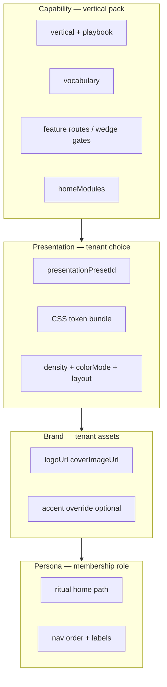

# Presentation presets — vertical capability × tenant skin × persona ritual

**Status:** Active spec (2026-05-29)  
**Scope:** **Staging rollout only** until promotion gate in [Part VIII](#part-viii--production-promotion-gate).  
**Code catalog:** `lib/policy/src/presentation-presets.ts`  
**Builds on:** [`../product/TENANT-EXPERIENCE-CONTRACT.md`](../product/TENANT-EXPERIENCE-CONTRACT.md), [`../product/PERSONA-UX.md`](../product/PERSONA-UX.md), [`../product/LIVIA-EXPERIENCE-DESIGN-BIBLE.md`](../product/LIVIA-EXPERIENCE-DESIGN-BIBLE.md)

---

## Part 0 — Executive summary

Livia serves nine vertical packs (hair → automotive detailing). Each vertical defines **capabilities** — features, routes, vocabulary, hero workflows. Tenants within a vertical may choose **one of three presentation presets** — color mode, density, layout chrome — without gaining or losing tools.

**Persona rituals** (founder, owner, manager, staff, reception, customer) inherit the tenant’s vertical + preset, then apply **role-specific home surfaces** (which module is fullscreen vs summary).

| Layer | Controls | Example |
|-------|----------|---------|
| **Capability** | What exists | Body-art: design proofs, consult-first, pipeline |
| **Presentation** | How it looks | Studio Dark vs Flash Light vs Minimal Mono |
| **Brand** | Who it is | Logo, cover photo, optional accent override |
| **Persona** | Where you land | Artist → session day; Owner → pipeline board |

**Rule:** Presets change presentation only. No preset unlocks `/design-proofs` on hair or removes age gate on body-art.

---

## Part I — Architecture



### Resolver chain

1. `resolveVerticalKey(vertical, category)` → capability pack  
2. `resolvePresentationPreset(vertical, business.presentationPresetId)` → skin tokens  
3. `resolveTenantExperienceSkin()` merges preset + vertical default accent + brand override  
4. `derivePersonaKind(membership)` → ritual home from [Part IV](#part-iv--persona-ritual-homes-by-vertical)

### Surfaces that consume the bundle

| Surface | Reads |
|---------|--------|
| Dashboard authenticated shell | `TenantExperience` + `data-presentation` |
| Mobile app | `fetchTenantExperience` + vertical accent |
| Public `/b/{slug}` | `publicExperienceSkin` + brand shell |
| Onboarding wizard | preset picker (staging) + live preview |
| Internal ops | **Neutral** — no tenant presets |

---

## Part II — Guardrails

1. **Max three presets per vertical** at launch — curated, not infinite themes.  
2. **Feature parity** — all presets expose identical routes and entitlements.  
3. **Preset validity** — `presetId` must belong to business `vertical`; invalid → vertical default.  
4. **Public + ops alignment** — `/b` uses same preset as dashboard for that tenant.  
5. **Accessibility** — each preset must pass contrast check in light and dark variants.  
6. **Motion** — inherit [`V3-EXPERIENCE-SPEC.md`](../product/V3-EXPERIENCE-SPEC.md); presets may only tune duration/density, not disable reduced-motion.  
7. **Staging gate** — picker UI and `data-presentation` bundles ship when `presentationPresetsEnabled()` is true ([Part VII](#part-vii--staging-rollout-plan)).  
8. **Production** — until promotion gate: all tenants use vertical **default preset** on prod even if DB column set.

---

## Part III — Full vertical catalog

For each vertical: **capability contract**, **three presets**, **persona ritual homes** (presentation inherits; homes differ by role).

Preset ids and labels are canonical in `lib/policy/src/presentation-presets.ts`.

---

### V1 — Hair (v1 heartland)

**Capability contract**

| Item | Value |
|------|--------|
| Wedge | Fill the chair — bookings, colour consults, SMS continuity |
| Hero steps | Public book → SMS confirm + ref photo → deposit → T-24 reminder |
| Home modules | `timeline`, `proposals`, `running-late` |
| Public CTA | Book your visit |
| Vocabulary | client · stylist/barber · chair · visit |

**Presentation presets**

| Id | Label | Best for |
|----|-------|----------|
| `hair-warm-chair` *(default)* | Warm Chair | Full-service salon, serif, golden accents |
| `hair-clean-salon` | Clean Salon | Modern salon, bright sans, timeline layout |
| `hair-barber-bold` | Barber Bold | Barbershop, dark compact, list layout |

**Persona ritual homes**

| Persona | Home surface | Capability focus |
|---------|--------------|------------------|
| Founder (multi) | Shop cards + week signal | Cross-location chair fill |
| Owner | Today + flight plan + approvals | Running late, deposits |
| Manager | Inbox + floor queue | Rebook, refund caps |
| Staff | My Day — next chair | One client + thread snippet |
| Reception | Bookings floor calendar | Walk-ins, messages |
| Customer `/b` | Staff-forward book flow | Pick stylist → service → slot |

---

### V2 — Beauty (v1 heartland)

**Capability contract**

| Item | Value |
|------|--------|
| Wedge | DM-to-chair — lashes, nails, brows |
| Hero steps | IG/WA inbound → patch-test note → book → rebook fill |
| Home modules | `timeline`, `proposals`, `inbox` |
| Public CTA | Book a treatment |

**Presentation presets**

| Id | Label | Best for |
|----|-------|----------|
| `beauty-soft-studio` *(default)* | Soft Studio | Lash/brow, rounded cards |
| `beauty-editorial` | Editorial | Menu-card treatments, wide margins |
| `beauty-tech-chic` | Tech Chic | DM-heavy solo techs, compact |

**Persona ritual homes**

| Persona | Home surface | Capability focus |
|---------|--------------|------------------|
| Owner | Inbox-forward + cycle fill | DM continuity, patch-test flags |
| Manager | Inbox + approval queue | Service duration overrides |
| Staff | My Day — station | Patch-test reminder on card |
| Reception | Inbox + bookings | Channel priority (SMS > WA > IG) |
| Customer `/b` | Treatment menu + staff pick | Allergy/patch-test gate on first visit |

---

### V3 — Body art / tattoo (v2)

**Capability contract**

| Item | Value |
|------|--------|
| Wedge | Consult → design proof → session deposit |
| Hero steps | Consult → proof approval → session block → aftercare SMS |
| Home modules | `design-proofs`, `proposals`, `timeline` |
| Public CTA | Request a consult |
| Extra routes | `/design-proofs`, age gate, session blocks |
| Vocabulary | client · artist · station · session · consult · design proof |

**Presentation presets**

| Id | Label | Best for |
|----|-------|----------|
| `body-art-studio-dark` *(default)* | Studio Dark | Traditional studio, pipeline kanban |
| `body-art-flash-light` | Flash Light | Bright proof review |
| `body-art-minimal-mono` | Minimal Mono | Solo artist, list pipeline |

**Persona ritual homes**

| Persona | Home surface | Capability focus |
|---------|--------------|------------------|
| Owner | **Pipeline board** | Consults → proof → sessions |
| Manager | Station map + proof queue | Sick artist → reassign blocks |
| Artist | **Session day** — one block + prep checklist | Proof approved, deposit, refs |
| Reception | **Proof desk** | Approve sketch vs client refs |
| Customer `/b` | Consult request + upload + age gate | No 6hr slot until proof path |

---

### V4 — Wellness (v2)

**Capability contract**

| Wedge | Calm scheduling — buffers, gift paths |
| Home modules | `timeline`, `packages` |
| Public CTA | Book a session |

**Presentation presets:** `wellness-spa-calm` *(default)* · `wellness-zen-light` · `wellness-retreat-dark`

**Persona homes:** Owner → room/session timeline; Staff → session block + buffer; Customer → room-aware slot picker + gift voucher path.

---

### V5 — Fitness (v2)

**Capability contract**

| Wedge | Classes, PT packs, waitlist |
| Home modules | `classes`, `timeline`, `proposals` |
| Public CTA | Book a class |

**Presentation presets:** `fitness-gym-bold` *(default)* · `fitness-studio-clean` · `fitness-coach-compact`

**Persona homes:** Owner → class roster + waitlist; Coach → PT day list + pack burn; Customer → class capacity + waitlist offer.

---

### V6 — Medspa (v3)

**Capability contract**

| Wedge | Consent-first aesthetics |
| Home modules | `medspa-hub`, `proposals`, `timeline` |
| Public CTA | Book a consultation |
| Regulatory | Mandate-gated changes; audit trail |

**Presentation presets:** `medspa-clinical-calm` *(default)* · `medspa-luxury-serif` · `medspa-minimal-consent`

**Persona homes:** Owner → procedure hub + pending mandates; Practitioner → consent checklist per appointment; Customer → consultation + informed consent before book.

---

### V7 — Allied health (v3 lite)

**Capability contract**

| Wedge | Lite clinic scheduling — not an EHR |
| Home modules | `timeline`, `proposals` |
| Public CTA | Book an appointment |

**Presentation presets:** `allied-clinic-standard` *(default)* · `allied-practice-warm` · `allied-compact-desk`

**Persona homes:** Owner → follow-up chain; Practitioner → patient slot + intake attach; Customer → assessment vs follow-up slot types.

---

### V8 — Pet grooming (v3)

**Capability contract**

| Wedge | Pet profiles, temperament, pickup SMS |
| Home modules | `timeline`, `inbox` |
| Public CTA | Book a groom |

**Presentation presets:** `pet-playful-paw` *(default)* · `pet-clean-groom` · `pet-mobile-van`

**Persona homes:** Owner → pet profile queue; Groomer → pet card + behaviour notes; Customer → pet on profile + size/duration.

---

### V9 — Automotive detailing (v3)

**Capability contract**

| Wedge | Vehicle-aware packages, bay time |
| Home modules | `timeline`, `proposals` |
| Public CTA | Book your detail |

**Presentation presets:** `auto-bay-industrial` *(default)* · `auto-showroom-light` · `auto-compact-mobile`

**Persona homes:** Owner → bay timeline; Detailer → vehicle package card; Customer → package by vehicle size.

---

## Part IV — Persona ritual homes by vertical

Persona **routes** stay stable ([`PERSONA-UX.md`](../product/PERSONA-UX.md)). Vertical changes **default module emphasis** on the home route and **layout primitive** from preset.

| Persona | Route | Hair / Beauty | Body-art | Fitness | Medspa |
|---------|-------|---------------|----------|---------|--------|
| Founder | `/chain` | Shop KPI strip | Pipeline rollup per studio | Location class fill | Compliance rollup |
| Owner | `/dashboard` | Flight plan | Pipeline board | Class + waitlist | Medspa hub |
| Manager | `/inbox` or vertical | Inbox + floor | Stations + proof queue | Roster borrow | Mandate queue |
| Staff | `/my-day` | Chair list | Session block | Class/PT block | Consent prep |
| Reception | `/bookings` | Floor calendar | Proof desk | Check-in desk | Arrival + consent |
| Customer | `/b/:slug` | Book visit | Request consult | Book class | Book consultation |

**Implementation:** extend `persona-rituals.ts` with `verticalHomeModule` map keyed by `vertical + persona`, not new routes per vertical.

---

## Part V — Token & CSS spec

### HTML data attributes

```html
<html
  data-vertical="body-art"
  data-presentation="studio-dark"
  data-vertical-shell="bold"
  data-vertical-display="sans"
  data-density="comfortable"
  data-motion="crisp"
>
```

### CSS token bundles

Add to `artifacts/livia-dashboard/src/index.css`:

```css
/* Preset overrides — staging bundles */
[data-presentation="studio-dark"] { --background: 0 0% 6%; /* … */ }
[data-presentation="flash-light"] { --background: 0 0% 100%; /* … */ }
```

Mobile mirrors via `applyPresentationTheme()` in `artifacts/livia-mobile/lib/vertical-theme.ts`.

### Brand override (optional)

| Field | Scope |
|-------|--------|
| `logoUrl`, `coverImageUrl` | Public + ritual header |
| `brandAccentHex` *(new, optional)* | Overrides vertical accent only — not preset structure |

---

## Part VI — API & data model

### Database (migration `027-presentation-preset.sql`)

```sql
ALTER TABLE businesses
  ADD COLUMN presentation_preset_id text,
  ADD COLUMN brand_accent_hex text;
```

- `presentation_preset_id` nullable → resolver uses vertical default.  
- Validate on write: `isValidPresentationPreset(vertical, presetId)`.

### TenantExperience extension

```typescript
type TenantExperienceSkin = {
  presetId: string;
  presetLabel: string;
  shell: string;
  display: "serif" | "sans";
  market: string;
  accentHex: string;
  colorMode: "light" | "dark" | "system";
  density: "comfortable" | "compact";
  layout: PresentationLayout;
  cssPreset: string;
  presetsEnabled: boolean; // false on prod until promotion
};
```

### New endpoints (staging)

| Method | Path | Role |
|--------|------|------|
| `GET` | `/businesses/:id/presentation-presets` | List presets for vertical |
| `PATCH` | `/businesses/:id/presentation` | Set `presentationPresetId` (+ optional accent) |

Gate PATCH with `presentationPresetsEnabled()` on API.

### Settings UI

`artifacts/livia-dashboard/src/pages/settings.tsx` → **Appearance** tab (staging only):

- Three preset thumbnails with live preview iframe  
- Brand accent color picker (optional)  
- Copy: *“Same tools — pick how Livia looks in your studio.”*

---

## Part VII — Staging rollout plan

**Environment:** `api.staging.livia-hq.com`, `app.staging.livia-hq.com`, mobile `dev:staging` profile.  
**Not in scope:** production promotion until [Part VIII](#part-viii--production-promotion-gate).

### Phase 0 — Spec & catalog (done)

| Deliverable | Location |
|-------------|----------|
| Preset catalog (9 × 3) | `lib/policy/src/presentation-presets.ts` |
| This document | `docs/design/PRESENTATION-PRESETS-AND-ROLLOUT.md` |
| Staging gate helper | `presentationPresetsEnabled()` |

### Phase 1 — Policy & API contract (3 days)

| Task | Files |
|------|--------|
| Export presets from `@workspace/policy` | `lib/policy/src/index.ts` |
| Extend `resolveTenantExperienceSkin` with preset merge | `lib/policy/src/tenant-experience.ts` |
| Unit tests: valid/invalid preset, default fallback | `lib/policy/src/__tests__/presentation-presets.test.ts` |
| Update tenant experience contract doc | `docs/product/TENANT-EXPERIENCE-CONTRACT.md` |

**Exit:** `pnpm --filter @workspace/policy test` green; `resolveTenantExperience` returns `presetId`.

### Phase 2 — Database & API (2 days)

| Task | Files |
|------|--------|
| Migration `027-presentation-preset.sql` | `lib/db/migrations/sql/` |
| Drizzle schema columns | `lib/db/src/schema/identity/businesses.ts` |
| PATCH presentation + GET preset list | `artifacts/api-server/src/routes/businesses.ts` |
| Service validation | `artifacts/api-server/src/services/presentation.service.ts` |
| Include in `GET /me/tenant-experience` | `tenant-experience.service.ts` |

**Exit:** Staging DB migrated; curl PATCH preset on demo tattoo tenant succeeds.

### Phase 3 — Dashboard tokens (4 days)

| Task | Files |
|------|--------|
| `applyPresentationTheme()` | `artifacts/livia-dashboard/src/lib/experience-theme.ts` |
| CSS bundles for **all 27 presets** (token subsets — start with 9 defaults) | `index.css` |
| Wire `useTenantExperience` → `document.documentElement` | `app-layout.tsx` or `business-context.tsx` |
| Appearance settings tab (staging gate) | `settings/appearance-panel.tsx` |
| Onboarding optional step: pick preset | `onboarding-wizard.tsx` |

**Exit:** Switch preset on staging demo → shell changes without reload; features unchanged.

### Phase 4 — Mobile parity (3 days)

| Task | Files |
|------|--------|
| `applyPresentationTheme` | `artifacts/livia-mobile/lib/vertical-theme.ts` |
| Fetch preset from tenant experience | `lib/tenant-experience.ts` |
| Settings appearance (staging) | new screen or settings section |

**Exit:** [`WEB-MOBILE-PARITY.md`](../product/WEB-MOBILE-PARITY.md) row for presentation preset added.

### Phase 5 — Public `/b` (3 days)

| Task | Files |
|------|--------|
| Pass `cssPreset` in public API | `artifacts/api-server/src/routes/public.ts` |
| Apply on public booking shell | `public-booking.tsx`, `experience-theme.ts` |
| Brand logo + cover from business row | existing fields |

**Exit:** `/b/ink-anchor-galway` (demo) reflects tenant preset on staging.

### Phase 6 — Vertical ritual homes (5 days, incremental)

Ship vertical home emphasis **without** blocking Phases 1–5.

| Vertical | Priority | Component work |
|----------|----------|----------------|
| body-art | P0 | Pipeline board owner home, proof desk, session day mobile |
| hair | P0 | Existing flight plan + preset chrome |
| beauty | P1 | Inbox-forward home module order |
| fitness | P1 | Class roster home module |
| wellness, medspa, allied, pet, auto | P2 | Module order + layout primitive only |

| Task | Files |
|------|--------|
| `verticalHomeModule(persona, vertical)` | `lib/policy/src/vertical-ritual-homes.ts` *(new)* |
| Dashboard home composition | `vertical-home-modules.tsx`, persona home pages |

**Exit:** Body-art owner lands on pipeline in all three presets; hair owner unchanged capability.

### Phase 7 — QA matrix on staging (3 days)

Run for **each vertical default preset** + **one alternate preset** on demo tenants:

| Check | Pass criteria |
|-------|---------------|
| Preset switch | Visual change ≤1s; no data loss |
| Feature parity | All wedge routes reachable in all 3 presets |
| Public `/b` | Matches operator preset |
| Persona homes | Staff vs owner vs reception distinct |
| Mobile | Same preset id as web |
| Invalid preset id | Falls back to default |
| Prod API | `presetsEnabled: false`; picker hidden |

Demo tenants: see [`LIVIA-EXPERIENCE-DESIGN-BIBLE.md`](../product/LIVIA-EXPERIENCE-DESIGN-BIBLE.md) § demo roster (`ink-anchor-galway`, hair IE demos, etc.).

### Phase 8 — Staging sign-off (1 day)

| Gate | Owner |
|------|-------|
| `pnpm run typecheck` | CI |
| Staging smoke + manual walkthrough | Founder |
| UX audit note appended | `docs/testing/UX-FULL-PLATFORM-AUDIT-2026-05-24.md` |
| PLATFORM-BACKLOG checkbox | Eng |

**Total estimate:** ~24 eng days (can parallelize web/mobile after Phase 2).

### Environment variables (staging)

| Variable | Value | Notes |
|----------|-------|-------|
| `LIVIA_ENV` | `staging` | Enables preset picker |
| `LIVIA_PRESENTATION_PRESETS` | `true` | Explicit override |
| *(prod)* | unset / `false` | Default preset only until Part VIII |

Document in [`ENV-VARIABLES.md`](../operations/ENV-VARIABLES.md) when Phase 2 lands.

---

## Part VIII — Production promotion gate

**Do not enable on production until all true:**

- [ ] 27 preset CSS bundles pass contrast audit (WCAG AA)  
- [ ] Staging sign-off complete (Phase 8)  
- [ ] No open P0 bugs in preset switcher  
- [ ] Support runbook: “change appearance” article  
- [ ] Marketing / demo screenshots updated per vertical  
- [ ] Explicit founder approval in `FOUNDER-SHIP-LANE.md` or release note  
- [ ] Set `LIVIA_PRESENTATION_PRESETS=true` on Railway **production** deliberately  

Until then: migration column may exist on prod DB but UI/API writes gated off.

---

## Part IX — Testing & CI

| Test | Location |
|------|----------|
| Preset resolver unit tests | `artifacts/api-server/src/services/__tests__/presentation-presets.test.ts` |
| Tenant experience includes preset | `artifacts/api-server/src/services/__tests__/tenant-experience.test.ts` |
| Vocabulary leak (unchanged) | `vocabulary-leak.test.ts` |
| E2E preset switch (staging) | `e2e/tests/presentation-preset.spec.ts` *(Phase 7)* |

---

## Part X — Related docs to update as phases land

| Phase | Doc |
|-------|-----|
| 1 | `TENANT-EXPERIENCE-CONTRACT.md`, `DOC-CANONICAL-INDEX.md` |
| 3 | `PRODUCT-UX-SYSTEM.md` — presentation layer note |
| 4 | `WEB-MOBILE-PARITY.md` |
| 7 | `MANUAL-WALKTHROUGH-BETA.md` — preset switch step |
| 8 | `PLATFORM-BACKLOG.md` |

---

## Appendix A — Preset quick reference (all 27)

| Vertical | Default | Alt 1 | Alt 2 |
|----------|---------|-------|-------|
| hair | Warm Chair | Clean Salon | Barber Bold |
| beauty | Soft Studio | Editorial | Tech Chic |
| body-art | Studio Dark | Flash Light | Minimal Mono |
| wellness | Spa Calm | Zen Light | Retreat Dark |
| fitness | Gym Bold | Studio Clean | Coach Compact |
| medspa | Clinical Calm | Luxury Serif | Minimal Consent |
| allied-health | Clinic Standard | Practice Warm | Compact Desk |
| pet-grooming | Playful Paw | Clean Groom | Mobile Van |
| automotive-detailing | Bay Industrial | Showroom Light | Compact Mobile |

Canonical ids: `lib/policy/src/presentation-presets.ts`.

---

## Appendix B — Anti-patterns

- Forking components per preset (`PipelineBoardDark.tsx`) — use tokens.  
- Per-tenant custom CSS uploads — brand logo/accent only.  
- Preset-gated features (`if preset === 'barber-bold' show payroll`) — use entitlements.  
- Different presets per persona on same tenant — one preset per business.  
- Shipping Ink Anchor–named demos as product strings — use `business.name`.
