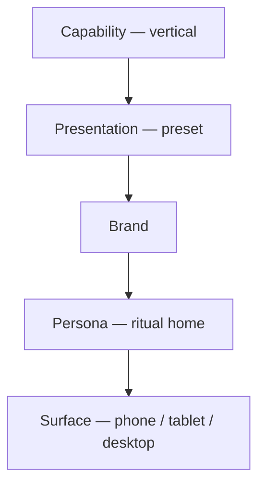

# Surface & breakpoints — phone, tablet, desktop

**Status:** Active spec (2026-05-29)  
**Scope:** All tenant-facing surfaces (dashboard web, native mobile, public `/b`). Internal ops excluded.  
**Builds on:** [`PRESENTATION-PRESETS-AND-ROLLOUT.md`](./PRESENTATION-PRESETS-AND-ROLLOUT.md), [`MOBILE-UX-PRINCIPLES.md`](./MOBILE-UX-PRINCIPLES.md), [`../product/WEB-MOBILE-PARITY.md`](../product/WEB-MOBILE-PARITY.md)

---

## Part 0 — Why surface is its own layer

Presentation presets (colour, density, typography) answer **how it looks**.  
Persona rituals answer **who you are**.  
**Surface class** answers **what shape the UI takes** on the device in hand.

| Mistake | Fix |
|---------|-----|
| Shrinking desktop onto phone | **Morph** — same data, different IA |
| One responsive grid everywhere | **Surface-native** — native app ≠ mobile browser ≠ desktop |
| Feature parity = identical pixels | **Capability parity** — act on phone; configure on desktop when needed |

**Rule:** Preset tokens are **surface-agnostic**. Layout morph is **surface + persona + vertical module**, not preset id.

---

## Part I — Surface classes

### Detection

| Class | Dashboard web | Native mobile | Typical context |
|-------|---------------|---------------|-----------------|
| **Phone** | viewport `<640px` (`sm` breakpoint) | always | Between clients, sofa triage, pocket |
| **Tablet** | `640px–1023px` (`sm`–`lg`) | width `≥600dp` landscape or large phone | Front desk iPad, floor walk with tablet |
| **Desktop** | `≥1024px` (`lg+`) | — (web handoff) | Back office, manager day, founder rollup |

**Native app** (`artifacts/livia-mobile`) is **phone-class by default**. Tablet detection uses shortest side `≥600dp` → tablet enhancements (wider cards, optional 2-pane on stack push).

**Public `/b`:** mobile-first; tablet adds 2-column service grid; desktop centers `max-w-lg` ritual column.

### HTML / RN hints (implementation)

| Runtime | Attribute / hook |
|---------|------------------|
| Dashboard | `document.documentElement.dataset.surface = "phone" \| "tablet" \| "desktop"` |
| Dashboard CSS | `@container` + Tailwind `sm:` / `lg:`; prefer container queries for module cards |
| Mobile | `useSurfaceClass()` → `"phone" \| "tablet"` |
| Public | `public-booking-shell` + `data-surface` on root |

---

## Part II — What each surface is for

### Phone — act in seconds

| Strength | Weakness |
|----------|----------|
| Push, haptics, camera, SMS deep links | Multi-column grids, bulk edit, legal attestation tables |
| Glance + one primary action | Comparing 4 columns of pipeline side-by-side |

**Design shape:** single column, hero + list, bottom tabs (native) or sticky thumb actions (web mobile). Max **one** stats row + **one** list per screen ([`MOBILE-UX-PRINCIPLES.md`](./MOBILE-UX-PRINCIPLES.md)).

### Tablet — standing desk + floor walk

| Strength | Weakness |
|----------|----------|
| Split pane (list + detail), large touch targets | Keyboard-heavy bulk entry (prefer desktop) |
| Proof review side-by-side (sketch vs refs) | Founder multi-shop dense P&L |

**Design shape:** **50/50 or 40/60 split** where desktop would use 3-pane. Reception and proof-desk personas **target tablet landscape** as primary.

### Desktop — see everything, keyboard power

| Strength | Weakness |
|----------|----------|
| Multi-pane (inbox + thread + booking), pipeline kanban, cmd palette | Not available mid-haircut |
| Dense tables, exports, settings tabs | Overwhelming if shown to staff on phone |

**Design shape:** sidebar + work area + optional context rail. `OperationalPageShell` max-width scales by persona (chain `lg`, default `3xl`).

---

## Part III — Layout morph by vertical module

Same **capability module**, different **layout primitive** per surface.  
Preset `layout` token (`cards`, `pipeline`, `list`, …) is the **desktop-first default**; morph table overrides on smaller surfaces.

| Module (capability) | Phone | Tablet | Desktop |
|---------------------|-------|--------|---------|
| **Pipeline board** (body-art owner) | Vertical stage list; tap stage → cards | 2-column kanban scroll | Full horizontal kanban |
| **Proof desk** (body-art reception) | Queue list → full-screen proof detail | Split: queue \| sketch vs refs | Split + client context rail |
| **Session day** (body-art artist) | Single hero block + checklist | Hero + checklist (wider) | Same as phone (no gain) |
| **Flight plan / Today** (hair owner) | Briefing + 3 KPI chips + proposals | Briefing + 2×2 KPI grid | Briefing + KPI strip + modules row |
| **Inbox / thread** | Thread list → push detail | List \| thread | List \| thread \| entity detail |
| **Floor calendar** (reception) | Day list + check-in FAB | Time grid simplified | Full calendar grid |
| **Station map** (manager) | Station list with status chips | Simplified spatial grid | Full drag-drop pegboard |
| **Class roster** (fitness) | Next class hero + waitlist count | Roster list + capacity bar | Week grid + waitlist panel |
| **Medspa hub** | Next mandate alerts stack | Alert list \| procedure detail | Hub dashboard + audit strip |
| **Chain glance** (founder) | Shop cards stack | 2-column shop cards | 3-column + rollup table |
| **Public consult request** | Single column steps | 2-col service grid (if book flow) | Centered single column |
| **Settings / appearance** | Full-screen preset picker | 2-col: list \| preview | Settings tab + live preview pane |

**Fallback rule:** if spatial layout (pegboard, kanban) cannot fit, degrade to **ordered list** with same sort/filter — never hide data.

---

## Part IV — Persona × primary surface

Each persona has a **primary surface** (where they spend most time) and **secondary** surfaces.

| Persona | Primary surface | Secondary | Avoid on phone |
|---------|-----------------|-----------|----------------|
| **P1 Founder** | Phone (evening triage) | Desktop (week P&L) | Dense cross-shop tables |
| **P2 Owner** | Phone (day pulse) | Desktop (settings, exports) | Multi-tab settings |
| **P3 Manager** | Tablet (floor) | Desktop (rota, reports) | Pegboard drag on narrow phone |
| **P4 Staff** | Phone (native) | — | Full inbox queue |
| **P6 Reception** | Tablet landscape | Desktop | — |
| **P7 Customer** | Phone (browser) | Desktop (same flow, centered) | — |

Native mobile **does not** target founder desktop parity — Glance tab + shop switch is the phone ritual; drill to web for franchise/legal when tier requires it ([`WEB-MOBILE-PARITY.md`](../product/WEB-MOBILE-PARITY.md)).

---

## Part V — Runtime matrix

| Concern | Dashboard web | Native mobile | Public `/b` |
|---------|---------------|---------------|-------------|
| Nav | Sidebar (desktop/tablet); bottom sheet nav optional on phone web | Bottom tabs + More | Step spine + sticky summary |
| Preset / theme | `data-presentation` CSS bundles | Accent hex + density flag | `public-skin-*` + preset |
| Multi-pane | `lg:` 2-pane, `xl:` 3-pane | Stack navigation only | N/A |
| Keyboard | `⌘K` command hub (desktop/tablet) | — | — |
| Haptics | — | Confirm, approve, tab change | Optional confirm beat |
| Handoff | Link “Finish on web” one line | `Linking.openURL` dashboard deep link | — |

### Web handoff (acceptable gaps)

Use **one-line handoff**, not dead ends ([`MOBILE-UX-PRINCIPLES.md`](./MOBILE-UX-PRINCIPLES.md)):

| Task | Phone / native | Desktop web |
|------|----------------|---------------|
| Payroll export | Handoff | Full |
| Franchise / ownership legal | Handoff | Full |
| Bulk import | Handoff | Full |
| Liv command toolkit | Handoff | `/toolkit` |
| Appearance preset picker (staging) | Handoff or simplified 4-up grid | Full preview pane |
| Design proof approve | **Native/tablet** | **Desktop/tablet** |
| Approve Liv proposal | Native | Web + native |

---

## Part VI — Presentation preset × surface

| Preset token | Phone behaviour | Desktop behaviour |
|--------------|-----------------|-------------------|
| `density: compact` | Default friendly | More rows visible |
| `density: comfortable` | Extra vertical spacing | Standard cards |
| `layout: pipeline` | Stage list morph | Kanban |
| `layout: cards` | Single column stack | Grid where space allows |
| `colorMode: system` | Follow OS | Follow OS |
| Platform Default | Aurora glass on **hero only** (phone) | Glass on Liv hub + modals |

**Picker preview:** Appearance settings must preview at **least two** surface widths (phone frame + desktop frame) on staging — same preset id, different morph.

---

## Part VII — Vertical × surface quick reference

| Vertical | Phone-native ritual | Tablet sweet spot | Desktop-only depth |
|----------|--------------------|--------------------|---------------------|
| Hair | My Day, SMS approve | Reception calendar | Chain payroll, exports |
| Beauty | Inbox reply | Inbox split pane | Campaign / settings |
| Body-art | Session day, proof approve | **Proof desk split** | Pipeline kanban, station map |
| Wellness | Session + buffer note | Package picker | Day package editor |
| Fitness | Class check-in | Roster + capacity | Class schedule editor |
| Medspa | Consent alert approve | Arrival + consent split | Mandate hub, audit |
| Allied health | Follow-up reminder | Intake attach | Care series editor |
| Pet grooming | Pet card + pickup SMS | Day list | Bulk roster |
| Auto detailing | Bay status + late broadcast | Bay timeline | Package editor |

---

## Part VIII — Implementation checklist

### Dashboard (`livia-dashboard`)

| Task | File / pattern |
|------|----------------|
| Surface detector hook | `hooks/use-surface-class.ts` |
| Set `data-surface` on shell | `app-layout.tsx` |
| Module morph components | `components/layout/surface-adaptive/*.tsx` |
| Container queries on home modules | `vertical-home-modules.tsx` |
| Inbox 2/3-pane | `inbox.tsx` at `lg` / `xl` |
| Public booking sticky bar | already mobile — extend tablet grid |

### Mobile (`livia-mobile`)

| Task | File / pattern |
|------|----------------|
| `useSurfaceClass()` | `hooks/use-surface-class.ts` |
| Tablet 2-pane on inbox stack | `app/(tabs)/inbox.tsx` optional |
| Proof detail split | `design-proofs` screen @ tablet |
| No desktop-only features in tabs | More → web handoff |

### Policy (optional resolver)

Future: `resolveSurfaceLayout(moduleId, surfaceClass)` in `@workspace/policy` alongside presentation presets — returns `layoutPrimitive` morph id. Until then, morph tables in this doc are authoritative.

---

## Part IX — QA matrix (staging)

For each **vertical default preset** + **Platform Default**, on **three surface classes**:

| Check | Phone | Tablet | Desktop |
|-------|-------|--------|---------|
| Persona home loads <2s to primary action | ✓ | ✓ | ✓ |
| No horizontal scroll on 320px | ✓ | — | — |
| Split pane where specified | — | ✓ | ✓ |
| Pipeline/kanban degrades to list | ✓ | partial | full |
| Public `/b` completable | ✓ | ✓ | ✓ |
| Preset switch updates all surfaces | ✓ | ✓ | ✓ |
| Web handoff links resolve | ✓ | — | — |

Document results in [`UX-FULL-PLATFORM-AUDIT`](../testing/UX-FULL-PLATFORM-AUDIT-2026-05-24.md) appendix when Phase 7 presentation rollout runs.

---

## Part X — Related docs

| Doc | Role |
|-----|------|
| [`PRESENTATION-PRESETS-AND-ROLLOUT.md`](./PRESENTATION-PRESETS-AND-ROLLOUT.md) | Preset catalog + staging phases |
| [`ux-layout-contract.md`](./ux-layout-contract.md) | Page zones + operational shell |
| [`PRODUCT-UX-SYSTEM.md`](./PRODUCT-UX-SYSTEM.md) | Engineering UX spine |
| [`../product/PERSONA-UX.md`](../product/PERSONA-UX.md) | Home routes per persona |
| [`../product/V3-EXPERIENCE-SPEC.md`](../product/V3-EXPERIENCE-SPEC.md) | Motion per surface |
