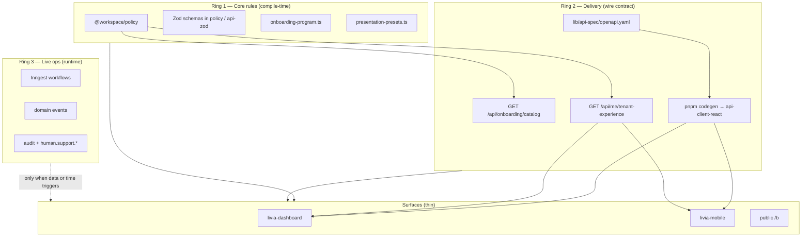

# Composable evolution — how Livia stays aligned when the product changes

**Status:** canonical (2026-05-29)  
**Audience:** engineering, product, agents  
**Reads with:** [`composable-monetisation-architecture.md`](./composable-monetisation-architecture.md) · [`../adr/0018-composable-monetisation-architecture.md`](../adr/0018-composable-monetisation-architecture.md) · [`../product/TENANT-EXPERIENCE-CONTRACT.md`](../product/TENANT-EXPERIENCE-CONTRACT.md) · [`PLATFORM-KERNEL.md`](./PLATFORM-KERNEL.md) · [`../product/PLATFORM-EVOLUTION-AND-OPS-PROGRAM.md`](../product/PLATFORM-EVOLUTION-AND-OPS-PROGRAM.md)

---

## 1. What we mean by “dynamic” and “self-evolving”

Livia is built so that **a change in one place propagates correctly** to every consumer that depends on it — without an engineer manually hunting fifteen files or hoping mobile “happened to” match the dashboard.

This is **not** runtime magic (components subscribing to each other, broadcast buses for product rules, or AI rewriting code on deploy). It is **deliberate architecture**:

1. **One source of truth** for product rules (policy, schemas, OpenAPI).
2. **One read path per surface** (tenant experience API, generated clients, catalog endpoints).
3. **Automated guards** (TypeScript, tests, codegen diff) that fail when something did not adjust.
4. **Domain events** only for **operational** reactions after go-live (workflows, notifications, analytics).

The mental model: **blocks snap together around a hub**. The hub is the contract; the blocks are thin surfaces and services.

---

## 2. Relationship to composable monetisation (ADR 0018)

ADR 0018 defines Livia as **twelve sellable units** composed through **eight patterns** (contract-first packages, event-driven core, tenant context primitive, capability tokens, Liv as a service, pricing primitives, vertical packs as plugins, etc.). See [`composable-monetisation-architecture.md`](./composable-monetisation-architecture.md).

**Composable evolution** is the **day-to-day discipline** that keeps those patterns true while the product changes:

| ADR 0018 pattern | Evolution mechanism |
|------------------|---------------------|
| Contract-first, package-isolated | Change `lib/policy` / OpenAPI first; packages do not reach into foreign tables |
| Event-driven core | New subscribers for *data* changes; not for renaming an onboarding act |
| Vertical packs as plugins | `resolveTenantExperience`, presentation presets, vocabulary — not forked UI strings |
| Thin surfaces (L8) | Dashboard/mobile/public render bundles; they do not invent gates |

If a change requires editing the same rule in three apps, the change was made in the **wrong layer**.

---

## 3. The three rings model

Every product-rule change should be classified into one or more rings. Work **from the center outward**.

### Ring 1 — Core rules

**Location:** primarily `lib/policy/src/`.

**Examples:**

| Concern | Canonical module | Consumers must not duplicate |
|---------|------------------|------------------------------|
| Onboarding acts & gates | `onboarding-state.ts`, `onboarding-program.ts` | `BLOCKING_ONBOARDING_ACTS`, `isOnboardingAppUnlocked` |
| Tenant bundle | `tenant-experience.ts` | Vertical copy, skin, onboarding extras |
| Presentation presets | `presentation-presets.ts` | Preset ids, labels, staging rollout |
| Vocabulary | `vocabulary.ts`, vertical playbooks | “Shop” vs “Practice” labels |
| Business rules | re-exported guards, entitlements hooks | Plan/feature gates in services |

**How “awareness” works:** TypeScript imports and unit tests. If dashboard hardcodes `a5_hours` logic locally, tests or review should catch it; preferred fix is to delete the duplicate and call policy or tenant experience.

### Ring 2 — Delivery

**Locations:** `lib/api-spec/openapi.yaml`, api-server routes, generated `lib/api-client-react` and `lib/api-zod`.

**Key endpoints:**

| Endpoint | Role |
|----------|------|
| `GET /api/me/tenant-experience?businessId=` | Single bundle for owner surfaces — see [`TENANT-EXPERIENCE-CONTRACT.md`](../product/TENANT-EXPERIENCE-CONTRACT.md) |
| `GET /api/onboarding/catalog` | Vertical list, acts metadata (target: sole catalog; dedupe client lists) |
| Domain routes under `/api/businesses/:id/...` | OpenAPI-first mutations and reads |

**How “awareness” works:** Run `pnpm codegen` after spec changes; CI `scripts/check-codegen.sh` fails on drift. Surfaces refetch tenant experience after mutations that affect gates (onboarding complete, vertical change, preset change).

### Ring 3 — Live operations

**Locations:** `artifacts/api-server/src/workflows/`, `publishDomainEvent`, Inngest.

**Use when:** something **happened** in production — booking created, support ticket filed, Liv error, stuck onboarding 48h.

**Do not use when:** renaming a checklist field, adding a presentation preset, or changing blocking acts — that is Ring 1 + 2.

---

## 4. Tenant experience as the hub (concrete example)

Canonical contract: [`../product/TENANT-EXPERIENCE-CONTRACT.md`](../product/TENANT-EXPERIENCE-CONTRACT.md).

`resolveTenantExperience()` in `lib/policy/src/tenant-experience.ts` assembles:

| Field | Source |
|-------|--------|
| `vocabulary` | `businessVocabulary()` |
| `playbook` | `getVerticalPlaybook()` |
| `skin` | `resolveTenantExperienceSkin()` + presentation preset merge (staging) |
| `onboardingExtras` | `getVerticalOnboardingExtras()` |
| `onboarding.appUnlocked` | `isOnboardingAppUnlocked()` |
| `onboarding.activationSteps` | `activationStepsFromState()` |

**Surfaces that consume (must stay thin):**

| Surface | Consumption |
|---------|-------------|
| Dashboard onboarding | Theme, preview API, vocabulary hints |
| Dashboard home | `ActivationWelcome` |
| Mobile home | `ActivationWelcome` |
| Mobile setup | `onboarding-continue` + tenant experience |
| Public booking | `experienceSkin` from API |

**Anti-patterns (explicitly forbidden in contract):**

- Duplicate `VERTICAL_OPTIONS` / `ONBOARDING_VERTICALS` in apps — use `/onboarding/catalog`
- Hardcoded salon/stylist copy in tenant UI
- `percentComplete === 100` as the only app-unlock check

---

## 5. Change playbooks (how blocks “snap” for real edits)

### 5.1 Onboarding change (act, gate, checklist field)

**Trigger examples:** new blocking act, reorder wizard, new checklist key, change unlock rule.

| Step | Action | Verify |
|------|--------|--------|
| 1 | Edit `lib/policy/src/onboarding-state.ts` (act ids, Zod checklist schema) | `onboarding-state` types compile |
| 2 | Edit `lib/policy/src/onboarding-program.ts` (blocking list, activation steps, seed state) | `artifacts/api-server/src/services/__tests__/onboarding-program.test.ts` |
| 3 | If API shape changes, update OpenAPI + run `pnpm codegen` | `scripts/check-codegen.sh` clean |
| 4 | Update api-server onboarding routes/services if persistence changes | API tests |
| 5 | Dashboard `onboarding.tsx` + wizard components — render from state/API, not local gates | Manual: second-shop intent still skips wrong business |
| 6 | Mobile `onboarding-setup` — same unlock via tenant experience | WEB-MOBILE-PARITY checklist |
| 7 | Update screen card YAML if exists (`docs/screens/...`) | Design QA |
| 8 | Update `TENANT-EXPERIENCE-CONTRACT.md` if gates table changes | Doc review |
| 9 | Add row to domain map (§7) if new surface coupling | — |

**Do not:** emit a new Inngest event “onboarding.act.changed” unless a **workflow** must run (e.g. 48h stuck-user email already tied to state, not act rename).

### 5.2 Presentation preset / skin change

**Canonical spec:** [`../design/PRESENTATION-PRESETS-AND-ROLLOUT.md`](../design/PRESENTATION-PRESETS-AND-ROLLOUT.md)  
**Catalog:** `lib/policy/src/presentation-presets.ts`

| Step | Action |
|------|--------|
| 1 | Add or edit preset in policy catalog |
| 2 | Extend `resolveTenantExperienceSkin` merge rules |
| 3 | DB column `presentation_preset_id` + PATCH API (staging gate) |
| 4 | Dashboard CSS bundles + `useSurfaceClass` |
| 5 | Mobile + public `/b` parity per rollout phases in PLATFORM-BACKLOG |
| 6 | Staging QA matrix (36 presets × surfaces) before prod |

### 5.3 Vertical / vocabulary change

**Full checklist:** [`VERTICAL-ADD-PLAYBOOK.md`](./VERTICAL-ADD-PLAYBOOK.md)

| Step | Action |
|------|--------|
| 1 | Policy: vocabulary, playbook, onboarding extras |
| 2 | `resolveTenantExperience` — no app-local vertical lists |
| 3 | Run `vocabulary-leak.test.ts` | 
| 4 | Marketing vs reality audit if customer-facing claims change |

### 5.4 New HTTP capability

| Step | Action |
|------|--------|
| 1 | OpenAPI path + schemas in `lib/api-spec/openapi.yaml` |
| 2 | `pnpm codegen` |
| 3 | Implement route in api-server; service uses `tenantContext` + `businessId` |
| 4 | Use generated hooks in dashboard where possible; `apiFetch` only for gaps |
| 5 | Entitlements: `withBusinessFeature()` or plan gate in service |

### 5.5 Exec workforce / work-event change (Track H)

**Spec:** [`../product/INTERNAL-EXEC-COCKPIT-SPEC.md`](../product/INTERNAL-EXEC-COCKPIT-SPEC.md) §4.2b

| Step | Action | Verify |
|------|--------|--------|
| 1 | Edit `lib/policy/src/exec-hats.ts` (role catalog, default mandates) | Policy tests |
| 2 | Migration + Drizzle schema for `exec_work_events` | Migration applies |
| 3 | OpenAPI + `pnpm codegen` for POST/GET work-events | check-codegen clean |
| 4 | Merge events in `internal-founder-cockpit.service.ts` | Snapshot includes last N per hat |
| 5 | Hats River UI in `FounderCockpitView.tsx` | Manual: event visible after CLI post |
| 6 | `pnpm exec:hat-work` + AGENTS.md logging discipline | Cursor session emits event |

**Do not:** store work events only in client state; infer hat from chat tokens without explicit declare.

---

Automated “notification” that something did not adjust:

| Guard | Location | Catches |
|-------|----------|---------|
| Codegen diff | `scripts/check-codegen.sh` | OpenAPI changed without regeneration |
| Typecheck graph | `pnpm run typecheck` | Broken imports after policy type change |
| Onboarding program | `onboarding-program.test.ts` | Gate/unlock regressions |
| Vocabulary leak | `vocabulary-leak.test.ts` | Salon-only strings in wrong vertical paths |
| E2E verticals | `pnpm test:e2e:verticals` | Vertical fairness |
| Brand / naming taboo | CI naming guards | Legacy codenames |

**Principle:** prefer a failing test over a Slack reminder.

---

## 7. Domain dependency map (living index)

Maintain this table when adding P0 flows. **Program owner:** engineering lead; update in the same PR as a hub change when possible.

| Domain | Hub (Ring 1) | API (Ring 2) | Dashboard | Mobile | Internal ops | Key tests |
|--------|--------------|--------------|-----------|--------|--------------|-----------|
| Onboarding gates | `onboarding-program.ts` | tenant-experience, onboarding routes | `pages/onboarding.tsx` | `onboarding-setup` | — | `onboarding-program.test.ts` |
| Tenant copy/skin | `tenant-experience.ts`, `presentation-presets.ts` | `GET tenant-experience` | layout, theme, appearance | `_layout`, theme | tenant health | vocabulary-leak |
| Liv inbox | policy inbox lenses | conversations API | `pages/inbox.tsx` | inbox tab | support Liv bundle | e2e inbox |
| Bookings | booking services | OpenAPI bookings | booking-detail, wizard | bookings | — | booking conflict tests |
| Support intake | — | `POST .../support/tickets` | `help-support-dialog.tsx` | (planned) | SupportQueueView | triage tests |
| Exec workforce (hats) | `exec-hats.ts` | `POST/GET .../exec/work-events` | — | — | FounderCockpitView Hats River | exec-hats tests |
| Billing | entitlements | Stripe routes | settings billing | — | finance_read | — |

Full program tasks for map automation: [`../product/PLATFORM-EVOLUTION-AND-OPS-PROGRAM.md`](../product/PLATFORM-EVOLUTION-AND-OPS-PROGRAM.md) Track A.

---

## 8. Screen cards and design alignment

Experience Bible screen cards (YAML) should reference **stable ids** aligned with policy:

- Onboarding routes: act ids (`a2_shop_profile`, `a5_hours`, …)
- Surface ids (see support points doc) for cross-linking QA and tickets

When cards are missing, code and policy still win; cards catch UX drift in review.

---

## 9. What we explicitly do not build

| Approach | Why not |
|----------|---------|
| Runtime pub/sub for product rules | Order, debugging, and duplicate logic; TypeScript + policy already solve shape |
| Per-component UUID “tags” in DOM | Unmaintainable; tag **surfaces** not inputs |
| Shared DB tables across packages | Breaks package isolation (ADR 0018 §1) |
| UI inventing unlock logic | Drift between web and mobile |

---

## 10. Success criteria (program complete)

| # | Criterion |
|---|-----------|
| 1 | No duplicate vertical/onboarding lists in `artifacts/*` (catalog API only) |
| 2 | Every blocking onboarding change follows §5.1 playbook in PR template |
| 3 | Domain map (§7) covers all P0 rows with accurate file paths |
| 4 | `TENANT-EXPERIENCE-CONTRACT` and this doc linked from `AGENTS.md` / onboarding engineer doc |
| 5 | Presentation preset Phases 1–8 complete per PLATFORM-BACKLOG |
| 6 | New engineers can answer “what breaks if I change act X?” in under five minutes using hub + map |

---

## 11. References

- [`../product/TENANT-EXPERIENCE-CONTRACT.md`](../product/TENANT-EXPERIENCE-CONTRACT.md)
- [`../design/PRESENTATION-PRESETS-AND-ROLLOUT.md`](../design/PRESENTATION-PRESETS-AND-ROLLOUT.md)
- [`../design/SURFACE-AND-BREAKPOINTS.md`](../design/SURFACE-AND-BREAKPOINTS.md)
- [`../product/WEB-MOBILE-PARITY.md`](../product/WEB-MOBILE-PARITY.md)
- [`../product/LIVIA-IDEA-TO-REALITY.md`](../product/LIVIA-IDEA-TO-REALITY.md) Part I.3–I.4 (layers, modularity table)
- [`../operations/PLATFORM-BACKLOG.md`](../operations/PLATFORM-BACKLOG.md) — P2 anti-patchwork + presentation preset phases
