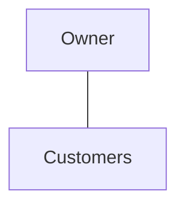
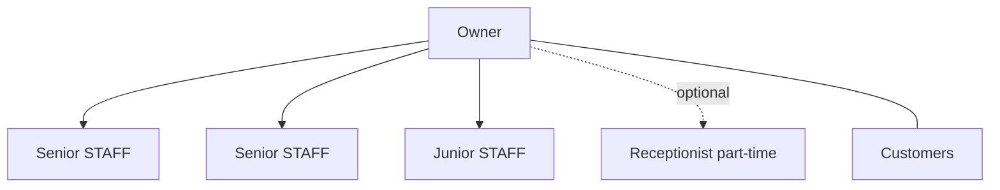
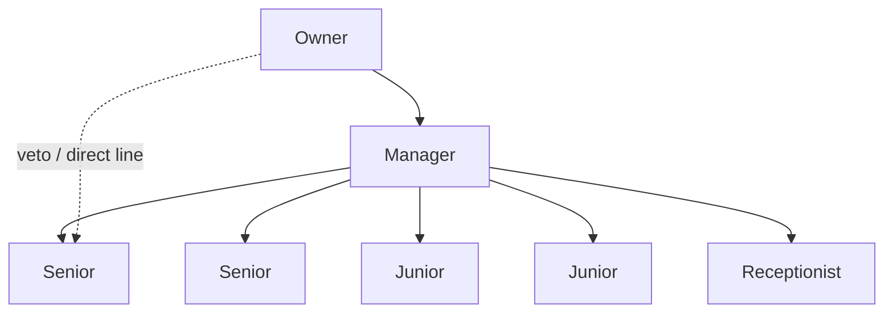
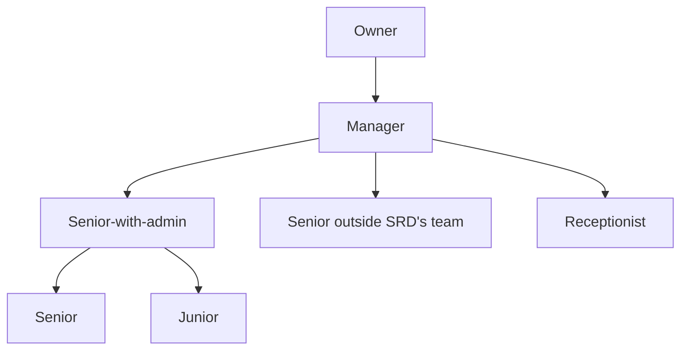
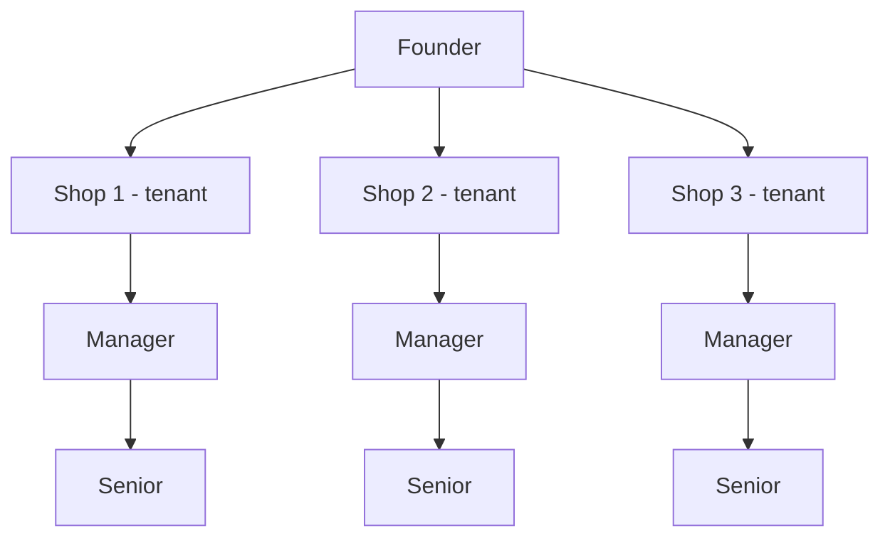
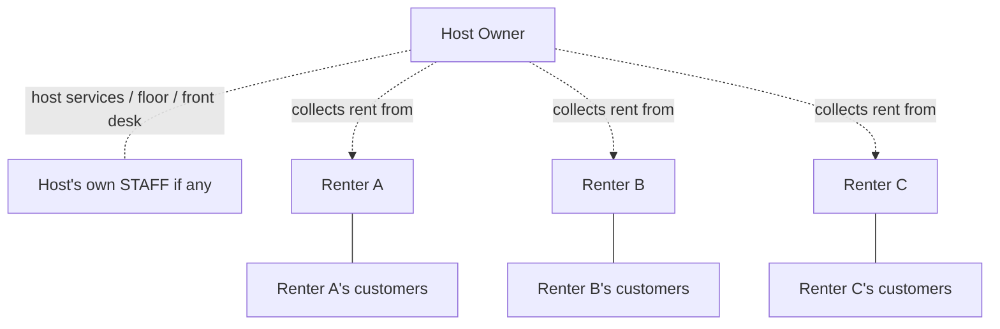
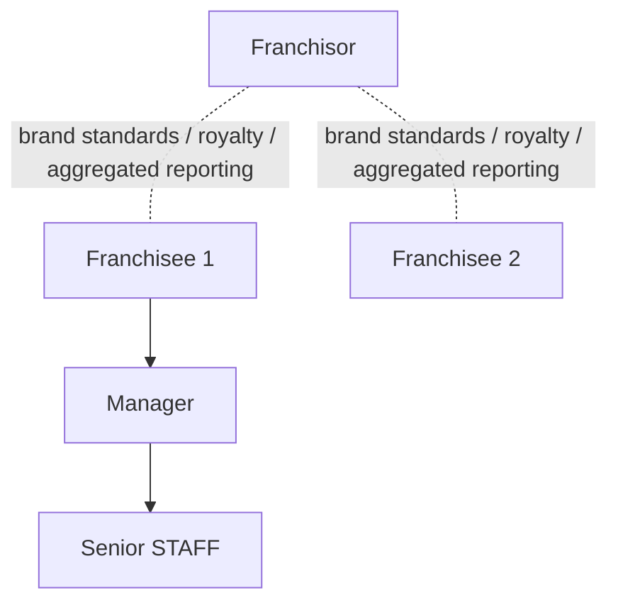
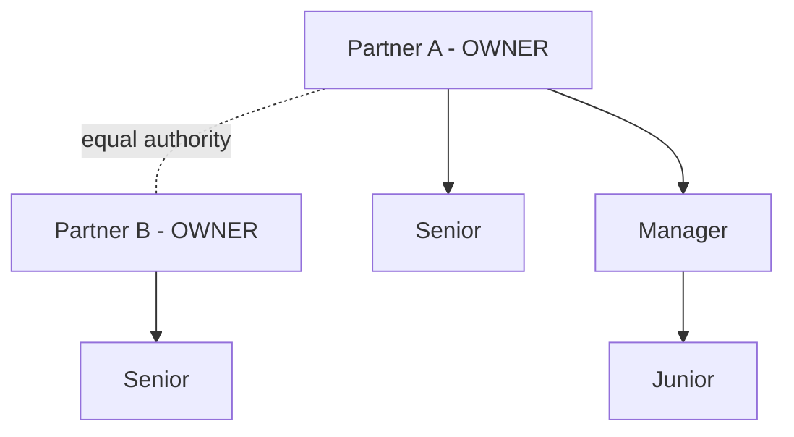
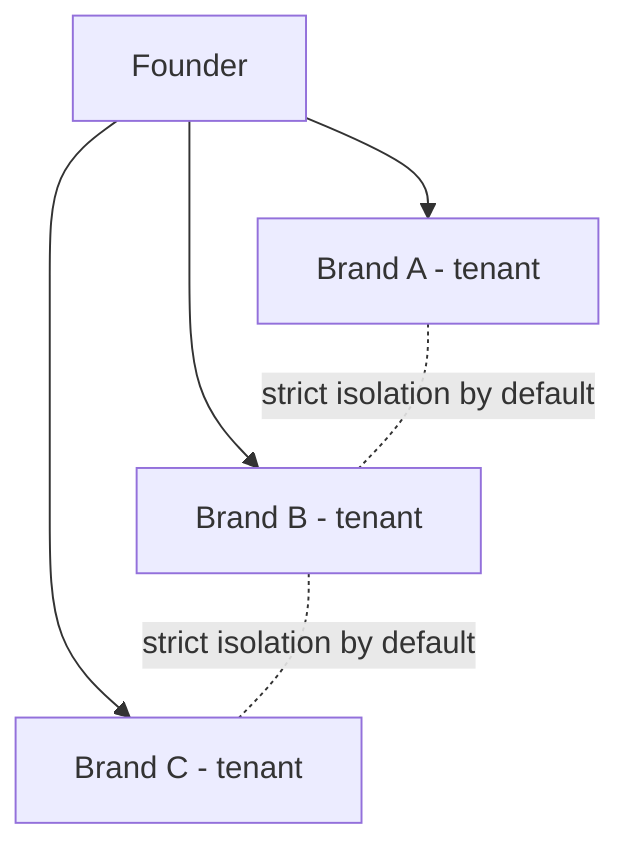

# Hierarchy and delegation

**Status:** F3 spine doc (2026-05-07). The data model and the operational model in one document.

Livia treats the hierarchy of a salon as a first-class graph. Workflows that cross levels — refunds above cap, time-off, hiring, escalation, owner-on-holiday — flow along defined edges. The graph is enforced at the data-access layer, not the UI.

---

## 1. The roles

Per ADR 0009 (Roles and personas):

| Role | Internal abbreviation | Authority |
|---|---|---|
| OWNER | OWN | Full authority over the tenant; only role that can mutate billing, brand, fundamental settings; only role that can promote/fire other staff |
| ADMIN (Manager) | ADM | Authority over operations of the shop: rota, time-off approvals, refunds within cap, daily ops; cannot mutate billing or brand |
| ADMIN-DESIGNEE (Senior-with-admin) | ADM-D | ADM-grade authority **scoped** to a defined subset (their team, their service line) — first-class flag `staff_admin_designee` |
| STAFF | STA | Their own slate; their own client list view; their own performance |
| RECEPTIONIST | REC | Multi-staff calendar view; no STAFF-internal data; refund authority €0 (recommends) |

Notes:
- **OWNER is a binary.** The Founder of a multi-shop chain has OWNER membership at *each* shop (one membership row per shop per ADR 0010). They are not a separate role.
- **ADM-D** is the role that closes the hotel-principle leak Phorest's role model creates by forcing seniors to share the Owner login.

---

## 2. The graph (per major configuration)

### 2.1 Solo configurations (C1, C2, C3)



No internal hierarchy. The Owner is the team.

### 2.2 Single-shop with staff, no manager (C4)



### 2.3 Single-shop with manager (C5)



### 2.4 Single-shop mature (with senior-with-admin) (C6)



The Senior-with-admin's authority is **scoped** — they manage their team's rota, approve their team's time-off, sign refunds for their service line. They do NOT have authority over the rest of the shop.

### 2.5 Multi-shop chain (C7-C9)



The Founder has OWNER membership at each shop. Per-shop tenancy is the isolation primitive (ADR 0010).

### 2.6 Chair-rental (C10)



**Critical.** Renter's customers belong to the Renter. The Host has no read access to a Renter's customer list, calendar internals, or revenue. The Host sees only: rent paid/owed; chair occupancy; aggregate front-desk traffic.

### 2.7 Franchise (C11)



Franchisor is its own tenant; franchisees are independent tenants. Franchisor sees aggregated reporting per franchise agreement; never per-customer data.

### 2.8 Partnership (C12)



Both partners are OWNER. Partner-vote workflows for big decisions. Profit distribution per partnership agreement (encoded in `partnership_terms` table).

### 2.9 Multi-brand portfolio (C13)



Each brand is a separate tenant. Strict customer-isolation by default. Cross-brand customer linking requires both Owners' approval AND customer's own consent.

---

## 3. First-class data model concepts

Per ADR 0010 (Multi-tenant and persona model), three concepts are first-class:

### 3.1 `memberships` table

```
memberships(
  user_id,
  business_id,
  role,                        -- OWN | ADM | ADM-D | STA | REC
  staff_admin_designee BOOL,   -- true only if role = STA and there's a delegation row
  joined_at,
  active
)
```

A user has one row per business. The Founder has N rows (one per shop). The chair-rental Renter has rows at the Host's shop AND optionally at her own one-person tenant.

### 3.2 `delegations` table

```
delegations(
  business_id,
  delegator_user_id,    -- e.g. ADM
  delegate_user_id,     -- e.g. STA being designated
  scope,                -- "team_rota" | "service_line_refunds_under_cap" | etc
  cap_eur,              -- per-action cap if applicable
  effective_from,
  effective_to,         -- NULL for permanent
  created_at,
  revoked_at
)
```

The Senior-with-admin role is realised as a `delegations` row from Manager → Senior with appropriate `scope`. Owner-on-holiday is realised as a `delegations` row from Owner → Manager with elevated `scope` and `effective_from/to`.

### 3.3 `reports_to` edge

```
reports_to(
  business_id,
  staff_user_id,
  reports_to_user_id    -- could be Mgr, Sr-w-admin, or Owner
)
```

Defines the escalation graph. Used by escalation, time-off-approval routing, refund-cap-ladder routing.

---

## 4. Six cross-level workflows (model-level specs; deep specs in F4)

### 4.1 Time-off

```
STAFF requests time-off
  → routes via `reports_to` to ADM or ADM-D
  → ADM-D may approve if scope includes their team's rota
  → otherwise ADM approves
  → above N consecutive days threshold, escalates to OWNER for ratification
  → calendar updated; affected bookings re-routed; customer comms drafted
```

Liv handles every step except the actual approve/decline. Drafts the customer comms; queues the rota balance.

### 4.2 Refund cap ladder

```
REC initiates refund recommendation: €X
  → if X ≤ ADM cap: routes to ADM (or ADM-D if scope matches)
  → if X > ADM cap: routes to OWNER with recommendation
  → action processed; audit-logged; customer notified; staff member notified
```

### 4.3 Hire

```
ADM identifies need
  → drafts role spec (Liv assists)
  → routes to OWNER for approval (always — never delegated)
  → upon approval, ADM runs hiring; OWNER ratifies offer
  → onboarding workflow triggers (membership row created at start_date)
```

Hire is OWNER-only at approval. Liv may assist with role spec drafting and candidate-coordination but never approves.

### 4.4 Promote-to-admin

```
OWNER nominates a Senior STAFF for ADM-D
  → defines scope (team / service line) and cap
  → STAFF accepts (notification + acceptance click)
  → `delegations` row created
  → audit log entry; team notification (or not, per OWNER preference)
```

Promotion is OWNER-only.

### 4.5 Escalation (customer issue)

```
Customer issue arrives (DM, voice call, in-person)
  → REC or staff handles if within scope
  → if out-of-scope: routes via `reports_to` upward
  → ADM handles within authority
  → if requires owner: routes to OWNER; pending state visible to all relevant parties
  → Liv tracks pending-state SLAs; nudges if stalled
```

### 4.6 Owner-on-holiday handoff

```
OWNER sets `owner_on_holiday(from, to, delegated_to_user_id, elevated_scope)`
  → `delegations` row created with elevated scope
  → ADM gets the elevated authority for the window
  → daily digest goes to ADM during window (instead of OWNER)
  → Liv's posture toward ADM shifts to OWNER-equivalent for permitted decisions
  → on `to` date, delegation auto-expires; pending issues queue for OWNER on return
```

---

## 5. Audit posture

Every cross-level workflow above produces an audit-log entry.

**What's logged.**
- Action initiator (user_id + role).
- Action subject (e.g. customer involved, booking moved).
- Action category (refund / time-off / promotion / escalation / etc).
- Liv's involvement (none / suggested / drafted / acted-and-asked / acted-autonomously).
- Outcome (approved / declined / queued / cancelled).
- Timestamp + tenant + IP geo (broad, not precise).

**Who can read.**
- OWNER: everything in their tenant.
- ADM: actions where they are initiator, subject, or in the routing chain.
- ADM-D: actions within their delegation scope.
- STA: their own actions only.
- REC: their own actions only.

**Retention.** 7 years for tax-adjacent actions (refunds, deposits, payouts); 24 months for ops actions (rota, time-off, escalations) per default; configurable per tenant.

**Residency.** EU-resident; per ADR (forthcoming F8 ADR on audit-log physical design); never replicated outside EU.

Cross-references `docs/policy/impersonation-audit.md` (existing).

---

## 6. Open questions resolved

- **Multi-shop OPS director?** Modelled as ADM with chain-scope `delegations` from each shop's OWNER (the Founder). F8 may revisit if patterns emerge.
- **Chair-rental Renter as a tenant?** Yes — Renter is OWNER of her own one-person tenant; STAFF (chair-renter) at the Host's tenant. Her customers belong to her tenant.
- **Partnership equal authority?** Yes — both OWNER. Partner-vote workflow as a configuration setting (`partnership_governance.requires_partner_vote_above_eur`).
- **Multi-brand cross-rollup access?** Founder has OWNER membership at each brand; cross-brand reporting view aggregates only their own OWNER tenants. No cross-brand customer access by default.
