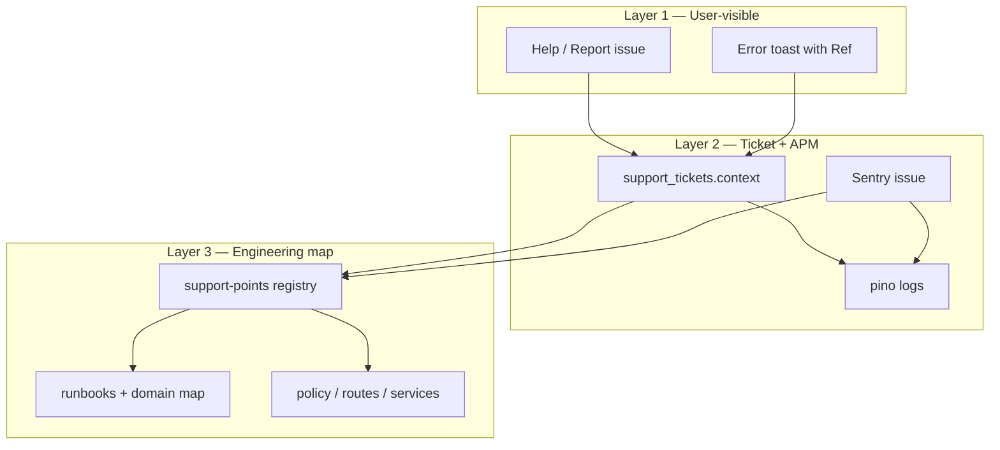

# Support points and investigation — internal troubleshooting architecture

**Status:** canonical (2026-05-29)  
**Audience:** engineering, support_l1, support_l2, founder  
**Reads with:** [`INTERNAL-SUPPORT-LIFECYCLE.md`](./INTERNAL-SUPPORT-LIFECYCLE.md) · [`INTERNAL-SUPPORT-SYSTEM-DESIGN.md`](./INTERNAL-SUPPORT-SYSTEM-DESIGN.md) · [`support-runbook.md`](./support-runbook.md) · [`../engineering/COMPOSABLE-EVOLUTION.md`](../engineering/COMPOSABLE-EVOLUTION.md) · [`../product/PLATFORM-EVOLUTION-AND-OPS-PROGRAM.md`](../product/PLATFORM-EVOLUTION-AND-OPS-PROGRAM.md)

---

## 1. Purpose

Livia must be **easy to troubleshoot internally**: when a tenant reports a problem (or an engineer sees a Sentry error), the team should reach the right code, logs, and runbook in minutes — without guessing from free-text alone.

This document defines:

1. **What is already shipped** in the repo (request ids, support tickets, triage, internal portal).
2. **The target model** — layered trace, stable `surfaceId`, support-point registry.
3. **Implementation phases** with acceptance criteria (executable backlog in PLATFORM-EVOLUTION-AND-OPS-PROGRAM Track B).

**Design principle:** auto-enrich tickets and traces; users describe problems in plain language. Engineers navigate via **stable surface ids** and **requestId**, not DOM tags on textareas.

---

## 2. What exists today (baseline)

### 2.1 Request correlation (API)

**File:** `artifacts/api-server/src/app.ts`

- Every request receives `x-request-id` (UUID v4).
- Client may send `x-request-id` only if it matches strict UUID regex (anti log-injection).
- Response echoes `x-request-id`.
- Sentry tags: `request_id`, `tenant_id` (when resolved).
- Structured logs (pino): flat fields `request_id`, `tenant_id`, `user_id`, `method`, `path`, `status`, `duration_ms`.

**JSON errors:** `sendError` / domain errors include `requestId` in body where applicable.

**Dashboard:** `ApiFetchError.requestId` from `getRequestIdFromErrorData`; Help dialog shows `Ref: <uuid>` on submit failure.

### 2.2 Support ticket intake (tenant)

**UI:** `artifacts/livia-dashboard/src/components/help-support-dialog.tsx`  
**API:** `POST /api/businesses/:businessId/support/tickets` (`artifacts/api-server/src/routes/support.ts`)

| Field | Values / notes |
|-------|----------------|
| `category` | `bug`, `liv_error`, `billing`, `feature`, `other` |
| `severity` | `blocking`, `annoying`, `nice_to_have` |
| `description` | min 10 chars |
| `consentLogsAccess` | boolean |
| `context` | merged object — see below |

**Server always adds** `requestId` from Express `req.id` into stored context.

**Client auto-context today:**

| Key | Source |
|-----|--------|
| `route` | `window.location.pathname` |
| `userAgent` | navigator |
| Caller `context` prop | per screen |

**Call sites with extra context:**

| Location | `defaultCategory` | Extra `context` |
|----------|-----------------|-----------------|
| `app-layout.tsx` (global Help) | `other` | route only |
| `pages/inbox.tsx` | `liv_error` | `conversationId`, `channel` |
| `pages/booking-detail.tsx` | `liv_error` | `bookingId`, `bookingStatus` |
| `ritual/liv-incidents-strip.tsx` | `liv_error` | route only |

### 2.3 Auto-triage (create-time)

**File:** `artifacts/api-server/src/services/support-ticket-triage.service.ts`

Runs on ticket create; writes `context.triage`:

| Output | Meaning |
|--------|---------|
| `priority` | `urgent` \| `normal` \| `low` |
| `tags` | category + regex tags from description |
| `suggestedReply` | operator snippet |

**Regex tags today:** `billing`, `liv`, `booking`, `leave`, `running_late`, `vertical_copy`, `sms`.

**Gap:** triage does not yet read `context.surfaceId` or map to code paths.

### 2.4 Internal portal

**Artifact:** `artifacts/livia-internal`  
**Docs:** [`INTERNAL-SUPPORT-LIFECYCLE.md`](./INTERNAL-SUPPORT-LIFECYCLE.md), [`../company/livia-internal-portal-spec.md`](../company/livia-internal-portal-spec.md)

- Support queue, ticket detail, Liv incident bundle when `liv_error` / tag `liv`.
- `requestId` in context → Sentry investigation hint.
- RBAC via `X-Internal-Ops-*` headers (dev defaults documented in lifecycle doc).

**Not built:** paste-requestId investigate page, surface-based file suggestions, impersonation, Linear sync.

### 2.5 Sentry

| Surface | Init |
|---------|------|
| api-server | `@sentry/node`, Express error handler |
| dashboard | `@sentry/react` |
| mobile | `initMobileSentry` in `app/_layout.tsx` |

Env-gated by `SENTRY_DSN_*` — no-op when unset.

---

## 3. Target model — three layers of trace



| Layer | Identifier | Who uses it |
|-------|------------|-------------|
| 1 | User description + optional `Ref: requestId` | Tenant, support_l1 |
| 2 | `requestId`, `businessId`, entity ids (`bookingId`, `conversationId`) | support_l2, engineer |
| 3 | `surfaceId` → registry row (files, tests, runbook) | engineer |

---

## 4. `surfaceId` — stable surface vocabulary

### 4.1 Definition

A **`surfaceId`** is a dot-separated, lowercase string identifying **where in the product** the user was when they reported the issue — not a DOM id, not a React component name.

**Format:** `{app}.{area}.{feature}`

| Segment | Values |
|---------|--------|
| `app` | `dashboard`, `mobile`, `public`, `internal` |
| `area` | route family or product area |
| `feature` | specific flow or screen |

### 4.2 Initial catalog (P0 — implement in registry Phase 1)

| surfaceId | Route hint (dashboard) | Primary code / policy |
|-----------|------------------------|------------------------|
| `dashboard.shell` | `*` (layout default) | `app-layout.tsx` |
| `dashboard.home` | `/` | home, ActivationWelcome |
| `dashboard.onboarding` | `/onboarding` | `onboarding.tsx`, `onboarding-program.ts` |
| `dashboard.onboarding.second-shop` | `/onboarding?intent=second-shop` | same + intent branch |
| `dashboard.inbox` | `/inbox` | `inbox.tsx`, conversations service |
| `dashboard.booking.detail` | `/bookings/:id` | `booking-detail.tsx` |
| `dashboard.bookings.new` | `/bookings/new` | booking wizard |
| `dashboard.settings.billing` | `/settings` billing tab | Stripe, entitlements |
| `dashboard.settings.liv` | `/settings` liv tab | Liv config, prompts |
| `dashboard.settings.comms` | `/settings` comms | Twilio, channels |
| `dashboard.team` | `/team` | invitations |
| `dashboard.liv.incidents` | ritual strip | `liv-incidents-strip.tsx` |
| `mobile.home` | `(tabs)/index` | mobile home |
| `mobile.onboarding` | onboarding-setup | mobile onboarding |
| `mobile.inbox` | inbox tab | mobile inbox |
| `public.booking` | `/b/:slug` | public book + chat |
| `internal.support.queue` | internal Support tab | SupportQueueView |

Expand catalog only via PR that updates **registry + this table + triage rules** together.

### 4.3 What not to tag

| Bad | Good |
|-----|------|
| `textarea-onboarding-hours-step-3` | `dashboard.onboarding` |
| Random UUID per mount | stable `surfaceId` from route table |
| User-typed code in description | auto-attached `surfaceId` |

---

## 5. Support-point registry (canonical map)

### 5.1 Purpose

The registry answers: **“Ticket says `dashboard.onboarding` — where do I go?”**

Planned canonical location: `lib/policy/src/support-points.ts` (exported from `@workspace/policy` so api-server and internal portal can import without reaching into artifacts).

### 5.2 Record shape (normative)

Each entry:

```ts
type SupportPoint = {
  surfaceId: string;
  label: string;              // human title for internal UI
  owner: string;              // team/domain: onboarding | liv | billing | bookings
  apps: ("dashboard" | "mobile" | "public" | "internal")[];
  routes: string[];           // path patterns
  policyModules: string[];    // repo-relative paths
  services: string[];         // api-server services
  uiComponents: string[];     // primary React paths
  tests: string[];            // test files that must pass after change
  runbook: string;            // doc path
  operatorTags: string[];     // triage tag hints
};
```

### 5.3 Example entry (onboarding — normative content)

**surfaceId:** `dashboard.onboarding`

| Field | Value |
|-------|-------|
| `label` | Dashboard onboarding wizard |
| `owner` | `onboarding` |
| `policyModules` | `lib/policy/src/onboarding-program.ts`, `onboarding-state.ts`, `tenant-experience.ts`, `vertical-onboarding.ts` |
| `services` | `artifacts/api-server/src/services/*onboarding*` (as applicable) |
| `uiComponents` | `artifacts/livia-dashboard/src/pages/onboarding.tsx` |
| `tests` | `artifacts/api-server/src/services/__tests__/onboarding-program.test.ts` |
| `runbook` | `docs/journeys/onboarding-paths.md`, `docs/product/TENANT-EXPERIENCE-CONTRACT.md` |
| `operatorTags` | `onboarding`, `vertical_copy` |

---

## 6. Wire-up contract (dashboard + API)

### 6.1 `useSupportContext` (to implement)

**Location:** `artifacts/livia-dashboard/src/lib/use-support-context.ts`

**Behaviour:**

1. Accept `surfaceId: string` and optional `extra: Record<string, unknown>`.
2. Merge: `surfaceId`, `route`, `businessId`, `vertical`, `appVersion` (from env/build), `extra`.
3. If last `apiFetch` failed with `requestId`, include `lastRequestId` (optional, session-scoped).

### 6.2 `HelpSupportDialog` change

Add required prop `surfaceId` (or derive from route map when omitted in layout only).

Post body:

```json
{
  "category": "bug",
  "severity": "annoying",
  "description": "...",
  "consentLogsAccess": true,
  "context": {
    "surfaceId": "dashboard.inbox",
    "route": "/inbox",
    "conversationId": "...",
    "requestId": "<from server on create>"
  }
}
```

### 6.3 Route → surface map (to implement)

**Location:** `artifacts/livia-dashboard/src/lib/support-surface-map.ts`

- Longest-prefix match on `pathname` → `surfaceId`.
- Query overrides: `intent=second-shop` → `dashboard.onboarding.second-shop`.
- `app-layout` Help uses map when child did not pass explicit `surfaceId`.

### 6.4 Sentry (dashboard + mobile)

On route change / focus:

```ts
Sentry.setTag("surface", surfaceId);
Sentry.setContext("livia", { businessId, vertical });
```

Aligns Sentry issue ↔ ticket `surfaceId`.

### 6.5 API triage extension

**File:** `support-ticket-triage.service.ts`

**Rules (add after description regex):**

1. If `context.surfaceId` present → add tag `surface:<id>` and merge `operatorTags` from registry.
2. Set `suggestedReply` from registry `runbook` when higher confidence than generic regex reply.
3. If `surfaceId` unknown → keep regex-only behaviour (no failure).

### 6.6 Domain error codes (incremental)

Where `replyDomainError` / `http-errors` expose stable `code` (e.g. `ONBOARDING_INCOMPLETE`, `BOOKING_CONFLICT`), include in ticket context when user submits from error state. Triage can tag `code:<value>`.

---

## 7. Internal “investigate” experience (target)

**Surface:** `artifacts/livia-internal` — new view or panel: **Investigate**

| Input | Action |
|-------|--------|
| `requestId` (UUID) | Show copyable log query hint: `request_id="<uuid>"`; link template to Sentry discover (project-specific URL in env doc) |
| Ticket id | Open ticket detail + Liv bundle |
| `surfaceId` | Render registry row: files, tests, runbook link |

**Ticket detail enhancements:**

1. Header: `surfaceId` + human label from registry.
2. Section **Likely code paths** (read-only list from registry).
3. Section **Identifiers** (existing): requestId, bookingId, conversationId — one-click copy.
4. **Re-triage** button calls triage with `reTriage: true` after context enriched.

This satisfies the “page with textbox” idea **for operators**, not tenants.

---

## 8. Operator workflow (end-to-end)

### 8.1 New ticket from tenant

1. **support_l1** opens internal Support queue — sort by `priority`, filter tag `liv`.
2. Open ticket — read **surfaceId** (once shipped) and **route**.
3. Copy **requestId** → logs / Sentry.
4. Read **suggestedReply** — first customer-safe response.
5. If Liv: open conversation from `conversationId`; compare Settings → Liv.

### 8.2 Engineer investigation

1. Confirm `surfaceId` → open registry paths (§5).
2. Reproduce on demo tenant same **vertical** (`pnpm dev` + `/demo`).
3. Run focused tests from registry `tests` array.
4. Fix in correct **ring** — policy vs API vs UI (see COMPOSABLE-EVOLUTION).
5. Close with: root cause, PR link, prevention (test or runbook update).

### 8.3 SLAs (beta — from INTERNAL-SUPPORT-SYSTEM-DESIGN)

| Priority | Acknowledge | Mitigation |
|----------|-------------|------------|
| urgent | < 30 min | same day |
| normal | < 24 h | scheduled |
| low | weekly batch | — |

---

## 9. Privacy and context limits

**Include in context:**

- ids (UUIDs), enums, route, surfaceId, app version, vertical, plan tier (if cheap to load).

**Do not include in ticket context:**

- Full message bodies, customer PII blobs, payment instrument details, secrets.
- Entire localStorage / session dumps.

`consentLogsAccess` gates operator access to extended logs per existing ticket model.

---

## 10. Testing requirements

| Test | Purpose |
|------|---------|
| `support-ticket-triage.test.ts` | extend: surfaceId → tags + suggestedReply |
| `support-points.test.ts` (new) | every P0 surfaceId has registry entry; paths exist on disk |
| E2E (optional) | Help submit includes `surfaceId` on inbox route |

---

## 11. Anti-patterns

| Anti-pattern | Why |
|--------------|-----|
| Tag every input field | Unmaintainable; use surface + entity ids |
| Require users to copy technical ids | Auto-attach; show Ref only on errors |
| Registry in markdown only | Drift; single TS registry + generated table optional later |
| Separate triage logic per app | triage in api-server only |

---

## 12. References

- [`INTERNAL-SUPPORT-LIFECYCLE.md`](./INTERNAL-SUPPORT-LIFECYCLE.md)
- [`INTERNAL-SUPPORT-SYSTEM-DESIGN.md`](./INTERNAL-SUPPORT-SYSTEM-DESIGN.md)
- [`SUPPORT-RUNBOOK.md`](./SUPPORT-RUNBOOK.md)
- [`CUSTOMER-SUPPORT-OPERATING-MODEL.md`](./CUSTOMER-SUPPORT-OPERATING-MODEL.md)
- [`../engineering/COMPOSABLE-EVOLUTION.md`](../engineering/COMPOSABLE-EVOLUTION.md)
- [`../product/PLATFORM-EVOLUTION-AND-OPS-PROGRAM.md`](../product/PLATFORM-EVOLUTION-AND-OPS-PROGRAM.md)
