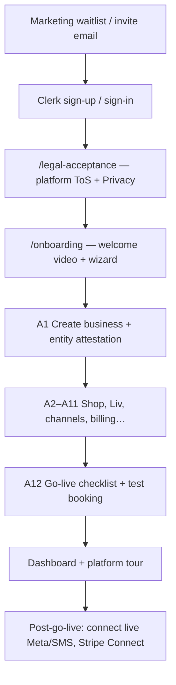

# Beta onboarding & compliance flow

**Audience:** founder, ops, engineers preparing closed beta demos and real sign-ups.  
**Status:** May 2026 — product gates implemented; legal pages remain counsel scaffolds.

---

## Honest answer: can anyone sign up without checks?

| Layer | What happens today | Beta target |
|--------|-------------------|-------------|
| **Clerk account** | Anyone who can reach `/sign-up` can create a Clerk user (unless you restrict sign-ups in the Clerk Dashboard). | **Ops:** enable invite-only or allowlist in Clerk for production beta; app cannot replace Clerk. |
| **Platform ToS / Privacy** | **Enforced** after sign-in: `/legal-acceptance` → `POST /me/platform-legal` before `POST /businesses`. | Bump versions in `@workspace/policy` `platform-legal.ts` when counsel publishes. |
| **Closed beta invite** | **Enforced** when `LIVIA_BETA_SIGNUP_MODE=invite` — only `LIVIA_BETA_INVITE_EMAILS` + `@livia.io` demo accounts can create a shop. | Set on staging/prod; keep `open` locally. |
| **Business vs personal** | Livia is **B2B only** — no consumer/personal account type. Copy states “business platform”. | N/A |
| **KYB / identity** | **Not performed** — sole trader / Ltd is **self-declared** (`tenant_attestation` on business). VAT optional, not VIES-checked. | Post-beta: Stripe Connect + optional KYB vendor. |
| **Licences** (medspa, tattoo, financial) | **Not verified** — vertical packs + public medspa consent only. | Tenant responsibility + counsel per market. |
| **DPA signed** | Link shown; **not** e-signature in product yet (`docs/legal/dpa-template.md`). | Gate paid tier or EU enterprise on signed DPA. |
| **Customer (P7) GDPR** | Public booking jurisdiction footer + AI disclosure; medspa consent on book. | See `docs/legal/customer-data-rights.md`. |

**Local dev:** `LIVIA_SKIP_LEGAL_GATE=1` skips ToS gate (never in production).

---

## End-to-end flow (real beta user)



### Phase 0 — Before the app (ops)

1. Prospect joins waitlist on `livia.io` (form — wire to CRM; not yet blocking sign-up).
2. Ops adds email to `LIVIA_BETA_INVITE_EMAILS` **or** Clerk invite list.
3. Optional: Clerk Dashboard → disable public sign-up; invitations only.

### Phase A0 — Account (Clerk)

- Email/password or OAuth.
- Clerk may show its own legal checkbox if configured — **in addition to** Livia’s recorded acceptance.

### Phase A0.5 — Platform legal (app) **new**

- Route: `/legal-acceptance`
- Records: `users.platform_legal` with version `2026-05-07-beta`.
- Blocks shop creation until done.

### Phase A1 — Create business

Collects: name, slug, **jurisdiction**, **vertical**, tier, timezone, **entity kind**, optional VAT, **attestation checkbox**.

Seeds: services, staff, policies, Liv pack for vertical.

### Phases A2–A11 (same acts for all verticals; copy differs)

| Act | Purpose | Vertical nuance |
|-----|---------|-----------------|
| A2 Shop profile | Public-facing identity | City + phone for regulatory footer |
| A3 Services | Menu | Pack defaults per vertical |
| A4 Team | Staff rows | Solo can skip |
| A5 Hours | Availability | — |
| A6 Liv | AI tone, greeting | Vocabulary from vertical pack |
| A7 Channels | WhatsApp / IG / SMS wizard | Jurisdiction channel priority |
| A8 Public link | Test booking URL | — |
| A9 Billing | Plan picker (beta free) | — |
| A10 Invite team | Email invites | — |
| A11 Import | Optional migration | — |

Extra guidance per vertical: `@workspace/policy` `vertical-onboarding.ts` (shown at create + go-live).

### Phase A12 — Go-live

**Hard gate:** cannot complete A12 without `checklist.testBooking`.

Checklist also tracks: Liv, hours, channels started, billing viewed, etc.

**After A12:** platform tour (dashboard), notification prefs, web push optional.

### Post-onboarding (not blocking wizard)

- Live Meta webhook + Twilio number (Settings → Communications).
- Stripe Connect for deposits.
- Medspa: procedure catalog, consent versions.
- Design proofs (body-art).
- Class waitlists (fitness).

---

## Demo flow (`demo-*@livia.io`)

1. `pnpm demo:provision` — skips Clerk friction via demo password ticket.
2. Demo users should still pass legal gate unless `LIVIA_SKIP_LEGAL_GATE=1`.
3. Demo portal at `/demo` — **not** a substitute for Phase 2 real sign-up test.

---

## Environment variables (beta ops)

```bash
# Shop creation
LIVIA_BETA_SIGNUP_MODE=invite          # open | invite | closed
LIVIA_BETA_INVITE_EMAILS=owner@studio.ie,manager@spa.de

# Dev only
LIVIA_SKIP_LEGAL_GATE=1
```

---

## Legal obligations matrix (beta)

| Obligation | Owner | In product? |
|------------|-------|-------------|
| Platform ToS + Privacy | Livia | Acceptance recorded |
| Art. 28 DPA | Livia ↔ tenant | Template linked; signature manual |
| EU AI Act Art. 50 disclosure | Livia + tenant | Liv + public booking footer |
| Tenant → client privacy policy | Tenant | Public booking hints + tenant website |
| Marketing SMS consent | Tenant | Separate opt-in; policy copy in footer |
| Medspa clinical consent | Tenant | Public booking medspa flow |
| Cookie banner (marketing site) | Livia | Gate 3 — not on dashboard yet |
| Data export/delete | Livia | Partial / roadmap (`launch-plan.md` C3–C4) |
| KYB / AML | — | **Not in v1** |

Counsel review required before claiming “GDPR-ready” on marketing — see `docs/legal/README.md`.

---

## What to test before beta (checklist)

- [ ] `LIVIA_BETA_SIGNUP_MODE=invite` with a non-invited email → 403 on create business.
- [ ] New user → legal page → onboarding → attestation → A12 blocked without test booking.
- [ ] Medspa vertical: public book shows consent + footer lines (DE/IE).
- [ ] Settings → Legal links resolve (when `livia.io/legal/*` published).
- [ ] Clerk production: sign-up restricted to match marketing promise.

See also `docs/testing/FINAL-TESTING-INSTRUCTIONS.md`.
