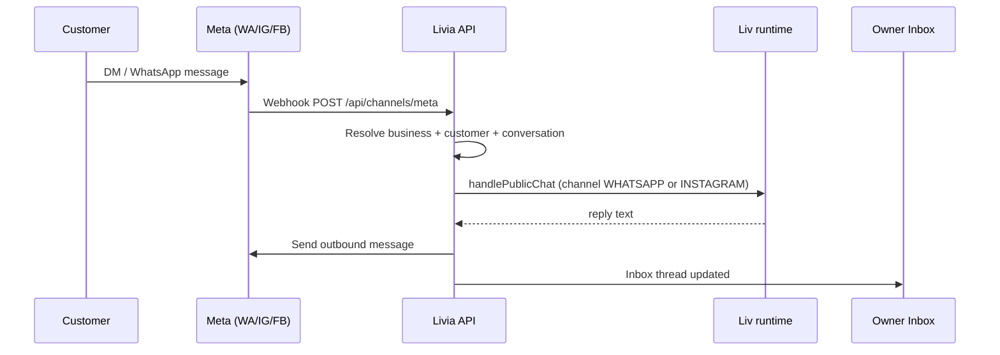

# EU messaging channels — product & engineering spec

**Status:** **v1 ship spec** (2026-05-26) — part of [`OPERATION-SOLIDIFY.md`](./OPERATION-SOLIDIFY.md) Track 1  
**Owner:** product + engineering  
**Implements:** one Liv brain across web, SMS, WhatsApp, Instagram DMs, Messenger; per-jurisdiction packs in `@workspace/policy` (`resolveChannelPack`).  
**Country targets:** [`../business/MARKET-COUNTRY-PLAYBOOKS.md`](../business/MARKET-COUNTRY-PLAYBOOKS.md)  
**v1.5+:** Telegram/Viber live adapters (stubs OK until then).

---

## 1. Why this exists

EU appointment businesses run **5–8 disconnected inboxes**. Livia’s wedge is **Liv on the channels customers already use**, with one **Inbox** and one **client timeline**.

| Channel | EU prevalence | v1 launch |
|---------|---------------|-----------|
| **WhatsApp** | ES, IT, DE, NL, PL, IE youth | **Live** (Meta Cloud API) |
| **Instagram DMs** | Beauty, hair, tattoo | **Live** (Meta Messaging) |
| **SMS** | Universal fallback | **Live** (Twilio) |
| **Web chat** | Booking page | **Live** |
| **Voice** | IE/GB shops | **Live** (Twilio; regulatory for prod number) |
| **Facebook Messenger** | Older EU demographics, some markets | **Live** (same Meta webhook) |
| **Telegram** | DE, Eastern EU, tech-forward | Documented v1.5; stub |
| **Viber** | PL, Balkans, GR | Documented v1.5; stub |
| **Snapchat** | Younger beauty (secondary) | Enum only; v2 |

---

## 2. Owner setup flow (self-serve)

### Act A7 — Channels (onboarding)

1. **Web booking** — always on (`/b/{slug}`).  
2. **SMS** — provision Twilio number (existing).  
3. **WhatsApp** — paste **Phone number ID** from Meta Business Suite (WABA connected to app).  
4. **Instagram** — paste **Facebook Page ID** linked to professional IG account.  
5. **Messenger** — same Page ID (optional checkbox).  
6. Copy **Meta webhook URL** + verify token into Meta Developer Console once per environment.

### Settings → Communications → Social

- Status chips: Connected / Not connected / Simulated (dev).  
- Test inbound (dev): simulate customer message without Meta.  
- Link: Meta Business Help + “Put booking link in bio” for IG.

---

## 3. Customer flows



**Rules**

- First message in thread: AI disclosure prefix (SMS-style for WA; inline for IG).  
- Same `conversationId` resumes thread (open status, channel + external participant id).  
- Bookings attach `sourceConversationId` when created via Liv tools.  
- Human **Take over** pauses Liv replies until **Resume AI**.

---

## 4. Technical contract

| Piece | Location |
|-------|----------|
| Channel pack per jurisdiction | `@workspace/policy` `resolveChannelPack` |
| Business connection JSON | `businesses.messaging_channels` |
| External identity | `channel_identities` table |
| Inbound webhook | `POST /api/channels/meta` |
| Outbound | `sendAiWhatsapp`, `sendAiInstagram`, `sendAiMessenger` |
| Dev simulate | `POST /api/dev/meta/inbound` (non-prod) |
| Entitlements | `whatsapp_inbound`, `whatsapp_outbound` |

### Environment

| Variable | Purpose |
|----------|---------|
| `META_ACCESS_TOKEN` | System user / app token for Graph API send |
| `META_APP_SECRET` | Webhook signature validation |
| `META_WEBHOOK_VERIFY_TOKEN` | GET hub.challenge |
| `META_DEV_SIMULATE` | `true` — allow dev inbound without send |

Per-business JSON (`messaging_channels`):

```json
{
  "whatsapp": { "phoneNumberId": "123", "displayPhone": "+353..." },
  "instagram": { "pageId": "456", "igAccountId": "789" },
  "messenger": { "pageId": "456" }
}
```

---

## 5. Presentation (Inbox + marketing)

- Inbox: channel badge `WHATSAPP` | `INSTAGRAM` | `SMS` | `WEB` | `VOICE`.  
- Customer detail: timeline includes `MESSAGE_RECEIVED` from all channels.  
- Marketing `/how-it-works`: lists live channels when audit green.  
- Public booking: “Message us on WhatsApp” deep link when `displayPhone` set.

---

## 6. Demo & test

- Seed: `luxe-salon-spa` with WA + IG connected + 2 inbox threads.  
- E2E: webhook verify + dev simulate → inbox list contains thread.  
- REAL-WORLD §8: configure Meta or use dev simulate.

---

## 7. What we explicitly do not do in v1

- WhatsApp **template blast** campaigns (Mailchimp replacement).  
- IG **comment** automation (DM only).  
- Telegram/Viber **live** transport (RFC before build).  
- Cross-tenant customer identity (one Liv ID across salons) — v2 with consent.

---

*Canonical anti-silo narrative: [`LIVIA-COMPLETE-SYSTEM-SPEC.md`](./LIVIA-COMPLETE-SYSTEM-SPEC.md) §2.*
