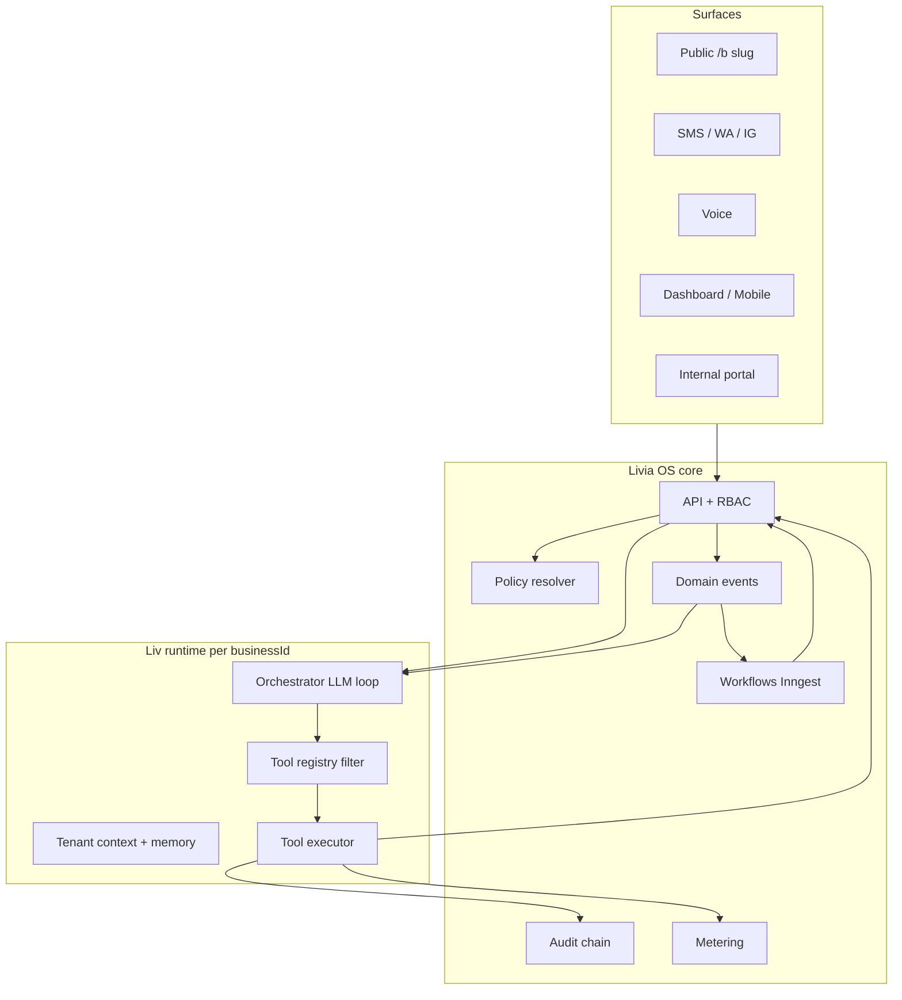

# Liv — operating-system intelligence (not a chatbot)

**Status:** L2 architecture (2026-05-21) — **authoritative** for how Liv must be built.  
**Audience:** product, engineering, ops, design.  
**Companion:** [`LIVIA-COMPLETE-SYSTEM-SPEC.md`](./LIVIA-COMPLETE-SYSTEM-SPEC.md) §1 OS, [`PLATFORM-BUILT-RIGHT.md`](./PLATFORM-BUILT-RIGHT.md), ADR 0012, [`agent-runtime.md`](../engineering/agent-runtime.md), [`BUSINESS-RULES-REGISTRY.md`](./BUSINESS-RULES-REGISTRY.md).

---

## 0. Thesis

**Livia** is an appointment-business **operating system** for **every applicable vertical** in the catalog (hair, spa, physio, dental, fitness, pet, and generic appointment businesses) — one tenant graph (people, time, money, conversations, policy), many surfaces (dashboard, mobile, public book, voice, DMs, internal portal).

**Liv** is the **always-on intelligence layer** of that OS — for **tenant customers (public)**, **tenant staff (all roles)**, and **Livia Inc (internal)** — closer to **JARVIS** than to “an AI feature”:

- She **observes** the same domain events and audit trail as the rest of the system.
- She **acts** only through registered, entitlement-gated **tools** (never ad-hoc SQL or hidden side effects).
- She **reasons** under **resolved policy** (platform + business + vertical + jurisdiction), not hardcoded `if (salon)` branches in application code.
- She **manifests** differently per **actor** (founder, owner, reception, customer), **surface** (inbox, voice, cron briefing), and **mode** (proactive vs reactive).
- She **coordinates** with **workflows** (Inngest), not replaces them — reminders, no-show recovery, billing dunning are deterministic; Liv handles ambiguity and conversation.

**Anti-pattern:** Liv as a single Express route with two tools and a string-built system prompt. That is a **prototype spine**, not the OS.

**Target:** Liv as a **versioned agent platform** inside the monorepo: policy resolver → capability catalog → tool registry → per-tenant runtime → event subscriptions → eval + audit for every tool call.

---

## 1. The “nothing hardcoded” contract

| Layer | Hardcoded today (gap) | Production shape |
|-------|------------------------|------------------|
| **Tools** | `find_slots`, `create_booking` in `lib/liv-runtime/src/tools.ts` | **Tool registry** — DB or config bundle per vertical + plan tier; semver; feature flags |
| **Prompt** | `buildLivSystemPrompt()` inline string | **Prompt templates** versioned per vertical/locale; variables injected from policy + context |
| **Tone / greeting** | `aiTone`, `aiGreeting` fields | **Persona manifest** — voice, boundaries, escalation triggers (data) |
| **Business rules** | Partial `ResolvedBusinessPolicies` + free-text `aiKnowledge` | **Policy graph** — typed rules with effective dates, jurisdiction, enforcement hooks |
| **Who can do what** | RBAC middleware only on HTTP | **Capability tokens** on every tool invocation (role + impersonation + plan) |
| **Reactions** | Some Inngest workflows | **Event → action matrix** — workflow OR Liv tool OR human task, declarative |
| **Memory** | Conversation rows only | **Episodic + entity memory** — customer trust, staff prefs, owner rituals (retention policy) |
| **Internal Liv** | Not built | **Livia Inc tenant** — separate runtime profile, read-only cross-tenant tools with audit |

**Rule for engineers:** No new business behaviour inside `ai-chat.service.ts` as raw strings. Add: policy type → enforcement in service → optional tool → test → registry row.

---

## 2. Architecture — how the ecosystem talks to itself

**Conversation flow (customer):** Channel adapter normalises inbound → identity resolution → conversation row → Liv runtime loads **policy + tools + memory** → tool calls hit same services as HTTP API → outbound message → audit + metering.

**Silent flow (no customer message):** `booking.confirmed` → event dedup → workflow schedules reminder **and** optional Liv briefing line for owner morning digest. Liv did not “decide” to send reminder; workflow did. Liv **may** summarise “3 confirmations overnight” in briefing.

---

## 3. Policy engine — fleshed out (not your list as ceiling)

Policies are **data** with `effectiveFrom`, `jurisdiction`, `verticalPackId`, `scope` (platform | business | location | staff). Liv and workflows **both** call `resolvePolicies(tenantContext)`.

### 3.1 Time & capacity

| Policy | Examples | Enforced by |
|--------|----------|-------------|
| Shop opening hours | Mon–Sat 09:00–18:00 | Slot engine |
| Per-staff availability | Chair renter Tue off | Staff rules |
| Buffers | 15m after colour | Slot engine |
| Turnaround / processing | “Colour needs 20m processing” blocked on calendar | Service metadata |
| Breaks | Lunch 13:00–14:00 blocking | Staff or shop |
| Max advance booking | 90 days | Tool `find_slots` |
| Min notice | 2h for online cancel | Tool `reschedule_booking` |
| Double-booking | Never same staff overlap | Advisory lock |
| Overbooking % | Manager-only 110% chair utilisation | Policy flag |
| Roster / shifts | v1.5 schema — generated week | Workflow + manager UI |
| Time-off approval | PTO blocks slots | `time-off` workflow |
| Holiday closures | Bank holiday IE | Business calendar |

### 3.2 Money

| Policy | Examples | Enforced by |
|--------|----------|-------------|
| Deposit required | 30% colour | Booking create + Stripe |
| Deposit waiver | Trusted client | Customer trust score |
| Full prepay | Medspa consult | Service flag |
| Card on file | No-show protection | Customer instrument |
| Refund ladder | Staff €50 cap; owner unlimited | Tool `request_refund` + approval |
| Cancellation fee | Inside 24h → 50% | Policy + charge |
| No-show fee | Auto-charge if card on file | Workflow + policy |
| Late arrival | Grace 10m; after 15m shorten service | Liv explains; staff confirms |
| Currency / VAT display | IE EUR inc VAT | Jurisdiction pack |
| Payout split | Chair rental % to stylist | v2 ledger |

### 3.3 Customer trust & identity

| Policy | Examples | Enforced by |
|--------|----------|-------------|
| Strike / no-show count | 2 in 12m → deposit always | Customer profile |
| Cancellation outside window | +1 strike | Event handler |
| Trusted / VIP | Skip deposit | Tag + policy |
| Block list | Harassment | No book |
| Identity merge | Same phone on WA + web | `channel-identities` |
| Consent | Marketing SMS opt-in | GDPR fields |
| Minor / guardian | Under 16 booking rules | Vertical pack |
| Cross-tenant identity | **Forbidden** without per-salon consent | Platform rule |

### 3.4 Staff & permissions (who overrides Liv)

| Actor | Typical capabilities |
|-------|---------------------|
| **OWNER** | All tools; policy edit; billing; ownership |
| **ADMIN** | Staff, services, refunds under cap |
| **MANAGER** | Roster, PTO approve, inbox takeover, refunds under cap |
| **RECEPTION** | Book/cancel/reschedule; inbox; no policy edit |
| **STAFF** | Own calendar; own clients; no shop policy |
| **LIV (agent)** | Tool allow-list per plan; cannot exceed role of “invoking context” |
| **FOUNDER (human)** | Cross-shop read; per-shop write only when switched |

**Override ladder:** Liv proposal → human confirm → audit `human.override` → optional eval trace. High-risk tools (`refund`, `delete_customer`, `policy_change`) **require** human confirmation token in v1.

### 3.5 Compliance & vertical

| Pack | Extra rules |
|------|-------------|
| **Hair / barber** | Patch test mention; colour consultation length |
| **Spa / medspa** | Consent form before book; patch test mandatory |
| **Physio** | Session series; insurance ref field |
| **Dental** | Exam vs hygienist routing |
| **Tattoo** | Design approval gate; deposit higher |
| **Fitness** | Class capacity not 1:1 slot |
| **Pet grooming** | Vaccination note; breed size |

Vertical packs ship as **`vertical-pack.yaml`** (policy defaults + tool allow-list + prompt module + seed services), not switches in React.

### 3.6 Communications

| Policy | Examples |
|--------|----------|
| Channel enabled | WA on, voice off until entitlement |
| Quiet hours | No outbound SMS 21:00–08:00 |
| Language | `ga`, `en-IE` per business |
| AI disclosure | First message EU Art. 50 |
| Handoff | `HANDED_OFF` → human must reply within SLA |
| Liv auto-pause | `aiEnabled=false` kill switch |

---

## 4. Tool registry — capability catalog (expansion)

Tools are **small, auditable, composable**. Grouped by domain; each has: `name`, `riskTier`, `requiredEntitlement`, `allowedRoles`, `idempotent`, `compensatingAction`.

### 4.1 Scheduling & bookings

`find_slots`, `create_booking`, `reschedule_booking`, `cancel_booking`, `hold_slot`, `confirm_booking`, `mark_no_show`, `mark_completed`, `waitlist_add`, `waitlist_offer_slot`, `block_calendar`, `suggest_alternate_staff`

### 4.2 Customers

`lookup_customer`, `create_customer`, `merge_customer_identity`, `update_customer_tags`, `get_customer_history`, `apply_strike`, `waive_deposit_requirement`

### 4.3 Money

`quote_price`, `create_payment_link`, `capture_deposit`, `request_refund`, `get_balance_due`, `explain_invoice` (integration)

### 4.4 Staff & roster

`list_staff_on_duty`, `get_staff_availability`, `propose_shift_swap`, `approve_time_off` (manager token)

### 4.5 Comms

`send_message` (channel-aware), `handoff_to_human`, `summarise_thread`, `draft_reply` (human approves)

### 4.6 Owner / founder intelligence

`morning_briefing`, `week_ahead_rollup`, `explain_anomaly` (“why 40% pending?”), `recommend_staffing`, `simulate_promo` (v2)

### 4.7 Compliance

`explain_policy_to_customer`, `generate_cancellation_terms`, `export_audit_slice` (owner)

### 4.8 Internal (Livia Inc only)

`tenant_health_snapshot`, `replay_conversation`, `stripe_subscription_lookup`, `eval_failure_triage`, `suggest_support_reply`, `verify_audit_chain`, `feature_flag_status`

**v1 shipped:** `find_slots`, `create_booking` only. Everything else is **specified backlog** with RFC where schema changes.

---

## 5. Liv for **Livia Inc** (internal JARVIS)

Separate runtime profile: `runtimeProfile=livia_inc`, **no customer-facing outbound**, cross-tenant read tools behind `INTERNAL_OPS_SECRET` + human SSO + immutable audit.

| Function | What Liv does | Value |
|----------|---------------|-------|
| **Support** | Ingest ticket → pull tenant timeline, last 10 bookings, Stripe status, recent eval failures → draft reply | Faster MTTR; consistent tone |
| **Onboarding CS** | “Why is shop X stuck at 50%?” → onboarding state + blockers | Scale manual onboarding |
| **Success** | Weekly scan: low booking volume, AI disabled, comms not connected → ranked outreach list | Revenue retention |
| **Compliance** | DPIA evidence pack; audit chain verify; sub-processor change diff | Sell to EU enterprises |
| **Finance** | Metering vs Stripe MRR reconciliation flags | Billing integrity |
| **Engineering** | Correlate Sentry + `request_id` + audit + eval trace for incident | Postmortems in minutes |
| **Product** | Summarise feature-flag adoption; prompt version A/B results | Ship intelligence safely |
| **Legal** | “List tenants in DE with voice enabled” | Jurisdiction rollout |
| **Sales** | Design-partner health score from usage signals | Pipeline honesty |

Internal Liv **never** auto-writes tenant data without human confirm in v1. It **proposes**; staff **commits** (same override ladder as tenants).

---

## 6. Liv for **tenant users** (by actor)

### 6.1 Customer (public / DM / voice)

**Job:** Book, reschedule, cancel, ask FAQs, feel heard.  
**Proactive:** Reminder T-24h, waitlist offer, “we have a slot Thursday” after no-show recovery.  
**Tools:** Subset of scheduling + money (pay link) + `explain_policy`.  
**Memory:** Preferences (stylist, allergies), channel handles, trust tier.  
**Not Liv’s job:** Clinical diagnosis, legal advice, negotiating price outside policy.

### 6.2 Reception / front desk

**Job:** Inbox air traffic control.  
**Liv:** Drafts replies, suggests slot for walk-in, flags VIP, escalates abuse.  
**Human:** Sends message, overrides Liv, takes HANDED_OFF threads (must have composer).  
**Morning:** “4 unconfirmed, 2 handed off >2h”.

### 6.3 Staff (stylist / therapist)

**Job:** Today’s chair, not shop strategy.  
**Liv:** “Next client patch test due”, break reminder, running late cascade to next client.  
**Tools:** Own calendar only; `suggest_break`.  
**Mobile-first** briefings.

### 6.4 Manager

**Job:** Floor + people + money exceptions.  
**Liv:** Staffing gap tomorrow, PTO queue, refund requests within cap, no-show pattern on stylist.  
**Tools:** Roster, approve PTO, inbox, refunds under cap.

### 6.5 Owner

**Job:** Shop P&L, policy, brand, crises.  
**Liv:** Weekly narrative, deposit capture rate, Liv conversion vs human, policy change impact simulation (v2).  
**Tools:** Policy edit (with confirm), billing, integrations.

### 6.6 Founder (multi-shop)

**Job:** Portfolio, not single chair.  
**Liv:** Cross-shop rollup, weakest shop, comms outage at location B, naming inconsistency warning.  
**Tools:** `week_ahead_rollup`, read-only drill-down; write only after `setBusinessById`.  
**Not:** Duplicate Glance header on Inbox — **context-scoped briefings** only.

---

## 7. Event-driven nervous system (concrete examples)

| Event | Workflow (deterministic) | Liv (ambiguous / narrative) |
|-------|--------------------------|-----------------------------|
| `booking.created` | Confirm email; meter | — |
| `booking.confirmed` | T-24h reminder | Briefing count +1 |
| `booking.cancelled` | Free slot; waitlist ping | Empathy reply if inbound |
| `booking.no_show` | Recovery sequence; strike +1 | Offer rebook script |
| `payment.deposit_failed` | Hold booking PENDING | Explain retry to customer |
| `conversation.handed_off` | SLA timer; notify manager | Stop auto-reply |
| `staff.time_off.approved` | Regenerate slots | “Cover Friday with Lara?” |
| `integration.twilio.down` | Alert owner | Inbox banner |
| `eval.guardrail.failed` | Pause workflow | Internal triage |
| `onboarding.act.completed` | — | Coach next act |
| `peer_insights.opt_in` | Aggregate job | Explain privacy line |

**Dedup:** `publishDomainEvent(..., dedupeKey)` — Liv reactions must be idempotent same as workflows.

---

## 8. Memory model (Rung 5 — ADR 0012)

| Memory type | Contents | TTL / scope |
|-------------|----------|-------------|
| **Session** | Current thread tool state | Conversation |
| **Entity — customer** | Name, prefs, strikes, deposit waiver | Per business |
| **Entity — staff** | Nickname, rituals (“Conor counts till Friday”) | Per business |
| **Entity — business** | Owner goals from onboarding | Per business |
| **Episodic** | “Last time they no-showed we offered 10% off” | Rolling 12m |
| **Procedural** | “Always offer Lara for colour” learned from edits | Suggest-only until owner confirms |

**Forbidden:** Cross-tenant memory without explicit consent at each salon (platform invariant).

---

## 9. Per-vertical Liv behaviour (illustrative, not exhaustive)

| Vertical | Liv emphasises | Unique tools |
|----------|----------------|--------------|
| Hair | Stylist continuity, patch test | `find_slots` with stylist preference |
| Spa | Consent, quieter tone | `send_consent_form` |
| Physio | Series booking, insurance ref | `book_series` |
| Barber | Walk-in + queue | `add_walk_in` |
| Dental | Route hygienist vs dentist | `triage_service` |

Same runtime; **different pack manifest** loaded at tenant boot.

---

## 10. Multi-structure scenarios (Liv must know which hat)

| Scenario | Tenant model | Liv behaviour |
|----------|--------------|---------------|
| Second **location**, same brand | New `business` or `location` entity (RFC) | Clone policies; shared founder rollup |
| Second **legal entity** | New business, new billing | No cross-booking assumptions |
| Chair renter in host shop | Staff row + revenue split flag | DM as stylist identity option |
| Franchisee | Franchisor policy template | Locked fields |
| Shared premises | Two businesses, one address | No customer merge; clear brand in greeting |
| Acquisition | Import customers | Match keys + merge queue |
| Partner salon same WhatsApp | **Danger** — channel routing rules | Explicit shop picker in thread |

Documented further in [`UX-AUDIT-2026-05-21.md`](./UX-AUDIT-2026-05-21.md); implementation = onboarding RFC.

---

## 11. Why bookings show **PENDING** (legitimate states)

| Reason | Who resolves | Liv role |
|--------|--------------|----------|
| Awaiting deposit | Customer pays link | Send link; remind |
| Awaiting staff confirm | Manager | Notify; suggest confirm |
| Policy hold (new client) | Reception | Explain deposit |
| Created by human, not confirmed | Staff | — |
| Slot hold expired soon | System | Warn customer |

UI must show **`pendingReason`** — not a generic yellow badge.

---

## 12. Honest gap: documentation vs code

| L2 spec (this doc + Complete Spec) | L5 code today |
|-----------------------------------|---------------|
| Full policy graph | `ResolvedBusinessPolicies` + partial |
| Tool registry | 2 tools |
| Event reactions for Liv | Mostly workflows only |
| Per-tenant runtime fleet | Single Node process |
| Internal Liv | Internal portal read-only directory |
| Identity merge UI | API only |
| HANDED_OFF reply | Pause only |
| Vertical packs | Seed in onboarding service |
| Memory beyond chat rows | Minimal |

**Documentation was not “complete” for Liv OS v1 implementation** — it was **complete for product intent** (L2). This file closes the **Liv-specific L2** gap. Implementation tracking: [`BUILD-BACKLOG.md`](./BUILD-BACKLOG.md), [`LIV-CAPABILITY-MATRIX.md`](./LIV-CAPABILITY-MATRIX.md).

---

## 13. Phased delivery (platform, not feature tickets)

| Phase | Outcome |
|-------|---------|
| **P0** | Policy resolver used by slots + booking + Liv; `pendingReason`; tool executor audit; no hardcoded new rules in chat service |
| **P1** | Tool registry schema; 8–12 core tools; inbox `send_message`; HANDED_OFF composer; policy editor UI |
| **P2** | Event→Liv reaction matrix; morning briefing; customer trust/strikes; identity merge UI |
| **P3** | Vertical pack loader; voice full IE; roster schema |
| **P4** | Internal Liv profile; cross-tenant read tools; eval-gated prompt versions |
| **P5** | Procedural memory with owner confirm; multi-structure onboarding flows |

---

## 14. Documentation map (keep in sync)

| When you change… | Update… |
|------------------|---------|
| New tool | This doc §4, `LIV-CAPABILITY-MATRIX.md`, OpenAPI if HTTP mirror, `BUSINESS-RULES-REGISTRY.md` |
| New policy type | `lib/policy`, `BUSINESS-RULES-REGISTRY.md`, vertical pack YAML |
| New event | `event-bus` registry, workflow doc, §7 table here |
| New actor permissions | `access-control.md`, ADR 0009 |
| Internal ops | `artifacts/livia-internal/README.md`, ADR internal |

---

## 15. Design principles (review checklist)

1. **Would this be a new `if` in the chat route?** → Stop; add policy + tool.  
2. **Does workflow already do it deterministically?** → Don’t duplicate in Liv.  
3. **Can every tool call be replayed from audit?** → Required.  
4. **Does customer see hard-fail on LLM down?** → Forbidden (ADR 0012).  
5. **Does founder see another shop’s PII without switching tenant?** → Forbidden.  
6. **Is behaviour different per vertical without forking code?** → Pack manifest only.

---

*Liv is the OS speaking. Build the registry, policy, and event fabric first; the model is the last mile.*
