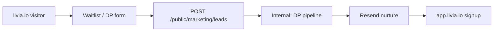
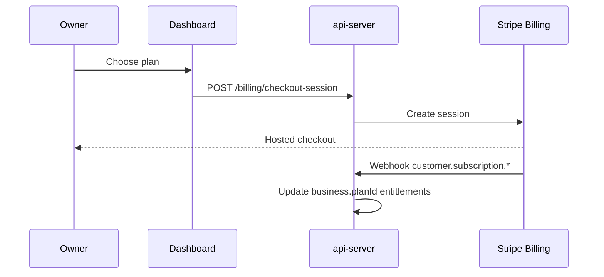
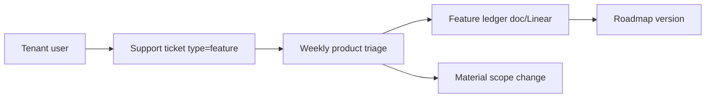

# Livia — Complete System Specification (EU)

**Status:** v1.0 — specification complete for build (2026-05-21)  
**Scope:** **European Union markets only** for product, legal, voice, and GTM until an explicit RFC expands geography.  
**Rule:** Nothing in this document is intentionally vague. Where a capability is **not built yet**, it is labelled **Specified / Not implemented**.

**Document set:**

| Doc | Role |
|-----|------|
| This file | End-to-end system: OS, onboarding, marketing, money, rollbacks, feedback, EU |
| [`LIVIA-GLOBAL-PRODUCT-SYSTEM.md`](./LIVIA-GLOBAL-PRODUCT-SYSTEM.md) | Vertical playbooks, pain, eagle-eye |
| [`LIVIA-EXPERIENCE-DESIGN-BIBLE.md`](./LIVIA-EXPERIENCE-DESIGN-BIBLE.md) | Screens & packs |
| [`LIVIA-FINAL-EXECUTION-PLAN.md`](./LIVIA-FINAL-EXECUTION-PLAN.md) | **Build sequence to get over the line** |

---

## 0. Document contract

### 0.1 What “complete” means here

Every section answers, in full sentences:

- **What** the system does  
- **Who** it serves  
- **When** in the customer lifecycle  
- **How** (flows, systems, responsibilities)  
- **What we do not do** (explicit boundaries)  
- **Implementation status** (Specified | Partial | Implemented)

### 0.2 EU geographic scope (locked for this phase)

| EU jurisdiction pack | Code | Currency | Voice (Liv phone) | Text/chat | Priority |
|----------------------|------|----------|-------------------|-----------|----------|
| Ireland | `IE` | EUR | **v1** en-IE | v1 | P0 launch |
| United Kingdom | `GB` | GBP | v1.5 en-GB | v1 | P0 text |
| Germany | `DE` | EUR | v2 de-DE | v1.5 | P1 |
| France | `FR` | EUR | v2 fr-FR | v1.5 | P1 |
| Spain | `ES` | EUR | v2 | v1.5 | P2 |
| Italy | `IT` | EUR | v2 | v1.5 | P2 |
| Netherlands | `NL` | EUR | v2 | v1.5 | P2 |
| Poland | `PL` | PLN | v2 | v1.5 | P2 |

**Out of scope until RFC:** United States, Japan, Canada, Australia, UAE, etc.  
**EU-wide from day one in architecture:** GDPR, DPA, EU residency option, VAT-aware receipts (locale pack), multi-country holiday calendars.

**Data residency default:** EU region for tenant PII and conversation storage (see `docs/policy/data-residency.md`).

---

## 1. Livia as an Operating System (OS)

### 1.1 Definition (not marketing fluff)

**Livia OS** = the single system of record + action layer for an appointment-based service business, with **Liv** as the always-on operator agent across channels.

| Traditional stack | Livia OS replaces |
|-------------------|-------------------|
| Calendar (Phorest, Booksy, Google Calendar) | **Time inventory** (bookings, slots, staff, rooms) |
| CRM spreadsheet / Phorest clients | **Client memory** (profile, history, prefs, allergies) |
| Phone + voicemail | **Voice** (Liv answers) |
| WhatsApp on owner's phone | **Conversational** (Liv on business number) |
| Instagram DM manual replies | **Conversational** (same brain) |
| Random notes / paper | **Structured notes** + audit |
| Email chaos | **Transactional** (Resend, templated) |
| Owner's head for "how's the week?" | **Briefing + dashboard truth** |
| Refund arguments | **Policy ladder + inbox approvals** |

**Livia is not:** full accounting (Xero), payroll (BrightPay), inventory ERP, clinical EHR, marketing blast tool (Mailchimp), website builder (Squarespace). Those are **integrations or exports**, not core OS.

### 1.2 OS layers (kernel vs apps)

```text
┌─────────────────────────────────────────────────────────────┐
│  Livia Inc (company) — internal portal, billing fleet, legal │
├─────────────────────────────────────────────────────────────┤
│  livia.io (prospect) — learn, pricing, legal, beta signup      │
├─────────────────────────────────────────────────────────────┤
│  World B — Customer (no login)                                 │
│    Public book/chat · SMS · WhatsApp · Voice                 │
├─────────────────────────────────────────────────────────────┤
│  World A — Tenant (Clerk auth)                               │
│    Mobile (flagship) · Dashboard (cockpit) · Optional tablet │
├─────────────────────────────────────────────────────────────┤
│  LIVIA OS KERNEL (invariant)                                 │
│    Tenant · Auth/RBAC · Bookings engine · Clients · Staff      │
│    Services · Slots · Conversations · Audit · Events · Policy│
├─────────────────────────────────────────────────────────────┤
│  PACKS (combinatorics)                                       │
│    vertical · locale · orgShape · personaRitual              │
├─────────────────────────────────────────────────────────────┤
│  LIV (agent runtime)                                         │
│    Tools · Guardrails · Evals · Disclosure · Metering        │
└─────────────────────────────────────────────────────────────┘
```

### 1.3 OS primitives (every vertical uses these)

| Primitive | Meaning |
|-----------|---------|
| **Business** | One shop (tenant) |
| **Client** | End customer (P7) |
| **Staff** | Skilled human who delivers service |
| **Service** | Sellable time product (duration, price) |
| **Booking** | Reserved time (state machine) |
| **Conversation** | Thread with Liv or human |
| **Policy** | Deposits, cancel, refund caps |
| **Audit event** | Immutable record of who did what |

Vertical packs add: patch test (beauty), design proof (tattoo), class capacity (fitness), consent artifacts (medspa).

### 1.4 “Ease pain for everyone” — OS-level promises

| Actor | Pain eased by OS |
|-------|------------------|
| **Owner** | One truth; briefing; less phone; safe refunds |
| **Manager** | Queue; policy; floor visibility |
| **Staff** | My Day; less DM noise |
| **Reception** | One schedule; book without breaking rules |
| **Customer** | 24/7 book; consistent answers; fair policy |
| **Livia Inc** | Tenant health; support runbooks; billing |

---

## 2. Anti-silo: stopping multiple tools

### 2.1 The fragmentation problem

Typical EU salon runs **5–8 disconnected tools**:

1. Booking software (Phorest / Fresha / Booksy)  
2. WhatsApp (personal phone)  
3. Phone / voicemail  
4. Instagram DMs  
5. Excel or Google Sheets (cash, stock)  
6. Stripe or SumUp (card present)  
7. Email (Gmail) for confirmations  
8. Optional: Xero, BrightPay, Mailchimp  

**Muddy water:** no single place knows “Mary asked on Instagram, booked on phone, paid deposit on SumUp, stylist is Sarah.”

### 2.2 Livia consolidation map (explicit)

| Old tool | Livia surface | Migration |
|----------|---------------|-----------|
| Phorest/Fresha calendar | Dashboard + mobile bookings | Broker export + parallel run |
| Personal WhatsApp | Business WhatsApp via Twilio | Number port or new Business number |
| Phone | Liv voice on Twilio number | Forward main line to Liv |
| Instagram “DM to book” | Liv chat link in bio + eventual Meta | Link to `/b/{slug}` |
| Gmail confirmations | Resend transactional | Auto on booking events |
| Excel client list | Clients import | CSV / broker |
| SumUp-only payments | **Stripe Connect** (deposits, tips) | Optional; not forced day 1 |

**What stays outside (by design):**

| Tool | Relationship |
|------|--------------|
| Xero / QuickBooks | Export revenue report (v2); not in-house accounting |
| BrightPay / payroll bureau | **Hours export CSV** (v2.5); not payroll engine |
| Mailchimp campaigns | Liv does lifecycle 1:1; not bulk blast (v2 optional) |
| Google Business Profile | Link only; not managing SEO |

### 2.3 Cutover narrative (onboarding sells this)

**Day 1 value without full migration:** Liv answers phone + books even if calendar still in Phorest for 30 days (parallel run).  
**Day 30:** single calendar truth in Livia; Phorest read-only 90 days.  
**Success metric:** owner stops opening Phorest daily.

### 2.4 Technical enablers of “one brain”

| Enabler | Requirement |
|---------|-------------|
| Single `customerId` across channels | Phone match, email match |
| Conversation → booking link | `sourceConversationId` on booking |
| Channel router | SMS, WhatsApp, voice, web → same Liv session |
| Audit | Cross-channel timeline on client profile |

**Status:** WhatsApp + Instagram + Messenger implemented — see [`CHANNELS-EU-MESSAGING.md`](./CHANNELS-EU-MESSAGING.md). Telegram/Viber v1.5.

---

## 3. Self-onboarding (automated, all verticals, EU)

### 3.1 Principles

| Principle | Implementation |
|-----------|----------------|
| **Self-serve default** | Owner completes without a human call for Solo/Studio |
| **Vertical-aware, not vertical-different wizard** | Same steps; **seed pack** changes services/staff/copy |
| **Time to first value < 60 min** | Liv answers or books within first session |
| **No dead ends** | Every step has recovery + support link |
| **EU jurisdiction first screen** | Sets locale, currency, timezone, legal |

**Concierge overlay (human)** only for: chain (C7+), medspa regulated, design-partner white-glove — not blocking self-serve.

### 3.2 Onboarding acts (screen-level)

| Act | User does | System does | Vertical variance |
|-----|-----------|-------------|-----------------|
| **A0 Sign up** | Clerk account | Create user | None |
| **A1 Create business** | Name, slug, country (EU), vertical, tier | `business` row + jurisdiction pack | Seed catalog from `resolveOnboardingDefaults` |
| **A2 Shop profile** | Address, timezone confirm, phone | Update business | None |
| **A3 Service menu** | Confirm/edit seeded services | CRUD services | Pack pre-fills (hair vs beauty vs tattoo consult) |
| **A4 Team** | Add stylists or skip (solo) | Staff + staff_services | Solo skips |
| **A5 Hours** | Weekly hours template | Availability rules | Same UI |
| **A6 Liv** | Tone, greeting, knowledge, enable AI | `ai*` fields on business | Vertical suggested knowledge snippets |
| **A7 Channels** | Connect SMS (Twilio), optional voice | Provision number workflows | IE voice; GB text-first |
| **A8 Public link** | Copy `/b/{slug}`, test book | Live public page | None |
| **A9 Billing** | Pick plan (Stripe Checkout) | Subscription | Design partner coupon |
| **A10 Invite team** | Email invites manager/staff | Clerk invites + memberships | Role picker |
| **A11 Migration (optional)** | Upload CSV / Phorest export | Import job | Broker |
| **A12 Go live checklist** | 8 ticks | In-app checklist persisted | Same structure all verticals |

**Implementation status:**

| Act | Status |
|-----|--------|
| A1 | **Partial** — `onboarding.tsx` + `seedBusinessFromOnboardingPack` |
| A3–A5 | **Partial** — seed only; no guided wizard |
| A6–A7 | **Partial** — settings, not wizard |
| A9 | **Partial** — billing routes exist |
| A12 | **Specified** — lifecycle checklist started in docs, thin in UI |

### 3.3 Automation requirements (engineering)

| Automation | Spec |
|------------|------|
| Slug availability check | Real-time API |
| Vertical seed on create | **Implemented** in `onboarding.service.ts` |
| Default EU timezone from jurisdiction | **Implemented** in policy |
| Progress % stored on `business.onboardingState` | **Specified** — JSON milestones |
| Email drip if stuck >48h on act | **Specified** — Resend templates |
| In-app Liv coach lines per act | **Specified** — copy pack per vertical |
| Skip logic for solo tier | Hide staff act |
| Chain: add shop without re-onboarding Liv | **Specified** — clone pack |

### 3.4 Onboarding success criteria

- [ ] New EU owner completes A1–A8 without support in < 60 minutes (median).  
- [ ] First booking (test or real) within 24 hours.  
- [ ] First Liv-handled inbound (chat or voice per locale) within 7 days.  
- [ ] Vertical switch only changes **seed + copy**, not route graph.

---

## 4. livia.io — public marketing site (first contact)

### 4.1 Role in the company

`livia.io` is **not** a landing page afterthought. Per **ADR 0004**, `artifacts/livia-marketing` is the **brand bible** — product surfaces rebase to it.

| Function | Must deliver |
|----------|--------------|
| **Explain category** | Operator OS for appointment businesses — Liv as colleague |
| **Build trust** | EU, GDPR, not a chatbot gimmick |
| **Convert** | Beta waitlist / design partner / start trial |
| **Route** | Demo, app signup, legal, status, changelog |
| **Honesty** | Claims ⊆ `marketing-vs-reality.md` |

### 4.2 Required pages (full sitemap)

| Path | Purpose | Content blocks | Status |
|------|---------|----------------|--------|
| `/` | Hero + conversion | Hero, 3 pillars, vertical strip (EU salons), social proof, form | **Partial** (`home.tsx`) |
| `/pricing` | Transparent pricing | Tier table EUR, seat fees, voice outcome share, FAQ | **Specified** — not separate page yet |
| `/how-it-works` | Education | M1–M4 modalities, OS diagram, anti-silo story | **Specified** |
| `/verticals/hair` … | SEO + depth | Per-vertical pain + Liv (EU examples) | **Specified** |
| `/demo` | Try Liv | Link to dashboard demo gateway | **Partial** link only |
| `/about` | Company trust | Founder story, EU anchor, team | **Specified** |
| `/legal/privacy` | GDPR | Published policy | **Specified** external |
| `/legal/tos` | Contract | Published | **Specified** external |
| `/legal/dpa` | B2B | Published | **Specified** external |
| `/legal/customer-rights` | P7 explainer | Link from public footer | **Specified** |
| `/changelog` | Product truth | Fed from release notes API | **Specified** |
| `/status` | Uptime | Statuspage embed | **Specified** |
| `/contact` | Sales | Form → `marketing-leads` API | **Partial** (`MarketingForm`) |

### 4.3 Hero / claims discipline

**Current issue to fix:** hero lists “dental practices” while v1 ledger excludes dental — **violates marketing-vs-reality**.

**Correct EU hero framing (specified):**

> For hair salons, beauty studios, barbers, tattoo artists, and wellness studios across Europe — Liv runs the phones, books the chairs, and remembers every client.

Regulated medical/dental: **“Coming with partners”** footnote, not hero promise.

### 4.4 Conversion flows



| Lead type | Next step |
|-----------|-----------|
| Waitlist | Nurture email → invite wave |
| Design partner | Founder call → concierge onboarding |
| Self-serve trial (later) | Direct Clerk signup → onboarding wizard |

### 4.5 Visual / quality bar (same or higher than product)

| Standard | Rule |
|----------|------|
| Typography | Cormorant hero + Inter body (match dashboard) |
| Motion | Restrained; no gimmick scroll |
| Performance | LCP < 2.5s EU mobile |
| a11y | WCAG 2.1 AA |
| i18n-ready | EN first; strings externalised for FR/DE (v2) |
| SEO | Per-vertical pages, `hreflang` for IE/GB (v1.5) |

**Artifact:** `artifacts/livia-marketing` — extend, do not rebuild brand elsewhere.

---

## 5. Pricing strategy & revenue streams (EU)

### 5.1 Revenue streams (complete list)

| Stream | Who pays | What for | Billing mechanism |
|--------|--------|----------|-------------------|
| **R1 — Platform subscription** | Business (tenant) | Liv OS runtime, audit, mobile, dashboard | Stripe Billing monthly/annual |
| **R2 — Per-seat fees** | Business | Manager, staff, reception seats | Stripe subscription line items |
| **R3 — Voice outcome share** | Business | % on voice-recovered bookings (measurable) | Metered invoice line (4%, cap €5/booking) |
| **R4 — Concierge migration** | Business (optional) | Phorest/Fresha import help | One-time invoice (€500–€2,500) |
| **R5 — Add-ons** | Business | Peer insights, extra locale voice | Stripe add-on price |
| **R6 — Design partner discount** | Business | 50% yr1 coupon | Stripe coupon |
| **R7 — Stripe Connect fees** | **Not Livia revenue** | Card processing pass-through | Stripe charges merchant; optional platform fee disclosed later |

**We do not take:** marketplace commission on bookings (not Treatwell).  
**We do not require:** Connect for subscription to Livia (only for shop deposits if enabled).

### 5.2 EU price presentation

- List prices in **EUR** with VAT note “ex VAT where applicable” per country.  
- UK site/show **GBP** equivalent for GB prospects.  
- In-app billing shows local currency from `business.currency`.

### 5.3 Tiers (unchanged economics, EU-facing)

See [`docs/business/pricing-and-packaging.md`](../business/pricing-and-packaging.md) for worked examples (Conor, Roisín, chain).

| Tier | EUR/mo base | Target config |
|------|-------------|---------------|
| Solo | €79 | C1–C2 |
| Studio | €149 | C4–C6 |
| Chain | €249/shop | C7+ |
| Host | €99 + €19/renter | C10 |

### 5.4 Trial policy (EU)

| Cohort | Trial |
|--------|-------|
| Design partners (first 100) | 12 mo @ 50% + free migration |
| 101–500 | 30 days free |
| PLG (500+) | 14 days self-serve |

---

## 6. Payments processing (full flows)

### 6.1 Two money rails (never conflate)

| Rail | Stripe product | Direction | Purpose |
|------|----------------|-----------|---------|
| **Livia subscription** | Stripe Billing | Business → Livia Inc | Pay for OS |
| **Shop money** | Stripe Connect | Customer → Business (via Livia) | Deposits, tips, optional full pay |

### 6.2 Subscription flow (business pays Livia)



| Event | System action |
|-------|---------------|
| `checkout.session.completed` | Attach `stripeCustomerId`, plan |
| `invoice.paid` | Mark active |
| `invoice.payment_failed` | Grace period → restrict voice (policy) |
| `customer.subscription.deleted` | Downgrade entitlements; data retained per DPA |

**Idempotency:** webhooks keyed by Stripe event id.  
**Status:** **Partial** — `billing-webhooks.ts`, `billing.service.ts`.

### 6.3 Connect flow (customer pays shop)

| Step | Spec |
|------|------|
| Owner starts Connect onboarding | Stripe Connect Express or Standard link |
| `charges_enabled` | Allow deposit collection on book |
| PaymentIntent on book | Optional deposit % from policy |
| Refund | Through Connect; tied to refund ladder |

**Entitlement:** deposits feature gated by plan + Connect status.  
**Status:** **Partial** — hooks in billing service; not full owner UX.

### 6.4 What Livia does not process

- Payroll wages  
- B2B invoices between companies (except Livia’s own invoice)  
- Cash register (POS) — future integration optional  

---

## 7. Payroll & people — OS boundary + ecosystem handoff

**Canonical for integrations:** this section. Proposal detail: [`../rfcs/0012-hours-to-payroll-export.md`](../rfcs/0012-hours-to-payroll-export.md).

### 7.1 Can Livia run payroll?

**No — not as in-house payroll.** EU payroll requires jurisdiction-specific tax, social insurance, payslip law, and filing deadlines. That is **BrightPay, Sage, Xero Payroll, DATEV** territory.

**Livia is the system of record for work done** (bookings, rota, time-off, chair rent, tips/deposits Livia touched). Partners remain the system of record for **wages owed and filed**.

### 7.2 Operational HR (in scope — deepen)

| Headache removed | Livia surface | Liv role |
|------------------|---------------|----------|
| Who works here | Staff, invites, roles | Onboarding checklist |
| Who is on when | Rota + availability | Coverage on time-off |
| Someone is off | Time-off workflow | Route + customer rebook |
| Team growth | Staff → Invite (Clerk) | Not a job board — see `docs/business/templates/team-on-livia.md` |
| Floor disputes | Audit + refund ladder | Never silent money move |

**Not in scope:** employment law advice, disciplinary automation, pension enrolment engine.

### 7.3 Payroll & HR handoff (integration roadmap)

| Layer | Phase | What ships | Owner win |
|-------|-------|------------|-----------|
| **Truth** | Now | Shifts + completed bookings + time-off + Connect $ events | One calendar brain |
| **Prep** | v2.5 | Payroll-ready export + pre-flight (“3 shifts unapproved”) | Clean file for accountant |
| **Connect** | v3 | BrightPay (IE) + one UK provider: staff map, push period, read payslip status | No re-type PPSN |
| **Assist** | v3 | Liv pay-run briefing on Today | Fix before Friday panic |

| Partner class | Relationship | Examples |
|---------------|--------------|----------|
| Payroll calc + file | Push hours, pull status | BrightPay, Sage |
| Accounting | Revenue export | Xero |
| Contracts / hire | Hire packet export | DocuSign, bureau |
| HRIS (later) | Staff sync | When enterprise needs it |

**Messaging:** “Livia tracks the work; your payroll tool pays the people.”

### 7.4 Entitlements

- `payroll_export` — Studio+ (RFC 0012).
- HR hire packet — Chain / multi-site tiers when connector ships.

---

## 8. Rollback & reversible workflows

### 8.1 Philosophy

| Class | Who approves | Examples |
|-------|--------------|----------|
| **Auto-rollback** | Liv only | Wrong SMS text; Liv double-book (race) |
| **Human-approved** | Manager/Owner | Cancel booking; refund; release deposit |
| **Human-only** | Staff cannot undo Owner policy | Refund above cap |

Documented: [`docs/workflows/liv-was-wrong.md`](../workflows/liv-was-wrong.md).

### 8.2 Reversible domain actions

| Action | Reversible? | How |
|--------|-------------|-----|
| Booking create | Yes | Cancel → status CANCELLED |
| Booking reschedule | Yes | Audit trail; notify customer |
| Booking confirm | Partial | Cancel with policy |
| Deposit charge | Partial | Stripe refund; may fail → escalate |
| Refund issued | **No silent undo** | New compensating refund only with approval |
| Client merge duplicate | Human-approved | Audit |
| Staff deactivate | Yes | Reactivate |
| Service deactivate | Yes | Hide from book; keep history |
| Liv message sent | **Cannot unsend** | Send correction message |
| Settings change | Yes | Audit + revert fields |
| Ownership transfer (G8) | **Irreversible** | Dual-sign; audit |

### 8.3 “Liv was wrong” product surfaces

| Surface | Actor |
|---------|-------|
| Inbox flag | Manager |
| Booking detail “Report Liv error” | Owner |
| Audit log link | All roles |
| Internal eval | Livia Inc |

**Auto-rollback engine:** eval failure → trigger `liv-was-wrong` workflow.  
**Status:** Workflow doc **Specified**; UI **Partial**.

### 8.4 Booking state machine (rollback paths)

| From | To | Allowed roles |
|------|-----|---------------|
| PENDING | CONFIRMED | system/Liv/manager |
| CONFIRMED | CANCELLED | manager/owner/Liv policy |
| CONFIRMED | NO_SHOW | manager/system |
| * | COMPLETED | staff/system |

Invalid transitions return 409; no silent fix.

---

## 9. Reporting issues & feature requests

### 9.1 External channels (tenant users)

| Channel | Use | SLA target |
|---------|-----|------------|
| **In-app “Help”** | Bug, confusion, billing | Auto-ticket |
| **In-app “Suggest a feature”** | Product ideas | Product backlog |
| **Email support@livia.io** | Escalation | 1 business day EU |
| **Status page** | Outages | Real-time |
| **Public chat widget** | No — not on marketing |

### 9.2 In-app report flow (specified UI)

| Field | Required |
|-------|----------|
| Category | Bug / Billing / Liv misbehaviour / Feature idea / Other |
| Severity | Blocking / Annoying / Nice-to-have |
| Context auto-attach | businessId, userId, route, app version, recent bookingId optional |
| Screenshot optional | Upload |
| Consent | “May access logs to reproduce” |

**API:** `POST /support/tickets` → store + forward to internal portal + Slack/email on-call.  
**Status:** **Specified** — **Not implemented**.

### 9.3 Feature requests (internal handling)



| Outcome | Action |
|---------|--------|
| Duplicate | Link + merge |
| Quick win | Backlog |
| Vertical-specific | Tag `vertical:hair` |
| Material | RFC + `marketing-vs-reality` |
| Declined | Reply with reason (OS boundary) |

**Transparency:** design partners see roadmap influence channel (private).

### 9.4 Internal (Livia Inc) handling

| Role | Responsibility |
|------|----------------|
| **Support L1** | Triage tickets; known issues |
| **Support L2** | Reproduce; impersonate (policy) |
| **Product** | Feature ledger priority |
| **Engineering** | Bug fix; eval updates for Liv |
| **Founder** | Escalations; policy exceptions |

**Tooling:** internal portal module `Support` (see §10).

---

## 10. Livia Inc internal environment (EU fleet)

Extends [`docs/company/livia-internal-portal-spec.md`](../company/livia-internal-portal-spec.md).

### 10.1 Modules (breadth × depth × width)

| Module | Depth | Roles |
|--------|-------|-------|
| Tenant directory | Fleet → tenant → user | All |
| Support tickets | Ticket → events → replay | L1, L2 |
| Liv traces | Conversation → tool calls → eval | L2, eng |
| Billing | MRR, past due, Connect | Finance, founder |
| Incidents | SEV timeline | Eng, founder |
| Feature flags | Global % + tenant | Eng |
| Marketing truth | Claim vs reality rows | Product, founder |
| Onboarding funnel | Act completion rates | Success |
| Migrations | Import job status | L2 |
| Legal/DSR | Export/delete queue | Legal |

### 10.2 EU-specific internal ops

| Task | Process |
|------|---------|
| GDPR DSR | 30-day SLA; portal queue |
| IE voice regulatory | Twilio IE bundle tracking |
| UK ICO complaints | Legal playbook |
| VAT invoices | Stripe Tax or manual |

---

## 11. Implementation status summary

| Area | Spec completeness | Code completeness |
|------|-------------------|-------------------|
| EU locale packs | **Complete in this doc** | **Partial** (IE, GB in onboarding) |
| OS definition | **Complete** | **Partial** kernel |
| Anti-silo | **Complete** | **Partial** channels |
| Self-onboarding | **Complete** | **Partial** (seed only) |
| livia.io | **Complete sitemap** | **Partial** (home + form) |
| Pricing | **Complete** (existing doc) | **Partial** Stripe |
| Payments | **Complete flows** | **Partial** |
| Payroll | **Boundary clear** | **Not started** (export) |
| Rollbacks | **Complete** (workflow doc) | **Partial** UI |
| Feedback | **Complete** | **Not implemented** |
| Internal portal | **Complete modules** | **Partial** shell |

---

## 12. What “perfection” requires next

Documentation is **complete at specification level** for EU complete system. **Not complete at implementation.**

See **[`LIVIA-FINAL-EXECUTION-PLAN.md`](./LIVIA-FINAL-EXECUTION-PLAN.md)** for the ordered build to get over the line.

---

*End of Complete System Specification.*
