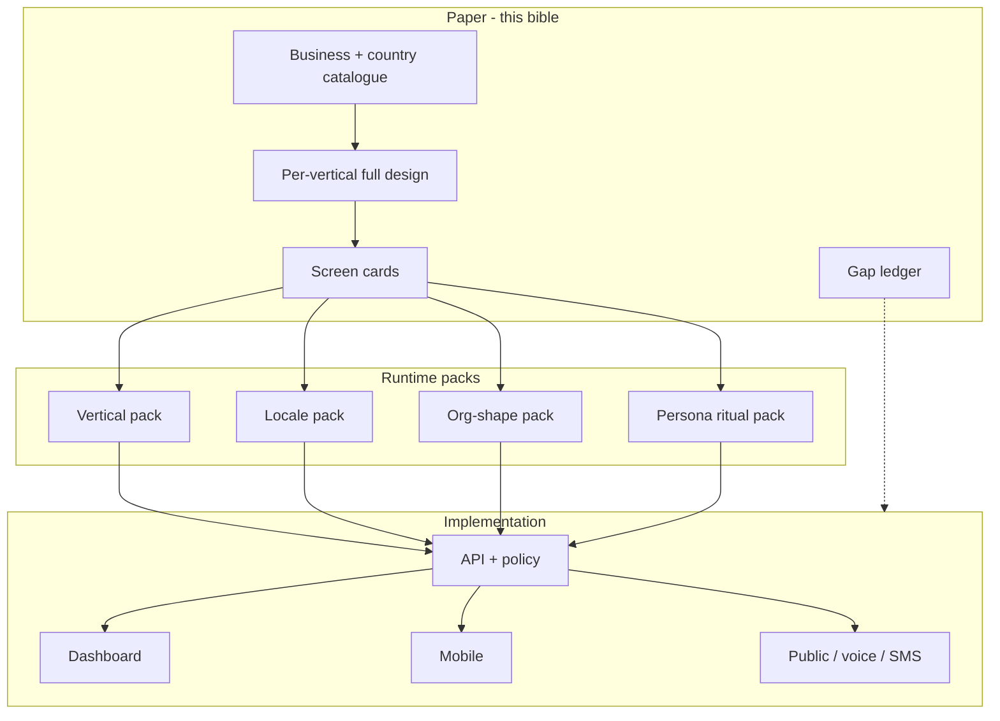

# Livia Experience Design Bible

**Status:** v1.0 — paper-first (2026-05-21)  
**Owner:** founder + product  
**Purpose:** Answer *“If we designed Livia only for this business, for this person — what would every screen do, and how does one product still feel bespoke?”*  
**Global strategy, pain, eagle-eye, internal ops:** [`LIVIA-GLOBAL-PRODUCT-SYSTEM.md`](./LIVIA-GLOBAL-PRODUCT-SYSTEM.md) — **read first** for company/product thinking; this bible is **screens + packs**. Locale (IE, UK, US, …) is a **pack**, not the product boundary.  
**This replaces:** light scaffolding, sprint checklists without screen depth, and “we’ll figure UX in code.”  
**Build rule:** No net-new customer-facing surface ships without a **Screen Card** row in [Part VI](#part-vi--screen-card-catalog-v1-wedge) marked at least **Designed**.

**Related canon (do not duplicate — cross-link):**

| Doc | Role |
|-----|------|
| [`docs/verticals.md`](../verticals.md) | 11 verticals, regulatory weight, vocabulary |
| [`docs/personas.md`](../personas.md) | P1–P7 depth, hotel principle |
| [`persona-vertical-configuration-matrix.md`](../persona-vertical-configuration-matrix.md) | ~70 populated cells |
| [`modality-and-locale-overview.md`](../modality-and-locale-overview.md) | M1–M4, locale gates |
| [`LIVIA-GLOBAL-PRODUCT-SYSTEM.md`](./LIVIA-GLOBAL-PRODUCT-SYSTEM.md) | **Global** vertical playbooks, pain, Liv role, internal ops |
| [`roadmap/v1-scope.md`](../roadmap/v1-scope.md) | **First ship** contract (narrow market proof — not product definition) |
| [`PERSONA-UX.md`](./PERSONA-UX.md) | Ritual homes (implementation pointers) |
| [`LIVIA-IDEA-TO-REALITY.md`](./LIVIA-IDEA-TO-REALITY.md) | Tracks A–J, Platform-Ready |

---

## Part 0 — How to read this document

You asked for thinking done *for you*, not repeated prompts. This bible is structured in **three layers**:

1. **Catalogue** — every business and country Livia *welcomes* (and explicitly rejects).  
2. **Bespoke design** — for each welcomed segment, “Livia as if built only for them” (screens, access paths, Liv’s job).  
3. **Unification** — how one codebase + one brand still *renders* as bespoke via **packs** (vertical, locale, org shape, persona ritual).

**End state you described (acceptance for “design done”):**

> Log in as founder / owner / manager / staff / reception across **different demo businesses** (hair IE, beauty IE, tattoo IE preview, UK hair text-only) and **see** different homes, vocabulary, defaults, and Liv lines — not the same app with a label swap.

That end state is **specified here**; it is **not fully built** (see [Part IX](#part-ix--honest-gap-paper-vs-repo-today)).

---

## Part I — Design philosophy

### I.1 One product, many “buildings”

**Hotel principle** (from `personas.md`): same building, different keys. A tattoo studio and a hair salon are not “the same CRUD with different icons.” They differ in:

| Dimension | Example: Hair salon | Example: Tattoo studio | Example: Physio clinic |
|-----------|---------------------|------------------------|-------------------------|
| **Unit of service** | 45–90 min cut/colour | 2–8 hr session blocks | 30 min slots, treatment plans |
| **Money before service** | Light deposit | 50%+ binds design | Insurance / pay-at-desk |
| **Consultation** | Colour chat, patch test | Design proof + age gate | Clinical intake, GP letter |
| **After visit** | Rebook 6–8 weeks | Healing check-ins | Plan adherence, recall |
| **Vocabulary** | client, stylist, chair | client, artist, station | patient, practitioner, room |
| **Regulatory** | GDPR, light | Health authority, age | CORU, clinical records |
| **Liv’s tone** | Warm, fast rebook | Serious, deposit clarity | Clinical, never diagnoses |

Livia must **feel** individually designed per row while sharing: tenant kernel, bookings engine, audit, auth, Liv runtime.

### I.2 Questions every screen must pass (non-negotiable)

Before marking a screen **Designed**, answer in writing:

1. **Purpose** — What job is this screen hired to do in one sentence?  
2. **Scenario** — Describe a real Tuesday; who is standing where; what just happened?  
3. **Must-do** — List every action the user must complete *on this screen* (not “somewhere in the app”).  
4. **Liv** — What does Liv do here proactively vs only when asked?  
5. **Differentiation** — What changes for vertical / country / persona (copy, fields, layout, nav)?  
6. **Backend** — What data, rules, and entitlements must exist so the UI is not lying?  
7. **Done** — Observable acceptance criteria (demo script line).  
8. **Gap** — What is thin or missing in the repo *today*?

If any answer is “TBD”, the screen is **Scaffolded**, not **Designed**.

### I.3 Paper → packs → code (build order)



**Rule:** Code may *prototype* ahead of paper only in `dev` routes; **Gate 3** surfaces require **Designed** screen cards.

---

## Part II — Who Livia welcomes (business × country)

### II.1 Business catalogue (all 11 verticals)

| ID | Vertical | Livia welcome? | Ship phase | Bespoke design depth in this bible |
|----|----------|----------------|------------|-------------------------------------|
| V1 | Hair | **Yes — heartland** | v1 | **Full** — Part III-A |
| V2 | Beauty | **Yes — heartland** | v1 public scope says Hair-only ledger; product intent includes Beauty at Gate 3 marketing | **Full** — Part III-B |
| V3 | Wellness | Yes | v2 | Summary + key deltas |
| V4 | Body art (tattoo/piercing/PMU) | Yes | v2 | **Full preview** — Part III-C |
| V5 | Fitness | Yes | v2 | Summary |
| V6 | Skin / Medspa | Yes, regulated | v3 + counsel | **Boundary doc** — Part III-D |
| V7 | Allied health | Yes, lite | v3 lite | **Boundary doc** — Part III-E |
| V8 | Dental | Partner-only | never direct | Explicit no |
| V9 | Mental health | Partner-only | never direct | Explicit no |
| V10 | Pet grooming | Yes, adjacent | v3 | Summary |
| V11 | Solo pros (tutors, etc.) | **No** | defer | Explicit no — dilutes salon craft |

**v1 legal ledger** (`v1-scope.md`) says **Hair only** for commitment; **this bible designs Beauty and tattoo anyway** so engineering does not paint itself into a generic corner. Marketing and ledger must stay aligned via RFC before promising Beauty at launch.

### II.2 Country / locale catalogue

| Locale pack | Code | Phase | Voice | Currency / tax | Comms regulatory | What visibly changes in product |
|-------------|------|-------|-------|----------------|------------------|--------------------------------|
| **Ireland** | `en-IE` | v1 wedge | Liv answers phone (en-IE) | EUR, VAT 23% display | Twilio IE, GDPR, DPC | Default; €; Tuesday–Saturday salon week; bank holidays IE |
| **United Kingdom** | `en-GB` | v1 text / v2 voice | Text first; voice v2 | GBP | UK GDPR, ICO | £; UK postcode; GOV.UK holiday calendar; “colour” spelling |
| **Germany** | `de-DE` | v3 | New voice corpus | EUR | TTDSG, strict templates | Formal Sie default; Impressum footer; date format |
| **France** | `fr-FR` | v3 | New voice corpus | EUR | CNIL | Formal vous; 24h labour rules preview |
| **US** | `en-US` | v3+ | Separate corpus | USD | TCPA, state-by-state | 12h time; tipping culture; not v1 |

**Country is not a skin:** it changes **holiday calendars**, **invoice fields**, **SMS sender regulations**, **voice character**, **deposit receipt wording**, and **Liv disclosure scripts**.

### II.3 Populated cells (who actually logs in)

Not every theoretical cell gets UI. **~70 populated cells** in `persona-vertical-configuration-matrix.md`. v1-critical cells:

- Hair × P2b solo barbershop × en-IE  
- Hair × P2a/P3 salon with manager × en-IE  
- Hair × P1 founder 2–5 shops × en-IE  
- Beauty × same shapes (design parity target)  
- P7 customer on public booking (no login)

---

## Part III — “Livia only for X” (full vertical designs)

Each subsection is written as if Livia were a **standalone product** for that vertical; Part VIII explains merge.

---

### III-A — Livia for a hair salon (Ireland) — reference design

**Business reality:** Time is sold per chair/stylist; relationship business; colour formulas matter; no-shows hurt; phone rings during cuts; Phorest-shaped expectations.

#### How Liv helps (not generic)

| Job | Liv behaviour |
|-----|----------------|
| Missed calls while cutting | Answers en-IE; books or messages back |
| Colour grow-out | Detects drift; offers rebook with last stylist |
| Saturday chaos | Reception/home shows floor density; waitlist backfill |
| Owner not on floor | Morning briefing: revenue, refunds queue, weak slots |
| Apprentice learning | Junior sees only their clients; cannot change prices |

#### Vocabulary pack (`hair.en-IE`)

| Generic | Hair IE |
|---------|---------|
| Customer | **Client** |
| Staff | **Stylist** / **Barber** |
| Service | **Service** (Cut, Colour, Blow-dry) |
| Booking | **Appointment** |
| Business | **Salon** / **Barbershop** |

#### Access map (how you reach every screen)

**Web dashboard (owner/manager/reception desktop)**

| Nav order | Owner | Manager | Reception | Staff (impersonation) |
|-----------|-------|---------|-----------|------------------------|
| 1 | Dashboard | Inbox | Bookings | My Day (via switcher) |
| 2 | Inbox | Bookings | Inbox | — |
| 3 | Bookings | My Day | Clients | — |
| 4 | Clients | Clients | — | — |
| 5 | Team | Team | Team (read) | — |
| 6 | Services | — | — | — |
| 7 | Settings | Settings (limited) | Settings (comms) | — |
| 8 | Lifecycle / Shops (founder) | — | — | — |

**Mobile (flagship)**

| Tab / route | Owner | Manager | Staff | Reception |
|-------------|-------|---------|-------|-----------|
| Home | Today summary | Inbox | **My Day** | **Bookings** |
| Bookings | ✓ | ✓ | Own only | All floor |
| Clients | ✓ | ✓ | Served only | ✓ |
| Inbox | ✓ | ✓ | — | ✓ |
| More → Team, Services, Settings | ✓ | partial | — | partial |

**Public (P7)** — `livia.io/b/{slug}`: book + chat; Liv voice on phone number.

#### Screen purposes (hair IE — critical path)

Detailed cards live in Part VI; narrative here:

| Screen | Purpose | Tuesday scenario |
|--------|---------|------------------|
| **My Day** (staff mobile) | Run the chair | Conor between clients; needs next name, formula notes, quick rebook |
| **Bookings** (reception) | Run the floor | Síobhan sees 4 stylists’ columns; walk-in at 2:30 |
| **Inbox** (manager) | Clear Liv’s queue | Niamh approves €60 refund; edits Liv mistake |
| **Dashboard** (owner) | Know if week is healthy | Roisín sees revenue vs plan, 1 weak Sunday slot |
| **Client profile** | Remember the person | Colour history, allergies, preferred stylist |
| **New booking wizard** | Book without error | Pick client → colour service → colourist who does balayage → slot |
| **Team → stylist** | Roster truth | Assign services (balayage), hours, time off |
| **Settings → Liv** | Train the receptionist | Tone, knowledge (“no bleach after 5pm”), SMS number |
| **Public book** | Client self-serve | Regular texts WhatsApp; books Thursday with Sarah |

#### Hair-specific fields & flows (backend + frontend)

| Feature | UI | API / policy |
|---------|-----|------------|
| Colour formula notes | Client profile section | `customers.notes` + future `formula` JSON |
| Patch test due | Banner on book if allergy | vertical rule `hair.patch_test` |
| Stylist–service matrix | Booking wizard filters staff | `staff_services` (built) |
| Deposit for colour | Checkout / SMS | `policies.deposit` per service category |
| Drift recovery | Liv passive + inbox card | workflows/no-show, drift |

#### Visual differentiation (hair)

- Ritual header: “The chair” / “The floor”  
- Accent: cyan owner, green staff (see `PERSONA_ACCENT`)  
- Empty states mention **Liv** catching missed calls  
- Illustration tone: warm salon, not clinical  

---

### III-B — Livia for a beauty salon (Ireland)

**How it differs from hair** (same app, different pack):

| Dimension | Beauty IE |
|-----------|-----------|
| Services | Lash fill, brow sculpt, gel nails — **cycle-based** rebook (3–4 wk) |
| Consultation | Allergy / patch test **required** for lash first visit |
| Deposits | Higher % standard (25–50%) |
| Staff title | **Tech** / **Artist**, not stylist |
| Home emphasis | Owner still dashboard; **tech** mobile = My Day with **service prep** time |
| Liv tone | Slightly more detail on **aftercare** (lash retention) |

**Screens that change vs hair**

| Screen | Beauty delta |
|--------|----------------|
| Service catalog | Duration bands 30–180; **consumable** cost optional |
| Client profile | **Allergy** flag prominent; patch test date |
| Public booking | Mandatory patch-test acknowledgement for lash category |
| Settings → Liv | Knowledge: “no infills before 48h after full set” |

**Screens that stay structurally identical**

Bookings list, inbox, team roster, comms, billing — same routes; **copy + validation rules** change via `verticalPackId`.

---

### III-C — Livia for a tattoo studio (Ireland) — v2 preview design

**Business reality:** Long sessions; **design approval** before deposit; age verification; healing comms; artist–client relationship over years.

#### How Liv helps

| Job | Liv behaviour |
|-----|----------------|
| “How much for a sleeve?” | Qualifies size/placement; books **consult** not 6hr slot |
| Deposit disputes | Explains deposit binds approved design |
| Healing week 2 | Check-in SMS; escalate redness to artist |
| Artist calendar | Day blocks, not 30-min-only grid |

#### Vocabulary (`tattoo.en-IE`)

Client, **Artist**, **Station**, **Session**, **Consult**, **Design proof**

#### Screens that **do not exist** in hair (must be designed for v2)

| Screen | Purpose | Must-do on screen |
|--------|---------|-------------------|
| **Design proof** | Legal + creative sign-off | Upload sketch; client approves; timestamp |
| **Consult vs session** booking types | Prevent wrong slot length | Service archetype drives slot picker (30m consult vs 4h block) |
| **Age gate** (public + voice) | Compliance | DOB / 18+ attestation stored |
| **Healing timeline** | Aftercare | Day 1–14 automated messages; artist override |
| **Deposit policy** | Money | 50% rule tied to proof approval state |

#### Access differences

- Owner home emphasizes **pipeline**: consults → approved → upcoming sessions  
- Artist mobile: **My Day** shows **one** big session + prep checklist, not 12×30min slots  

#### Unified architecture note

Tattoo does **not** get a separate app; it gets `verticalPack: tattoo` enabling routes `/design-proofs`, extra booking states, and public flow steps.

---

### III-D — Livia for medspa / aesthetics (boundary)

**Welcome:** Yes, but **v3 with medico-legal partnership** — not “salon plus extra fields.”

| Hair/beauty | Medspa |
|-------------|--------|
| Client | **Patient** (wording opt-in per counsel) |
| Consent | Marketing opt-in | **Informed consent** artifact per treatment |
| Photos | Portfolio optional | **Before/after** clinical retention rules |
| Liv | Books, FAQs | **Never** diagnoses; never recommends treatment |
| Records | CRM notes | **Not** a full EHR — partner integration |

**Screens we refuse to thin-build:** treatment dosing logs, prescription paths, HIQA inspection mode — **partner or never**.

---

### III-E — Livia for allied health / doc-adjacent (boundary)

**Welcome:** Lite v3 — **Cliniko-shaped** scheduling + correspondence, not clinical records.

| Capability | In | Out |
|------------|----|----|
| Recurring plan appointments | ✓ | |
| GP referral PDF attach | ✓ | |
| Progress notes clinical coding | | ✗ |
| Insurance claim submission | | ✗ |

---

## Part IV — Persona × vertical matrix (what changes when you log in)

| Persona | Hair IE: first screen | Tattoo IE: first screen | Beauty IE: first screen | Founder multi-shop |
|---------|----------------------|-------------------------|-------------------------|-------------------|
| **Owner** | Dashboard — week health | Pipeline board | Dashboard — cycle fill rate | **Shops** — 3 numbers |
| **Manager** | Inbox | Inbox + proof queue | Inbox | Per-shop inbox drill |
| **Staff** | My Day — chair | My Day — session block | My Day — station | N/A (per shop context) |
| **Reception** | Bookings floor | Bookings + consult queue | Bookings | Per-shop bookings |
| **Customer** | Public book | Public consult request | Public book | — |

**Visual differences you should see in demo** (target, not all built):

| Switch | Expected visual / copy change |
|--------|----------------------------|
| Hair → Beauty business | “Client” stays; services show lash/brow; allergy banners |
| Hair → Tattoo business | “Artist”, session lengths, design proof nav item |
| Owner → Staff persona | Nav collapses to My Day; data scoped |
| IE → UK business | £, UK holidays, “colour”, no voice badge if voice not enabled |
| Solo → Chain founder | Shops tab, cross-shop KPI strip |

---

## Part V — Country packs (what “serving a country” means)

### V.1 Ireland (`en-IE`) — v1

| Layer | Specification |
|-------|----------------|
| **Voice** | Liv answers; disclosure script IE consumer law |
| **Dates** | DD/MM/YYYY; Monday–Sunday week; IE public holidays in slot engine |
| **Money** | EUR; VAT line on receipts optional v1.5 |
| **Phone** | +353 format; missed-call SMS follow-up |
| **Legal links** | livia.io/legal/* + DPA |
| **Liv idiom** | Irish-English friendly, not US hype |

### V.2 United Kingdom (`en-GB`) — text v1, voice v2

| Delta vs IE |
|-------------|
| GBP, £ formatting |
| UK bank holidays |
| ICO-flavoured privacy copy |
| Voice: **off** until en-GB corpus + Ofcom/Twilio UK ready |
| Spelling pack: colour, organise |

### V.3 EU expansion (DE/FR) — preview only

Requires: translated UI, formal register option, locale-specific WhatsApp templates, local holiday calendars, **separate eval suites** per voice locale.

**Do not** ship a language toggle without a **locale pack** — half-translated UI is worse than English-only.

---

## Part VI — Screen card catalog (v1 wedge)

**Status legend:** `Designed` | `Scaffolded` | `Missing`  
**Repo status:** May 2026 audit (post S2–S4)

### Template (apply to every new screen)

```yaml
id: screen.booking.new
vertical: [hair, beauty]
persona: [owner, manager, reception]
modality: web
purpose: ""
scenario: ""
must_do: []
liv: ""
differentiation: { vertical: {}, locale: {}, persona: {} }
api: []
acceptance: []
repo_status: Scaffolded
gaps: []
```

### Web dashboard

| ID | Screen | Purpose | Real-life scenario | Must-do on screen | Repo status | Gaps |
|----|--------|---------|-------------------|-------------------|-------------|------|
| W01 | **Dashboard** | Owner week health | Roisín Tuesday 10:00 checks week | See revenue, approvals, weak slots, Liv briefing | Scaffolded | No flight-plan strip; weak KPI depth |
| W02 | **Inbox** | Clear Liv queue | Niamh refunds | Thread list, take-over, approve/deny | Partial | Persona copy; escalation types thin |
| W03 | **Bookings list** | Operate calendar | Floor view | Filter staff/date; open detail | Partial | Not true multi-staff day view |
| W04 | **Booking new (wizard)** | Book without wrong stylist | Colour with Sarah | Client→service→qualified staff→slot→confirm | Scaffolded | No patch-test gate; confirm sparse |
| W05 | **Booking detail** | Run one appointment | Change time, cancel, refund | Status, notes, comms history | Partial | Refund ladder UI incomplete |
| W06 | **Clients list** | Find anyone | 400+ clients | Search, paginate, add | Partial | Was 50 cap; pagination added S2 |
| W07 | **Client detail** | Know the client | Allergy, formula | Edit, history, book CTA | Partial | Formula/allergy sections missing |
| W08 | **Team list** | See roster | Hire status | Invite, roles | Partial | — |
| W09 | **Staff detail** | Configure human | Assign balayage | Profile, services, hours, PTO | Partial | Profile tab added S3; hours OK |
| W10 | **Services** | Catalog | Price list | CRUD, deactivate | Partial | Edit dialog S3; no categories |
| W11 | **Settings** | Configure shop + Liv | Train Liv | Persona tabs | Partial | Persona IA S4; not vertical-aware |
| W12 | **Lifecycle** | Graduate org | Second shop | G1–G8 | Partial | — |
| W13 | **Public /b/slug** | Customer book+chat | WhatsApp link | Book, chat, disclose AI | Partial | Widget footer; WhatsApp depth |
| W14 | **Onboarding** | Cold start | New salon | Tier, services, Liv, go-live | Partial | Not vertical-specific paths |

### Mobile

| ID | Screen | Purpose | Repo status | Gaps |
|----|--------|---------|-------------|------|
| M01 | **My Day** | Staff chair | Partial | Formula quick-view; prep checklist |
| M02 | **Bookings tab** | Reception floor | Scaffolded | Not columnar floor board |
| M03 | **Clients** | Client roster | Partial | Pagination S2 |
| M04 | **Client detail** | Client memory | Partial | Edit S2; no allergy banner |
| M05 | **Booking new wizard** | Book on phone | Partial | Wizard S2; slots OK |
| M06 | **Staff detail** | Roster | Partial | Services assign S3 |
| M07 | **Service edit** | Catalog | Partial | New S3 |
| M08 | **Settings** | Shop + Liv | Partial | Persona S4; no vertical copy |
| M09 | **Inbox** | Approvals | Scaffolded | Thin vs web |
| M10 | **Shops** (founder) | Multi-shop | Partial | KPI depth |

### Public / modalities

| ID | Screen | Purpose | Repo status | Gaps |
|----|--------|---------|-------------|------|
| P01 | Public booking | P7 self-serve | Partial | Beauty/tattoo flows absent |
| P02 | Public chat | P7 FAQ + book | Partial | Eval coverage |
| P03 | Voice | Answer phone | Partial | en-IE only; prod hardening |
| P04 | SMS/WhatsApp | Async book | Partial | Template locale |

---

## Part VII — Unified architecture (how one Livia stays bespoke)

### VII.1 Pack resolution order

At runtime (business context load):

```text
effectiveExperience = merge(
  basePlatform,
  localePack(business.country, business.locale),
  verticalPack(business.verticalId),
  orgShapePack(business.orgShape),  // solo | single-shop | chain
  personaRitual(currentUser.persona)
)
```

### VII.2 What each pack controls

| Pack | Controls | Example keys |
|------|----------|--------------|
| **verticalPack** | Vocabulary, validations, extra routes, service archetypes | `terms.client`, `booking.requiresPatchTest` |
| **localePack** | Currency, holidays, legal links, spelling, phone rules | `currency: EUR`, `holidays: IE` |
| **orgShapePack** | Multi-shop nav, founder features | `nav.shops: true` |
| **personaRitual** | Home route, nav order, Liv line | `home: /my-day` |

### VII.3 Implementation targets (repo)

| Pack | Where it should live | Today |
|------|---------------------|-------|
| verticalPack | `lib/policy/src/verticals/*.ts` + DB `businesses.vertical` | Partial / implicit |
| localePack | `lib/policy/src/locale/*.ts` + `businesses.timezone/country` | Timezone only |
| personaRitual | `persona-rituals.ts`, mobile tab layout | Web partial; mobile thin |
| orgShape | `businesses` + membership count | Founder shops route exists |

### VII.4 Visual differentiation system

| Layer | Mechanism |
|-------|-----------|
| Tokens | Shared Aurora; **accent** from persona ritual |
| Density | Staff = large tap targets; owner = data-dense |
| Imagery | Vertical **hero** on onboarding + public page |
| Empty states | Vertical-specific Liv explanation |
| Demo seeds | `seed-demo` per vertical persona path |

**Acceptance:** Switching demo business changes **at least 5 visible elements** without code deploy (copy, nav, hero, default service list, Liv greeting).

---

## Part VIII — Demo businesses (login and see difference)

Target demo matrix (seed + `demo-gateway.md`):

| Demo slug | Vertical | Country | Org | Personas to test |
|-----------|----------|---------|-----|------------------|
| `aurora-hair-dublin` | Hair | IE | Single + mgr | owner, manager, staff, reception |
| `bloom-beauty-galway` | Beauty | IE | Single | owner, manager, staff |
| `inkwell-tattoo` | Tattoo | IE | Studio 3 artists | owner, artist (staff) |
| `aurora-hair-london` | Hair | UK | Single | owner (GBP, no voice) |
| `aurora-chain` | Hair | IE | 3 shops | founder |

Each demo must ship: distinct **service menu**, **Liv greeting**, **onboarding copy**, **public page hero**, **ritual home**.

---

## Part IX — Honest gap: paper vs repo today

### IX.1 What “going good” actually means

| Area | Paper depth | Repo depth | Verdict |
|------|-------------|------------|---------|
| Vertical strategy | Excellent (`verticals.md`) | Partially encoded | Strategy ≠ product |
| Persona strategy | Excellent (`personas.md`) | Rituals started | Nav not fully enforced mobile |
| Screen-level design | **This bible starts it** | Mostly scaffolded | **Your frustration is valid** |
| Hair IE E2E | Defined here | ~60% paths work | Not “real deal” |
| Beauty differentiation | Defined here | Hair copy everywhere | **Not served** |
| Tattoo differentiation | Preview here | Not present | Correctly absent |
| Country differentiation | Defined here | Timezone + currency partial | **Not visible enough** |
| Backend depth | Strong kernel | Bookings, audit, Liv exist | Rules like patch-test not enforced |

### IX.2 Root cause (why it felt like half jobs)

1. **Sprints optimized for “close Platform-Ready checklist”** (CRUD, pagination, wizard) without **vertical screen cards** signed first.  
2. **v1 ledger says Hair-only** while you **think in multi-vertical** — docs diverged from emotional target.  
3. **Packs not in code** — `business.vertical` and ritual copy not driving validations/UI.  
4. **Mobile ritual parity** explicitly still open in `PERSONA-UX.md`.

### IX.3 What changes immediately (process)

| Gate | Rule |
|------|------|
| **Design** | No Gate-3 customer screen without `Designed` card in Part VI |
| **Demo** | No new persona in `demo-gateway` without vertical demo business |
| **Build** | PR must state: `verticalPack`, `persona`, `locale` affected |
| **Review** | Tuesday scenario walkthrough required |

### IX.4 Build sequence after this bible (not more random Sprints)

| Phase | Work | Outcome |
|-------|------|---------|
| **D1** | Encode `verticalPack` hair + beauty in policy; DB field | Copy/validation switch works |
| **D2** | Screen cards W01–W14, M01–M10 to **Designed** for hair IE | Owner/manager/staff depth |
| **D3** | Demo seeds: hair + beauty + UK hair | Visual diff on login |
| **D4** | Beauty validations (patch test, cycles) | Beauty feels bespoke |
| **D5** | Tattoo preview routes behind flag | Tattoo demo |
| **D6** | Locale pack en-GB | UK visible diff |

Platform-Ready (S2–S4) remains necessary but **not sufficient** for your standard.

---

## Part X — Appendix: screen card YAML location

Screen cards will be stored as machine-readable files for codegen and QA:

```text
docs/product/screens/
  hair.en-IE/
    web.dashboard.yaml
    web.booking.new.yaml
    mobile.my-day.yaml
    public.book.yaml
  beauty.en-IE/
    ...
  tattoo.en-IE/
    ...
```

**Next action:** Generate `hair.en-IE` cards from Part VI table (one file per screen) — **then** implement vertical pack in code.

---

## Part XI — Summary for the founder

You are not wrong: **Livia for a tattoo parlour ≠ Livia for a hair salon ≠ Livia for a clinic**, and serving them through one product requires **deep per-vertical design on paper**, then **pack-based architecture**, not shared CRUD with the same labels.

This document:

1. **Lists** every welcomed business and country.  
2. **Designs** hair IE fully, beauty IE and tattoo IE with real deltas, medspa/clinic as boundaries.  
3. **Specifies** screen purposes, scenarios, must-dos, and **honest gaps**.  
4. **Defines** how unification works without feeling generic.  
5. **States** what you should see when logging in as different personas/businesses — and that **we are not there yet**.

**Your call:** Treat this bible as the **authoritative design gate** before the next engineering sprint. I can generate the `docs/product/screens/hair.en-IE/*.yaml` cards next, or implement `verticalPack` in policy + demo seeds so login differences become visible — your priority.
