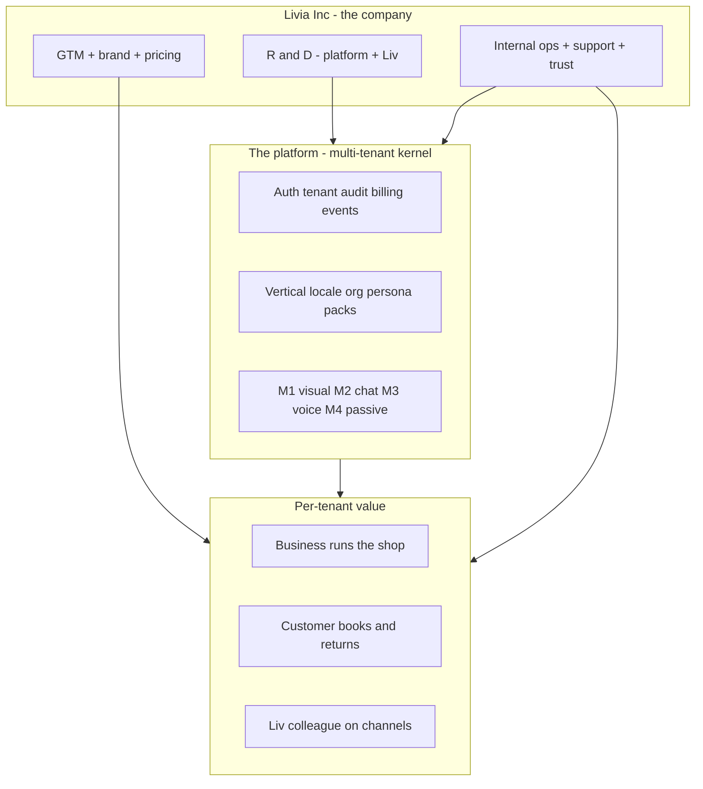

# Livia — Global Product System

**Status:** v1.0 (2026-05-21)  
**Audience:** founder, product, engineering, future Livia Inc operators  
**Purpose:** Document how Livia is built and operated as a **global company and platform** — every welcomed vertical, every relationship, pain and invisible failure, where Liv clears muddy water, and what the **internal environment** must be.  
**This is not a ship wedge doc.** Ireland is the **first market to prove**, not the **definition of the product**.

**Companion docs:**

| Doc | Role |
|-----|------|
| [`LIVIA-EXPERIENCE-DESIGN-BIBLE.md`](./LIVIA-EXPERIENCE-DESIGN-BIBLE.md) | Screen-level design, packs, screen cards |
| [`LIVIA-IDEA-TO-REALITY.md`](./LIVIA-IDEA-TO-REALITY.md) | Build tracks, Platform-Ready |
| [`../verticals.md`](../verticals.md) | Vertical facts table |
| [`../personas.md`](../personas.md) | P1–P7 |
| [`../company/livia-internal-portal-spec.md`](../company/livia-internal-portal-spec.md) | Internal ops surface (Part VI + X.2) |
| [`LIVIA-COMPLETE-SYSTEM-SPEC.md`](./LIVIA-COMPLETE-SYSTEM-SPEC.md) §7 | Payroll & people ecosystem (no duplicate doc) |

---

## Part 0 — Correction: global product, local proof

| Wrong framing | Right framing |
|---------------|---------------|
| “Livia for hair salons in Ireland” | **Livia for appointment-based service businesses globally** |
| Hair salon IE = the product | **Hair salon = one vertical pack**; IE = first locale pack we prove in market |
| Design one country, copy later | Design **global operating truths**, attach **locale packs** (currency, law, voice, holidays, templates) |
| v1 ledger Hair-only = only care about hair | v1 ledger = **what we ship first**, not **what we architect for** |

**Hair salon in Tokyo, Toronto, and Dublin** share the same product core: skilled human + time inventory + relationship memory + missed-demand recovery. They differ in **language, money, regulation, and channel norms** — not in whether “clients” exist or chairs get booked.

---

## Part I — How you build a company this size (not just features)

Livia Inc is three intertwined businesses:



### I.1 Layers (what “building Livia” actually means)

| Layer | Question it answers | Artifact |
|-------|---------------------|----------|
| **1. Category** | What market are we in? | Operator platform for scheduled skilled services (not CRM, not EHR) |
| **2. Vertical packs** | How does a tattoo studio differ from a salon? | `verticalPack` + vertical playbooks (this doc Part III) |
| **3. Locale packs** | How does Japan differ from Brazil? | `localePack` — law, money, holidays, templates, voice |
| **4. Org shape** | Solo vs chain vs chair-rental? | `orgShapePack` — nav, billing, cross-shop |
| **5. Persona ritual** | What does the owner see vs stylist? | `personaRitual` — home, authority, copy |
| **6. Modalities** | How do humans meet Liv? | M1–M4 (`modality-and-locale-overview.md`) |
| **7. Kernel** | What is invariant? | Bookings, customers, staff, audit, entitlements, webhooks |
| **8. Internal ops** | How does *our* team run the fleet? | Internal portal + runbooks (Part VI) |
| **9. Commercial** | How do we make money ethically? | Tiers, outcome share, DP program |

**Half jobs happen when layers 2–5 are skipped** and only layer 7 (CRUD) ships.

### I.2 “Muddy water” — what Livia clears

Appointment businesses drown in **fragmented truth**:

| Muddy water | Symptom | Eagle-eye truth Liv sees |
|-------------|---------|---------------------------|
| **Demand invisible** | “We’re quiet” while phone rings unanswered | Missed calls, unread DMs, drifted regulars |
| **Calendar lies** | Double-book, wrong stylist, gap holes | One conflict-safe schedule tied to skills |
| **Customer amnesia** | “Do you remember my formula?” | Unified client memory across channels |
| **Policy chaos** | Staff refunds randomly | Cap ladder + audit + manager queue |
| **Owner fog** | Reports without “so what?” | Briefing: 3 numbers + 1 action |
| **Channel silos** | WhatsApp ≠ book ≠ phone | Liv one brain, many surfaces |
| **Chain blindness** | Shop 2 failing while shop 1 fine | Cross-tenant roll-up for founder |
| **Compliance doubt** | “Can AI book for us?” | Disclosure, DPA, audit trail |

**Livia’s job:** make **operating reality** legible and **action** safe — for the business **and** the customer.

---

## Part II — Operating model template (every vertical uses this)

For each vertical we document four quadrants:

### II.A Internal operations (how the business runs)

| Subsystem | What happens | Typical pain |
|-----------|--------------|--------------|
| **Roster** | Who works when | Swaps, sickness, skill mismatch |
| **Inventory of time** | Chairs/rooms/stations | Under-utilised Tue 2pm |
| **Service catalog** | What can be sold | Wrong duration, stale prices |
| **Money** | Deposits, refunds, tips, VAT | Leakage, disputes |
| **Supply** | Consumables (optional) | Stock-outs for lash glue |
| **Policy** | Cancel, no-show, deposits | Inconsistent enforcement |
| **Governance** | Who can approve what | Owner interrupted for €20 |
| **People & pay handoff** | Hours, hire data, tips | Re-keying into BrightPay/Xero | Livia truth → partner export (Complete Spec §7) |

### II.B External operations (how the market meets them)

| Channel | Customer expectation | Failure mode |
|---------|---------------------|--------------|
| **Walk-in** | “Any chance today?” | Turned away opaque |
| **Phone** | Human answer | Voicemail → lost €€€ |
| **Instagram DM** | Book via chat | Slow reply → competitor |
| **Google / Maps** | Find + book | Friction to Phorest link |
| **Web booking** | Self-serve | Picks wrong service |
| **WhatsApp** | Async book | 24h window, template hell |

### II.C Business ↔ customer relationship

| Relationship type | Cadence | Livia memory needs |
|-------------------|---------|-------------------|
| **Transactional once** | Rare | Light |
| **Regular** | 4–8 weeks | Stylist preference, notes |
| **Intimate / high trust** | Beauty, tattoo, med | Allergies, design, clinical |
| **Long gap** | Tattoo, some wellness | Re-engage without creepiness |
| **Household** | Parent books kid | Multiple profiles |
| **B2B2C** | Insurance, corporate wellness | Payer ≠ attendee |

### II.D Personas inside the business (always)

| Persona | Internal job | External touch |
|---------|--------------|----------------|
| **Owner** | Survive + grow; brand | Brand voice; escalations |
| **Manager** | Floor + policy | Approvals; conflict |
| **Staff** | Deliver service | Their regulars |
| **Reception** | Schedule + messages | All customers |
| **Customer** | Get service | All channels |

---

## Part III — Vertical playbooks (global design, all welcomed segments)

Each section: **operating reality → pain → invisible failures → Liv/Livia intervention → locale notes (not IE-only)**.

---

### V1 — Hair (global)

**Sub-segments:** barbershop, salon, colour house, blow-dry bar, afro/textured specialists, kids cuts, wedding trials.

#### Operating reality

- **Internal:** Chair/stylist calendar; colour services long; multi-chair parallel; retail attach; walk-ins + appointments mixed; chair-rental common in barber.
- **External:** High phone + Instagram; reviews drive discovery; rebook cycle 4–8 weeks (cut) / 8–12 (colour).
- **Relationship:** Regulars ask for **same stylist**; formula memory is reputation.

#### Pain points (seen daily)

| Who | Pain | € / time cost |
|-----|------|----------------|
| Owner | Phone unanswered during service | €20–80k/yr missed booking (varies by market) |
| Owner | “Is the week good?” without reading 12 reports | Hours of anxiety |
| Manager | Refund arguments on floor | Trust erosion |
| Stylist | Context switch to reply DMs | Bad client experience |
| Reception | “Who does balayage?” roster guess | Double-book / wrong book |
| Customer | Hold music, no callback | Goes elsewhere |

#### Eagle-eye (what they don’t see)

| Blind spot | What’s actually happening |
|------------|---------------------------|
| “Regulars are fine” | 15% drifting >90 days — revenue cliff in 60 days |
| “Saturday is full” | Tue–Thu 30% empty — fixable with drift + promos |
| “Niamh handles it” | Manager is the hidden API — burnout risk |
| “We don’t need AI” | 40% of bookings start outside desk hours |
| Chair utilisation | Wrong skill-service match hides true capacity |

#### Where Livia helps (clear the mud)

| Capability | Customer | Business |
|------------|----------|----------|
| **Voice/chat book** | Books at 9pm | Owner sleeps |
| **Drift recovery** | Gets warm rebook | Fills Tue gaps |
| **Skill-filtered book** | Right stylist | No embarrassment |
| **Client memory** | “Same as last time” | Premium feel |
| **Refund ladder** | Fair outcome | Owner not pinged for small |
| **Briefing** | — | Owner sees 3 truths |
| **Audit** | — | Disputes resolved |

#### Locale (examples — product must support all over time)

| Dimension | IE | UK | US | JP (future) |
|-----------|----|----|-----|-------------|
| Currency | EUR | GBP | USD | JPY |
| Voice | en-IE first | en-GB | en-US | ja-JP |
| Deposit norm | Common | Common | Card hold | Local custom |
| Holiday calendar | IE | UK | Federal+state | JP national |

**Product implication:** `verticalPack: hair` is global; `localePack` switches law/money/voice.

---

### V2 — Beauty (global)

**Sub-segments:** nails, lash, brow, wax, facial, spray tan, PMU-light.

#### Operating reality

- **Internal:** Station-based; cycle bookings (3–4 wk lash); allergy/patch protocols; consumables per service; higher no-show cost.
- **External:** Instagram-heavy; photo portfolio; DM booking dominant for solos.
- **Relationship:** **High intimacy** — body image, allergies, aftercare.

#### Pain points

| Who | Pain |
|-----|------|
| Owner | No-show on €80 lash fill |
| Tech | Aftercare questions at 10pm |
| Customer | Unclear prep (no mascara) |
| Manager | Wrong service duration blocks day |

#### Eagle-eye

- Clients book **wrong service** (infills vs full set) → tech loses 20 min.
- **Allergy** incident waiting to happen — no patch-test record.
- **Cycle** drift breaks fill quality → churn blamed on “service” not scheduling.

#### Livia intervention

- Patch-test gate on first booking (vertical rule).
- Service descriptions enforced in public chat.
- Aftercare automated Day 0–3 (Liv M2/M4).
- Cycle-based rebook nudges (4 wk lash, 3 wk nails).

---

### V3 — Wellness (global)

**Sub-segments:** massage, spa day, float, sauna, couples packages.

#### Operating reality

- **Internal:** Room inventory (not just people); gift vouchers; packages; gender preference for therapist; quieter throughput.
- **External:** Treatwell/Mindbody discovery; gift season spikes.
- **Relationship:** Medium repeat; gift-driven one-offs.

#### Pain points

- Room double-booked vs therapist available.
- Gift voucher redemption confusion.
- Couples booking needs **two** resources aligned.

#### Eagle-eye

- Gift liability on books (unused €€).
- Therapist utilisation vs room utilisation diverge.

#### Livia intervention

- Resource types: `room` + `staff` (v2 schema).
- Package / voucher ledger (v2).
- Liv explains couples slot options in chat.

---

### V4 — Body art — tattoo, piercing, PMU (global)

#### Operating reality

- **Internal:** Long sessions; multi-session sleeves; **design approval**; deposit binds artwork; age verification; sterile workflow (documentation not surgery).
- **External:** Portfolio + waitlist culture; consult ≠ tattoo session.
- **Relationship:** **Years** between some visits; high trust.

#### Pain points

| Who | Pain |
|-----|------|
| Artist | DMs: “how much for half sleeve?” — 40 min quote ping-pong |
| Owner | Deposit chargebacks after design change |
| Customer | Unclear consult vs session booking |

#### Eagle-eye

- **Pipeline** stuck in “interested DM” — not in CRM.
- **Healing** problems unseen until bad review.
- **Chair** calendar treated like 30-min slots — destroys artist day.

#### Livia intervention

- Consult vs session service archetypes.
- Design proof workflow + deposit linkage.
- Healing check-in cadence (M2/M4).
- Age gate (locale law pack).
- Voice/chat qualifies size/placement before human time.

---

### V5 — Fitness (global)

#### Operating reality

- **Internal:** **Classes** (capacity) + **1:1 PT**; memberships; waitlists; PARQ health intake.
- **External:** App booking; Strava culture; pack purchases.
- **Relationship:** Member identity; attendance habit.

#### Pain points

- Waitlist not promoted when cancel happens.
- Package sessions not decremented correctly.
- Instructor substitution not communicated.

#### Eagle-eye

- Class appears full while 3 no-shows expected historically.
- Members churn silently (passive) not cancellation.

#### Livia intervention

- Capacity-based booking model (different from salon chair).
- Waitlist promote on cancel (v1.5+).
- Liv nudges pack expiry / unused sessions.

---

### V6 — Skin / Medspa (global, regulated)

#### Operating reality

- **Internal:** Practitioner-led; device logs; contraindications; before/after photos; complication protocol.
- **External:** High consideration; consult required; often hybrid medical + retail.
- **Relationship:** Medico-legal trust.

#### Pain points

- Consent not tracked → regulatory exposure.
- Liv must **never** diagnose or recommend treatment.

#### Eagle-eye

- Marketing promises “results” without audit trail.
- Photo storage GDPR/medical retention blur.

#### Livia intervention (partner-gated)

- Informed consent artifacts.
- Practitioner-only booking rules.
- Complication escalation to human (kill switch).
- **Not** in-house EHR — integrate Pabau-class partners.

---

### V7 — Allied health (global, lite)

Physio, chiro, osteo, acupuncture, podiatry.

#### Operating reality

- **Internal:** Treatment plans; recurring series; insurer sometimes pays.
- **External:** GP referral; longer intake forms.
- **Relationship:** Clinical length multi-year.

#### Livia intervention (lite)

- Plan-linked rebook series.
- GP letter export hook.
- **Stop** at clinical notes / ICD coding.

---

### V8–V9 — Dental, mental health

**Welcome:** partner-only or never.  
**Reason:** regulated records, imaging, safeguarding — specialised incumbents, different liability surface.  
**Livia role:** integrate, don’t replace.

---

### V10 — Pet grooming (global)

~80% salon workflow + **pet** as client subtype: vaccination, breed, behaviour, multi-pet household.

#### Livia intervention

- Pet profile on customer.
- Groomer skill by breed size.
- “Dog anxious” notes for Liv tone.

---

### V11 — Solo professional services

**Explicit defer** — different job-to-be-done (Calendly world); would dilute craft.

---

## Part IV — Master pain matrix (persona × relationship)

| Persona | Relationship to business | Universal pain | Livia surface |
|---------|-------------------------|----------------|---------------|
| **Owner** | Principal | Cash + calendar truth | Dashboard, briefing, billing |
| **Manager** | Agent of owner | Queue + policy | Inbox, approvals |
| **Staff** | Revenue actor | Next client clarity | My Day |
| **Reception** | Air traffic | Floor schedule | Bookings |
| **Customer** | Buyer | Friction + uncertainty | Public, voice, SMS |
| **Founder (multi)** | Portfolio | Which shop needs love | Shops, chain KPI |

**Cross-vertical:** pain **shape** is similar; **rules and words** change via packs.

---

## Part V — Customer typology × Liv (global)

From `customer-typologies.md` (CT1–CT6) — how Liv treats each:

| Type | Behaviour | Liv strategy |
|------|-----------|--------------|
| **CT1 VIP** | High LTV, picky | Tone deferential; human handoff fast |
| **CT2 Regular** | Predictable cycle | Drift watch; same stylist bias |
| **CT3 New** | Needs education | Service explainer; patch tests |
| **CT4 Drifted** | Was regular | Win-back; not spam |
| **CT5 Bargain** | Price sensitive | Clear deposit/cancel policy |
| **CT6 Problem** | Complaint | Escalate; refund ladder |

---

## Part VI — Livia Inc internal environment (breadth × depth × width)

A platform this big **cannot** be operated from Stripe + Clerk + raw SQL. The internal environment is a **product**, not a spreadsheet.

### VI.1 Breadth (domains the team must see)

| Domain | Internal module | Why |
|--------|-----------------|-----|
| **Tenants** | Directory + health | Every support call starts here |
| **Customers of tenants** | Restricted PII view | Debug booking failures |
| **Liv runtime** | Traces, evals, prompt version | “Why did Liv say that?” |
| **Comms** | Twilio/Resend status | SMS/voice failures |
| **Billing** | Stripe sub + Connect | Money disputes |
| **Legal/DSR** | Export/delete queue | GDPR requests |
| **Incidents** | SEV timeline | Fleet outages |
| **Feature flags** | Rollout % | Safe launch |
| **Vertical/locale** | Pack registry | “Is tattoo on for this tenant?” |
| **Design partners** | Cohort notes | GTM feedback loop |
| **Competitive** | Incumbent imports | Migration status |

### VI.2 Depth (how far we drill down)

| Level | Example |
|-------|---------|
| Fleet | Error rate all tenants |
| Tenant | Last booking, Liv enabled, tier |
| Conversation | Message trace + tool calls |
| Booking | State transitions + audit |
| Single event | Webhook delivery id |

**Rule:** support L1 stops at tenant card; L2 opens conversation; engineer opens trace + replay.

### VI.3 Width (roles across the company)

| Role | Primary internal surfaces |
|------|---------------------------|
| **Founder** | Fleet health, MRR, incident, DP transcripts |
| **Engineering** | Deploy SHA, queues, eval suites, flags |
| **Support L1** | Tenant search, replay notification, docs |
| **Support L2** | Impersonate (boxed), PII sample, kill switch request |
| **Success** | Onboarding funnel, activation metrics |
| **Finance** | MRR, churn, Connect onboarding |
| **Legal** | DSR, subprocessors, marketing claims vs reality |
| **Product** | Vertical pack editor (future), screen card status |

### VI.4 Internal portal modules (target map)

Extends [`livia-internal-portal-spec.md`](../company/livia-internal-portal-spec.md):

```text
/internal
  /tenants          search, health, impersonate (policy)
  /conversations    Liv traces, redaction
  /bookings         cross-tenant search by id
  /billing          Stripe deep links, past due
  /incidents        SEV, status page
  /flags            global + per-tenant
  /evals            golden paths per vertical/locale
  /packs            vertical + locale version registry
  /design-partners  notes, transcripts
  /marketing-truth  marketing-vs-reality audit rows
  /migrations       Phorest/CSV job status
```

**Visual:** distinct chrome (violet stripe) — never confused with tenant app.

### VI.5 “Eagle eye” for Livia Inc (meta)

| We must see | Tooling |
|-------------|---------|
| Which vertical packs break evals | Eval dashboard by pack |
| Which locale lacks templates | Locale coverage matrix |
| Which tenants are “active lie” (paying, no bookings) | Success health |
| Claim drift (marketing vs product) | marketing-vs-reality.md in portal |
| Liv hallucination patterns | Clustered failure tags |

---

## Part VII — Unifying global + bespoke (architecture recap)

```text
Livia Platform (global, invariant)
├── Kernel: tenant, auth, booking engine, audit, billing hooks, events
├── Modalities: M1–M4
└── Packs (combinatorics):
    ├── verticalPack: hair | beauty | tattoo | wellness | fitness | medspa | allied | pet
    ├── localePack: en-IE | en-GB | en-US | de-DE | …
    ├── orgShapePack: solo | single | chain | chair-host
    └── personaRitual: founder | owner | manager | staff | reception
```

**Ship order** (commercial): prove locale pack in **one** market while **designing** all vertical packs on paper.  
**Your priority:** all verticals documented to Part III depth → screen cards → then code packs.

---

## Part VIII — Documentation system (how we build to perfection)

| Artifact | Owner | Contains |
|----------|-------|----------|
| **This doc** | Product | Vertical playbooks, pain, eagle-eye, internal ops |
| **Experience Bible** | Product | Screens, access paths, gaps |
| `screens/{vertical}.{locale}/*.yaml` | Product | Designed gate per screen |
| `verticals.md` | Strategy | Facts table |
| `personas.md` | Strategy | P1–P7 narratives |
| `workflows/*.md` | Product | State machines |
| `marketing-vs-reality.md` | Founder | Claim integrity |
| Internal portal spec | Ops/eng | Company tooling |

**Definition of “documented enough to build”:**

- [ ] Part III section exists for vertical (all 9 welcomed)  
- [ ] Screen cards **Designed** for that vertical’s v1 surfaces  
- [ ] Eval golden paths per vertical × locale  
- [ ] Internal runbook for top 10 support cases per vertical  

---

## Part X — Value by stakeholder (tenants and Livia Inc)

*Who we serve, what pain we remove, and what keeps them on the platform — without scope creep. Payroll/HR handoffs: Complete Spec §7. GTM surfaces: [`V2-GTM-WOW-LAYER.md`](./V2-GTM-WOW-LAYER.md).*

### X.1 External — who we seduce and what wins them

| Actor | Core fear | “Damn” moment (target) | Stickiness loop |
|-------|-----------|------------------------|-----------------|
| **Customer** | Won’t get answered / wrong book | Liv books at 9pm with disclosure + confirmation | Returns via same memory, not marketplace lock-in |
| **Owner** | Flying blind + tool sprawl | Morning briefing + toolkit + pay-run prep (future) | Opens Today first; Liv already handled overnight |
| **Founder / multi-site** | Shop 2 failing silently | Chain glance + per-shop drill-down | One login, many locations |
| **Manager** | Queue + coverage chaos | Inbox + Ask Liv + time-off with coverage | Approves on phone; audit backs them |
| **Staff** | DM distraction | My chair + rota glance | Stays in craft; Liv handles noise |
| **Reception** | Floor overload | Calendar + Liv on messages | One screen for walk-in + book |
| **Host (chair-rental)** | Renter PII + rent chase | Host floor without client lists | Rent reminders; renters on own tier |
| **Franchisor** | Brand drift + royalty fog | Franchise rollup (aggregate only) | Mandates without seeing customer PII |

**External ecosystem wins (orchestrate, don’t own):**

| Headache | Livia owns | Partner |
|----------|------------|---------|
| Pay run hours | Rota + bookings truth | BrightPay / Sage |
| Month-end revenue | Booking + Connect events | Xero |
| New hire paperwork | Hiring intake | DocuSign / bureau |
| Bulk marketing | Lifecycle 1:1 only | Mailchimp link-out |
| Incumbent calendar | Parallel run + broker | Phorest / Fresha import |

**Rule:** every integration removes a **named Friday headache**, not a logo slide.

### X.2 Internal — how Livia Inc runs the fleet at scale

| Role | Core fear | “Damn” moment (target) | Stickiness loop |
|------|-----------|------------------------|-----------------|
| **Founder** | Claim drift + fleet blind | marketing-truth + MRR + SEV on one portal | Ships match livia.io |
| **Support L1** | “Which tenant?” in 5 min | Tenant health card + replay notification | No raw SQL |
| **Support L2** | Liv misbehaved | Conversation trace + tool calls + boxed impersonate | Fix with audit |
| **Engineering** | Regression per pack | Eval by vertical×locale + flags | Ship without fear |
| **Success** | Paying but dead tenant | Activation funnel + “no bookings 14d” | Save before churn |
| **Finance** | Connect mess | Stripe deep links + past-due roll-up | One finance view |
| **Legal** | GDPR / claim liability | DSR queue + subprocessors status | Counsel checklist in portal |

**Internal Liv (JARVIS):** `search_tenants`, `tenant_snapshot`, `/internal/ops/liv/assist` — same runtime discipline as tenant Liv, different tool slice ([`LIV-OPERATING-SYSTEM.md`](./LIV-OPERATING-SYSTEM.md) §5).

**Portal target map** (extends internal portal spec): tenants · Liv traces · flags · incidents · billing · evals · packs · marketing-truth · **migrations** · **partner connectors** (payroll/Xero status per tenant).

### X.3 Revolution principle (EU → world)

1. **Own the appointment graph** — time, people, conversations, money events.  
2. **Liv owns ambiguity** — workflows own determinism.  
3. **Partners own obligation** — tax, filings, clinical, bulk blast.  
4. **Locale packs** switch law/money/voice; **vertical packs** switch rituals — kernel invariant.

---

## Part IX — What changes in the Experience Bible

The Experience Bible’s IE-first examples are **market proof instances**, not product boundaries. When reading:

- Replace mentally: “hair salon IE” → **“hair salon, locale IE”**  
- Add: **“hair salon, locale en-US”** shares vertical pack, different locale pack  

A follow-up pass will add `docs/product/screens/hair.*/` and `beauty.*/` without locale in the path (locale inside YAML).

---

## Part X — Direct answer: do we know how to build a company/product?

**Yes — and the repo mixed up three things:**

1. **Company** (Livia Inc, GTM, support, legal, finance) → needs Part VI internal environment.  
2. **Platform** (kernel + packs + modalities) → needs Part VII architecture.  
3. **Ship wedge** (first paying market proof) → `v1-scope.md` is intentionally narrow.

You care about (2) and (1) at full vertical breadth — correct.  
Recent sprints targeted (3) without finishing (2)’s paper — that’s the half-job feeling.

**This document is (2)+(1) on paper for all welcomed verticals.** Next concrete outputs:

1. Expand **screen cards** per vertical (not only hair).  
2. **`verticalPack` registry** in policy code with rules from Part III.  
3. **Internal portal MVP** modules: tenant directory + Liv traces + marketing-truth.  
4. **Demo businesses** per vertical (not only IE hair) for visual proof.

Tell me which output to execute first; the thinking for “all verticals, global, internal ops” is now anchored here.
