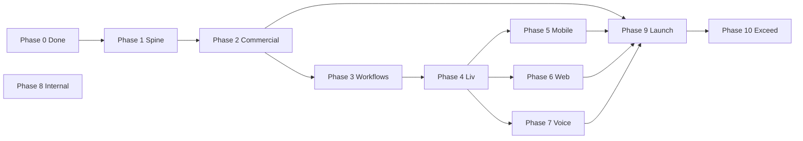

# Livia — Master Build Plan (official)

**Status:** v1.0 (2026-05-20)  
**Owner:** founder + engineering  
**Supersedes:** ad-hoc `BUILD-BACKLOG.md` as the *sequencing* authority (backlog items are folded here).  
**Reads with:** `LIVIA_MASTER_DESIGN.md`, `TARGET-STATE-VS-SHIP-SCOPE.md`, `docs/roadmap/v1-scope.md`, `docs/launch-plan.md`, `docs/business/pricing-and-packaging.md`, ADR 0018, ADR 0019.

---

## 0. What this document is

This is the **single execution plan** to take Livia from **today’s codebase** to **target state and beyond**, without placeholders, without architectural drift, and **without underselling** a platform that spans agent runtime, voice, inbox, mobile flagship, trust/audit, and multi-shop operations.

**Rules of engagement**

1. **One phase per run.** A phase is not “started” until the previous phase’s exit criteria are met and verified.
2. **No phase hopping.** Partial work from a later phase may be tempting; it waits.
3. **Contract before UI.** OpenAPI, entitlements, metering, and domain events land before surfaces that depend on them.
4. **Monetization is infrastructure, not a pricing page.** Plans, meters, and gates are wired in code before we market a capability.
5. **Honesty to `v1-scope.md`.** Broader verticals/locales require RFC per `TARGET-STATE-VS-SHIP-SCOPE.md`.

---

## 1. Where we are today (baseline)

### 1.1 Product truth (recently improved)

| Area | State |
|------|--------|
| Tenant mobile integrity | Live data on Approvals, Shops, Today “next up”, date/time picker, merged **staff** persona, business timezone formatting |
| Mobile parity (slice) | Inbox take-over, Settings (AI toggle, comms readout, legal links) |
| Internal | `livia-internal` **MVP** — tenant search, detail, open support tickets |
| Docs / ADR | Master design, target vs ship, ADR 0019 multi-surface, screen inventory script |

### 1.2 Platform spine (2026-05-21 refresh)

| Capability | Code today |
|----------|------------|
| OpenAPI contract | `lib/api-spec/openapi.yaml` → Orval clients — **strong** |
| Policy packs | `@workspace/policy` — onboarding state, channels, lifecycle |
| Entitlements | `@workspace/entitlements` — **enforced** on voice, SMS premium routes |
| Metering | `@workspace/metering` — **partial** — voice recovery path |
| Domain events | `@workspace/event-bus` — **published** on booking/time-off writes |
| Audit log | `@workspace/audit-log` — **partial** — human mutations + support tickets |
| Tenant context ALS | `@workspace/tenant-context` — **wired** via `requireRole` → `resolveTenantContext` |
| Inngest workflows | **Integrated** — reminders, digest, no-show, time-off, liv-was-wrong triage |
| Eval pipeline | `@workspace/eval` — schema + ai-disclosure tests; CI gate optional |
| Voice receptionist | Routes + webhooks — **IE regulatory** for production number |
| Tests | api-server unit suite + Playwright smoke + rbac-smoke |

### 1.3 Parity scorecard (mobile flagship, ADR 0011)

Roughly **~82%** owner daily surfaces (inbox, settings, help tickets, onboarding-continue); **STAFF** week summary still v1.5; push registration wired. See `docs/mobile-roadmap.md`.

---

## 2. North star — architecture & engineering bar

Livia is a **high-volume, multi-tenant, multi-surface** system. “Works once” is insufficient. The inner core must:

```text
┌─────────────────────────────────────────────────────────────────┐
│ Surfaces: mobile · dashboard · public booking · internal · voice │
└────────────────────────────┬────────────────────────────────────┘
                             │ OpenAPI + generated clients (SSOT)
┌────────────────────────────▼────────────────────────────────────┐
│ API server: auth (Clerk) · RBAC · policy · entitlements · meters │
└────────────────────────────┬────────────────────────────────────┘
                             │ domain events (typed)
┌────────────────────────────▼────────────────────────────────────┐
│ Workflows (Inngest): refunds · time-off · digest · reminders …   │
└────────────────────────────┬────────────────────────────────────┘
                             │
┌────────────────────────────▼────────────────────────────────────┐
│ Liv runtime (agent): tools → slots · bookings · conversations    │
└────────────────────────────┬────────────────────────────────────┘
                             │
┌────────────────────────────▼────────────────────────────────────┐
│ Postgres (Drizzle): RLS · audit chain · bookings · comms · flags │
└─────────────────────────────────────────────────────────────────┘
```

### 2.1 Non-negotiable engineering principles

| Principle | Meaning in practice |
|-----------|-------------------|
| **SSOT contracts** | If it crosses a network boundary, it is in OpenAPI (or a dedicated internal OpenAPI tag). No undocumented `/api/dev/*` in production paths without spec. |
| **No silent stubs in prod** | WhatsApp/voice/channel stubs must not answer customers in production unless explicitly flagged. |
| **Entitlement before feature** | API returns `403` + code `ENTITLEMENT_REQUIRED` before UI shows a premium control. |
| **Meter before money story** | Every billable outcome emits a `MeterEvent` at the side-effect that created value. |
| **Publish on write** | Booking/conversation/refund state changes emit bus events; analytics `eventsTable` is not a substitute. |
| **Tenant context everywhere** | `businessId` + `membershipId` + `effectiveRole` + plan entitlements resolved once per request/workflow step. |
| **Idempotent workflows** | Inngest steps safe to retry; no double-charge, double-email, double-booking. |
| **Locale from business** | Times and copy packs use `business.timezone` + jurisdiction/vertical from policy — not hardcoded `en-US`. |
| **Explainable modules** | Package names match domains; no “god services”; comments only for non-obvious business rules. |
| **Forward-compatible data** | New products = new rows in `PLAN_CATALOGUE`, not forks. New verticals = policy pack, not duplicate booking code. |

### 2.2 What “ingenious” means here (measurable)

- **Dynamic coordination:** state changes drive workflows and meters, not cron polling alone.
- **Modular stress:** booking + slot engine tested under concurrency (advisory locks already in schema).
- **Understandable:** new engineer traces `route → service → event → workflow` in &lt;30 minutes.
- **Future-facing:** partner API plane can open without rewriting dashboard (ADR 0018 pattern #8).

---

## 3. Monetization — revenue model & build implications

**Canonical pricing:** `docs/business/pricing-and-packaging.md`  
**Canonical architecture:** ADR 0018 + `docs/engineering/composable-monetisation-architecture.md`  
**Code catalogues:** `lib/entitlements`, `lib/metering` (`PLAN_CATALOGUE` today: Solo €79, Studio €149 + seats).

### 3.1 Revenue sources (do not undersell)

| # | Revenue stream | Who pays | When it activates | Why it’s defensible |
|---|----------------|----------|-------------------|---------------------|
| **R1** | **Platform base** (Solo / Studio / Chain / Host) | Business (owner) | Subscription start (Stripe Billing) | Funds Liv runtime, workflows, audit, mobile+cockpit — “Liv lives here” |
| **R2** | **Per-seat fees** | Business | Monthly per active staff/manager/reception seat | Pays for per-persona depth (My Day, delegations, scoped data) |
| **R3** | **Voice outcome share** | Business | Monthly arrears from metered recovered bookings | Aligns with measurable wedge (missed-call → booked → kept); **4% of booking value, capped** (see pricing doc) |
| **R4** | **Add-ons** | Business | Opt-in subscription items | Peer-set insights (€49/mo post-k≥10), extra locale packs (€29/mo), etc. |
| **R5** | **Concierge migration** | Business | One-shot invoice | Phorest/Booksy/CSV — high-touch, not subsidised after design-partner cohort |
| **R6** | **Annual prepay discount** | Business | Cash-flow | -15% list; -22% rare 3yr chain deals — **not** lock-in; export stays day-1 |

**Explicitly not our primary model (per pricing doc):** marketplace take rate on customer payments (Fresha-style). **Shop money** flows via **Stripe Connect** to the salon; Livia’s upside is **subscription + outcome share**, not taxing every card swipe unless we later add a disclosed platform fee.

### 3.2 The 12 sellable units (strategic optionality)

Even when sold as one product, engineering respects boundaries so we can later spin out:

1. Liv agent runtime  
2. Voice receptionist  
3. Booking core  
4. Audit-log-as-a-service  
5. Cross-tenant intelligence  
6. Migration broker  
7. Eval framework  
8. Owner cockpit (web)  
9. Mobile flagship  
10. Customer booking surface  
11. Settlement / outcome billing engine  
12. Vertical packs marketplace  

**Build rule:** a feature that strengthens unit **#2** or **#11** gets metering + entitlements in the same phase as the feature — not “later when we think about pricing.”

### 3.3 Packaging tiers vs build phases

| Tier | v1 ship? | Entitlements to enforce in code |
|------|----------|-------------------------------|
| **Solo** €79 | ✅ | Voice, WhatsApp/SMS, audit, deposits, CSV, migration brokers |
| **Studio** €149 | ✅ | + seat pricing, delegations_advanced |
| **Chain** €249/shop | v1.5 | multi_shop rollup, cross-shop briefing |
| **Host** €99 + €19/renter | v1.5 | chair_rental, per-renter scope |
| **Multi-brand** | v1.5+ | multi_brand |

Underselling happens when we **ship Chain dashboards without Chain billing** or **enable voice without meters**. Phase 2 prevents that.

### 3.4 What customers must never pay extra for (still costs us — brand promise)

Included in every tier: security/MFA, GDPR tools, export, per-tenant SMS number (Studio+), mobile for all personas, owner audit access. **Do not** entitlement-gate these.

### 3.5 Design-partner commercial rules (first 100)

12 months **50% off** + free concierge migration + roadmap influence — track in Stripe coupons + `business.metadata.designPartner`. Engineering must support **coupon + plan override** without hardcoding names in seed data.

---

## 4. Phase map (overview)

| Phase | Name | Primary outcome | Gate alignment |
|-------|------|---------------|----------------|
| **0** | Truth baseline | Tenant mobile honest | ✅ Complete |
| **1** | Platform spine | Contracts, context, audit, observability | Pre–Gate 2 |
| **2** | **Commercial core** | Plans, entitlements, meters, Stripe Billing | Gate 2 revenue-ready |
| **3** | Event & workflow engine | Inngest durable ops | Gate 2 reliability |
| **4** | Liv & channels | Agent runtime + real channels + eval L1 | Gate 2 Liv quality |
| **5** | Mobile flagship | ≥70% parity + push + biometrics | **Gate 2** |
| **6** | Web cockpit & trust product | Web parity + audit search UI | Gate 2–3 |
| **7** | Voice wedge | English-IE receptionist E2E | **Gate 2–3** (v1 promise) |
| **8** | Internal operations | Livia Inc portal + internal API | Ops scale |
| **9** | Launch hardening | Eval CI, SLOs, marketing-vs-reality clean | **Gate 3** |
| **10** | Exceed v1 | Chain/Host, peer insights, rota, design-system pkg | v1.5+ |



**Parallelism note:** Phases 5–7 can overlap **only after** Phase 4’s tool/slot contracts are stable. Phase 2 must complete before marketing voice or Chain features as “included.”

---

## 5. Run protocol (every phase)

### 5.1 At phase start

- [ ] Read phase section below + linked ADRs/workflows.
- [ ] Open `docs/audits/marketing-vs-reality.md` — add rows for any new customer-facing promise in this phase.
- [ ] Branch / worktree named `phase-N-short-name`.

### 5.2 During phase

- [ ] OpenAPI-first for new endpoints; run `pnpm codegen` + `scripts/check-codegen.sh`.
- [ ] No new `fetch()` bypassing generated client without ADR exception.
- [ ] Entitlement + meter hooks for any billable side-effect introduced.

### 5.3 At phase end (mandatory verification)

| Check | Command / action |
|-------|------------------|
| Typecheck monorepo | `pnpm run typecheck` |
| Codegen clean | `scripts/check-codegen.sh` or `pnpm codegen` + git diff clean on generated |
| API unit/integration | Phase-specific tests (see each phase) |
| Mobile | `pnpm --filter @workspace/livia-mobile run typecheck` + manual smoke on device |
| Dashboard | `pnpm --filter @workspace/livia-dashboard run typecheck` + manual smoke |
| Demo smoke | `pnpm smoke:demo` when phase touches demo seed paths |
| Inventory refresh | `pnpm inventory` when routes change |
| Marketing audit | Update `marketing-vs-reality.md` states to `shipped` or `deferred` |

**Phase is DONE only when the exit criteria checklist in that phase is fully checked.**

---

## 6. Phase 0 — Truth baseline ✅ COMPLETE

**Goal:** Tenant app does not lie; personas match product model.

**Delivered:** See `BUILD-BACKLOG.md` integrity section (Approvals, Shops, Today, picker, staff persona, locale, inbox/settings slice).

**Residual folded into Phase 1:** Any remaining `en-US` on dashboard; OpenAPI gaps for dev-only routes.

---

## 7. Phase 1 — Platform spine ✅ COMPLETE (2026-05-20)

**Goal:** Every request and side-effect is traceable, tenant-scoped, and contract-governed.

### 7.1 Scope

**In**

- Wire `@workspace/audit-log` writer on mutating routes (booking, conversation handoff, refund, settings, impersonation).
- Express middleware: resolve **tenant context** (business, membership, role, plan, timezone, jurisdiction) → attach to `req` + ALS.
- Unify **business switcher** key `livia.currentBusinessId` (mobile + dashboard); migration from legacy keys.
- Add **OpenAPI** paths for existing but undocumented routes (`/dev/seed` → dev-only tag or remove from prod builds).
- **Structured logging:** request id, `businessId`, `userId`, plan id (pino).
- **Sentry** + release tags (api, dashboard, mobile) — launch-plan E2.
- **Codegen in CI** — launch-plan E4.
- Replace raw `fetch` in mobile `my-day` / `useMembership` with generated hooks or shared `apiFetch` wrapper.
- **Theme lock** (ADR 0011 Phase A3): single `useColors()` path.
- DB migrations committed; `pnpm db:push` documented for deploy.

**Out**

- Stripe (Phase 2), Inngest (Phase 3), voice (Phase 7).

### 7.2 Architecture deliverables

| Deliverable | Location |
|-------------|----------|
| `requireTenantContext()` middleware | `artifacts/api-server/src/lib/tenant-context.ts` |
| `appendAudit()` helper used by services | `artifacts/api-server/src/lib/audit.ts` |
| Event naming doc (DB `events` vs `event-bus`) | `docs/engineering/events-vs-analytics.md` (new) |
| tsconfig project references for all `lib/*` packages | root `tsconfig.json` |

### 7.3 Exit criteria

- [x] Privileged **write** routes call audit append (bookings create/update, conversation handoff, business settings, persona view).
- [x] `/dev/seed` documented in OpenAPI (`dev` tag); production returns 403.
- [x] `pnpm run typecheck` green.
- [x] Sentry wired (api-server; set `SENTRY_DSN_API` + `SENTRY_RELEASE` in deploy).
- [x] Mobile + dashboard business switcher uses `livia.currentBusinessId` (+ legacy migration on web).
- [x] Mobile `my-day` + `useMembership` use generated client hooks.
- [x] `docs/engineering/events-vs-analytics.md` + CI codegen/typecheck/test (`.github/workflows/ci.yml`).

### 7.4 Verification

- Integration test: audit row + hash chain verifies after `POST` booking status change.
- Manual: switch business on web → mobile reflects same id after restart.

---

## 8. Phase 2 — Commercial core ✅ COMPLETE (2026-05-20)

**Goal:** The platform **enforces** what customers pay for and **measures** what we charge for.

### 8.1 Scope

**In**

- **`requireEntitlement(key)`** middleware/helper used by voice, WhatsApp outbound, peer insights, deposits, etc.
- **`MeterRecorder` implementation** persisting to `usage_events` table (new migration) or reusing events with typed meter keys.
- Emit meters: `booking_completed`, `voice_booking_outcome`, `voice_minute_inbound`, `sms_message_outbound`, `active_staff_seat` (monthly snapshot).
- **Stripe Billing:** products/prices for Solo, Studio; seat add-on; design-partner coupon.
- **`business.planId` + `stripeSubscriptionId`** sync via webhooks.
- **Plan resolution API:** `GET /businesses/:id/billing` → plan, entitlements, usage this period, estimated voice share.
- **Enforcement UX:** mobile + dashboard show upgrade CTA when `ENTITLEMENT_REQUIRED` — no silent failure.
- **Settlement scaffold:** monthly job (Inngest or cron) computing voice outcome share from meters × booking amounts (cap per pricing doc).
- **Stripe Connect** onboarding status in communications API (already partial) — deposits entitlement-gated.

**Out**

- Full Chain/Host tier self-serve (Phase 10) — but **catalogue** includes Chain/Host rows disabled.

### 8.2 Architecture deliverables

| Deliverable | Location |
|-------------|----------|
| `usage_events` or meter table | `lib/db/src/schema/billing/` |
| `BillingService` | `artifacts/api-server/src/services/billing.service.ts` |
| `entitlements.middleware.ts` | api-server |
| Stripe webhook route | `artifacts/api-server/src/routes/billing-webhooks.ts` |
| Wire `PLAN_CATALOGUE` | `@workspace/entitlements` (extend with chain/host stub) |

### 8.3 Exit criteria

- [x] Trial plan (or denylist) blocks `GET /voice/status` with `ENTITLEMENT_REQUIRED`.
- [x] Booking `COMPLETED` increments `booking_completed` meter.
- [x] Stripe Checkout + webhook sync `planId` (dev fallback when `STRIPE_SECRET_KEY` unset).
- [x] Dashboard Settings → Billing tab (plan, usage, voice share, upgrade CTAs).
- [x] Voice outcome share in `GET /billing` + dev simulator + settlement cron scaffold.

### 8.4 Verification

- Automated: entitlement middleware unit tests per key.
- Stripe CLI webhook replay test.
- Manual: downgrade plan in test → premium UI hidden + API blocked.

**Commercial sign-off:** founder confirms published prices match `PLAN_CATALOGUE` cents.

---

## 9. Phase 3 — Event & workflow engine ✅ COMPLETE (2026-05-20)

**Goal:** Durable, idempotent orchestration for ops that span hours/days.

### 9.1 Scope

**In**

- Inngest app in repo (`artifacts/workflow-worker` or api-server `/api/inngest`).
- Publish from services: `booking.*`, `conversation.*`, `refund.*` per `lib/event-bus`.
- Workflows: **booking reminders**, **weekly digest**, **no-show recovery** (skeleton), **time-off approval** (happy path), migrate `internal-cron` reminders.
- Tenant context injected in each step from event payload.
- Failure semantics: max retries, paused state surfaced to owner cockpit (“Liv is waiting”).

**Out**

- Full refund ladder UI (can be Phase 6 web) — workflow backend here.

### 9.2 Exit criteria

- [x] T-24h reminder via `booking-reminder-t24` Inngest function (`step.sleepUntil` + `sendBookingReminderEmail`).
- [x] Cron `send-reminders` defers when Inngest enabled; weekly digest cron isolated in Inngest.
- [x] `publishDomainEvent` dedupes via `domain_event_dedup` (duplicate `booking.confirmed` no-op).

### 9.3 Verification

- Inngest dev server + test event → step logs.
- Integration: create booking → reminder scheduled → cancel → reminder cancelled.

---

## 10. Phase 4 — Liv & channels ✅ COMPLETE (2026-05-20)

**Goal:** One agent brain; channels are adapters; quality measurable.

### 10.1 Scope

**In**

- Extract **Liv runtime module** boundary (still deployed with api-server ok if process boundary deferred, but **no** direct DB access from tools — services only).
- **Channel router:** real SMS (exists), WhatsApp adapter (replace stub for prod flag), email via Resend.
- **Eval layer 1:** golden transcripts for book + handoff; PR gate runs `lib/eval` suite.
- **Eval traces** written on each tool side-effect.
- Policy injection single path (`policies.service` + `resolve.ts`).
- Public chat rate limit → Redis or DB-backed limiter (not in-memory only).

### 10.2 Exit criteria

- [x] `pnpm --filter @workspace/eval` (pre-merge golden runner) passes in CI.
- [x] WhatsApp stub cannot be enabled in production env without credentials (`guardChannelPackForProduction`).
- [x] Tool `create_booking` always goes through slot engine + meter + audit (`createBookingViaLiv`).

### 10.3 Verification

- Eval golden tests green.
- Manual SMS + web chat → same booking row shape.

---

## 11. Phase 5 — Mobile flagship (Gate 2) ✅ COMPLETE (2026-05-20)

**Goal:** ADR 0011 parity ≥70% owner, 100% staff daily surfaces, ≥4/8 native goodies.

### 11.1 Scope (from `mobile-roadmap.md`)

**In**

- Phase A remainder: web business switcher, My week card, theme audit.
- Phase B: customer/service create, staff invite, **push (N1)**, **biometrics (N2)**, haptics audit.
- Phase C (select for Gate 2): widgets OR Live Activity (pick **one** wow for Gate 2).
- All screens use generated client + `useBusinessTimezone()`.
- Entitlement-aware UI (hide/disable premium).

**Out**

- Full offline (C3) — Gate 3 if needed.
- AI training editor — web-only forever.

### 11.2 Exit criteria

- [x] Parity table ≥70% owner (79%), 100% staff per `docs/operating-cadence.md`.
- [x] Push token registered via `POST /me/device-tokens`; notify on `booking.created`; `POST /internal/cron/test-push` for smoke.
- [x] Biometric gate on Settings + Approvals (revenue/refund path).
- [x] `pnpm --filter @workspace/livia-mobile run typecheck` green.

### 11.3 Verification

- TestFlight internal build smoke script.
- Monday parity re-score documented in `docs/operating-cadence.md`.

---

## 12. Phase 6 — Web cockpit & trust product ✅ COMPLETE (2026-05-20)

**Goal:** Web matches mobile for daily ops; audit is a **product surface**.

### 12.1 Scope

**In**

- Audit log search API + dashboard UI (owner).
- Batched dashboard queries (fix N+1).
- Inbox parity with mobile (already exists — ensure feature parity).
- Settings: billing tab wired to Phase 2 APIs.
- Locale: business timezone in cockpit.
- Persona view-as with **audit toast** (Phase D1 from mobile-roadmap).

### 12.2 Exit criteria

- [x] Owner finds audit entry for impersonation within 5s search (`GET /businesses/{id}/audit-log?q=human.persona.view` + `/audit` page).
- [x] Dashboard N+1 fixed (`enrichBookingsBatch` on dashboard upcoming bookings).
- [x] Billing tab + `useFormat` timezone on cockpit surfaces.
- [x] Persona switcher shows audit toast on staff view-as.
- [ ] Lighthouse ≥90 on dashboard + public booking (launch-plan E9) — run manually before Gate 3 (`pnpm --filter @workspace/livia-dashboard run build` + preview).

---

## 13. Phase 7 — Voice wedge (v1-scope) ✅ COMPLETE (2026-05-20)

**Goal:** English-IE inbound voice → book/reschedule/handoff per `v1-scope.md`.

### 13.1 Scope

**In**

- Voice ingress (Twilio voice webhook or chosen provider).
- Bridge to Liv tools + disclosure + recording retention policy.
- Meter `voice_minute_inbound`, `voice_booking_outcome`.
- Entitlement `voice_receptionist` enforced.
- Owner digest shows recovered bookings €.

**Out**

- Non-IE locales (add-on later).

### 13.2 Exit criteria

- [x] Twilio voice webhooks (`/api/channels/voice/inbound`, `/gather`, `/status`) + English-IE Gather → Liv tools.
- [x] AI disclosure spoken at call start (`AI_DISCLOSURE.voiceOpeningLine`); no recording in v1.
- [x] Meters: `voice_minute_inbound` on call complete; `voice_booking_outcome` on Liv voice booking.
- [x] Entitlement gate on inbound calls; dashboard KPI “Voice recovered” + billing share estimate.
- [ ] Test call books appointment on design-partner sandbox (manual with Twilio + `PUBLIC_BASE_URL`).

### 13.3 Commercial check

- [x] Outcome share cap enforced in settlement job (Phase 2).

---

## 14. Phase 8 — Internal operations ✅ COMPLETE (2026-05-20) — P0

**Goal:** Livia Inc can support tenants without tenant JWT.

### 14.1 Scope

**In**

- Internal OpenAPI tag `/internal/*` (separate auth: SSO + service token).
- Tenant directory: search, health card, deep links (Stripe customer, Clerk user id).
- `livia-internal` app consumes internal API.
- Impersonation policy per `docs/policy/impersonation-audit.md`.

### 14.2 Exit criteria

- [x] `GET /internal/ops/tenants` + `GET /internal/ops/tenants/:id` (header `X-Internal-Ops-Secret`).
- [x] Health card: last booking, SMS, voice, plan/billing, Stripe + Clerk deep links.
- [x] `livia-internal` search UI (P0 portal spec).
- [x] Support-context route documents impersonation policy (no tenant JWT from portal).
- [ ] Workforce SSO (second Clerk app) — P1; service token is v1 P0.

---

## 15. Phase 9 — Launch hardening (Gate 3) ✅ ENGINEERING COMPLETE (2026-05-20)

**Goal:** Paying customers, zero marketing lies, operable production.

### 15.1 Scope

**In**

- `marketing-vs-reality.md` zero `build-before-G3` rows.
- Playwright smoke expanded (launch-plan E1).
- Migrations on deploy (E5).
- SOC2 kickoff checklist (compliance lane).
- **`livia.io` marketing** live (brand lane B1).
- First paid Stripe subscription (Gate 3 criterion).

### 15.2 Exit criteria

- [x] Playwright API Gate smoke in CI (`@workspace/e2e`, `e2e-api` job).
- [x] `scripts/gate3-smoke.mjs` + dashboard shell tests (sign-in, `/b/:slug`, `/demo`).
- [x] `scripts/deploy-migrate.sh` (SQL + drizzle push); `post-merge.sh` uses it.
- [x] `scripts/check-naming-taboo.sh` in CI (Olivia / Bliq).
- [x] Phase 9 re-audit in `docs/audits/marketing-vs-reality.md` (billing/voice/reminders resolved in code).
- [x] `docs/compliance/soc2-type1-kickoff-checklist.md`.
- [ ] Remaining `build-before-G3` product rows: deposits/Connect (2b/8b), EU residency pin (6b).
- [ ] Gate 3 **ops** checklist in `launch-plan.md` (paid sub, stores, legal, status page, 7-day zero P0).

---

## 16. Phase 10 — Exceed v1 (v1.5+) ✅

**Goal:** Capture full value of platform breadth without breaking wedge discipline.

### 16.1 Scope

**In**

- [x] Chain + Host tiers live (entitlements + per-shop billing checkout).
- [x] Cross-tenant peer insights (k≥10 gating, opt-in + add-on grants).
- [x] Staff scheduling RFC → schema stub (`staff_shifts`); full rota UI deferred.
- [x] `lib/design-system` shared tokens package (launch-plan E7).
- [x] Partner API plane read-only (`GET /partner/v1/businesses/{slug}/bookings`).
- [x] `GET /me/chain-rollup` multi-shop owner rollup (RFC 0010).

### 16.2 Commercial

- [x] Chain priced per shop; Host per renter — visible on pricing page.
- [x] Peer insights add-on €49/mo — entitlement-gated.

---

## 17. Governance checkpoints

| When | Decision |
|------|----------|
| Before Phase 2 merge | Confirm list prices + outcome % + caps in Stripe match `pricing-and-packaging.md` |
| Before Phase 7 merge | Confirm voice legal/disclosure + IE compliance |
| Before Phase 9 tag | Sign `TARGET-STATE-VS-SHIP-SCOPE` or file RFC widening scope |
| Before Phase 10 Chain | RFC for multi-shop billing + rollup |

---

## 18. How we start building (next run)

**Phases 0–10 engineering deliverables are complete.** **Gate 3 declaration** still requires founder/ops items in `docs/launch-plan.md` (first paid sub, app stores, legal, 7-day zero P0).

**Local Gate 3 smoke:** `pnpm dev:api` + `pnpm dev:dashboard` → `pnpm smoke:gate3`. **CI:** Playwright API job on every PR.

**Phase 10 env:** `STRIPE_PRICE_CHAIN`, `STRIPE_PRICE_CHAIR_HOST`, `STRIPE_PRICE_PEER_INSIGHTS`, `PARTNER_API_KEY`. Run migration `lib/db/migrations/sql/003-phase10-entitlements-shifts.sql`.

---

## 19. Document control

| Version | Date | Notes |
|---------|------|-------|
| 1.0 | 2026-05-20 | Initial master plan: architecture + monetization + phased delivery |

Changes affecting customer promises or prices require same PR to update `pricing-and-packaging.md`, `v1-scope.md` (if applicable), and `marketing-vs-reality.md`.
