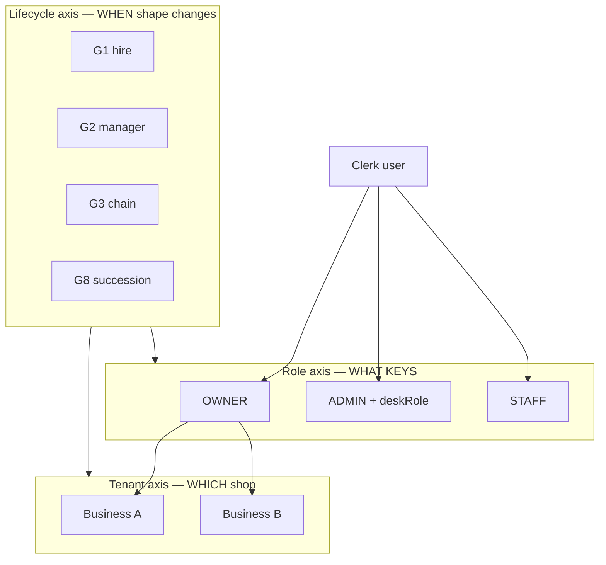
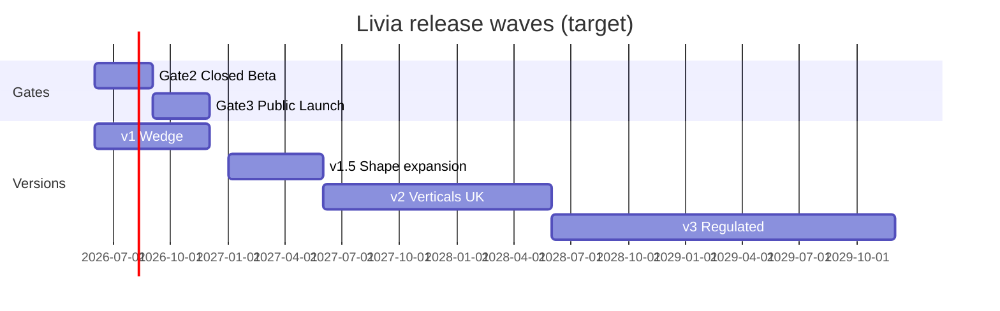

# Livia — Master Plan (one bow)

> **⚠ Superseded (2026-05-31)** for execution by [`LIVIA-WIDE-BUILD-PLAN.md`](./LIVIA-WIDE-BUILD-PLAN.md) + [`LIVIA-BUILD-PLAN-V2.md`](./LIVIA-BUILD-PLAN-V2.md). Strategy sections remain useful reference.

**Status:** Archived orchestration doc — 2026-05-21  
**Owner:** founder + product + engineering  
**Purpose:** One nested plan that ties **company strategy**, **business model**, **product promise**, **platform architecture**, and **sprint execution** into a single hierarchy. Everything else is an **annex**, not a competing plan.

**Relationship to other “master” docs:**

| Doc | Role |
|-----|------|
| **[`LIVIA-IDEA-TO-REALITY.md`](./LIVIA-IDEA-TO-REALITY.md)** | **Idea → real life** — UX, architecture kernel, CRUD parity, docs/portal, company structure, definition of done |
| **This file (`LIVIA-MASTER-PLAN.md`)** | The **commercial bow** — why, who, when (waves), how (sprints), money, lifecycle |
| [`LIVIA-MASTER-BUILD-PLAN.md`](./LIVIA-MASTER-BUILD-PLAN.md) | **Engineering phases** — contract-first build order, exit criteria, verification |
| [`LIVIA_MASTER_DESIGN.md`](./LIVIA_MASTER_DESIGN.md) | **Design target** — surfaces, constituencies, screen architecture |
| [`launch-plan.md`](../launch-plan.md) | **Gate acceptance** — Demo / Beta / Launch checklists |
| [`roadmap/`](../roadmap/) | **Version promises** — v1, v1.5, v2, v3 scope locks |

Read **this doc first** for orientation; open **BUILD-PLAN** when writing code; open **launch-plan** when declaring a gate passed.

---

## How to read this document

| Layer | What it answers | Where detail lives |
|-------|-----------------|-------------------|
| **0 — Constitution** | Why we exist; what we never become | §1 below · [`livia-bets.md`](../livia-bets.md) · [`livia-manifesto.md`](../livia-manifesto.md) |
| **1 — Market & economics** | Who pays; ROI; switching | [`persona-economics-and-switching.md`](../persona-economics-and-switching.md) · [`pricing-and-packaging.md`](../business/pricing-and-packaging.md) |
| **2 — Experience model** | Who sees what; hotel keys | [`personas.md`](../personas.md) · [`PERSONA-UX.md`](./PERSONA-UX.md) · [`lifecycle-map.md`](./lifecycle-map.md) |
| **3 — Platform** | Tenancy, roles, audit, billing | ADR 0002, 0009, 0010, 0015 · [`policy/`](../policy/) |
| **4 — Release waves** | v1 → v1.5 → v2 → v3 promises | [`roadmap/`](../roadmap/) |
| **5 — Gates** | Demo → Beta → Launch acceptance | [`launch-plan.md`](../launch-plan.md) |
| **6 — Sprint program** | What we build *when*, in order | §6 below (authoritative sequence) |
| **7 — Annex index** | Deep specs | §7 below |

**Rule:** If a decision conflicts with this doc, update **this doc first** (RFC + founder sign-off), then cascade to annexes. No more orphan “plan #47” docs.

---

## §1 — Constitution (the bow’s knot)

### Unit primitive

**Software you operate → Colleague you hire.**  
Everything—personas, graduations, pricing, UX rituals, voice, audit—exists to make Liv feel like a colleague inside the salon hierarchy, not a dashboard with AI.

### Beachhead (v1–v1.5)

| Dimension | Commitment |
|-----------|------------|
| Geography | EU, starting Ireland (IE) |
| Vertical | Hair + Beauty appointment businesses |
| Configuration | Solo (C2–C4), single-shop with manager (C5–C6), small chain (C7), chair-host (C10), multi-brand (C13) |
| Wedge modality | Voice + WhatsApp receptionist + ops cockpit |
| Anti-model | Marketplace customer ownership (Fresha/Booksy trade we refuse) |

### Ten bets (moat stack)

The bets in [`livia-bets.md`](../livia-bets.md) are not a wish list—they are **release filters**. A feature ships only if it strengthens at least one bet without violating another. The master program orders work by **bet dependency** (character → hierarchy → voice → audit → shape-fit → …).

### Three axes (never conflate)



| Axis | Storage | UX rule |
|------|---------|---------|
| **Tenant** | `businessId`; client `currentBusinessId` | ≥2 shops → switcher always visible |
| **Role** | `business_memberships.role` + `scope.deskRole` | API enforces; UI is not security |
| **Lifecycle** | Events + graduations G1–G8 | Surfaces suggestions; humans approve shape changes |

**Founder ≠ role.** Founder = OWNER + `businessCount ≥ 2` (derived). **Manager ≠ ADMIN generically** — reception is ADMIN + `deskRole: reception`.

---

## §2 — Who we serve (persona × configuration × vertical)

### Persona stack (inside the salon)

| ID | Name | Job-to-be-done | Home | Wave |
|----|------|----------------|------|------|
| P1 | Founder | Sunday triage, cross-shop | `/chain` | v1.5 depth |
| P2a | Owner + mgr | Ratify, trust Niamh | `/dashboard` | v1 critical |
| P2b | Working owner | Phone quiet, full chair | `/dashboard` | **v1 wedge** |
| P3 | Manager | Queue, rota, caps | `/inbox` | v1 critical |
| P4a/b | Senior | Chair, regulars | `/my-day` | v1 |
| P5 | Junior | Walk-in → rebook | `/my-day` | v1 |
| P6 | Reception | Floor calendar | `/bookings` | v1 (deskRole) |
| P7 | Customer | Book + chat | `/b/:slug` | v1 |

Full narratives: [`personas.md`](../personas.md). Matrix: [`persona-vertical-configuration-matrix.md`](../persona-vertical-configuration-matrix.md).

### Configuration graduations (lifecycle product)

| ID | Shape change | Monetization moment | Build status |
|----|--------------|---------------------|--------------|
| G1 | Solo → first hire | Solo → Studio tier | **Nudge built**; auto-tier TBD |
| G2 | + Manager (ADMIN) | + seat; cap ladder | **Nudge built** |
| G3 | + Second shop | Chain €/shop; concierge launch | **Checklist + nudge built** |
| G4 | Chain 6–15 | Volume tier | v2 |
| G5 | Chair-rental | Host + renter | v1.5 |
| G6 | Multi-brand | Per brand-shell | v1.5 |
| G7 | Partnership split | Concierge + legal | v1.5 (`partner-vote`) |
| G8 | Ownership succession | Succession pack € | **v1 core built**; dual-sign TBD |

Spec: [`configuration-graduation.md`](../journeys/configuration-graduation.md) · Map: [`lifecycle-map.md`](./lifecycle-map.md).

### Verticals (sequenced, not “all at once”)

| Vertical | v1 | v1.5 | v2 | v3 |
|----------|----|----|----|-----|
| Hair / barber | ● | ● | ● | ● |
| Beauty | ○ supported | ● | ● | ● |
| Body art | ○ | ○ | ● | ● |
| Wellness / fitness | | | ● | ○ |
| Medspa / allied / dental | | | | ● (regulated) |

● = primary · ○ = supported/onboarding path

---

## §3 — Business & monetization (tied to lifecycle)

### Revenue model (one sentence)

**Per-business base + per-seat + measurable voice outcome share** — aligned to F6 ROI cells; never security/GDPR/export as upsell.

| Component | Purpose | Example |
|-----------|---------|---------|
| Base | Liv lives here | Solo €79 · Studio €149 · Chain €249/shop |
| Seat | Per-persona depth | Mgr €15 · Staff €8 · Reception €10 |
| Voice share | Wedge capture | 4% recovered booking, capped |
| Add-ons | Optional trust | Peer insights €49 · locale packs |
| **Lifecycle one-shots** | Shape-change anxiety | Succession €750–2.5k · 2nd shop launch €1.5k · Migration broker |

### Lifecycle → SKU map (commercial bow)

| Moment | SKU | Owner |
|--------|-----|-------|
| Signup | 14-day trial → Solo/Studio self-serve | PLG |
| G1/G2 detected | In-app upgrade + concierge call | CS + product |
| G3 second shop | Chain checkout `shopCount` + launch pack | Sales-assisted |
| G8 succession | Succession pack + audit export | Concierge |
| Phorest leave | Migration broker (free → paid after DP100) | Ops |

Detail: [`pricing-and-packaging.md`](../business/pricing-and-packaging.md) · Motion: [`sales-motion.md`](../business/sales-motion.md).

### Company milestones (not sprint dates)

| Milestone | Definition |
|-----------|------------|
| **M0** | Gate 1 — demo locked |
| **M1** | Gate 2 — 10 DPs, real bookings, 7-day green |
| **M2** | Gate 3 — paid subs, Connect, stores public |
| **M3** | €1k MRR pipeline |
| **M4** | v1.5 acceptance (C7, C10, C13 live) |
| **M5** | €5M ARR path credible (multi-vertical EU) |

---

## §4 — Platform architecture (build once, many shapes)

### Core services (don’t splinter)

| Capability | Owner module | ADR / note |
|------------|--------------|------------|
| Auth + roles | `auth.ts`, memberships | 0003, 0009 |
| Tenancy | `businessId`, switcher | 0010 |
| Audit chain | `audit-log` | 0015 |
| Entitlements | `@workspace/entitlements` | 0018 |
| Billing | Stripe per business | RFC 0010 |
| Liv runtime | chat, voice, workflows | Inngest |
| Lifecycle | `lifecycle.service`, ownership transfer | **NEW — extend here** |
| Migrations | Phorest broker, CSV | onboarding-paths |

### Explicit non-goals per wave

| Wave | Not building |
|------|----------------|
| v1 | Org entity, consolidated invoice, REC DB enum, cross-shop PII |
| v1.5 | Franchise enterprise, US, marketplace |
| v2 | Medspa regulatory stack |
| v3 | SOC2 chain-per-tenant unless C9 customer |

---

## §5 — Release waves (product promise timeline)

Waves are **gated by acceptance**, not calendar. Dates are targets from [`roadmap/release-calendar.md`](../roadmap/release-calendar.md).



| Wave | Promise in one line | Persona/cell focus |
|------|---------------------|------------------|
| **v1** | Liv answers the phone; owner sees cockpit | P2b, P2a, P3, P6, P4, P5 × Hair IE |
| **v1.5** | Chain + host + brand + sr-w-admin + peer insights | +P1 C7, +C10, +C13, +P4b |
| **v2** | Beauty, body art, fitness, UK voice | Matrix v2 cells |
| **v3** | Medspa, allied, DACH, enterprise chain | Regulated packs |

Scope docs: [`v1-scope.md`](../roadmap/v1-scope.md) … [`v3-scope.md`](../roadmap/v3-scope.md).

---

## §6 — Sprint program (authoritative execution sequence)

**Program name:** `LIVIA-ONE`  
**Cadence:** 2-week sprints; Monday review per [`operating-cadence.md`](../operating-cadence.md)  
**Prioritization:** Gate blockers → wedge ROI → lifecycle retention → bet depth → expansion

### Program map (nested)

```
LIVIA-ONE
├── WAVE 0 — Align & harden (Sprints 0–2)     ← YOU ARE HERE
├── WAVE A — Gate 2 Closed Beta (Sprints 3–8)
├── WAVE B — Gate 3 Public Launch (Sprints 9–12)
├── WAVE C — v1.5 Shape expansion (Sprints 13–20)
├── WAVE D — v2 Verticals & UK (Sprints 21–28)
└── WAVE E — v3 Regulated & scale (Sprints 29+)
```

---

### WAVE 0 — Align & harden (Sprints 0–2)

**Outcome:** One story internally and externally; lifecycle spine trustworthy; no plan drift.

| Sprint | Theme | Engineering | Product/UX | GTM/Ops | Done when |
|--------|-------|-------------|------------|---------|-----------|
| **S0** | Master plan lock | OpenAPI: lifecycle + transfer routes; fix policy exports | This doc + link from README | DP interview guide references G8/G3 | All leads read §1–§6; no conflicting “next plan” |
| **S1** | Lifecycle completeness | Dual-sign transfer draft RFC; auto G1→Studio tier detector | Web onboarding carousel parity with mobile; REC invite in dashboard | Succession + 2nd-shop SKU in Stripe | E2E: hire → promote → transfer → keys ritual |
| **S2** | Trust & demo | Audit log on impersonation; chain rollup depth | `/experience` + `/lifecycle` in demo script | marketing-vs-reality audit pass | Gate 1 re-certified; Playwright lifecycle smoke |

**Dependencies:** S0 blocks parallel “random” feature work.

---

### WAVE A — Gate 2 Closed Beta (Sprints 3–8)

**Outcome:** 10 Dublin shops, real bookings, Liv on SMS, STAFF on My Day, founders on switcher.

| Sprint | Theme | Must ship |
|--------|-------|-----------|
| **S3** | Onboarding concierge | Hybrid onboarding checklist in-app; Phorest broker happy path | 
| **S4** | Voice wedge | Twilio provision; voice eval suite; missed-call attribution → billing meter |
| **S5** | Manager depth | Cap ladder UI; refund queue; manager digest ≠ owner digest |
| **S6** | Staff adoption | Mobile ritual parity; SMS day-list for juniors; push |
| **S7** | Founder multi-shop | Chain rollup reports (top 3); per-shop billing clarity | 
| **S8** | Gate 2 proof | 10 DPs × real booking; Sentry 7-day green; transcripts filed | 

**Gate 2 exit:** [`launch-plan.md`](../launch-plan.md) § Gate 2 criteria — all green 7 days.

---

### WAVE B — Gate 3 Public Launch (Sprints 9–12)

**Outcome:** Paid subs, public stores, livia.io, legal live.

| Sprint | Theme | Must ship |
|--------|-------|-----------|
| **S9** | Billing PLG | Stripe Checkout Solo/Studio; trial→paid; in-app upgrade on G1 |
| **S10** | Connect & deposits | Stripe Connect; deposit bind; tip flow |
| **S11** | Marketing truth | livia.io hero + pricing + legal; changelog; status page |
| **S12** | Launch | App Store + Play public; PH kit; first organic + first € paid |

**Gate 3 exit:** launch-plan § Gate 3.

---

### WAVE C — v1.5 Shape expansion (Sprints 13–20)

**Outcome:** Chair-host, chain at depth, multi-brand, peer insights, promotions.

| Sprint | Theme | Must ship |
|--------|-------|-----------|
| **S13–S14** | C10 chair-rental | Renter tenant; host dashboard; data-leave walkthrough |
| **S15–S16** | C7 chain ops | staff-borrow; chain Sunday digest; cross-shop KPI set |
| **S17** | C13 multi-brand | Brand switcher; isolation tests; portfolio rollup |
| **S18** | People workflows | staff-promotion-flow; hire intake (MVP) |
| **S19** | C12 partnership | partner-vote; dual-OWNER billing rules |
| **S20** | Intelligence | peer-set k≥10 insights; opt-in UX |

**v1.5 exit:** [`v1.5-scope.md`](../roadmap/v1.5-scope.md) acceptance checklist.

---

### WAVE D — v2 Verticals & UK (Sprints 21–28)

**Outcome:** Beauty + body art + fitness packs; EN-UK voice; Fresha/Square brokers.

| Sprint block | Focus |
|--------------|-------|
| S21–S22 | Vertical packs (booking shape, consent, deposits) |
| S23–S24 | Body art design-proof + age gate |
| S25–S26 | Fitness classes + PARQ |
| S27–S28 | UK locale + Nordics prep |

---

### WAVE E — v3 Regulated & scale (Sprints 29+)

**Outcome:** Medspa/allied with regulatory partnership; DACH; enterprise chain.

See [`v3-scope.md`](../roadmap/v3-scope.md). RFC required before sprint kickoff.

---

## §6.1 — Five lanes × sprint allocation (every sprint)

Each sprint allocates **capacity** across launch-plan lanes (never skip Compliance):

| Lane | Typical % | Sprint obligation |
|------|-----------|-------------------|
| **Engineering** | 55% | Vertical slice + tests + observability |
| **Brand** | 10% | Copy/assets for what shipped |
| **Compliance** | 15% | C-items from launch-plan for touched surfaces |
| **Launch ops** | 10% | Env, Stripe, Twilio, stores |
| **GTM** | 10% | DP feedback, digest, sales collateral |

Reference backlog: [`launch-plan.md`](../launch-plan.md) § Per-lane backlog.

---

## §6.2 — What’s built vs program (honest scorecard)

| Capability | Status | Wave |
|------------|--------|------|
| Roles OWNER/ADMIN/STAFF | Shipped | v1 |
| Persona rituals + nav | Shipped | v1 |
| Business switcher (web) | Shipped | v1 |
| Chain rollup + `/chain` | Shipped (depth thin) | v1.5 |
| G8 transfer + audit + keys ritual | **Shipped (v1 simple)** | v1 |
| Lifecycle nudges G1–G3, G8 | Shipped | v1 |
| deskRole manager/reception | Shipped | v1 |
| Mobile tier onboarding | Shipped | v1 |
| Dual-sign succession | Not built | S1 |
| OpenAPI lifecycle hooks | Not built | S0 |
| Web onboarding carousel | Not built | S1 |
| Auto tier on G1 | Not built | S9 |
| Chair-rental C10 | Not built | S13 |
| partner-vote C12 | Not built | S19 |
| staff-promotion-flow | Not built | S18 |
| Org billing | Deferred | post–M4 |

---

## §7 — Annex index (deep specs — not duplicate plans)

| Topic | Document |
|-------|----------|
| Personas & psychology | [`personas.md`](../personas.md) |
| Messaging | [`messaging-by-persona.md`](../brand/messaging-by-persona.md) |
| Economics & switching | [`persona-economics-and-switching.md`](../persona-economics-and-switching.md) |
| Onboarding modes | [`onboarding-paths.md`](../journeys/onboarding-paths.md) |
| Lifecycle moments | [`lifecycle-moments.md`](../journeys/lifecycle-moments.md) |
| Configurations C1–C13 | [`configurations.md`](../configurations.md) |
| Workflows | [`workflows/`](../workflows/) |
| Features | [`features/`](../features/) |
| ADRs | [`adr/`](../adr/) |
| Demo narrative | [`demo-script.md`](../demo-script.md) |
| Testing E2E | [`testing/FULL-LIVIA-EXPERIENCE.md`](../testing/FULL-LIVIA-EXPERIENCE.md) |
| Internal ops | [`company/livia-internal-portal-spec.md`](../company/livia-internal-portal-spec.md) |
| Exit / acquirer | [`company/exit-and-acquirer-thesis.md`](../company/exit-and-acquirer-thesis.md) |

---

## §8 — Decision rules (stop the plan spiral)

1. **New work** → maps to a sprint in §6, a wave in §5, and a bet in `livia-bets.md`. If it maps to none, it waits.
2. **New doc** → either updates an annex OR adds one row to §7 — never a parallel “plan.”
3. **Scope creep** → RFC per [`governance/rfc-process.md`](../governance/rfc-process.md); master plan §6 amended in same PR.
4. **Marketing claim** → row in `marketing-vs-reality.md` with target gate/version.
5. **Persona request** → check matrix; if cell empty, v2+ or never — don’t improvise in sprint.

---

## §9 — Critical path (next 90 days)


**If you only do three things before Gate 2:**

1. **Voice answers a real call** and books (wedge proof).  
2. **Manager inbox + cap ladder** (P3 retention).  
3. **Lifecycle E2E** (G8 + G3) so shape-changes don’t leak customers.

---

## §10 — How teams use this weekly

| Role | Monday action |
|------|----------------|
| Founder | Pick **one** sprint theme; reject unmapped asks |
| Engineering | Pull sprint backlog from §6; link PRs to sprint ID |
| Product/UX | Update `lifecycle-map` + persona UX when surface changes |
| GTM | Match outreach to wave persona; no v2 verticals in copy |
| Ops | Gate checklist from launch-plan |

**Sprint naming:** `S{n}-<theme>` e.g. `S1-lifecycle-parity`.

---

*This document is the bow. Pull any thread—it should trace to §1 constitution, §2 who, §5 when, or §6 how.*
