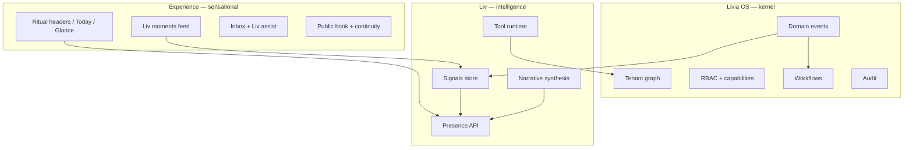

# Livia — North star (fresh POV, 2026)

**Status:** Active — the *why* behind every ship  
**Audience:** founder, product, design, engineering  
**Execution:** [`PLATFORM-BUILT-RIGHT.md`](./PLATFORM-BUILT-RIGHT.md) · [`V3-EXECUTION-PROGRAM.md`](./V3-EXECUTION-PROGRAM.md)

---

## The one sentence

**Livia is the operating system for appointment businesses that refuse to bleed revenue in the gap between “booked online” and “showed up on the chair” — and Liv is the colleague who never forgets a client, never drops a thread, and never speaks nonsense.**

Not: booking software with AI.  
Not: a calendar with a chatbot.  
**An OS with a voice.**

---

## The enemy (what we kill)

| Enemy | What it feels like | Livia answer |
|-------|-------------------|--------------|
| **Channel chaos** | DM → website → phone → walk-in; nothing connects | One continuity graph per booking |
| **No-show drift** | Empty chair, awkward chase | Workflows + Liv recovery tone |
| **Inbox guilt** | 14 unread WhatsApps at 9:01 | Handoff, Liv draft, desk rituals |
| **Founder blindness** | Three shops, three tabs, no pulse | Chain Glance + portfolio Liv line |
| **Fake AI** | Same greeting at every salon | Tenant facts → Liv synthesis |
| **Staff tool sprawl** | Five apps to run Tuesday | Today / My Day / one thread |

---

## Sensational = five feelings (non-negotiable)

### 1. *She’s in the room*

Liv is not a settings toggle. She appears on **Today** before you scroll: one true line, then moments when something just happened (“New booking from WhatsApp · 2m ago”). Operators should feel watched-over in a *good* way — like a brilliant floor manager who already read the diary.

### 2. *The shop has a pulse*

Every surface shows **live state**: pending confirmations, handed-off threads, no-shows, next client in N minutes. Motion is subtle; urgency is honest (watch vs act). Colour means priority, not decoration.

### 3. *Roles are different lives*

Founder ≠ owner ≠ manager ≠ senior stylist ≠ reception. **Different homes, different Liv lines, different actions.** Demo with real emails or we fail the story.

### 4. *Customers feel continuity*

Public `/b` confirm is not a dead end — **Next steps**, channel handoff, Liv on SMS/WA with the same policy. The brand voice follows them home.

### 5. *We are embarrassingly honest*

Matrix and `IDEA-TO-REALITY` say what’s missing. Marketing never claims internal Liv until internal portal ships it. Trust compounds.

---

## Product architecture (three layers)

---

## Magic moments catalog (build toward)

| Moment | Trigger | User sees | System does |
|--------|---------|-----------|-------------|
| **Morning breath** | 06:00 local | Liv briefing card | Facts → Claude narrative |
| **Fresh booking** | `booking.created` | Moment chip + line refresh | Signal + debounced briefing regen |
| **Confirmed** | `booking.confirmed` | Timeline + moment | Signal |
| **No-show sting** | `booking.no-show` | Coach moment (act) | Signal + no-show workflow |
| **Handoff** | `conversation.updated` → HANDED_OFF | “Liv stepped back” | pause_liv signal |
| **Stuck web book** | 24h pending continuity | Owner queue | continuity workflow |
| **Founder pulse** | Chain rollup | Glance badges | Portfolio Liv line |
| **Staff next** | My Day | “Maya in 12m” | stats presence |
| **Internal triage** | eval rollback | Internal Liv | livia_internal tools |

---

## Business POV (why this wins)

1. **Wedge stays operational** — We sell recovered revenue and calmer Tuesdays, not “AI transformation.”  
2. **Expansion is structure** — Second location, chair renter, franchise = same OS, new policy pack.  
3. **Moat is graph + audit** — Switching cost is conversations + bookings + policy history, not UI skin.  
4. **Liv is the brand** — Customers meet Liv; staff trust Liv; founders rely on Liv. Dashboard is the cockpit, not the hero.

---

## 90-day sensational bar

| By day | Bar |
|--------|-----|
| **30** | Liv presence + moments on web/mobile; signals on all booking + handoff events; demo walkthrough green |
| **60** | Staff Liv assist default in inbox; continuity timeline on every booking; public next-steps parity |
| **90** | Internal Liv in portal; eval gate on voice; matrix row honest for enterprise claims |

---

## How to use this doc

- **Founder:** Gut-check pitches and screenshots against § Sensational.  
- **Design:** Every screen maps to a magic moment or cut it.  
- **Engineering:** If it doesn’t emit an event or show up in presence/moments, it’s not OS-grade yet.

When in doubt: **would JARVIS say this exact sentence at this shop right now?** If not, keep building.
