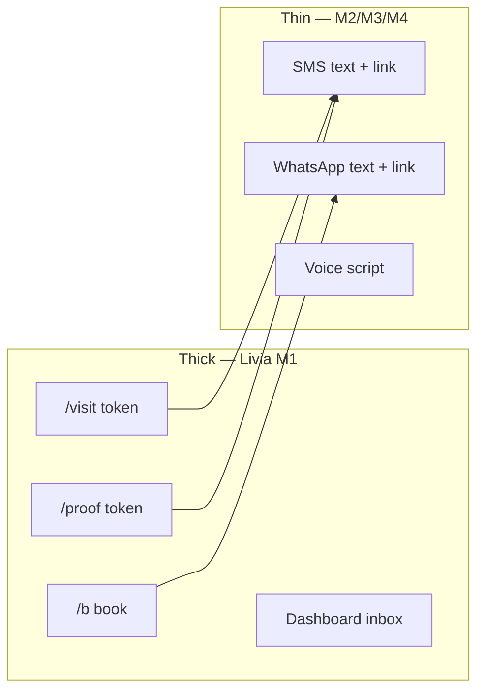

# Livia platform flows — nested, programmatic, complete

**Status:** canonical (2026-05-29)  
**Audience:** founder, product, engineering, agents  
**Parent:** [`LIVIA-PLATFORM-LIFECYCLE.md`](./LIVIA-PLATFORM-LIFECYCLE.md) (skins, seed, signup)  
**Supersedes:** ad-hoc “channel vs app” debates — one rule platform-wide.

---

## 0. Platform-wide rule (founder lock)

| Layer | Role | What happens here |
|-------|------|-------------------|
| **Thick — Livia (M1 guest + tenant)** | Rich work | Images, forms, approvals, design proofs, consent, deposits UI, booking, inbox, day-of |
| **Thin — off-platform (M2/M3/M4)** | Transport only | Reminders, links to guest pages, YES/NO/lates, voice scripts — **not** media collaboration |

**Do not** rely on MMS or WhatsApp image tennis for core workflows. Channels **notify and nudge**; Livia **hosts collaboration**. Customer still **never logs in** — guest token links (`/b/{slug}/…/{token}`) are the customer-side thick surface.

**Programmatic rule:** Every step in a flow must have **policy definition + API + event + internal `surfaceId`** (where user-facing).

---

## 1. Nested flow model (top to bottom)

```text
PLATFORM FLOW (Livia Inc)
├── Discover → account → business seed → onboarding → go-live
├── Internal ops (exec · support · tenants · investigate)
└── Per-tenant runtime (vertical pack + preset + entitlements)

    VERTICAL FLOW (capability pack — 9 heartland verticals)
    ├── Business tools (W4 modules: proofs, classes, medspa hub, …)
    ├── Customer guest tools (W5: book · visit · proof · consent · pay)
    ├── Channel templates (thin SMS/WA copy + deep links)
    └── Seed data + gates (API routes, vocabulary, playbook)

        PERSONA FLOW (within tenant)
        ├── P1 founder / P2 owner / P3–P6 staff → dashboard + mobile
        └── P7 customer → guest surfaces + thin channel replies

            ARTIFACT FLOW (single booking / conversation / proof)
            ├── conversation → booking → continuity → reminder → day-of
            └── proof: draft → pending_review → approved → deposit → session
```

Each inner flow **inherits** outer context (`businessId`, `vertical`, `jurisdiction`, `planId`) — never re-resolved in UI.

---

## 2. Three toolkits (every vertical must have all three)

### 2.1 Business toolkit (W4 — owner/staff)

**Job:** Run the shop inside Livia.

| Category | Examples | Vertical-specific modules |
|----------|----------|---------------------------|
| **Core (all verticals)** | Inbox, Today, bookings, customers, services, staff, hours, Liv settings, policy, billing | — |
| **Continuity** | Thread view, handoff, Liv assist | Same spine |
| **Vertical power** | See §4 matrix | design-proofs, class sessions, medspa procedures, pet profiles, … |
| **Go-live** | Onboarding wizard, activation checklist, public intake panel | `getVerticalOnboardingExtras()` |

### 2.2 Customer toolkit (W5 — P7 guest, no login)

**Job:** Everything the end customer must do **without** a Livia account.

| Guest surface | Route pattern | Status | Used by |
|---------------|---------------|--------|---------|
| **Book + Liv chat** | `/b/{slug}` | ✅ shipped | All |
| **Visit / day-of** | `/b/{slug}/visit/{token}` | ✅ shipped | All |
| **Design proof collab** | `/b/{slug}/proof/{token}` | 🔲 build | body-art |
| **Consent / intake** | `/b/{slug}/book` (step) + optional `/intake/{token}` | 🟡 partial | medspa, allied-health |
| **Deposit pay** | Stripe link (guest checkout) | 🟡 partial | deposit verticals |
| **Waitlist accept** | SMS keyword + optional guest page | 🟡 partial | fitness |
| **Reschedule / cancel** | visit token or channel keyword | 🟡 partial | All |

**Rule:** If a vertical needs images, signatures, or multi-step approval → **guest M1 page**, not channel media.

### 2.3 Internal Livia toolkit (W3 — ops)

**Job:** Support tenants and platform ship without touching tenant presets.

| Module | Flow supported |
|--------|----------------|
| **Exec cockpit** | Ship lane, gates, exceptions, hats |
| **Support workspace** | Thread/board/radar; ticket ↔ tenant ↔ `surfaceId` |
| **Tenant directory** | Health, vertical, plan, impersonation (future) |
| **Investigate** | `requestId`, registry paths, Sentry |
| **Workforce / access** | Goldspire, beta grants |
| **Monitoring** | Stuck continuity, public URL smoke |

Internal never implements vertical **business** logic — it **observes and unblocks** tenant/guest flows.

---

## 3. Thick vs thin — channel contract (platform-wide)



| Channel may send | Channel must NOT be primary for |
|------------------|----------------------------------|
| Reminder text | Design proof review |
| “Your design is ready: {url}” | Consent form signing |
| “Reply LATE if running behind” | Service menu browsing |
| Deposit link URL | Multi-image reference boards |
| Booking confirm + ICS | Medspa procedure catalog |

Full rules: [`CHANNEL-UX-CONTRACT.md`](../design/CHANNEL-UX-CONTRACT.md) Part 1b.

---

## 4. Vertical completeness matrix

Each row = **minimum** for that vertical to be “fully tooled” on Livia. Empty cells = 🔲 build backlog.

| Vertical | Business tools (W4) | Customer guest (W5) | Thin channel copy | Internal ops hooks |
|----------|-------------------|----------------------|-------------------|-------------------|
| **hair** | inbox, timeline, running-late | book, visit, chat | continuity SMS | `public.booking`, `inbox.*` |
| **beauty** | inbox, patch-test on services | book, visit | DM→book templates | same |
| **body-art** | **design-proofs**, proposals, pipeline home | book, visit, **proof token** | “proof ready” link | `design-proofs.*` |
| **wellness** | packages, buffers | book, visit | calm reminders | same |
| **fitness** | **classes**, waitlist, roster home | book, visit, waitlist accept | class cancel offer | `class-sessions.*` |
| **medspa** | **medspa hub**, procedures, consent admin | book + **consent step**, visit | clinical tone templates | medspa routes |
| **allied-health** | long-slot policy | book + intake guards, visit | policy windows | same |
| **pet-grooming** | pet on customer profile | book + **pet step**, visit | pickup SMS | same |
| **automotive** | vehicle tiers on services | book + vehicle step, visit | bay timing | same |

**Catalog source:** `vertical-playbooks.ts`, `wedge-gate.ts`, `vertical-onboarding.ts`, `VERTICAL_COVERAGE_REGISTRY`.

**Honesty:** A vertical is **beta-full** only when business + guest + channel templates + support `surfaceId`s exist for its hero workflow ([`vertical-coverage.ts`](../../lib/policy/src/vertical-coverage.ts) tier).

---

## 5. End-to-end example — body-art (reference vertical)

```text
1. P7 lands /b/ink-anchor (thick) → consult book
2. Continuity SMS (thin): "Consult booked — upload refs here: …/visit/{token}" OR proof later
3. Artist uploads proof (W4 design-proofs)
4. SMS (thin): "Design ready: …/proof/{token}"
5. P7 approves on guest proof page (thick) — comments, version, approve
6. Deposit link on proof page (thick Stripe guest)
7. Session booked (W4 + W5)
8. Reminder SMS (thin) → visit token day-of (thick)
9. Staff sees full thread in Inbox (W4)
10. Support uses surfaceId + tenant if stuck (W3)
```

Same **pattern** applies to medspa (consent page), fitness (waitlist page), etc. — only the **guest surface type** changes.

---

## 6. Programmatic spine (every flow)

| Layer | Contract |
|-------|----------|
| **Policy** | Vertical pack, playbook, onboarding extras, continuity templates, guest surface registry (Track G1) |
| **API** | OpenAPI paths; public routes under `/api/public/b/:slug/*`; tenant under `/api/businesses/:id/*` |
| **Events** | `BOOKING_CREATED`, `BOOKING_CONTINUITY_SENT`, `design-proof.*`, … → Inngest |
| **Identity** | Customer = phone/email scoped to business; guest = opaque token; no P7 Clerk |
| **Experience** | `GET /me/tenant-experience` (W4); public bootstrap (W5) |
| **Support** | `surfaceId` on tickets; registry row → code paths (Track B) |
| **Internal** | Ticket enrichment, investigate, exec snapshot |

**Anti-pattern:** Vertical workflow only documented in Figma or only reachable from WhatsApp — must exist as guest route + API + test.

---

## 7. Build program (cross-track)

| Track | Delivers flow completeness |
|-------|---------------------------|
| **D** | Tenant preset, `/b` skin, vertical ritual homes |
| **F** | Marketing/gateway/internal UX |
| **B/C** | Support `surfaceId`, investigate |
| **G — Guest collaboration** | Guest surface registry + per-vertical token pages (NEW) |

### Track G — Guest surfaces (platform-wide)

| ID | Task | Verticals |
|----|------|-----------|
| G0.1 | `lib/policy/src/guest-surfaces.ts` — registry: id, route pattern, verticals[], events | all |
| G0.2 | Token issue/validate service (reuse `booking_guest_access` pattern) | all |
| G1.1 | **Proof guest page** `/b/:slug/proof/:token` | body-art |
| G1.2 | Proof ↔ design-proofs.service sync + notify SMS | body-art |
| G2.1 | Medspa consent guest polish on `/b` book + token revisit | medspa |
| G2.2 | Fitness waitlist guest accept page | fitness |
| G3.1 | Channel templates: link-only, no media dependency | all |
| G3.2 | E2E per vertical hero workflow | beta-full verticals |
| G4.1 | Support registry entries for each guest `surfaceId` | all |

Estimate: ~15 eng-days after G0. Parallel with Track D5 (public `/b`).

---

## 8. Verification — “does the platform flow?”

| Check | Pass when |
|-------|-----------|
| Vertical hero workflow | Runnable without WhatsApp images |
| Web-only customer | Phone → SMS link → guest page → Inbox visibility |
| Business never leaves W4 for core job | Proof/class/consent in dashboard/mobile |
| Internal can debug | Ticket has `surfaceId` + `requestId` → registry |
| Programmatic | Demo seed + API tests cover vertical hero path |
| No vertical forgotten | `VERTICAL_COVERAGE_REGISTRY` tier matches §4 matrix |

---

## 9. Related docs

| Doc | Role |
|-----|------|
| [`LIVIA-PLATFORM-LIFECYCLE.md`](./LIVIA-PLATFORM-LIFECYCLE.md) | Signup → seed → skins |
| [`CHANNEL-UX-CONTRACT.md`](../design/CHANNEL-UX-CONTRACT.md) | M2 thin transport rules |
| [`PUBLIC-BOOKING-INTAKE-E2E.md`](./PUBLIC-BOOKING-INTAKE-E2E.md) | Customer book → business intake |
| [`PERSONA-VERTICAL-SURFACE-MATRIX.md`](../design/PERSONA-VERTICAL-SURFACE-MATRIX.md) | P×V×surface routing |
| [`PLATFORM-EVOLUTION-AND-OPS-PROGRAM.md`](./PLATFORM-EVOLUTION-AND-OPS-PROGRAM.md) | Tracks A–G checklist |
| [`SUPPORT-POINTS-AND-INVESTIGATION.md`](../operations/SUPPORT-POINTS-AND-INVESTIGATION.md) | Internal ops wiring |

---

## Changelog

| Date | Change |
|------|--------|
| 2026-05-29 | Initial — thick/thin model, three toolkits, vertical matrix, Track G |
