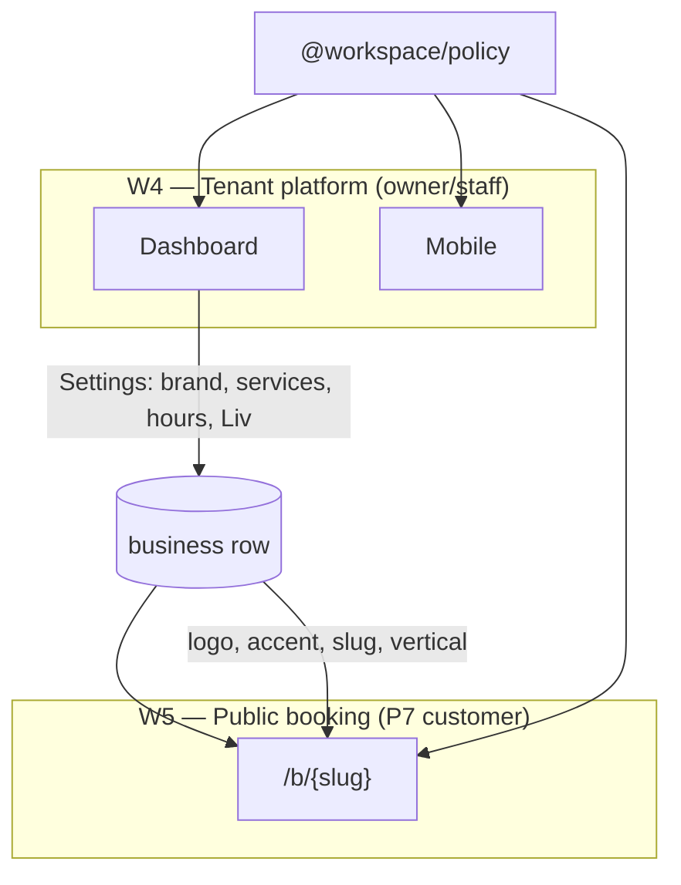
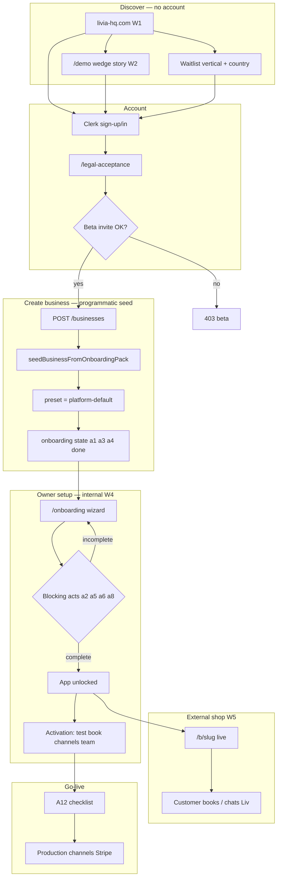

# Livia platform lifecycle — beginning to end (programmatic)

**Status:** canonical (2026-05-29)  
**Audience:** founder, product, engineering, agents  
**Purpose:** One map of **who touches what**, **which skin applies where**, **what is pre-seeded**, and **how the full journey runs in code** — not UX mockups alone.

**Reads with:** [`TENANT-EXPERIENCE-CONTRACT.md`](../product/TENANT-EXPERIENCE-CONTRACT.md) · [`BETA-ONBOARDING-FLOW.md`](../product/BETA-ONBOARDING-FLOW.md) · [`LIVIA-PLATFORM-FLOWS.md`](../product/LIVIA-PLATFORM-FLOWS.md) · [`PLATFORM-SURFACES-BUILD-SPEC.md`](./PLATFORM-SURFACES-BUILD-SPEC.md) · [`EXPERIENCE-ARCHITECTURE.md`](./EXPERIENCE-ARCHITECTURE.md) · [`PLATFORM-RELEASE-PROGRAM.md`](../product/PLATFORM-RELEASE-PROGRAM.md) · [`VISUAL-INHERITANCE-AND-BRAND-LOCKS.md`](../design/VISUAL-INHERITANCE-AND-BRAND-LOCKS.md)

---

## 0.1 Platform-wide collaboration rule

**Thick work on Livia (guest + tenant M1). Thin transport on SMS/WhatsApp/voice (links + reminders only).** Every vertical ships **business tools + customer guest tools + internal ops hooks**. Full nested model: [`LIVIA-PLATFORM-FLOWS.md`](../product/LIVIA-PLATFORM-FLOWS.md).

## 0. Executive summary

Livia is **not one app with one theme**. It is a **stack of surfaces**, each with its own chrome, connected by **policy + API**:

```text
Prospect (P?)     →  Marketing skin (livia-hq.com)
                         ↓
Prospect / demo   →  Gateway skin (/demo, sign-in)
                         ↓
Livia Inc ops     →  Internal skins (exec · support · other ops modules)
                         ↓
Business owner    →  Tenant skin (Platform Default on signup → optional vertical presets)
                         ↓
End customer (P7) →  Public booking skin (/b/{slug} — business brand × vertical template)
```

**Design principle:** Pre-set everything we can from **vertical + jurisdiction** so owners **finish setup**, not **invent setup**. They still get tools to customize **internal ops** (dashboard/mobile) and **external shop** (public booking + brand).

**Programmatic rule:** If a human can do it in the product, there must be an **API + policy path** that does the same without the UI (demo seed, onboarding, tenant experience, public book).

### 0.2 Programmatic north-star (company — not UI alone)

**North-star UI** is what screens should look like. **Programmatic north-star** is what Livia **is** as a business and product:

| Principle | Meaning for design & build |
|-----------|---------------------------|
| **Policy-first** | Vertical, jurisdiction, preset, guest surface, and ops behaviour live in `@workspace/policy` — UI is a renderer, not the source of truth |
| **Seed, don't configure** | Signup creates a *complete* business skeleton (legal, catalog, rituals, guest flows) — owners finish, not invent |
| **Every journey is an API** | Prospect → demo → tenant → P7 guest must run headless (scripts, agents, CI) — same paths as clicks |
| **Extend, don't overhaul** | New verticals/surfaces add rows to policy + routes; no one-off skins or manual founder steps |
| **Thick Livia, thin channels** | Product value on Livia pages; SMS/WA/voice carry links only — design for tokenized guest URLs from day one |

**Wedge proof** ([`NORTH-STAR-DASHBOARD.md`](../company/NORTH-STAR-DASHBOARD.md)) is the *market* north-star. **Programmatic platform** is the *engineering/product* north-star that makes 10 shops → 10,000 shops possible without multiplying ops headcount.

| **Design implication:** Mockups, logos, and presets are direction — but acceptance is “does the full lifecycle run in code?” See §10 verification.

**Surface programs (design before build — 2026-05-30):** [`VISUAL-INHERITANCE-AND-BRAND-LOCKS.md`](../design/VISUAL-INHERITANCE-AND-BRAND-LOCKS.md) · Marketing [`MARKETING-SURFACE-PROGRAM.md`](../design/MARKETING-SURFACE-PROGRAM.md) · Gateway [`GATEWAY-SURFACE-PROGRAM.md`](../design/GATEWAY-SURFACE-PROGRAM.md) · Support [`INTERNAL-SUPPORT-PLATFORM-SPEC.md`](./INTERNAL-SUPPORT-PLATFORM-SPEC.md) · Exec [`INTERNAL-EXEC-COCKPIT-SPEC.md`](./INTERNAL-EXEC-COCKPIT-SPEC.md) · Public `/b` [`PUBLIC-B-SURFACE-SPEC.md`](./PUBLIC-B-SURFACE-SPEC.md) · Releases [`PLATFORM-RELEASE-PROGRAM.md`](./PLATFORM-RELEASE-PROGRAM.md)

---

## 1. Skin hierarchy — five worlds (do not merge)

| # | World | Who | Artifact / URL | Skin name | Tenant preset picker? | Policy source |
|---|-------|-----|----------------|-----------|----------------------|---------------|
| **W1** | **Marketing** | Prospects | `livia-marketing` → livia-hq.com | **Aurora Editorial** (Livia Inc brand) | No | Fixed platform chrome |
| **W2** | **Gateway** | Prospects trying demo / sign-up | `livia-dashboard` `/demo`, `/sign-in` | **Gateway aurora** (extends W1) | No | Fixed |
| **W3a** | **Internal exec** | `@livia-hq.com`, Goldspire exec | `livia-internal` FounderCockpitView | **Ops amber — exec** (Ship Lane, Hats, workforce ledger R2) | No | Internal shell I0 + `exec_work_events` (Track H) |
| **W3b** | **Internal support** | Livia support operators | `livia-internal` `/support/*` | **Ops amber — support** (Thread/Board/Radar) | No | Same INTERNAL family, support module chrome |
| **W3c** | **Internal other** | Ops (tenants, flags, …) | `livia-internal` other routes | **Ops amber — modules** | No | Inherits I0 sidebar |
| **W4** | **Tenant platform** | Owner, staff, manager (P1–P6) | `app.` dashboard + mobile | **Platform Default** on signup; owner may switch to **vertical presets** (4 per vertical) | Yes (staging → prod) | `GET /me/tenant-experience` + `presentation_preset_id` |
| **W5** | **Public + guest** | End customers (P7) | `/b/{slug}` + token pages | **Business brand × vertical template × guest surface type** | Brand fields; vertical drives flow | `publicExperienceSkin` + guest tokens |
| **W6** | **Guest hub (R2)** | End customers (P7) cross-shop **self** view | `my.livia-hq.com` | **Liv Guest** — phone OTP, favorites, book-again | Opt-in on first book | [`GUEST-CONTINUITY-HUB-SPEC.md`](./GUEST-CONTINUITY-HUB-SPEC.md) |

**W5 guest surfaces (thick — no login):** book/chat, visit, proof (body-art), consent (medspa), pay, waitlist accept. Channels only **link** here. See [`LIVIA-PLATFORM-FLOWS.md`](../product/LIVIA-PLATFORM-FLOWS.md) §2.2.

### 1.1 Critical boundaries

| Do | Don't |
|----|-------|
| Marketing sets **Livia Inc** narrative | Apply tenant `presentation_preset_id` to livia-hq.com |
| New business gets **`platform-default`** preset (Aurora tenant chrome) | Force vertical-native preset on signup without owner consent |
| Public `/b` uses **vertical P7 flows** (consult, consent, class, …) | Show internal amber stripe on tenant or public apps |
| Exec + support share **INTERNAL** identity boundary | Put exec ship lane inside tenant `/chain` |
| End customer page reflects **that business** (name, logo, slug) | Make `/b` look identical across all verticals |

### 1.2 How W4 and W5 relate



- **W4** = how the **business runs** Livia (inbox, today, settings, onboarding).
- **W5** = how **their customers** book — same business data, different persona, vertical-specific steps on top of shared booking core.

---

## 2. Full lifecycle — beginning to end

### 2.1 Master flow



### 2.2 Phase map (human labels)

| Phase | Name | Surface | Exit criteria |
|-------|------|---------|---------------|
| **−1** | Discover | W1, W2 | Prospect understands wedge; optional waitlist |
| **0** | Account + gates | W2 | Clerk session + platform legal + beta allowed |
| **1** | Business born | API | `businessId`, seed data, Platform Default preset |
| **2** | Internal setup | W4 wizard | Blocking acts complete → `appUnlocked` |
| **3** | External shop ready | W5 | Public link act + `/b/{slug}` renders with vertical flows |
| **4** | Activation | W4 | Test booking, channels started, team optional |
| **5** | Go-live | W4 | A12 checklist; ops confidence |
| **6** | Run | W4 + W5 + channels | Customers book; staff operate; Liv runs continuity |
| **∞** | Livia ops | W3 | Support, exec, tenant admin — parallel track |

---

## 3. What happens programmatically on signup

### 3.1 Trigger chain

```text
POST /api/businesses
  → evaluateBetaSignup(email)
  → hasCurrentPlatformLegal(user)
  → createBusiness(userId, { name, slug, vertical, jurisdiction, … })
  → seedBusinessFromOnboardingPack(businessId)   [if seedDefaults !== false]
  → onboarding state = afterBusinessCreatedStateWithSeed()
  → (Track D2) presentation_preset_id = "platform-default"
  → GET /me/tenant-experience?businessId=…
  → dashboard/mobile apply theme; public API serves experienceSkin
```

### 3.2 Pre-seeded on create (owner does not start from zero)

| Domain | What | Source in code | Owner can edit later |
|--------|------|----------------|----------------------|
| **Vertical pack** | `vertical` enum | `POST` body or category inference | Rarely |
| **Jurisdiction** | country, currency, locale, timezone, EU region | `getJurisdictionPack()` | Settings |
| **Service menu** | 3–6 default services + prices | `vertical.defaultServices` → `createService` | Services CRUD |
| **Staff template** | 1 stylist/artist/therapist row + service links | `vertical.defaultStaff` | Staff CRUD |
| **Liv greeting** | AI intro line with shop name | `resolveOnboardingDefaults().aiGreeting` | Settings → Liv |
| **Vocabulary** | client/stylist/location nouns | `businessVocabulary()` | No (vertical-driven) |
| **Home modules** | Which widgets appear first | `getVerticalPlaybook().homeModules` | Persona + vertical |
| **Public CTA** | “Book your visit” vs “Request a consult” | `playbook.publicCta` | Brand settings (future) |
| **Public shell** | warm / bold / clinical / … | `publicExperienceSkin(vertical, country)` | Via preset + brand |
| **Presentation preset** | **Platform Default (Aurora)** | `PLATFORM_DEFAULT_PRESET_ID` | Settings → Appearance |
| **Onboarding acts** | a1, a3, a4 marked complete | `AUTO_COMPLETED_ON_CREATE_ACTS` | — |
| **Operational policy** | cancel window, deposit defaults | jurisdiction + `parseOperationalPolicy` | Settings → Policy |
| **Channel hints** | SMS vs WA priority copy | jurisdiction channel pack | Settings → Comms |
| **Onboarding hints** | Vertical-specific go-live tips | `getVerticalOnboardingExtras()` | Read-only in wizard |
| **Feature gates** | medspa, classes, design proofs routes | `withBusinessFeature(vertical)` | Automatic from vertical |

**Code today:** seed path is `artifacts/api-server/src/routes/businesses.ts` + `onboarding.service.ts` + `lib/policy/src/resolve.ts`.  
**Track D2 adds:** persist `presentation_preset_id = platform-default` on business row (not yet in DB).

### 3.3 Owner must still configure (blocking before full app)

| Act | What | Why not pre-seed |
|-----|------|------------------|
| **a2_shop_profile** | City, phone, public-facing identity | Must be *their* shop |
| **a5_hours** | Opening hours | Location-specific |
| **a6_liv** | Tone, booking rules acknowledgment | Owner voice |
| **a8_public_link** | Confirm slug / public URL | Go-live consent |

After blocking acts: **`isOnboardingAppUnlocked()`** → full dashboard/mobile.

### 3.4 Activation (recommended, not app-lock)

| Step | Purpose |
|------|---------|
| Test booking | Prove `/b/{slug}` works end-to-end |
| Connect SMS/WhatsApp | Real continuity (post-go-live OK for beta) |
| Invite team | Studio tier value |
| Billing viewed | Plan awareness |
| Vertical extras | e.g. body-art: first design proof; medspa: procedure review |

---

## 4. Internal shop setup (W4) — tools the owner needs

After login, the owner configures **how they run the business inside Livia**:

| Area | Route / surface | Pre-seeded? | Vertical nuance |
|------|-----------------|-------------|-----------------|
| **Shop profile** | Onboarding A2, Settings | Partial (name from create) | City/phone for regulatory footer |
| **Services** | Services, Onboarding A3 | ✅ default menu | body-art consult; medspa procedures; fitness classes |
| **Team** | Staff, Onboarding A4 | ✅ one row | Solo can add later |
| **Hours** | Onboarding A5, Settings | ❌ | — |
| **Liv** | Onboarding A6, Settings → Liv | ✅ greeting | Vocabulary from vertical pack |
| **Channels** | Onboarding A7, Settings → Comms | ❌ (wizard started) | Jurisdiction channel priority |
| **Policy** | Settings → Policy | ✅ jurisdiction defaults | Deposits, cancel windows |
| **Appearance** | Settings → Appearance (Track D) | ✅ Platform Default | 4 presets per vertical |
| **Brand** | Settings → Brand | ❌ | Logo/accent → flows to W5 |
| **Public link** | Onboarding A8 | Slug from create | Copy/share `/b/{slug}` |
| **Vertical modules** | Dashboard home | ✅ playbook modules | proofs, classes, medspa hub, … |
| **Billing** | Settings → Billing | Plan from tier | Stripe when live |

**Owner internal experience** inherits **Platform Default** until they pick a vertical preset — capability (routes, vocabulary, modules) always comes from **vertical**, not from preset.

---

## 5. External shop setup (W5) — public booking + guest collaboration

Each **`/b/{slug}`** and **token sub-routes** are **distinct customer experiences** without Livia login:

| Layer | What varies | Source |
|-------|-------------|--------|
| **Business identity** | Name, logo, slug, description | `businesses` row |
| **Vertical template** | Shell (warm/bold/clinical), display serif/sans | `publicExperienceSkin(vertical, country)` |
| **Guest surface type** | book · visit · proof · consent · pay | [`LIVIA-PLATFORM-FLOWS.md`](./LIVIA-PLATFORM-FLOWS.md) §2.2 |
| **Vertical flows** | Consult, consent gate, class picker, pet profile | Public UI + API |
| **Market footer** | GDPR, AI disclosure, jurisdiction | `resolveBusinessPolicies()` |
| **Collaboration** | Images, approve/reject, signatures — **on Livia guest page only** | Not MMS/WhatsApp loops |

**Inheritance rule:** W5 **never** uses marketing or internal skins. Off-platform channels send **text + link** to W5 guest pages for anything rich.

**Vertical tailoring examples (P7):**

| Vertical | Public flow highlights |
|----------|------------------------|
| hair | Service pick → slot → confirm; SMS continuity |
| body-art | Consult service → design proof path teased post-book |
| medspa | Procedure + consent checkbox on book |
| fitness | Class / PT selection; waitlist when full |
| pet-grooming | Pet name/size on intake |
| automotive | Vehicle size → package tier |

Full matrix: [`PERSONA-VERTICAL-SURFACE-MATRIX.md`](./PERSONA-VERTICAL-SURFACE-MATRIX.md) · public E2E: [`PUBLIC-BOOKING-INTAKE-E2E.md`](../product/PUBLIC-BOOKING-INTAKE-E2E.md).

---

## 6. Vertical × persona × surface (who sees what)

| Persona | Code | Primary surfaces | Skin world |
|---------|------|------------------|------------|
| Prospect | P? | livia-hq.com, `/demo` | W1, W2 |
| Livia exec | — | ops exec cockpit | W3a |
| Livia support | — | ops `/support/*` | W3b |
| Owner | P2 | dashboard, mobile glance | W4 |
| Staff | P6 | mobile my-day | W4 |
| Manager / reception | P3/P4 | dashboard inbox, today | W4 |
| Founder (tenant) | P1 | `/chain`, mobile glance | W4 |
| **Customer** | **P7** | **`/b/{slug}` only** | **W5** |

**Same business, three customer-facing hats** (marketing S3 concept): P7 on `/b`, P6 on mobile, P2 on dashboard — all one `businessId`, different surfaces and skins.

---

## 7. Programmatic API contract (single spine)

| Step | API / policy | Response drives |
|------|--------------|-----------------|
| Catalog | `GET /onboarding/catalog` | Vertical picker, tiers, preset list (staging) |
| Create | `POST /businesses` | Seed + onboarding state |
| Experience | `GET /me/tenant-experience?businessId=` | W4 theme, vocabulary, activation steps |
| Onboarding patch | `PATCH /businesses/:id/onboarding` | Act completion, unlock |
| Presentation | `PATCH /businesses/:id/presentation` (D2) | Preset id, brand accent |
| Public | `GET /public/b/:slug/bootstrap` | W5 skin + services + policies |
| Book | `POST /public/b/:slug/book` | Customer booking |
| Demo | `demo-portal` provision + wedge slug | W2 → pre-seeded W4 |

**Anti-pattern:** Dashboard/mobile/marketing each maintaining their own vertical list. **Use catalog API only** (Track A1).

---

## 8. Pre-set strategy — minimize blank-slate

### 8.1 Philosophy

| Tier | Meaning |
|------|---------|
| **T0 — Auto on create** | Owner sees value in first 60 seconds (services, staff, greeting, public page skeleton) |
| **T1 — Blocking wizard** | Legal + operational minimum (profile, hours, Liv ack, public link) |
| **T2 — Activation nudges** | Test book, channels, team — checklist not jail |
| **T3 — Post-go-live** | Stripe Connect, live webhooks, vertical power features |

### 8.2 Future pre-sets (build backlog)

| Item | Vertical | Track |
|------|----------|-------|
| Default procedure catalog | medspa | seed extension |
| Consult + session pair services | body-art | already in pack |
| Class templates | fitness | seed extension |
| Deposit policy preset | body-art, medspa | operational policy overlay |
| Instagram bio link copy | all | activation step copy |
| Preset thumbnail preview in onboarding | all | D3.7 |
| Brand accent from vertical accent hex | all | D2 default until owner overrides |

---

## 9. Build tracks mapped to lifecycle

| Lifecycle phase | Program track | Key deliverables |
|-----------------|---------------|------------------|
| Discover W1–W2 | **F** Platform surfaces | Marketing, wedge stories, gateway |
| Account gates | Ops / beta gate | Already shipped |
| Create + seed | **A** catalog dedupe + **D2** preset column | `platform-default` on insert |
| W4 onboarding + presets | **D** D1–D7 | Tenant experience, appearance panel |
| W5 guest collaboration | **G** Guest surfaces | Proof, consent, waitlist token pages |
| W5 public vertical flows | **D** D5 + PUBLIC-BOOKING E2E | `/b` preset + vertical steps |
| W3 support depth | **F6** + **B/C** | Thread workspace + surfaceId registry |
| W3 exec | **F5** | Ship Lane collapse |
| Channel thin templates | **G3** | Link-only continuity copy |
| End-to-end proof | **F8** + **G3.2** E2E | Full vertical hero workflows |

Master checklist: [`PLATFORM-EVOLUTION-AND-OPS-PROGRAM.md`](../product/PLATFORM-EVOLUTION-AND-OPS-PROGRAM.md) §8.

---

## 10. Verification — “does the whole thing work programmatically?”

| Drill | Steps | Pass |
|-------|-------|------|
| **Demo path** | `/demo/wedge/body-art` → enter → dashboard shows proofs module → `/b/{slug}` consult CTA | No manual seed |
| **Signup path** | invite user → legal → POST business `vertical=hair` → onboarding → `/b` book | Services exist day 0 |
| **Preset path** | create → tenant experience returns `platform-default` → switch preset (staging) → dashboard + `/b` update | &lt;1s switch D7 |
| **Vertical gate** | hair tenant → medspa routes 403 | API enforced |
| **Skin isolation** | open marketing + tenant + internal + `/b` in 4 tabs | 4 distinct chrome families |
| **Support trace** | book on `/b` → help ticket includes `surfaceId=public.booking` | Track B |

---

## 11. Related docs

| Question | Doc |
|----------|-----|
| What is locked for marketing/internal UX? | [`PLATFORM-SURFACES-CONCEPTS-DEEP.md`](./PLATFORM-SURFACES-CONCEPTS-DEEP.md) |
| Nested flows + vertical toolkits | [`LIVIA-PLATFORM-FLOWS.md`](./LIVIA-PLATFORM-FLOWS.md) |
| How do 36 presets work? | [`PRESENTATION-PRESETS-AND-ROLLOUT.md`](../design/PRESENTATION-PRESETS-AND-ROLLOUT.md) |
| Beta legal + acts | [`BETA-ONBOARDING-FLOW.md`](../product/BETA-ONBOARDING-FLOW.md) |
| Tenant experience fields | [`TENANT-EXPERIENCE-CONTRACT.md`](../product/TENANT-EXPERIENCE-CONTRACT.md) |
| Five-layer model | [`EXPERIENCE-ARCHITECTURE.md`](./EXPERIENCE-ARCHITECTURE.md) |

---

## Changelog

| Date | Change |
|------|--------|
| 2026-05-29 | Thick/thin collaboration rule; W5 guest surfaces; Track G cross-ref |
