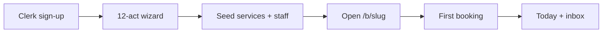

# Onboarding — production design

**Route:** `/onboarding` (dashboard) · mobile `/onboarding` + `/onboarding-continue`  
**Policy:** `lib/policy/src/onboarding-state.ts` (acts A1–A12)

---

## Intended journey

1. **A0** — Clerk account (outside wizard).
2. **A1** — Create business (`POST /businesses`, `seedDefaults: true`).
3. **A2–A11** — Profile, menu, team, hours, Liv, channels, billing, invites, migration hints.
4. **A8** — Public booking link; owner should open `/b/:slug` and complete a test booking.
5. **A12** — Go live checklist → redirect to **`/bookings?create=1`** (first shop) or **`/lifecycle#chain`** (second location).

---

## Second location (chain)

- Entry: Lifecycle **G3** or `/onboarding?intent=second-shop`
- **`parentBusinessId`** is set automatically from the owner’s first business (not only via query string).
- New row uses `structureKind: location`.
- Wizard does not resume the first shop’s `onboardingState`.

---

## Automation

| Event | Effect |
|-------|--------|
| First `POST /public/b/:slug/book` | Sets `onboardingState.checklist.testBooking = true` |
| Stuck &lt;50% for 48h | Cron email (`onboarding-nudge.service.ts`) |

---

## Mobile parity

- Mobile creates the shop and shows checklist progress.
- Deep link: **Continue on web** → full 12-act wizard (`EXPO_PUBLIC_DASHBOARD_URL/onboarding`).
- Product decision: setup depth is **web-first**; mobile is capture + Today, not full wizard.

---

## Marketing alignment

- **livia.io** — waitlist / demo CTA (no self-serve Clerk on marketing site).
- **app** — `/sign-up` + `/onboarding` for invited or direct founders.
- Design partners: send dashboard URL + invite, not waitlist-only copy.

---

## UX quality bar (before GA)

- [ ] Act validation: cannot mark A12 complete without `testBooking` (future)
- [ ] Inline form errors surfaced (not `.catch(() => {})`)
- [ ] Onboarding analytics events per act
- [ ] E2E: A1 → public book → Today shows booking
