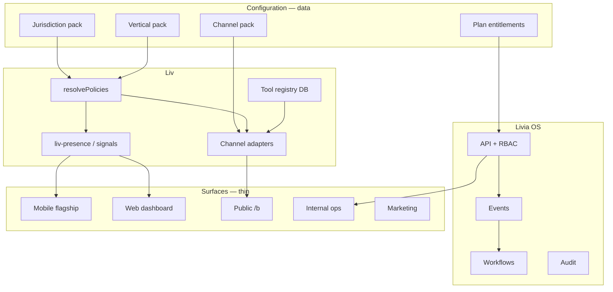

# Operation Solidify — v1 final build (formerly “v4 scope”)

**Status:** **Active — canonical execution program** (2026-05-26)  
**Engineering started:** 2026-05-26 — Tracks 0–1 done; 2/3/4/5/6 in progress; `pnpm solidify:verify` for local certify  
**Supersedes for day-to-day engineering:** scattered “v1.5 / v2 / v3 partial” deferrals that hid mobile, channels, and internal ops behind “later”  
**Audience:** founder, product, engineering  
**Companion docs:**  
- [`../business/MARKET-COUNTRY-PLAYBOOKS.md`](../business/MARKET-COUNTRY-PLAYBOOKS.md) — per-country targets & channels  
- [`LIVIA-OS-MONETIZATION.md`](./LIVIA-OS-MONETIZATION.md) — OS revenue layers  
- [`PLATFORM-BUILT-RIGHT.md`](./PLATFORM-BUILT-RIGHT.md) — JARVIS + kernel gates  
- [`LIV-OPERATING-SYSTEM.md`](./LIV-OPERATING-SYSTEM.md) — nothing hardcoded contract  
- [`../design/MOBILE-UX-PRINCIPLES.md`](../design/MOBILE-UX-PRINCIPLES.md) — mobile flagship rules  
- [`CHANNELS-EU-MESSAGING.md`](./CHANNELS-EU-MESSAGING.md) — WA / IG / Messenger  
- [`../operations/INTERNAL-SUPPORT-SYSTEM-DESIGN.md`](../operations/INTERNAL-SUPPORT-SYSTEM-DESIGN.md) — internal cockpit  

**Founder / legal / field (unchanged):** [`../company/FOUNDER-BACKLOG.md`](../company/FOUNDER-BACKLOG.md)

---

## Proverb: “What was v4 is now v1”

We stop shipping **a polished wedge with a hollow rim**. v1 means:

- **Every supported vertical** gets the same data path (policy pack → Liv → UI), not one golden hair shop and empty shells.  
- **Mobile is flagship**, not “read on phone, edit on web.”  
- **WhatsApp + Instagram + Messenger** are product surfaces in every jurisdiction where policy enables them — honest when BSP not wired.  
- **Internal Livia** is an ops cockpit, not a secret-only API.  
- **New starters and veterans** get different rituals, same OS.

What remains **v2** is listed in §10 — real legal/geo expansion, not excuses to skip engineering.

---

## Definition of done (certify)

| # | Criterion | Verify |
|---|-----------|--------|
| 1 | **Kernel truth** | Migrations applied; no 500 on notifications/proposals; API port consistent |
| 2 | **Data-driven Liv** | Switch demo shop → different `liv-presence` line, moments, stats (no shared template) |
| 3 | **Channels** | WA/IG/Messenger in onboarding + Settings; inbox thread; disclosure; continuity id on booking |
| 4 | **Cross-border** | Create business FR + DE + PL → correct locale, currency, channel chips, holidays |
| 5 | **Mobile depth** | Owner ≥ 90% daily surfaces on phone; create/edit customer, service, staff invite, policy read, rota view |
| 6 | **Operator maturity** | Onboarding path for new starter; chain path for founder — no demo-only shortcuts in prod graph |
| 7 | **Internal ops** | Support 3-column workspace + runbooks + doc graph |
| 8 | **Vertical fairness** | `pnpm test:e2e:verticals` — 0 skipped slugs |
| 9 | **Monetization OS** | Plan tier + usage visible; billing tab matches marketing |
| 10 | **Promise integrity** | `marketing-vs-reality.md` — zero false G2 claims |

---

## Architecture: one data path

**Rule:** No new `if (vertical === 'hair')` in React. Add policy type → API → optional tool → seed → test.

---

## Track 0 — Kernel truth (2–3 days)

| Task | Detail |
|------|--------|
| T0.1 | Apply SQL migrations `022`–`023` (+ pending) on dev/staging |
| T0.2 | Align `PORT=3000` — dashboard, mobile, internal proxy, `.env.example` |
| T0.3 | `verify-livia-api.mjs` in `start-platform-for-test.mjs` |
| T0.4 | Fix `/api/api/...` double-prefix routes |
| T0.5 | Chain: `parentBusinessId` on Aurora locations; remove `aurora-*` slug hack |
| T0.6 | Demo provision writes **same graph** as production onboarding |

---

## Track 1 — Cross-border channels (4–6 days)

**Goal:** Liv on the channels each country expects — see [`MARKET-COUNTRY-PLAYBOOKS.md`](../business/MARKET-COUNTRY-PLAYBOOKS.md).

| Task | Detail |
|------|--------|
| T1.1 | Policy: all P1 jurisdictions have correct `resolveChannelPack` |
| T1.2 | Settings → Communications: jurisdiction-aware channel cards |
| T1.3 | Meta webhook path production-hardened; test inbound in dev |
| T1.4 | Onboarding Act A7: channel setup wizard |
| T1.5 | Inbox: WA/IG/Messenger badges + external id copy |
| T1.6 | Booking `sourceConversationId` + continuity timeline on all channels |
| T1.7 | Production guard: no fake “WhatsApp on” without credentials |
| T1.8 | Marketing: only claim channels that pass T1.7 in prod |

**Honest stub:** Dev may simulate inbound; prod shows “Connect WhatsApp” — not silent failure.

---

## Track 2 — Liv & verticals data-driven (5–7 days)

| Task | Detail |
|------|--------|
| T2.1 | Dashboard/mobile headers: **only** `liv-presence` + briefing (remove duplicate static lines) |
| T2.2 | `liv-moments`, `liv-proposals`, `user_notifications` end-to-end |
| T2.3 | Vertical packs served from DB/catalog; TS `loader.ts` = fallback only |
| T2.4 | Per-vertical demo seeds: distinct services, staff, **Liv lines** |
| T2.5 | Morning briefing on **mobile** (read + push hook) |
| T2.6 | Peer insights, rota, time-off on mobile (not web-only) |
| T2.7 | “Liv was wrong” + incident cards web + mobile |

---

## Track 3 — Mobile flagship (7–10 days)

Absorb **`mobile-roadmap.md` Phases B + C** into v1 — see [`MOBILE-UX-PRINCIPLES.md`](../design/MOBILE-UX-PRINCIPLES.md).

| Surface | v1 requirement |
|---------|----------------|
| Inbox + take over | Full thread + Liv assist chips |
| Customer/service CRUD | Create + edit on device |
| Staff invite | POST invitation from phone |
| Settings | Comms status, Liv toggle, policy read, **plan usage strip** |
| Rota / shifts | View + manager actions where entitled |
| Hiring / packages | Read + critical actions or honest “finish on web” **one line** |
| Push | Booking, inbox, Liv moment (Expo) |
| Biometrics | Gate settings, refunds, revenue |
| Haptics | Tier system on confirm/cancel/Liv moment |
| Offline | Today + bookings + inbox **read** cache |
| Camera | Customer note photo attach |
| Live Activities / widgets | iOS where feasible; Android widget glance |

**UX bar:** “Masterclass” = ritual-first, depth in **More** and stacks, not 40 empty tabs. Every screen answers who / what / why (mobile principles doc).

---

## Track 4 — Operator maturity (3–4 days)

| Segment | Build |
|---------|-------|
| **New starter** | Shortened onboarding acts; Liv copy R1; checklist on Today; first-booking celebration |
| **Experienced owner** | Full dashboard density; peer insights; payroll export link |
| **Founder** | Chain Glance mobile + web; cross-shop alerts |
| **Staff** | My Day + week summary + push |
| **Reception** | Bookings-first; running late; multi-staff day view |

**Remove:** `buildDemoOnboardingCompleteState()` for prod path — demo flag only.

---

## Track 5 — Internal Livia cockpit (4–5 days)

| Task | Detail |
|------|--------|
| T5.1 | Support **3-column** workspace (queue / summary / timeline) |
| T5.2 | Runbook links per category from `CUSTOMER-SUPPORT-OPERATING-MODEL.md` |
| T5.3 | Knowledge: doc graph browser (`/internal/ops/docs`) |
| T5.4 | Ticket → tenant → trace → Liv bundle one click |
| T5.5 | Monitoring: alert-first home; Grafana external optional |
| T5.6 | RBAC roles on tabs (L1 / engineer / founder) — secret + role header |

---

## Track 6 — Monetization OS (2–3 days)

See [`LIVIA-OS-MONETIZATION.md`](./LIVIA-OS-MONETIZATION.md).

| Task | Detail |
|------|--------|
| T6.1 | Enforce plan on invites, voice, chain, WA volume |
| T6.2 | Usage meter in Settings |
| T6.3 | Marketing pricing ↔ `GET /billing/plans` single source |
| T6.4 | Internal ops: tenant plan + usage in support bundle |

---

## Track 7 — Certify (2–3 days)

| Command | Gate |
|---------|------|
| `pnpm db:migrate:sql` | Clean DB |
| `pnpm typecheck` | Monorepo |
| `pnpm test:e2e:verticals` | 0 skip |
| `pnpm test:e2e:full-ready` | Full stack |
| `node scripts/gate2-evidence-status.mjs` | G2 docs |
| Manual: `MANUAL-WALKTHROUGH-BETA.md` | Personas |
| axe on dashboard + marketing | 0 violations |

---

## Sensational differentiation (why competitors can’t catch up fast)

| Capability | Why it’s hard to copy |
|------------|----------------------|
| **Continuity graph** | Booking ↔ conversation ↔ channel ↔ workflow in one tenant DB |
| **Audit-backed Liv** | Every tool call logged; “Liv did X” in UI |
| **Policy-first AI** | Slots/deposits/consent blocked by resolver, not prompt |
| **Role-native OS** | Different homes per persona, same kernel |
| **Cross-border packs** | 12 jurisdictions × channels × locales in code, not copy-paste |
| **Mobile flagship ops** | Incumbents desktop-first; Fresha/Phorest weak on character voice |
| **Chair-host + franchise + chain** | Commercial shapes in one product |
| **Peer insights** | k-anonymized benchmarks — needs tenant graph scale |

---

## Competitive posture (May 2026)

| Competitor move | Livia counter (build in Solidify) |
|-----------------|-----------------------------------|
| Fresha AI Concierge | Colleague + audit + EU posture + owner rituals |
| Phorest Front Desk / Ivy | Voice + continuity + mobile Today, not bolt-on chat |
| Booksy | Multi-channel inbox + Liv memory per client |
| Planity (FR) | FR pack + IG/WA + founder chain |

---

## §10 — Explicit v2 (after Solidify)

Do **not** block Solidify on these:

| Item | Why v2 |
|------|--------|
| Telegram / Viber live | Lower EU prevalence; stub OK |
| Deposits + Connect **production** money | Legal + Stripe prod — founder |
| Medspa marketing campaigns | Counsel |
| Enterprise SSO production | Sales-led |
| SOC 2 Type II | Process |
| US / APAC jurisdictions | No policy packs |
| Per-locale Liv **character** (not just translated strings) | F9 voice program |
| Native public Liv chat on mobile | Web `/b` sufficient for G2 |
| Full hiring ATS | Web MVP enough |

---

## Program timeline (realistic)

| Weeks | Tracks |
|-------|--------|
| 1 | T0 + T1 + start T2 |
| 2 | T2 + T3 (mobile core) |
| 3 | T3 finish + T4 + T5 |
| 4 | T6 + T7 certify + founder field Gate 2 |

Parallel: founder runs design partners (off-repo).

---

## Doc updates from this program

| Doc | Change |
|-----|--------|
| `DOC-CANONICAL-INDEX.md` | Points here for active build |
| `mobile-roadmap.md` | Banner: Phases B–C = v1 per Solidify |
| `WEB-MOBILE-PARITY.md` | Target ≥ 90% owner surfaces |
| `CHANNELS-EU-MESSAGING.md` | v1 live mandate |
| `NORTH-STAR-DASHBOARD.md` | Link Solidify + country playbooks |
| `SURFACE-COMPLETION-MATRIX.md` | Refresh after T3 |

---

## What to tell stakeholders

> “v1 is the OS release: every vertical and country we support runs on policy data, Liv is on the channels your market uses, mobile is where owners live, and internal ops can support tenants without grep-ing the repo. v2 is geographic character voice and enterprise money movement at scale.”
