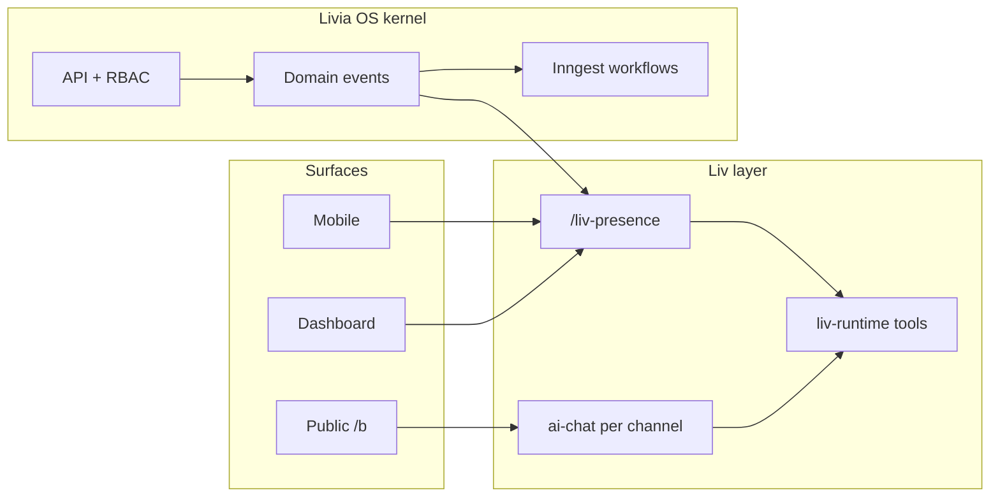

# Platform built right — what you mean when you say “JARVIS” and “OS”

**Status:** Active (2026-05-24)  
**Audience:** founder, product, engineering  
**Canonical companions:** [`LIV-OPERATING-SYSTEM.md`](./LIV-OPERATING-SYSTEM.md), [`LIVIA-IDEA-TO-REALITY.md`](./LIVIA-IDEA-TO-REALITY.md), [`V3-EXECUTION-PROGRAM.md`](./V3-EXECUTION-PROGRAM.md)

---

## What you are really asking for

When you say you want **Liv like JARVIS**, **Livia like an actual OS**, and the **entire platform built right**, you are not asking for more UI polish on one screen. You are asking for four things at once:

1. **Trust** — Nothing on any surface should feel fake. If Luxe and Peak show the same sentence, the product is lying. Liv must speak from **this tenant’s facts** at **this moment**.
2. **One nervous system** — Bookings, inbox, payroll, policy, audit, and workflows are not separate apps glued together. They share one **tenant graph** and one **event bus**. Liv and Inngest are two faces of the same reactions layer.
3. **Role truth** — Founder, owner, manager, floor, desk, and customer are different **capabilities**, not tab skins. Demo must prove it with **real sign-ins**, not a dev-only persona toggle.
4. **Surface honesty** — Web, mobile, public `/b`, voice, and internal portal are **peers** on the kernel. Mobile is not “web with redirects.” Marketing is not ahead of the matrix.

This document turns that intent into **gates** we can ship against.

---

## The five pillars

### 1. Liv is the voice of the OS (JARVIS)

| Built right | Not built right |
|-------------|-----------------|
| Liv lines come from **`/liv-presence`** and morning briefing synthesis keyed by `businessId` | Same template string for every shop |
| Customer chat uses **tool registry** + policy resolver per tenant | One hardcoded prompt in a route |
| Staff Liv assist can confirm/cancel/reschedule when entitled | “AI feature” bolt-on with two public tools only |
| Every tool call is **audited** and metered | Silent side effects |
| Events refresh briefings and trigger workflows | Cron-only “AI” |

**Exit:** Switch demo businesses and personas → different **line**, **highlights**, and **stats**; `content.source === "liv"` when Anthropic is configured.

### 2. Livia is an operating system (kernel)

| Kernel piece | Role |
|--------------|------|
| **Tenant graph** | `businessId` → people, time, money, conversations, policy |
| **API + RBAC** | Every mutation scoped; desk vs floor vs admin enforced server-side |
| **Domain events** | Idempotent publish → Inngest workflows + Liv reactions |
| **Audit chain** | Human and agent actions explainable |
| **Policy packs** | Vertical/locale tone and rules without `if (salon)` in app code |

**Exit:** A new vertical behaviour ships as **policy + tool + test**, not a one-off dashboard hack.

### 3. Surfaces are peers

| Surface | Built right |
|---------|-------------|
| Dashboard | Owner/manager ritual, inbox, continuity timeline |
| Mobile | Today = operational home; Glance = chain; no fake “Experience hub” |
| Public `/b` | Disclosure, booking, continuity handoff |
| Channels | SMS/WA/voice/meta through **channel router** |
| Internal | Separate Liv profile (`livia_internal`) — not faked in tenant UI |

**Exit:** [`V3-SURFACE-MATRIX.md`](./V3-SURFACE-MATRIX.md) row updated every release; [`WEB-MOBILE-PARITY.md`](./WEB-MOBILE-PARITY.md) gaps closed or marked honest.

### 4. Demo proves the thesis

| Rule | Why |
|------|-----|
| Use `demo-founder@`, `demo-admin@`, `demo-staff-senior@`, etc. | Persona switcher is dev-only; investors must see real RBAC |
| Reprovision demo after Liv/kernel changes | Briefings and seeds stay in sync |
| Each vertical shop has distinct copy and counts | Proves tenant isolation |

**Exit:** [`MANUAL-WALKTHROUGH-BETA.md`](../testing/MANUAL-WALKTHROUGH-BETA.md) §10 passes without “same Liv everywhere.”

### 5. No v1 excuses while claiming v3

| Honest | Dishonest |
|--------|-----------|
| `LIVIA-IDEA-TO-REALITY.md` lists CRUD/parity gaps | “AI-first platform” with missing settings |
| `marketing-vs-reality` row per claim | Landing page promises internal Liv |
| Phase 4 in v3 = Liv OS + internal | Shipping only morning briefing |

---

## Architecture snapshot

**Division of labour:** Workflows own **deterministic** side effects (reminders, dunning, continuity bridge). Liv owns **language and ambiguity** (briefings, inbox assist, customer conversation). Neither duplicates the other.

---

## Milestone ladder (how we know we are “built right”)

| Stage | User-visible | Engineering |
|-------|--------------|-------------|
| **A — Present** | Liv line differs per shop; “written by Liv” when synthesized | `liv-presence` API, `liv-morning-narrative`, briefing refresh on booking events |
| **B — Reactive** | Liv mentions new booking / no-show in today’s briefing within minutes | Event → `liv-briefing-refresh` workflow; reactions map in `lib/liv-runtime` |
| **C — Agentic** | Staff asks Liv to confirm booking in thread | Staff tools wired in `liv-runtime-deps` (confirm/cancel/reschedule/lookup) |
| **D — OS complete** | Internal Liv triage; full tool catalog in DB; eval gates voice claims | Phase 4 v3 + `LIV-CAPABILITY-MATRIX` all green |

We are at **design-partner complete** on the Liv OS alphabet core (A–G, H, K, M, Q, T, Y, Z) as of 2026-05-25 — see [`LIV-OS-ALPHABET.md`](./LIV-OS-ALPHABET.md). Remaining 🟡 letters are process, legal, enterprise marketing, and mobile settings depth — not missing kernel code. Claim **Ω (full OS)** only after voice eval gate + medspa counsel + enterprise honesty.

---

## What to do next (engineering order)

1. Verify **Liv presence** on mobile + dashboard after API restart (`source: "liv"`).
2. Expand **event → Liv** beyond briefing refresh (coach_owner on no-show, pause on handoff).
3. Wire **internal Liv** profile on internal portal (read-only tenant snapshot tools already in registry).
4. Close **IDEA-TO-REALITY** CRUD gaps that break “OS” narrative (mobile customer edit, settings depth).
5. Keep **release sweep** (Block R) so no single-surface PR ships alone.

---

## Related APIs

| Endpoint | Purpose |
|----------|---------|
| `GET /api/businesses/:id/liv-presence?context=owner_today\|manager_today\|staff_today\|reception_today` | Single ritual line + briefing slice + moments for tenant surfaces |
| `GET/POST …/customers/:id/liv-memory` | Per-customer Liv memory (prompt injection) |
| `GET /api/me/liv-presence?context=founder_portfolio` | Chain founder line |
| `GET /api/businesses/:id/morning-briefing` | Full briefing card (highlights, today list) |
| `GET /api/businesses/:id/liv-moments` | Reactive moments feed (last 48h) |
| `POST …/liv-moments/:id/dismiss` | Dismiss a moment (admin) |
| `GET …/liv-capabilities` | Tools available for this tenant + profile |
| `POST …/liv-assist` | Staff thread agent loop (STAFF+, audit + toolsUsed) |

When docs disagree with code, update code or mark the matrix row **honest** — never silently drift.
