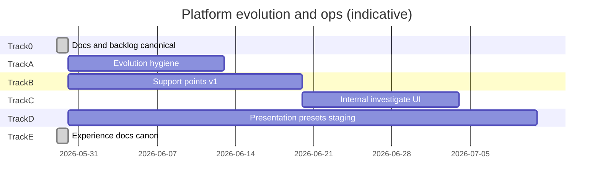

# Platform evolution and ops program — master build plan

**Status:** canonical program (2026-05-29)  
**Origin:** product/architecture working session — composable evolution + internal troubleshooting + **UX experience architecture** (design session 2026-05-29)  
**Audience:** founder, engineering, support operators, agents  
**Does not replace:** [`OPERATION-SOLIDIFY.md`](./OPERATION-SOLIDIFY.md) (v1 ship) · [`../operations/PLATFORM-BACKLOG.md`](../operations/PLATFORM-BACKLOG.md) (ongoing ops checklist)

**Deep specs:**

| Topic | Document |
|-------|----------|
| **Experience architecture (master)** | [`../design/EXPERIENCE-ARCHITECTURE.md`](../design/EXPERIENCE-ARCHITECTURE.md) |
| Persona × vertical × surface matrix | [`../design/PERSONA-VERTICAL-SURFACE-MATRIX.md`](../design/PERSONA-VERTICAL-SURFACE-MATRIX.md) |
| Channel UX (M2/M3/M4) | [`../design/CHANNEL-UX-CONTRACT.md`](../design/CHANNEL-UX-CONTRACT.md) |
| Presentation presets rollout | [`../design/PRESENTATION-PRESETS-AND-ROLLOUT.md`](../design/PRESENTATION-PRESETS-AND-ROLLOUT.md) |
| Surface / breakpoints | [`../design/SURFACE-AND-BREAKPOINTS.md`](../design/SURFACE-AND-BREAKPOINTS.md) |
| Self-evolving / hub-and-spoke product rules | [`../engineering/COMPOSABLE-EVOLUTION.md`](../engineering/COMPOSABLE-EVOLUTION.md) |
| Support points, surfaceId, investigation | [`../operations/SUPPORT-POINTS-AND-INVESTIGATION.md`](../operations/SUPPORT-POINTS-AND-INVESTIGATION.md) |
| Tenant experience bundle | [`TENANT-EXPERIENCE-CONTRACT.md`](./TENANT-EXPERIENCE-CONTRACT.md) |

---

## 0. Executive summary

Two capabilities make Livia **modular and operable at scale**:

1. **Composable evolution** — product rules change once at the hub (`@workspace/policy`, OpenAPI, tenant experience); surfaces and tests adjust in predictable rings. No runtime spaghetti.

2. **Investigation by design** — support tickets, logs, and Sentry share `requestId` and (target) `surfaceId`; a registry maps surfaces to code, tests, and runbooks.

3. **Experience architecture (Track D/E)** — five-layer UX (capability → presentation → brand → persona → surface); 36 presentation presets; phone/tablet/desktop morph; M2/M3/M4 channel parity documented.

This program sequences **documentation**, **registry + wiring**, **CI guards**, **internal portal UX**, and **staging-only presentation preset rollout** without blocking Operation Solidify’s v1 ship criteria. Work proceeds in **tracks** that can run in parallel after Track 0.

### 0.1 Design session → documentation map (2026-05-29)

This program absorbed a full UX architecture working session. Every decision below is written in full in linked docs — not bullet stubs.

| Session topic | Decision | Canonical doc |
|---------------|----------|---------------|
| Buildable UX boundaries (no WebGL theatre) | v3 alive patterns + Framer/Reanimated/CSS only | [`EXPERIENCE-ARCHITECTURE.md`](../design/EXPERIENCE-ARCHITECTURE.md) Part 3 |
| Four global non-Aurora themes | Rejected as global strategy; ideas → vertical presets | EXPERIENCE-ARCHITECTURE §3.2 |
| Six persona-inspired directions | Rejected as separate apps; → persona home patterns | EXPERIENCE-ARCHITECTURE §3.3–3.4 |
| Business-first (body-art) | Canonical: capability → presentation → persona | EXPERIENCE-ARCHITECTURE §3.5 |
| 2–3 skins per vertical + same tools | **36 presets** (4 per vertical incl. Platform Default) | [`PRESENTATION-PRESETS-AND-ROLLOUT.md`](../design/PRESENTATION-PRESETS-AND-ROLLOUT.md) |
| Platform Default = Aurora | Fourth preset in every vertical; not forced default for new tenants | PRESENTATION-PRESETS Part IIb |
| Phone / tablet / desktop morph | Fifth layer **Surface**; independent of preset | [`SURFACE-AND-BREAKPOINTS.md`](../design/SURFACE-AND-BREAKPOINTS.md) |
| M2/M3/M4 not covered by CSS presets | Parallel channel stack | [`CHANNEL-UX-CONTRACT.md`](../design/CHANNEL-UX-CONTRACT.md) |
| Full P×V×surface routing | Matrix tables + body-art E2E reference | [`PERSONA-VERTICAL-SURFACE-MATRIX.md`](../design/PERSONA-VERTICAL-SURFACE-MATRIX.md) |
| Staging-only rollout Phases 0–8 | ~24 eng-days after Phase 0 | This doc §7 + PRESENTATION-PRESETS Part VII |
| Cross-cutting (a11y, locale, shared tablet, support metadata) | Must ship with Track D | PRESENTATION-PRESETS Appendix B; EXPERIENCE-ARCHITECTURE Part 8 |

**Code landed (Phase D0):** `lib/policy/src/presentation-presets.ts`, `artifacts/api-server/src/services/__tests__/presentation-presets.test.ts`, `"aurora"` in dashboard `VerticalShellKind`.

---

## 1. Program goals and non-goals

### 1.1 Goals

| # | Goal | Measure |
|---|------|---------|
| G1 | Onboarding/gate changes follow a written playbook | PR template + COMPOSABLE-EVOLUTION §5.1 used in review |
| G2 | No duplicate vertical/onboarding catalogs in apps | grep clean; `/onboarding/catalog` only |
| G3 | ≥ 90% of dashboard Help submits include `surfaceId` | ticket context audit |
| G4 | Mean time to first code file < 10 min for P0 surfaces | operator survey / timed drill |
| G5 | Sentry issues filterable by `surface` tag | Sentry UI |
| G6 | Internal ticket detail shows registry paths | screenshot / QA checklist |
| G7 | Staging preset switch works on 3 demo verticals without feature loss | Phase 7 QA sign-off |
| G8 | M2 SMS/WA uses vertical vocabulary on body-art + hair demos | CHANNEL-UX-CONTRACT §8 |

### 1.2 Non-goals (this program)

- Replacing Sentry, Linear, or Intercom
- Tenant-facing “paste your request id” debug page
- Runtime pub/sub for product rule changes
- Auto-generating registry from AST (future optional)

---

## 2. Tracks overview



| Track | Name | Depends on | Delivers |
|-------|------|------------|----------|
| **0** | Canon + backlog | — | Evolution + support + experience docs + PLATFORM-BACKLOG |
| **A** | Composable evolution hygiene | 0 | Deduped catalogs, domain map, PR checklist, CI |
| **B** | Support points v1 | 0 | Registry, surfaceId on tickets, triage, Sentry tags |
| **C** | Internal investigate | B | Investigate view, ticket detail enrichment |
| **D** | Presentation presets + surface morph | 0, E | Staging Phases 1–8 — see §7 |
| **E** | Experience architecture docs | — | **Complete** — EXPERIENCE-ARCHITECTURE + matrix + channel + surface specs |

---

## 3. Track 0 — Canon (complete)

| Task | Status | Output |
|------|--------|--------|
| Write COMPOSABLE-EVOLUTION.md | done | Three rings, playbooks, domain map template |
| Write SUPPORT-POINTS-AND-INVESTIGATION.md | done | Baseline, surfaceId catalog, wire-up contract |
| Write PLATFORM-EVOLUTION-AND-OPS-PROGRAM.md | done | Tracks, full todo matrix §8 |
| Write EXPERIENCE-ARCHITECTURE.md | done | Five-layer model, exploration archive, persona catalog |
| Write PERSONA-VERTICAL-SURFACE-MATRIX.md | done | Full P×V×surface tables |
| Write CHANNEL-UX-CONTRACT.md | done | M2/M3/M4 rules |
| Write SURFACE-AND-BREAKPOINTS.md | done | Phone/tablet/desktop morph |
| Write PRESENTATION-PRESETS-AND-ROLLOUT.md | done | 36 presets, Phases 0–8, Appendix B cross-cutting |
| Code: presentation-presets.ts | done | Catalog + PLATFORM_DEFAULT_PRESET_ID |
| Code: presentation-presets.test.ts | done | api-server smoke test |
| Update DOC-CANONICAL-INDEX | done | All new canonical rows |
| Extend PLATFORM-BACKLOG | done | P1 Presentation presets + cross-program |

---

## 4. Track A — Composable evolution hygiene

**Owner:** engineering  
**Spec:** [`../engineering/COMPOSABLE-EVOLUTION.md`](../engineering/COMPOSABLE-EVOLUTION.md)

### Phase A1 — Anti-patchwork (catalog dedupe)

| ID | Task | Files / notes | Done when |
|----|------|---------------|-----------|
| A1.1 | Audit duplicate vertical/onboarding lists in dashboard + mobile | grep `VERTICAL_OPTIONS`, `ONBOARDING_VERTICALS` | List in PR |
| A1.2 | Route all pickers to `GET /api/onboarding/catalog` | dashboard onboarding, any settings pickers | No local enum lists |
| A1.3 | Mobile parity for catalog fetch | mobile onboarding | Same API |
| A1.4 | Remove dead duplicates | — | `pnpm typecheck` green |

**Acceptance:** PLATFORM-BACKLOG item “Onboarding catalog dedupe” checked.

### Phase A2 — Domain dependency map

| ID | Task | Done when |
|----|------|-----------|
| A2.1 | Fill §7 table in COMPOSABLE-EVOLUTION for all P0 domains | Table complete in doc |
| A2.2 | Add “Domain map” link to `docs/onboarding-engineer.md` | Engineer doc updated |
| A2.3 | PR template checkbox: “Hub change? Updated domain map + playbook” | `.github/pull_request_template.md` or CONTRIBUTING |

### Phase A3 — Change discipline

| ID | Task | Done when |
|----|------|-----------|
| A3.1 | Document onboarding change checklist in AGENTS.md pointer | AGENTS.md links COMPOSABLE-EVOLUTION |
| A3.2 | Require `onboarding-program.test.ts` update on gate changes | CI review rule |
| A3.3 | Zod jurisdiction enum from policy (FR, tiers) | PLATFORM-BACKLOG P2 item done |

**Track A exit:** G1, G2 satisfied; domain map current.

---

## 5. Track B — Support points v1

**Owner:** engineering  
**Spec:** [`../operations/SUPPORT-POINTS-AND-INVESTIGATION.md`](../operations/SUPPORT-POINTS-AND-INVESTIGATION.md)

### Phase B1 — Registry

| ID | Task | Files | Done when |
|----|------|-------|-----------|
| B1.1 | Create `lib/policy/src/support-points.ts` with P0 catalog (§4.2 of spec) | policy | Exported from `@workspace/policy` |
| B1.2 | Add `getSupportPoint(surfaceId)` + `listSupportPoints()` | policy | Unit tests |
| B1.3 | `support-points.test.ts` — paths exist | `lib/policy/src/__tests__/` | CI green |
| B1.4 | Export from `lib/policy/src/index.ts` | index | typecheck |

### Phase B2 — Dashboard wire-up

| ID | Task | Files | Done when |
|----|------|-------|-----------|
| B2.1 | `support-surface-map.ts` route → surfaceId | dashboard lib | Unit test longest-prefix |
| B2.2 | `use-support-context.ts` | dashboard lib | Merges surface + route + business |
| B2.3 | `HelpSupportDialog` requires/propagates `surfaceId` | help-support-dialog.tsx | All call sites pass id |
| B2.4 | Update inbox, booking-detail, liv-incidents, app-layout | pages/components | Explicit ids per spec table |
| B2.5 | Sentry `setTag('surface', ...)` on route change | dashboard sentry init or layout | Sentry shows tag |

### Phase B3 — API triage

| ID | Task | Files | Done when |
|----|------|-------|-----------|
| B3.1 | Triage reads `context.surfaceId` | support-ticket-triage.service.ts | Tags `surface:*` |
| B3.2 | `suggestedReply` from registry when match | same | Tests updated |
| B3.3 | Persist `surfaceId` in ticket list filters (internal API) | support-tickets.service + internal routes | Queue filterable |

### Phase B4 — Mobile (parity slice)

| ID | Task | Done when |
|----|------|-----------|
| B4.1 | Mobile Help/report path (if not present, add) | Ticket create works |
| B4.2 | Mobile surface map + Sentry tag | `mobile.*` surfaceIds on tickets |
| B4.3 | WEB-MOBILE-PARITY row for support context | doc updated |

**Track B exit:** G3, G5 satisfied for dashboard; mobile B4.1–B4.2 complete or ticketed P2.

---

## 6. Track C — Internal investigate UI

**Owner:** engineering  
**Depends on:** Track B1 minimum

| ID | Task | Files | Done when |
|----|------|-------|-----------|
| C1.1 | API `GET /internal/ops/support-points` (list) | api-server internal routes | internal portal consumes |
| C1.2 | API enrich ticket detail with registry row | internal ops support | JSON includes `supportPoint` |
| C1.3 | Investigate panel: paste requestId | livia-internal | Shows log hint + Sentry link template |
| C1.4 | Ticket detail: Likely code paths section | SupportQueueView / detail | Renders registry lists |
| C1.5 | Copy buttons for ids | UI | QA checklist |
| C1.6 | Update SUPPORT-RUNBOOK §triage with surfaceId | docs | Operators trained |

**Track C exit:** G4, G6 satisfied.

---

## 7. Track D — Presentation presets + surface morph (full build plan)

**Owner:** engineering  
**Spec:** [`../design/PRESENTATION-PRESETS-AND-ROLLOUT.md`](../design/PRESENTATION-PRESETS-AND-ROLLOUT.md)  
**Architecture:** [`../design/EXPERIENCE-ARCHITECTURE.md`](../design/EXPERIENCE-ARCHITECTURE.md)  
**Composable evolution:** preset changes follow COMPOSABLE-EVOLUTION §5.2 (policy → tenant experience → surfaces).

**Environment:** staging only until Phase 8 prod gate.  
**Estimate:** ~24 eng-days (Phases 1–8); Phase 0 + Track E docs **done**.

### Phase D0 — Spec & catalog ✅

| ID | Task | Status |
|----|------|--------|
| D0.1 | `lib/policy/src/presentation-presets.ts` — 9×4 presets incl. platform-default | done |
| D0.2 | `presentationPresetsEnabled()` staging gate | done |
| D0.3 | EXPERIENCE-ARCHITECTURE + matrix + channel + surface docs | done |
| D0.4 | `presentation-presets.test.ts` | done |

### Phase D1 — Policy & tenant experience (3 days)

| ID | Task | Files | Done when |
|----|------|-------|-----------|
| D1.1 | Extend `TenantExperienceSkin` with preset fields | `lib/policy/src/tenant-experience.ts` | Type exports presetId, cssPreset, colorMode, density, layout, presetsEnabled |
| D1.2 | `resolvePresentationPreset()` in skin resolver | same | Invalid id → vertical-native default |
| D1.3 | Export `PLATFORM_DEFAULT_PRESET_ID` consumers | dashboard, mobile, api | typecheck |
| D1.4 | Unit tests tenant experience + preset merge | `tenant-experience.test.ts`, `presentation-presets.test.ts` | CI green |
| D1.5 | Update TENANT-EXPERIENCE-CONTRACT.md | docs | Fields documented |

### Phase D2 — Database & API (2 days)

| ID | Task | Files | Done when |
|----|------|-------|-----------|
| D2.1 | Migration `027-presentation-preset.sql` | `lib/db/migrations/sql/` | `presentation_preset_id`, `brand_accent_hex` nullable |
| D2.2 | Drizzle schema | `businesses.ts` | push/typecheck |
| D2.3 | `presentation.service.ts` validate + PATCH | api-server | 400 on invalid preset for vertical |
| D2.4 | `GET /businesses/:id/presentation-presets` | businesses routes | Returns 4 presets for vertical |
| D2.5 | `PATCH /businesses/:id/presentation` gated | `presentationPresetsEnabled()` | 403 on prod when gate off |
| D2.6 | Audit log event on preset change | audit service | presetId in payload |
| D2.7 | ENV docs | `ENV-VARIABLES.md` | LIVIA_PRESENTATION_PRESETS, LIVIA_ENV |

### Phase D3 — Dashboard presentation + surface (5 days)

| ID | Task | Files | Done when |
|----|------|-------|-----------|
| D3.1 | `applyPresentationTheme()` merge preset tokens | `experience-theme.ts` | data-presentation on html |
| D3.2 | `useSurfaceClass()` hook | `hooks/use-surface-class.ts` | phone/tablet/desktop |
| D3.3 | Wire shell `data-surface` | `app-layout.tsx` | resize updates |
| D3.4 | CSS bundles — 27 vertical-native cssPreset values | `index.css` | platform-default = baseline |
| D3.5 | `surface-adaptive/` components — pipeline, inbox, proof | new dir | morph per SURFACE-AND-BREAKPOINTS §III |
| D3.6 | Appearance settings panel (staging gate) | `settings/appearance-panel.tsx` | 4 thumbnails, phone+desktop preview |
| D3.7 | Onboarding optional preset step | `onboarding-wizard.tsx` | after vertical, before go-live |
| D3.8 | A11y contrast check list per preset | doc appendix or checklist file | WCAG AA sign-off started |
| D3.9 | Blur degrade low-end Android | CSS/feature-detect | no jank on budget devices |

### Phase D4 — Mobile parity + tablet (4 days)

| ID | Task | Files | Done when |
|----|------|-------|-----------|
| D4.1 | `applyPresentationTheme` mobile | `vertical-theme.ts` | accent + density |
| D4.2 | `useSurfaceClass()` native | `hooks/use-surface-class.ts` | phone vs tablet ≥600dp |
| D4.3 | Tenant experience fetch includes preset | `tenant-experience.ts` | mobile |
| D4.4 | Tablet split — inbox | `(tabs)/inbox.tsx` | list \| thread |
| D4.5 | Tablet split — design proofs | `design-proofs` screen | queue \| detail |
| D4.6 | Settings appearance (staging) | settings | picker works |
| D4.7 | WEB-MOBILE-PARITY rows updated | doc | preset + surface |

### Phase D5 — Public `/b` (3 days)

| ID | Task | Files | Done when |
|----|------|-------|-----------|
| D5.1 | Public API returns cssPreset + brand | `public.ts`, `experience-skin.ts` | JSON fields |
| D5.2 | Apply on public booking shell | `public-booking.tsx` | matches operator preset |
| D5.3 | Tablet 2-col service grid | public components | sm breakpoint |
| D5.4 | Body-art consult flow skin | public-booking | age gate + upload styled |

### Phase D6 — Vertical ritual homes (6 days)

| ID | Task | Priority | Done when |
|----|------|----------|-----------|
| D6.1 | `vertical-ritual-homes.ts` in policy | P0 | persona×vertical → homeModule id |
| D6.2 | Body-art pipeline board owner home | P0 | kanban desktop, list phone |
| D6.3 | Body-art proof desk reception | P0 | tablet split |
| D6.4 | Body-art session day mobile | P0 | hero block |
| D6.5 | Hair flight plan + preset chrome | P0 | no regression |
| D6.6 | Beauty inbox-forward home order | P1 | modules reordered |
| D6.7 | Fitness class roster home | P1 | waitlist visible |
| D6.8 | Remaining verticals module order | P2 | matrix § implemented |

### Phase D7 — Staging QA (4 days)

| ID | Task | Done when |
|----|------|-----------|
| D7.1 | Matrix: 9 verticals × default preset × 3 surfaces | checklist filled |
| D7.2 | Platform Default on hair, body-art, beauty demos | visual pass |
| D7.3 | Preset switch <1s no data loss | timed |
| D7.4 | Invalid preset fallback | test |
| D7.5 | Prod API presetsEnabled false | curl 403 PATCH |
| D7.6 | E2E `presentation-preset.spec.ts` | CI optional staging job |
| D7.7 | CHANNEL-UX-CONTRACT §8 SMS vocabulary | manual |
| D7.8 | UX audit appendix | UX-FULL-PLATFORM-AUDIT |

### Phase D8 — Staging sign-off → prod gate (1 day)

| ID | Task | Owner |
|----|------|-------|
| D8.1 | `pnpm run typecheck` + api tests | CI |
| D8.2 | Founder manual walkthrough | Founder |
| D8.3 | Part VIII prod gate checklist reviewed | Founder |
| D8.4 | PLATFORM-BACKLOG all D phases checked | Eng |
| D8.5 | FOUNDER-SHIP-LANE note if prod promotion approved | Founder |

**Track D exit:** G7 satisfied; Phase 8 prod gate passed or deferred with founder sign-off.

---

## 7b. Track E — Experience documentation (complete)

| Doc | Status |
|-----|--------|
| EXPERIENCE-ARCHITECTURE.md | done |
| PERSONA-VERTICAL-SURFACE-MATRIX.md | done |
| CHANNEL-UX-CONTRACT.md | done |
| SURFACE-AND-BREAKPOINTS.md | done |
| PRESENTATION-PRESETS-AND-ROLLOUT.md (full V1–V9) | done |
| PRODUCT-UX-SYSTEM.md updated | done |
| PERSONA-UX.md surface note | done |

No code in Track E. Track D implements Track E specs.

---

## 8. Master todo matrix (consolidated)

Use this section as the **single checklist** for the program. Mirror in PLATFORM-BACKLOG; when items complete, check both.

### 8.1 Documentation — composable evolution & support (Track 0)

- [x] COMPOSABLE-EVOLUTION.md (full)
- [x] SUPPORT-POINTS-AND-INVESTIGATION.md (full)
- [x] PLATFORM-EVOLUTION-AND-OPS-PROGRAM.md (full — this doc)
- [x] DOC-CANONICAL-INDEX updated (evolution program rows)
- [x] onboarding-engineer.md — links to COMPOSABLE-EVOLUTION, support points, program
- [x] AGENTS.md — hub change playbook + program pointer

### 8.1b Documentation — experience architecture (Track E)

- [x] EXPERIENCE-ARCHITECTURE.md — five layers, exploration archive, persona catalog, cross-cutting
- [x] PRESENTATION-PRESETS-AND-ROLLOUT.md — 9 verticals × 4 presets, Phases 0–8, Appendices A–C
- [x] SURFACE-AND-BREAKPOINTS.md — breakpoints, morph tables, QA matrix
- [x] PERSONA-VERTICAL-SURFACE-MATRIX.md — P1–P7 × 9 verticals × surface
- [x] CHANNEL-UX-CONTRACT.md — M2/M3/M4 rules, brand parity, QA §8
- [x] PRODUCT-UX-SYSTEM.md — five-layer stack + preset/surface rows
- [x] PERSONA-UX.md — surface layer note
- [x] TENANT-EXPERIENCE-CONTRACT.md — preset fields spec
- [x] WEB-MOBILE-PARITY.md — preset + surface parity rows
- [x] ux-layout-contract.md + MOBILE-UX-PRINCIPLES.md — surface cross-links
- [x] PLATFORM-BACKLOG § P1 Presentation presets
- [ ] MANUAL-WALKTHROUGH-BETA.md — add preset switch + surface resize steps (when D3 lands)
- [ ] UX-FULL-PLATFORM-AUDIT — appendix for 36×3 matrix (when D7 lands)

### 8.2 Track A — Evolution

- [ ] A1.1 Audit duplicate catalogs
- [ ] A1.2 Dashboard → `/onboarding/catalog` only
- [ ] A1.3 Mobile catalog parity
- [ ] A1.4 Remove dead duplicates
- [ ] A2.1 Complete domain map table (P0 rows)
- [ ] A2.2 onboarding-engineer.md link
- [ ] A2.3 PR template hub checklist
- [ ] A3.1 AGENTS.md pointer
- [ ] A3.2 CI/review gate on onboarding-program tests
- [ ] A3.3 Jurisdiction enum from policy

### 8.3 Track B — Support points

- [ ] B1.1 `support-points.ts` registry (P0 catalog §4.2)
- [ ] B1.2 `getSupportPoint()` + `listSupportPoints()`
- [ ] B1.3 `support-points.test.ts` — paths exist
- [ ] B1.4 export from `lib/policy/src/index.ts`
- [ ] B2.1 `support-surface-map.ts` route → surfaceId
- [ ] B2.2 `use-support-context.ts`
- [ ] B2.3 `HelpSupportDialog` requires/propagates surfaceId
- [ ] B2.4 Help call sites: inbox, booking-detail, liv-incidents, app-layout
- [ ] B2.5 Sentry `setTag('surface', ...)` on route change (dashboard)
- [ ] B3.1 triage reads `context.surfaceId`
- [ ] B3.2 `suggestedReply` from registry when match
- [ ] B3.3 ticket list filters by surfaceId (internal API)
- [ ] B4.1 mobile Help/report path
- [ ] B4.2 mobile surface map + Sentry tag
- [ ] B4.3 WEB-MOBILE-PARITY support context row
- [ ] B4.4 ticket metadata: `presetId`, `surfaceClass`, `vertical` (Track D cross-cut)

### 8.4 Track C — Internal investigate

- [ ] C1.1 internal list support-points API
- [ ] C1.2 ticket detail enrichment
- [ ] C1.3 Investigate panel (requestId)
- [ ] C1.4 Likely code paths UI
- [ ] C1.5 copy buttons
- [ ] C1.6 SUPPORT-RUNBOOK update

### 8.5 Track D — Presentation presets + surface morph

**Phase D0 — Spec & catalog ✅**

- [x] D0.1 `presentation-presets.ts` — 9 verticals × 4 presets
- [x] D0.2 `presentationPresetsEnabled()` staging gate
- [x] D0.3 experience architecture docs (Track E)
- [x] D0.4 `presentation-presets.test.ts` (api-server)

**Phase D1 — Policy & tenant experience**

- [ ] D1.1 extend `TenantExperienceSkin` with preset fields
- [ ] D1.2 `resolvePresentationPreset()` — invalid → vertical-native default
- [ ] D1.3 export `PLATFORM_DEFAULT_PRESET_ID` to consumers
- [ ] D1.4 unit tests tenant experience + preset merge
- [ ] D1.5 TENANT-EXPERIENCE-CONTRACT.md fields documented

**Phase D2 — Database & API**

- [ ] D2.1 migration `027-presentation-preset.sql`
- [ ] D2.2 Drizzle schema on `businesses`
- [ ] D2.3 `presentation.service.ts` validate + PATCH
- [ ] D2.4 `GET /businesses/:id/presentation-presets`
- [ ] D2.5 `PATCH /businesses/:id/presentation` gated (403 prod)
- [ ] D2.6 audit log on preset change
- [ ] D2.7 ENV-VARIABLES.md — `LIVIA_PRESENTATION_PRESETS`, `LIVIA_ENV`

**Phase D3 — Dashboard presentation + surface**

- [ ] D3.1 `applyPresentationTheme()` + `data-presentation`
- [ ] D3.2 `useSurfaceClass()` hook
- [ ] D3.3 shell `data-surface` on resize
- [ ] D3.4 CSS bundles — 27 vertical-native `cssPreset` values
- [ ] D3.5 `surface-adaptive/` — pipeline, inbox, proof morphs
- [ ] D3.6 appearance settings panel (staging gate)
- [ ] D3.7 onboarding optional preset step
- [ ] D3.8 a11y contrast checklist per preset
- [ ] D3.9 blur/glass degrade on low-end Android

**Phase D4 — Mobile parity + tablet**

- [ ] D4.1 mobile `applyPresentationTheme`
- [ ] D4.2 mobile `useSurfaceClass()` (≥600dp tablet)
- [ ] D4.3 tenant experience fetch includes preset
- [ ] D4.4 tablet split — inbox
- [ ] D4.5 tablet split — design proofs
- [ ] D4.6 mobile settings appearance (staging)
- [ ] D4.7 WEB-MOBILE-PARITY preset + surface rows

**Phase D5 — Public `/b`**

- [ ] D5.1 public API returns cssPreset + brand
- [ ] D5.2 public booking shell applies preset
- [ ] D5.3 tablet 2-col service grid
- [ ] D5.4 body-art consult flow skin (age gate + upload)

**Phase D6 — Vertical ritual homes**

- [ ] D6.1 `vertical-ritual-homes.ts` in policy
- [ ] D6.2 body-art pipeline board (owner) — kanban desktop, list phone
- [ ] D6.3 body-art proof desk (reception) — tablet split
- [ ] D6.4 body-art session day (staff) — mobile hero
- [ ] D6.5 hair flight plan + preset chrome — no regression
- [ ] D6.6 beauty inbox-forward home order
- [ ] D6.7 fitness class roster home
- [ ] D6.8 remaining verticals module order (matrix)

**Phase D7 — Staging QA**

- [ ] D7.1 matrix 9 verticals × default preset × 3 surfaces
- [ ] D7.2 Platform Default on hair, body-art, beauty demos
- [ ] D7.3 preset switch <1s, no data loss
- [ ] D7.4 invalid preset fallback test
- [ ] D7.5 prod API PATCH returns 403 when gate off
- [ ] D7.6 E2E `presentation-preset.spec.ts`
- [ ] D7.7 CHANNEL-UX-CONTRACT §8 SMS vocabulary (body-art + hair)
- [ ] D7.8 UX audit appendix

**Phase D8 — Staging sign-off → prod gate**

- [ ] D8.1 `pnpm run typecheck` + api tests green
- [ ] D8.2 founder manual walkthrough (preset + surface)
- [ ] D8.3 PRESENTATION-PRESETS Part VIII prod gate checklist
- [ ] D8.4 PLATFORM-BACKLOG § P1 Presentation all checked
- [ ] D8.5 FOUNDER-SHIP-LANE note if prod promotion approved

### 8.6 Cross-program (existing PLATFORM-BACKLOG — keep in sync)

- [ ] P0 rotate Supabase DB password if exposed
- [ ] P1 staging stack A–I
- [ ] P1 workforce ops migrations + env
- [ ] P2 OpenAPI `/me/platform-config`, `/me/workforce-access` + codegen
- [ ] P2 internal portal deploy ops.livia-hq.com
- [ ] P3 workforce SSO, canary, full visual E2E

---

## 9. Dependencies and sequencing rules

| Rule | Rationale |
|------|-----------|
| B1 before B3 | Triage imports registry |
| B2 before G3 measurement | surfaceId must be sent |
| B1 before C1.2 | Ticket enrichment needs registry |
| A1.2 can parallel B1 | Different files |
| D Phase 1 before preset UI | Same hub as tenant experience |
| Do not block Solidify G2–G6 on C | Internal investigate is ops maturity, not wedge |

**Merge with Operation Solidify:** Solidify criterion 7 (“Internal ops — Support 3-column workspace + runbooks”) absorbs Track C when complete.

---

## 10. Verification and drills

### 10.1 Evolution drill (quarterly)

1. Pick fictional change: add blocking act `a5b_deposit_policy`.
2. Engineer walks playbook §5.1 without opening chat.
3. Time to list all touchpoints < 15 minutes.

### 10.2 Investigation drill (monthly)

1. Create ticket from dashboard inbox with Liv context.
2. Operator finds conversation + requestId in internal portal.
3. Engineer uses surfaceId → registry → opens correct service file < 10 minutes.

### 10.3 CI commands

```bash
pnpm run typecheck
pnpm --filter @workspace/api-spec run codegen
scripts/check-codegen.sh
pnpm --filter api-server test -- onboarding-program support-ticket-triage support-points
```

---

## 11. RACI

| Activity | Founder | Engineering | support_l1 | support_l2 |
|----------|---------|-------------|------------|------------|
| Approve surfaceId vocabulary | A | R | C | C |
| Implement tracks A–C | I | R | — | — |
| Maintain registry | I | R | — | C |
| Triage tickets | I | C | R | A |
| Close with root cause | I | C | — | R |
| Presentation preset prod gate | A | R | — | — |

R = responsible, A = accountable, C = consulted, I = informed

---

## 12. Success — program closed

The program closes when:

1. §8.2 Track A — all boxes checked.  
2. §8.3 Track B — all boxes checked (mobile B4 may slip to P2 only if documented in WEB-MOBILE-PARITY).  
3. §8.4 Track C — all boxes checked.  
4. §8.5 Track D — Phase 8 prod gate passed OR explicitly deferred with founder sign-off in PLATFORM-BACKLOG.  
5. Drills §10.1 and §10.2 passed once.  
6. Goals G1–G8 met or explicitly waived with reason in this doc’s changelog.

**Changelog**

| Date | Change |
|------|--------|
| 2026-05-29 | Initial program — composable evolution + support points from architecture session |
| 2026-05-29 | Expanded Track D/E — full UX design session map, granular D0–D8 todos, G7–G8, §8.1b experience docs checklist |
