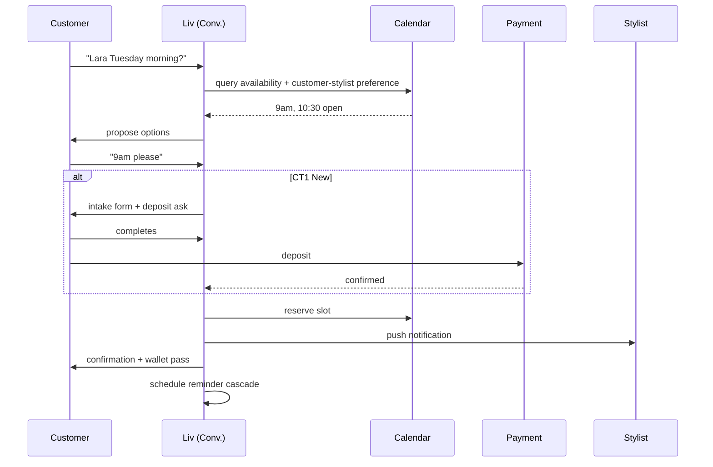

# A01 — Book

**Initiator.** P7 Customer (any typology) via any modality (visual public booking page, WhatsApp/SMS, voice, in-person/walk-in, or staff-on-customer's-behalf).
**Participants.** Customer · (selected staff member's calendar) · payment provider (if deposit applies) · notification cascade (Customer + selected staff + Receptionist if shop has one).
**Configurations needed in.** Universal — every populated cell.

## Happy path (canonical: WhatsApp customer × C5 single-shop with mgr × Hair)

1. Customer DMs the salon's WhatsApp number: *"Lara Tuesday morning?"*
2. Liv resolves customer identity (CT lookup); fetches salon settings (deposit, cancellation, customer-claimed-stylist if regular).
3. Liv proposes 1-3 slot options matching the request, prioritising the customer's previous-stylist if regular: *"Tuesday 9am or 10:30 with Lara — which works?"*
4. Customer picks: *"9am please."*
5. If customer is CT1 New: Liv collects intake + deposit (if applicable) before confirming.
   If customer is CT2-CT3-CT5: Liv confirms immediately (deposit pre-empted on file or waived for CT3 VIP).
   If customer is CT4 Refund-prone: standard flow with a note in the audit log; no surface change to the customer.
6. Calendar slot reserved; Customer + selected stylist (Lara) + Receptionist (if any) notified.
7. Wallet pass issued / updated; calendar invite sent (if customer accepts ICS).
8. SMS day-before reminder + day-of arrival info scheduled.

## Sequence

## Liv's involvement per step

| Step | Liv's posture |
|---|---|
| Identify customer | Autonomous |
| Propose slot options | Autonomous (uses customer-stylist preference, recency bias) |
| Collect intake (CT1) | Autonomous via templates |
| Collect deposit | Autonomous via payment provider |
| Reserve slot | Autonomous |
| Notify stylist | Autonomous |
| Confirm to customer | Autonomous (Liv's voice) |
| Schedule reminders | Autonomous |

No staff involvement on the happy path. **This is the demonstrative workflow** — Phorest/Fresha do this with forms; Liv does it as a 4-message conversation.

## Liv's refusals

- **Never** book a CT2 Regular's stylist with another stylist without explicit customer ask.
- **Never** waive the deposit policy without the relevant authority's tap (Receptionist suggests; ADM/OWN approves).
- **Never** book a service the customer's profile flags contraindicates (medspa: allergen, pregnancy; tattoo: under-age) — escalates to staff.
- **Never** book outside published hours without owner-tap approval.

## Failure modes + Liv's response

- **Slot reserved but payment fails** → slot held for 5 min with retry; customer notified; if expires, slot released and customer offered re-attempt.
- **No staff available for requested service** → Liv proposes alternative staff or alternative time; if customer asks for stylist who is on leave, Liv says so and offers options.
- **Customer's identity ambiguous** (multiple matches) → Liv asks one disambiguation question.
- **Off-the-grid request** ("can I have a half-cut?") → escalates to Owner/Manager with the customer's exact phrase; doesn't fabricate.

## Rollback / undo

- Within 5 min of confirmation: customer can cancel via reply-cancel link with no penalty.
- After 5 min, beyond cancellation window: cancellation goes through standard cancellation workflow (A03), which may forfeit deposit per salon policy.

## Nested sub-workflows

- A05 Pay deposit
- (intake collection — sub-workflow within CT1 path)
- (waitlist — if no slots; book initiates A13 if requested)
- A14 Pre-visit-prep (the day-before nudge)

## Audit-log entries

- `customer.identified` (with CT)
- `slot.proposed` (with options + scoring rationale)
- `slot.reserved` (with stylist, time, service, deposit-amount)
- `payment.deposit.captured` (or `failed`)
- `notification.customer.confirmation.sent`
- `notification.staff.push.sent`

## Configurations

Universal. Variations:
- **Chair-rental:** customer of a Renter is booked into the Renter's calendar, not the Host's; rent calculation untouched.
- **Multi-brand:** brand isolation — booking at "Aurora Studio" does not surface at "Aurora Mews."
- **Chain:** customer's stylist preference travels across shops only with explicit consent (per CT5).

## Ambition rung this assumes

- R1 (Day 1): Liv proposes options, asks for confirmation at every step.
- R2 (Month 1): Liv books CT2-CT3-CT5 confirmations within preferences without asking.
- R3 (Month 3): Liv books any customer within their stated preference autonomously; surfaces ambiguous cases.
- R5 (Month 12 for P2b solo barbershop): Liv handles every booking end-to-end; Owner sees the day-end summary.
