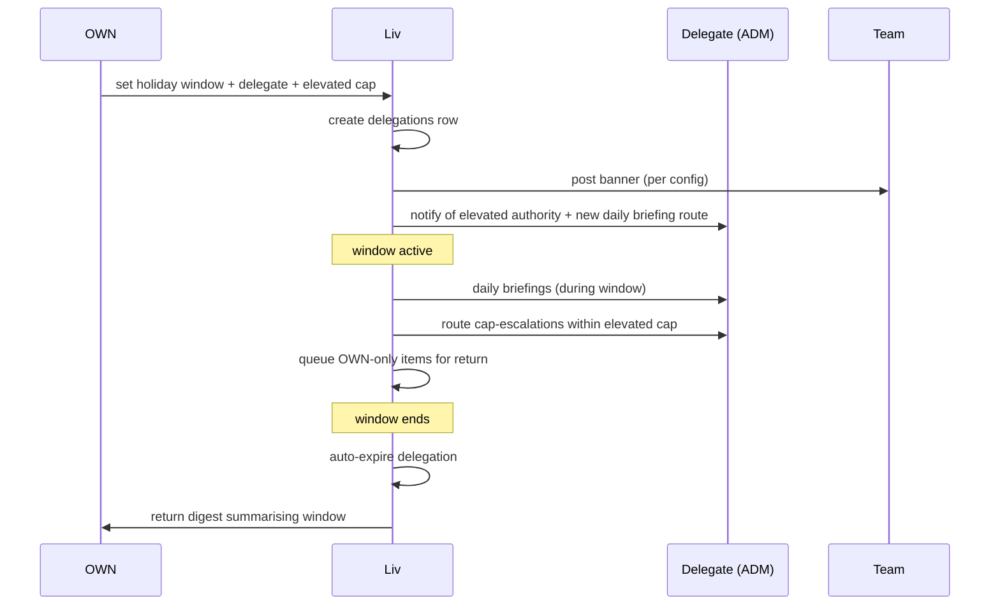

# E03 — Owner-on-holiday handoff

**Initiator.** OWN (sets the holiday window).
**Participants.** OWN · designated delegate (typically ADM) · ADM-D (if scoped) · audit log.
**Configurations needed in.** All with at least one ADM (so C5+ and chain configs primarily).

## What it does

OWN sets `owner_on_holiday(from, to, delegated_to_user_id, elevated_scope)`. Liv:

1. Creates a `delegations` row with elevated scope to the delegate.
2. Re-routes notifications during the window: OWN's daily briefing goes to delegate (or both, per OWN preference). Cap-escalations route to delegate within new cap; if exceed even elevated cap, queue for OWN return.
3. Posts an in-app banner for the team: "Aoife's away 12-19; Niamh has the OWN keys for ops decisions up to €500."
4. On `to` date, delegation auto-expires; OWN gets a return-from-holiday digest summarising decisions made in the window.

## Happy path

1. Aoife (OWN) sets holiday: 12-19 Sept; delegate = Niamh (ADM); elevated refund cap = €500 (vs Niamh's normal €100).
2. Liv writes the `delegations` row; effective_from 12 Sept 00:00, effective_to 19 Sept 23:59.
3. Liv posts the team banner (configurable visibility).
4. During the window, Niamh gets daily briefings, refund routes, hire requests held for Aoife's return.
5. On the 20th: delegation auto-expires; Aoife gets a return digest: "While you were away — 14 cap-bound refunds (€2,140 total; all under €500), 1 hire request queued, no above-cap refunds, customers seen: 1,420; Galway shop had a sick-day cluster — Niamh handled."

## Sequence

## Liv's posture

| Step | Posture |
|---|---|
| Set window | Autonomous (writes delegations row) |
| Notify delegate | Autonomous |
| Re-route briefings | Autonomous |
| Re-route cap-escalations | Autonomous within elevated cap |
| Queue OWN-only | Autonomous (with delegate visibility) |
| Auto-expire | Autonomous |
| Return digest | Autonomous |

## Liv's refusals

- **Never** elevate authority beyond what OWN explicitly set.
- **Never** approve OWN-only actions during the window (hire/fire/promote/brand/billing) — these queue.
- **Never** delete the holiday-window delegation without OWN's explicit revocation.
- **Never** silently extend the window beyond `to`.

## Failure modes

- **OWN unreachable mid-window for a queued OWN-only decision** → Liv holds; if SLA breach, escalates to delegate with explicit "this is queued for Aoife — your call on hold-or-act."
- **Delegate also goes off-grid mid-window** → Liv escalates to next-tier-up (typically other ADM, or OWN regardless of holiday flag).
- **Return digest fail** → Liv falls back to structured-data summary at OWN's first login.

## Rollback / undo

- OWN can revoke the holiday window early at any time; delegation row updated.
- Delegate's actions during the window are NOT auto-reversed on revocation; they stand unless individually rolled back.

## Nested sub-workflows

- C04 Approve-refund-under-threshold (re-routed)
- D01 Weekly digest (re-routed during window)
- F03 "Liv was wrong" rollback (still works during window)

## Audit entries

- `holiday.set` (window, delegate, elevated_scope)
- `holiday.banner.posted`
- `delegation.created` (referencing the holiday)
- All delegate actions during window logged with `holiday_window_active = true` flag
- `holiday.window.expired`
- `holiday.return_digest.delivered`

## Configurations

- **Solo:** workflow N/A; Liv at R5 may take elevated authority directly (P2b R5 Owner-on-holiday case is the deepest test of trust — Liv runs the shop alone for the window).
- **Chain:** Founder can holiday-delegate chain-wide (one delegate for all shops) OR per-shop (different delegate per shop).
- **Chair-rental:** Host holiday-delegates host scope; Renters unaffected (their own tenants).
- **Partnership:** one partner can holiday-delegate to the other (default behaviour); or to ADM if scoped that way.

## Ambition rung

- R1: workflow exists but Liv only routes; delegate makes every call.
- R2: Liv composes recommendations for the delegate.
- R3: Liv handles routine ops fully autonomously within elevated scope.
- R4: Liv proposes plans for the delegate; delegate approves at digest cadence.
- R5 (P2b solo barbershop): the single deepest trust moment. Owner takes a real holiday. The shop runs.

The owner-on-holiday workflow is **the production test of Rung 5**. Until an Owner has taken a real holiday and the shop ran without incident, the bet hasn't been proven.
