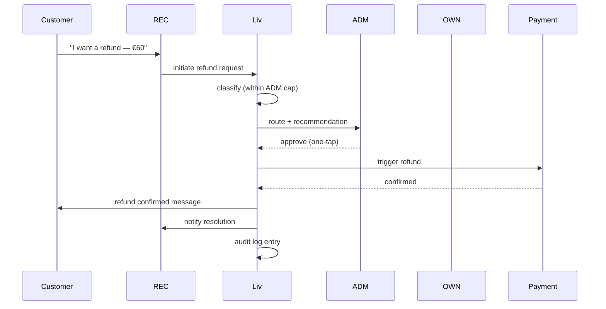

# A06 / E01 — Refund request + ladder

**Initiator.** P7 Customer via any modality, OR P3/P6 staff on customer's behalf.
**Participants.** Customer · receiving staff (REC/ADM/STA) · escalation chain per ladder · payment provider · audit log.
**Configurations needed in.** Universal.

## The ladder (canonical — single-shop with mgr)

| Cap (€) | Authority | Escalation if exceeded |
|---|---|---|
| €0 | REC (recommends only) | → ADM |
| €100 | ADM | → OWN |
| €50 (within service line) | ADM-D | → ADM (cap reached or out of scope) |
| ∞ | OWN | — |

Caps are configurable per tenant.

## Happy path (canonical: customer requests refund of €60 from REC)

1. Customer (or REC on customer's behalf) initiates refund request with reason.
2. Liv classifies: (a) within REC scope (≤€0 — recommend only), (b) within ADM cap (€60 ≤ €100 — yes), (c) above cap.
3. €60 case → routes to ADM with full context: original booking, prior visits, recent comms, recommended action.
4. ADM reviews on phone in 30s; one-tap approve/decline.
5. Approved → payment provider refund triggered; customer notified in Liv's voice with the salon-specific tone; staff member involved (e.g. Lara) notified ("refund processed for Mary's Tuesday — €60").
6. Audit log entry created.

## The above-cap path (customer requests €180; ADM cap €100)

1. ADM/REC starts the request. Liv recognises it exceeds ADM cap.
2. Liv routes to OWN with: original booking, prior visits (and prior refunds), reason, ADM's recommendation.
3. OWN gets notification on phone; one-tap approve/decline.
4. (Approved.) Same steps 5-6 as above; OWN's name on the audit entry.

## Sequence

## Liv's involvement per step

| Step | Posture |
|---|---|
| Classify amount vs ladder | Autonomous |
| Compose context | Autonomous |
| Route to authority | Autonomous |
| Wait | (Liv polls; SLA reminder if stalled) |
| Trigger payment refund | Autonomous (after authority approval) |
| Notify customer | Autonomous in Liv's voice |
| Audit entry | Autonomous |

## Liv's refusals

- **Never** auto-approve a refund regardless of cap. The ladder is *who* approves; the *whether* is always human.
- **Medspa CT4 Refund-prone:** never auto-route within ADM cap; always escalates to OWN with extra context regardless of amount, given medico-legal sensitivity.
- **Never** mention to the customer that they are CT4 Refund-prone.
- **Never** override the ladder even on Owner's say-so within the same session — change requires a settings update with audit trail.

## Failure modes + Liv's response

- **No approver responds within SLA (4h on shop hours)** → Liv escalates one tier up; if it remains unanswered 4h after that, Liv pings OWN regardless of amount.
- **Payment provider refund fails** → Liv retries 3 times; if persistent failure, escalates to OWN with the error, holds the refund in pending state visible to all relevant parties.
- **Customer requests refund mid-active-session** (e.g. customer is in the chair) → Liv routes silently; staff member sees no surface; only the relevant authority sees.

## Rollback / undo

- Within 30 minutes of refund processed: refund-of-refund possible (returns funds to salon, payment-of-payment to customer if not refunded yet) via OWN-only authority.
- After 30 min: standard reversal workflow (manual reconciliation).

## Nested sub-workflows

- (payment provider call — sub-workflow A05-inverse)
- (notification cascade)
- (audit-log entry — first-class workflow F03 if rollback)

## Audit entries

- `refund.requested` (initiator, customer, amount, reason)
- `refund.classified` (cap-position, recommendation)
- `refund.routed` (to user_id with role)
- `refund.decision` (approve/decline, decision_user_id, timestamp, optional reason)
- `payment.refund.{captured|failed}` (with provider correlation id)
- `notification.{customer|staff}.{sent|delivered}`

## Configurations

- **Solo:** OWN is the only authority; ladder collapses.
- **Chain:** ladder is per-shop; Founder is OWN at each shop.
- **Chair-rental:** Renter is OWN of her own tenant; refunds for her customers go to her cap. Host plays no role.
- **Partnership:** OWN authority shared; partner-vote workflow can be added for refunds above N (configurable).
- **Multi-brand:** ladder is per-brand-tenant.

## Ambition rung

- R1: Liv only proposes the route; staff click through every step.
- R2: Liv composes the recommendation but does not pre-fill the action.
- R3: Liv routes autonomously, recommendation pre-filled, one-tap approve.
- R3+: as above; the ladder defines the boundary.

The ladder makes Rung 3 safe for refunds. Without the ladder, Liv would either be too cautious (every refund interrupts the OWN) or too risky (auto-refund without bounds).
