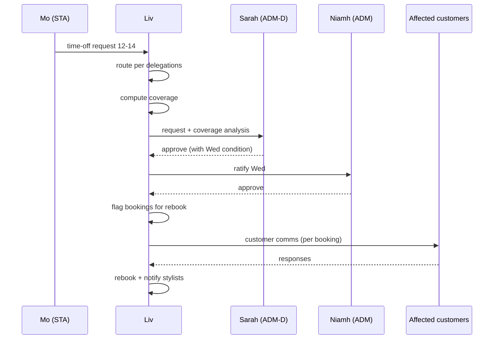

# B02 — Time-off request

**Product UI (Phase A):** Staff submit on **profile → Leave** or **My chair**; managers **approve on Rota** (not job board, not manager-submitted forms).  
**Business template:** [`../business/templates/leave-and-rota.md`](../business/templates/leave-and-rota.md)

**Initiator.** STA / ADM-D / ADM (any internal staff).
**Participants.** Initiator · approver per `reports_to` · ADM-D (if scoped) · ADM · OWN (if exceeds ADM threshold) · affected customers · waitlist (potentially).
**Configurations needed in.** All except Solo.

## Routing rules

- STA → ADM-D if scoped, otherwise → ADM.
- ADM-D → ADM (cannot self-approve).
- ADM → OWN (always).
- ≤ N consecutive days (default 5; configurable per tenant): single approver.
- > N consecutive days OR > M instances per quarter (default 3): always escalates to OWN for ratification regardless of routing.

## Happy path (STA → ADM-D, scoped)

1. STA (Mo) requests via app or via Liv: *"Off the 12th-14th."*
2. Liv routes to ADM-D (Sarah, scoped to colour team — Mo's team).
3. Liv pre-computes coverage: who's working those days, who could cover Mo's bookings, capacity hit.
4. Sarah sees: "Mo time-off 12-14. Your team's covered Tue/Thu; Wed needs ADM (Niamh). Approve with that condition?"
5. Sarah taps approve.
6. Liv re-routes the Wed-only ratification to Niamh.
7. Niamh approves.
8. Mo's bookings for 12-14 are flagged for rebook; Liv composes customer comms ("Mo unavailable 12-14; offering with Sarah / Tom / reschedule").
9. Customers respond; Liv books accordingly; affected stylists notified.

## Sequence

## Liv's posture per step

| Step | Posture |
|---|---|
| Receive request | Autonomous |
| Route per `reports_to` + delegations | Autonomous |
| Compute coverage analysis | Autonomous |
| Wait for approval | Autonomous (SLA: nudge after 24h) |
| Compose customer comms | Drafts; sends after approver's nod (R3) or autonomously after policy-defined delay (R4+) |
| Rebook customers | R3 sends drafts; R4 acts within rebook policy |

## Liv's refusals

- **Never** approve time-off (always human).
- **Never** override the routing to skip an approver.
- **Never** publish the time-off externally beyond customer comms (e.g. team chat) without ADM/OWN's approval.
- **Never** affect payroll calculations directly — that's a downstream action requiring OWN tap.

## Failure modes

- **Approver doesn't respond in SLA** → Liv nudges; after 48h, escalates one tier.
- **Coverage analysis shows no possible coverage** → Liv flags this in the request to approver: "no coverage possible for Wed; review needed."
- **Conflicting time-off (two staff want overlapping days)** → Liv routes to ADM with both requests + coverage analysis; never picks winner.

## Rollback / undo

- ADM/OWN can revoke approval up to 48h before the time-off; affected customers re-notified.
- After 48h (or any customer-comms have gone), revocation requires explicit OWN approval and customer-by-customer outreach.

## Nested sub-workflows

- (Coverage computation — sub-workflow shared with C01 Rota-build)
- A02 Rebook (customer comms downstream)
- C04 Approve-refund-under-threshold (if customer takes a refund instead of reschedule)

## Audit entries

- `time_off.requested` (initiator, dates)
- `time_off.routed` (to user, with rationale)
- `time_off.coverage.computed` (analysis snapshot)
- `time_off.decision` (approve/decline, by user)
- `notification.customer.{sent}` (per customer)
- `booking.rebooked` (per booking)

## Configurations

- **Solo:** N/A.
- **Single-shop no mgr (C4):** STA → OWN directly.
- **Single-shop with mgr (C5):** STA → ADM.
- **Single-shop mature (C6):** STA → ADM-D if scoped, else ADM.
- **Chain (C7+):** as C5/C6 per shop.
- **Chair-rental:** Renter has no internal staff to request to; she sets her own time-off.
- **Partnership:** ADM → either partner per partnership rules.

## Ambition rung

- R1: Liv collects and routes; humans approve and act.
- R2: Liv adds coverage analysis; humans approve and Liv composes comms drafts.
- R3: Liv autonomously routes, computes coverage, drafts comms; ADM/OWN approves; Liv executes the comms.
- R4: Liv proposes rebook plan with confidence scores; ADM/OWN approves the plan, Liv executes.
