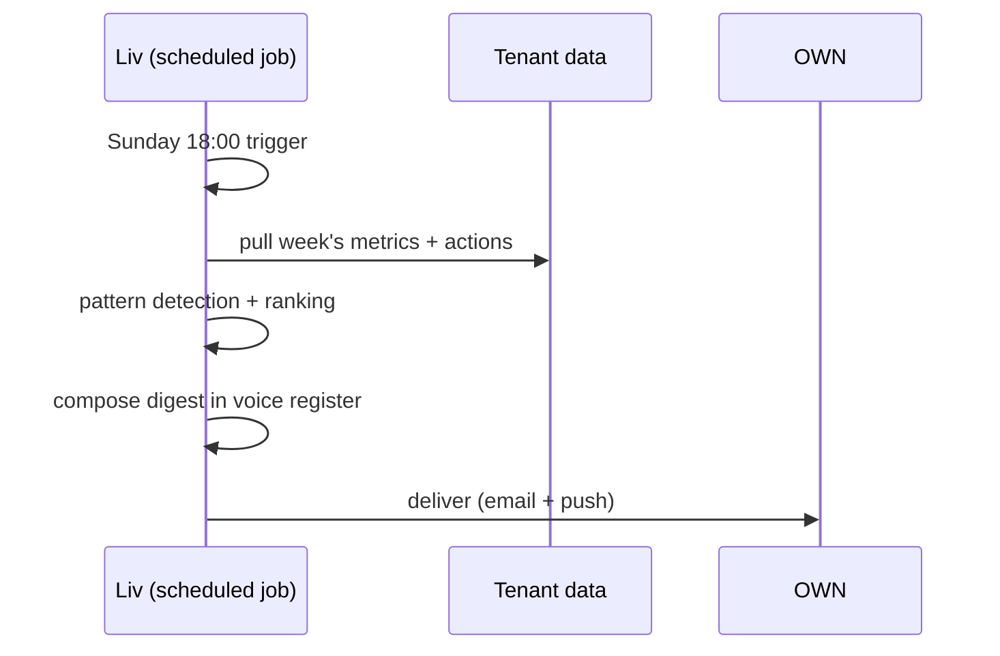

# D01 — Weekly digest

**Initiator.** Liv, autonomously, Sunday 18:00 local time.
**Participants.** OWN (primary recipient); ADM (per-shop receives shop-scoped digest); Founder (P1) receives chain-scoped digest.
**Configurations needed in.** Universal.

## What it contains

Per-tenant, scoped to the recipient's authority:

1. **The numbers that moved** (vs prior week, vs same week last year).
   - Bookings count
   - Revenue
   - Average ticket
   - No-show rate
   - Customer-acquisition (new CT1 → CT2 conversion)
   - Drift count (CT2 → CT6)
   - Cap-bound refunds (count, total)

2. **Decisions Liv made** (categorised; one-tap "show me everything").
   - Bookings handled
   - Refunds processed within cap
   - Time-offs facilitated
   - No-show recoveries
   - Customer comms volume

3. **Decisions Liv asked you to make** — pending or completed in the past week.
   - Counts + status; one-tap into any.

4. **The pattern Liv noticed** — at most 3 per digest, ranked by importance.
   - Each: observation, evidence, proposed plan, expected impact, "approve plan / dismiss / discuss."

5. **The next-week heads-up.**
   - Capacity-stretched days; staff on leave; major events (calendar overlay); customer "anniversary" moments worth catching.

## Tone (in Liv's voice)

> *Sunday evening. Aurora Studio's week:*
>
> *€18,420 booked (+8% on last week, +14% on same week last year). 246 bookings. No-show rate 11% (down from 14%). Lara filled 96% of her slots; Mo opened up 3 new regulars from walk-ins.*
>
> *I handled 184 bookings, 6 refunds (€420 total), one cap-escalation to you (Mary's €180, you approved Friday).*
>
> *Three things I'd flag:*
>
> 1. *Saturday late-afternoon is over-capacity (last 4 Saturdays). Consider a fourth chair or extending one Senior's shift.*
> 2. *Twelve customers drifted past their cycle this month. None messaged (your setting is OFF for re-engagement; flag for review?).*
> 3. *Niamh approved 4 refunds this week — within cap, but the average is rising. Worth a Thursday check-in?*
>
> *Next week: Lara off Wednesday. Saturday is fully booked already. Mary's anniversary visit (her 8th year with us) is Tuesday — Lara's noted.*

## Sequence

## Liv's posture

Fully autonomous composition + delivery. Owner can request: voice-mode (delivered as audio); shorter version; longer version with raw data tables.

## Liv's refusals

- **Never** include staff-individual performance numbers visible to anyone other than the staff member's own digest scope.
- **Never** include customer-individual "shame" data (refund-prone count visible by name to OWN; never visible by name to ADM).
- **Never** suggest a hire/fire/promotion in the digest body — those are separate workflows requiring deeper context.
- **Never** suggest a marketing campaign in the digest — see Bet 5: marketing-as-conversation, not campaigns.

## Failure modes

- **Compose-time error** (LLM down, data fetch fail) → Liv falls back to a structured-data digest (no narrative voice) and notes: *"Voice composition unavailable this week — raw numbers below."* Never silently skips the digest.
- **No data movement worth flagging** (rare; quiet week) → Liv says so honestly: *"Nothing significant moved this week. Same shape as the last six. Quiet is the read."*

## Rollback / undo

N/A — informational. Owner can request a re-send with a different framing.

## Nested sub-workflows

- F06 Liv-detected anomaly (digest is the surface for some anomalies)
- D03 AI training review (digest can flag "I made these decisions; here's what I'd improve")

## Audit entries

- `digest.composed` (with run-time, version, model used)
- `digest.delivered` (with channel: email / push / voice)

## Configurations

- **Solo:** simpler digest; no per-staff cuts.
- **Chain:** Founder gets chain-rollup digest with per-shop sub-sections; each Manager gets shop-scoped digest.
- **Multi-brand:** Founder gets per-brand sections (strict isolation); cross-brand patterns surface only with both Owners' opt-in.
- **Chair-rental:** Host gets host-scoped digest (rent + chair + floor traffic); each Renter gets her own one-person tenant digest.

## Ambition rung

- R1: Liv sends a structured-data summary; no pattern detection.
- R2: Liv adds 1-2 patterns with one-tap "show me more."
- R3: Liv composes in voice register, includes proposed plans, asks for approval on top-ranked patterns.
- R4: Liv's digest becomes the primary planning surface — Owners increasingly trust it as the steering wheel.
- R5: Owner's only weekly check-in. Holiday-mode where Owner is away; ADM gets the digest in OWN's stead per delegation.

The weekly digest is the **single most-cited Liv surface** for trust amplification. It is where Owners learn Liv is competent and honest. It is also where Owners catch Liv being wrong, before the wrongness compounds.
